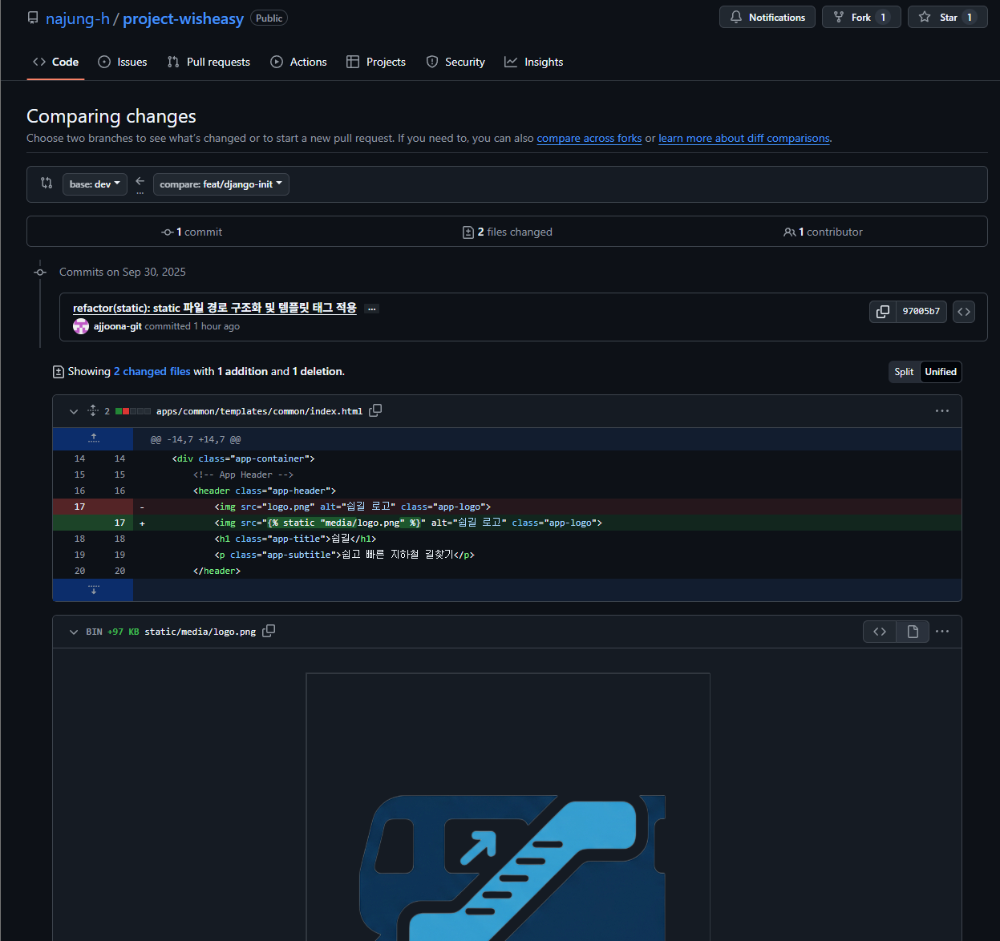
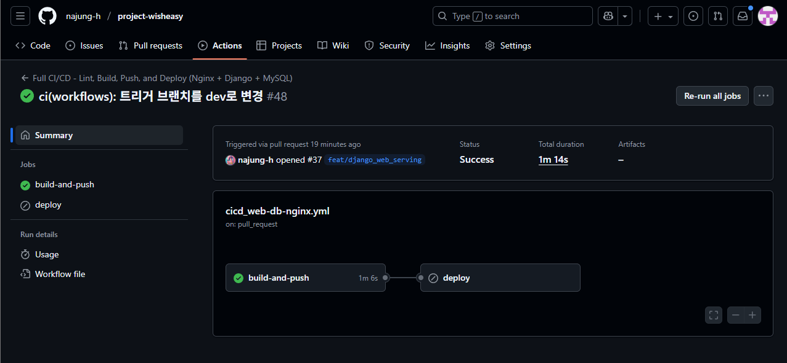

## 오늘 한 일

1. static에 로고 이미지 추가

→ static/media/logo.png 추가, ``

- PR 이슈 - 깃허브 로그인 안함;

`feat/django-init` 브랜치에서 push까지 성공했고, git에도 commit 확인 가능함

하지만 create PR 버튼이 없음!!!! 황당함….

New Pull Request에서 dev, 현재 브랜치 선택 시 넘어간 화면

`git log dev..`  # `dev` 브랜치에는 없고, 현재 브랜치에는 있는 커밋 내역을 보여달라

2. url name속성 추가

→ 이미 되어있음

3. css 연결 관련해서 로컬서버 디버깅

→ 이미 서버에 연결된 상태라 로컬 환경에서 디버깅하기가 쉽지 않음… dev로 넘어가지 않는 브랜치를 새로 파거나 프로젝트 파일을 복사해서 테스트해보는 방법..?

- DB 서버에 바로 올리기 때문에 로컬에서 sqlite로 migrate 할 필요가 없다.
- 각자 로컬에서 MySQL 다운받고 실행하면 된다.

4. custom user model 대체

→ 구글 소셜 로그인으로 진행할 것이니, 백엔드 및 로그인 담당이 작업하기로 함. 커스텀 유저 모델을 만드는 것은 동의하나, 수업 시간에 진행한 코드와는 다를 것이라는 의견임.

---

merge PR까지 끝낸 후, actions 탭에서 배포 결과 확인 가능

- 초록색 체크이면 성공, 아니면 문제가 생긴 것 → 세부 내역 확인해서 디버깅 진행

## 느낀점

오늘 수업에서는 커스텀 유저 모델과 로그인 구현에 대해 다뤘다. 강의에서는 프로젝트 초반에 커스텀 유저 모델을 만들어 두는 것을 강력히 권장했는데, 그래서 우리 프로젝트에도 적용할 수 있을지 논의가 있었다. 하지만 백엔드 담당자는 우리 서비스가 구글 소셜 로그인(OAuth)을 중심으로 할 예정이라 일반 로그인 구현과는 접근 방식이 다를 수 있다고 했다. 게다가 아직 관련 수업을 듣지 못해 더 학습이 필요하다고 했기에, 당장은 적용하지 않기로 했다.

역할 분담과 관련해서는 자바스크립트를 누가 공부해야 하는지가 잠깐 논의됐다. 초기에는 동작 로직이니 백엔드 담당 영역이라고 생각했던 부분이 있었지만, 지금은 프론트엔드 쪽에서 더 필요하다는 인식이 강하다. 사실 프론트와 백을 나누는 것 자체보다 당장 필요한 기능을 누가 맡아서 해결할지가 더 중요하다는 생각이 들었다. 다만 서로 다른 속도로 학습하다 보니 팀 전체의 진행에 영향을 줄 수 있어, 앞으로는 일정 부분은 함께 맞춰가야 할 필요도 느꼈다.

프로젝트는 조금씩 진척되고 있다. DB 설계가 마무리 단계에 있어 곧 완성된 ERD를 바탕으로 실제 DB를 올릴 수 있을 것 같다. DB가 준비되면 백엔드 로직도 구체화할 수 있을 것이고, 그 과정에서 새로운 시도도 가능할 것으로 보인다. 길 안내 로직은 데이터 분석 담당자가 알고리즘을 설계 중인데, 이 역시 백엔드와 연결될 시점이 머지않았다. 서버 담당자는 서버를 구동해 사이트 접속이 가능하도록 만들었고, 그 과정에서 JS 파일 경로가 하드 코딩된 문제를 발견해 수정하려 했다. 다만 수정 과정에서 git이나 DB 관련 이슈가 겹치면서 지금 이 작업이 우선순위가 맞는지에 대한 논의도 오갔다.

이야기를 나누다 보니 프로젝트 방향과 역할, 그리고 학습 범위를 두고 여러 의견이 오갔다. 오해가 생기기도 했지만, 결과적으로는 프로젝트의 큰 그림을 다시 점검하는 시간이 되었다. 무엇보다 수업 참여율이 들쑥날쑥하다 보니 공통적인 이해가 부족한 점이 크게 느껴졌다. 그래서 추석 연휴 전에 다 같이 모여 각자의 역할과 진행 상황을 공유하고, 그것이 어떤 의미를 가지는지 설명하는 시간을 갖는 것이 필요하다고 생각했다. 그렇게 해야 연휴 동안에도 각자 할 수 있는 범위 내에서 프로젝트를 이어갈 수 있을 것이다.