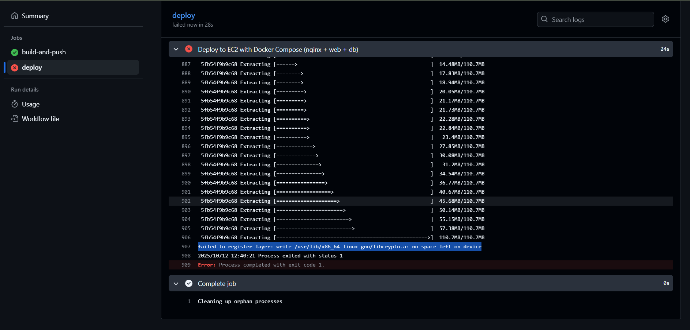

## 오늘 한 일

### base.html 생성 (`feat/frontend-routing`, #60)

BASE_DIR / ‘templates’ 위치에 base.html을 작성했습니다.

각 템플릿은 base.html을 상속받도록 수정했습니다.

```html
<!-- base.html -->


<!DOCTYPE html>
<html lang="ko">
<head>
  <meta charset="UTF-8">
  <meta name="viewport" content="width=device-width, initial-scale=1.0">
  
  <title>쉽길</title>
  

  <link href="https://fonts.googleapis.com/css2?family=Pretendard:wght@300;400;500;600;700&display=swap" rel="stylesheet">
  <link rel="stylesheet" href="https://cdnjs.cloudflare.com/ajax/libs/font-awesome/6.0.0/css/all.min.css">
</head>
<body>
  
  
</body>
</html>
```

### JavaScript 함수 **하드코딩된 URL을 Django 템플릿 방식으로 변경** (`feat/frontend-rounting`, #61)

base.html 에 URL 데이터를 담을 중앙 `div` (`wisheasy-app`)를 만들고,

각 자바스크립트에서 하드코딩된 경로를 사용하는 자바스크립트 함수들을 수정했습니다.

단순 이동 함수(`index.js > showMyPage()`)는 <a> 태그로 대체했습니다.

```html
<!-- base.html -->
...
<body>
  <div id="wisheasy-app"
    data-main-page-url=""
    data-route-page-url=""
    data-station-page-url=""
  >
    
  </div>
...
</body>
```

- **❓**각 템플릿에 개별 설정하지 않고 base.html에 설정한 이유는?
    
    
    | 항목 | ① `base.html` 중앙 관리 방식 | ② 각 템플릿 개별 설정 방식 |
    | --- | --- | --- |
    | **유지보수** | **매우 편리**
    URL 변경 시 `base.html` **한 곳만** 수정하면 됨 | **불편함**
    URL 변경 시 해당 URL을 사용하는 **모든 템플릿을** 찾아다니며 수정해야 함 |
    | **코드 중복** | **없음 (DRY 원칙)**
    모든 URL이 한 곳에 정의됨 | **발생 가능성 높음**`goBack`처럼 여러 페이지에서 쓰는 기능은 URL을 **중복으로 선언**해야 함 |
    | **일관성** | **높음**
    JavaScript는 항상 `wisheasy-app`이라는 **하나의 ID**만 바라보면 됨 | **낮음**
    JavaScript가 각 기능에 따라 `page-navigation`, `user-actions` 등 **여러 ID를 알아야** 함 |
    | **안정성** | **안정적**
    페이지 내부 구조가 바뀌어도 JS 코드에 영향 없음 | **불안정**
    버튼이 다른 `div`로 옮겨지는 등 HTML 구조가 바뀌면 JS 코드가 동작하지 않을 수 있음 |

- **수정한 코드 요약**

```jsx
// index.js
// goToStationPage() 함수도 동일한 방법으로 수정함

// 수정 전
function goToRoutePage() {
    const btn = event.target.closest('.route-btn');
    btn.classList.add('loading');

    // Simulate loading delay
    setTimeout(() => {
        window.location.href = 'route.html';
    }, 500);
}

// 수정 후
const appContainer = document.getElementById('wisheasy-app');

function goToRoutePage() {
    const btn = event.target.closest('.route-btn');
    btn.classList.add('loading');

    // Simulate loading delay
    setTimeout(() => {
        const routePageUrl = appContainer.dataset.routePageUrl;
        window.location.href = routePageUrl;
    }, 500);
}
```

```jsx
// route.js와 settings.js
// station_info.js의 goBack()함수도 동일한 부분을 수정함

// 수정 전
function goBack() {
    if (window.history.length > 1) {
        window.history.back();
    } else {
        window.location.href = 'main.html';
    }
}

// 수정 후
const appContainer = document.getElementById('wisheasy-app');

function goBack() {
    // 방문 기록이 있으면서, 동시에 외부 페이지를 통해 정상적으로 들어온 경우에만 뒤로가기
    if (window.history.length > 1 && document.referrer) {
        window.history.back();
    } 
    // 그렇지 않다면, 메인 페이지로 이동
    else {  
        const mainPageUrl = appContainer.dataset.mainPageUrl;
        window.location.href = mainPageUrl;
    }
}
```

- **❓ `document.referrer`를 왜 추가했나요?**
    
    > "새 탭에서 열기"와 같은 예외 상황에서 history.back()이 오작동하는 것을 막기 위해서입니다.
    > 
    
    `window.history.length > 1` 조건만 사용하면, 사용자가 링크를 '새 탭에서 열기'로 띄운 다음 그 탭 안에서 다른 페이지로 한 번 이동했다가 뒤로가기를 누를 때, 의도치 않게 빈 페이지로 이동하는 등의 오류가 발생할 수 있습니다.
    
    `&& document.referrer` 조건을 추가함으로써, **"방문 기록이 있으면서, 동시에 외부 페이지를 통해 정상적으로 들어온 경우에만"** 뒤로가기를 허용하겠다는 더 엄격하고 안전한 규칙을 만드는 것입니다.
    

---

## 디버깅 내역

### #61 merge PR 과정 중 deploy에서 오류 발생

- 문제 원인: 용량 부족 문제
    - Docker 이미지 레이어를 생성하거나 가져올 때 디스크에 빈 공간이 없어 작업이 중단됐다는 뜻

```bash
failed to register layer: write /usr/lib/x86_64-linux-gnu/libcrypto.a: no space left on device
```



**해결 방법**

`.github/workflows/cicd_web-db-nginx.yml`에 아래와 같이 추가하세요:

1. **Docker 및 시스템 불필요한 파일 정리** 작업 시작 전 아래 명령어로 Docker와 시스템의 불필요한 리소스를 정리하세요.
    
    ```yaml
    - name: Clean up Docker system
      run: |
        docker system prune -af
        docker volume prune -f
        sudo rm -rf /var/lib/docker/tmp/*
    ```
    
2. **디스크 사용량 체크** 실제 디스크 사용량을 확인해 원인을 파악할 수 있습니다.
    
    ```yaml
    - name: Check disk usage
      run: df -h
    ```
    
3. **Docker 네트워크 중복 생성 방지** 로그에 아래와 같은 메시지도 있습니다:
    
    ```bash
    Error response from daemon: network with name appnet already exists
    ```
    
    이미 네트워크가 있으면 새로 만들지 않도록 아래처럼 처리하세요.
    
    ```yaml
    - name: Create Docker network if not exists
      run: |
        if ! docker network inspect appnet &>/dev/null; then
          docker network create appnet
        fi
    ```