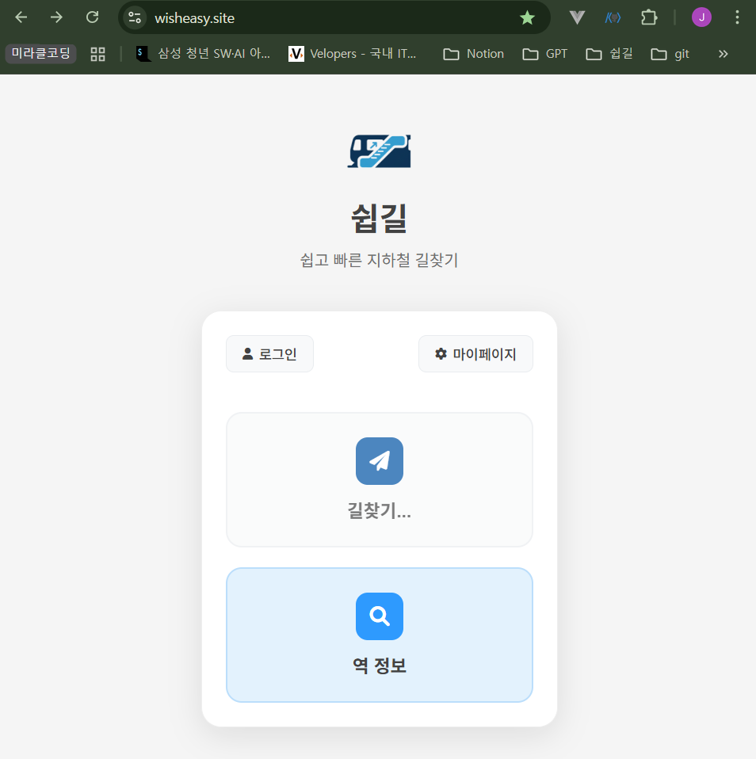

## 오늘 한 일

### #79 `feat/frontend-routing` - index.css 수정

**문제 상황 1: 메인 페이지의 좌우 여백이 생김**

`base.html`을 도입하면서 HTML 구조가 `<body>` → `<div id="wisheasy-app">` → `<div class="app-container">`로 변경되었습니다.

`index.css`에 정의된 `.app-container`는 `max-width: 400px` 속성을 가지고 있습니다. 이로 인해 `.app-container`를 감싸는 부모 태그인 `#wisheasy-app`의 너비 또한 자식의 너비(400px)에 맞춰졌습니다.

결과적으로 `body` 태그의 `display: flex;`와 `justify-content: center;` 속성이 너비가 400px로 좁아진 `#wisheasy-app`를 화면 정중앙에 배치하면서, 의도치 않은 큰 좌우 여백이 발생했습니다.

**해결 방법**

- **`#wisheasy-app` (부모 컨테이너)**: `width: 100%;` 스타일을 적용하여 `body`의 전체 너비를 차지하도록 만들었습니다. 이제 `body`는 꽉 찬 화면을 정렬하므로 좌우 여백 문제가 사라집니다.
- **`.app-container` (자식 컨테이너)**: 기존처럼 `max-width: 400px`는 유지하되, `margin: 0 auto;` 스타일을 추가하여 부모(`wisheasy-app`) 안에서 스스로 수평 중앙 정렬을 하도록 변경했습니다.

```css
#wisheasy-app {
    width: 100%;
}  /* 추가 */

.app-container {
    width: 100%;
    max-width: 400px;
    padding: 20px;
    margin: 0 auto;  /* 추가; 꽉 찬 #wisheasy-app 내부에서 스스로 수평 중앙 정렬 */
    display: flex;
    flex-direction: column;
    align-items: center;
}
```

---

**문제 상황 2: 메인 페이지에서 ‘마이페이지’ 버튼에 밑줄**

자바스크립트 함수를 삭제하고 button 태그를 a 태그로 변경하는 과정에서, 마이페이지에 밑줄이 생겼습니다.

**해결 방법**

- 해당 클래스에 `text-decoration: none;` 속성을 추가했습니다.

```css
/* index.css */
.login-btn, .mypage-btn {
    background: #f8f9fa;
    border: 1px solid #e9ecef;
    padding: 8px 16px;
    border-radius: 8px;
    cursor: pointer;
    font-size: 14px;
    font-weight: 500;
    color: #424242;
    transition: all 0.3s ease;
    display: flex;
    align-items: center;
    gap: 6px;
    text-decoration: none; /* 추가함 */
}
```

---

### #80 `feat/frontend-routing` - index.js 수정

**문제 상황 1: 뒤로가기 시 버튼이 계속 로딩 중으로 표시됨**



**시나리오**

1. 메인 페이지에서 '경로안내' 또는 '역정보' 버튼을 클릭합니다.
2. 클릭과 동시에 버튼에 `loading` 클래스가 추가되어 '...' 애니메이션이 시작됩니다.
3. 다음 페이지로 이동한 후, 브라우저의 '뒤로가기' 기능(버튼 또는 제스처)을 이용해 메인 페이지로 돌아옵니다.
4. 메인 페이지의 버튼들이 여전히 '...' 애니메이션이 실행되는 **로딩 상태로 남아있는 문제**가 발생합니다.

**원인: 브라우저의 뒤로가기 캐시 (bfcache)**

이 문제의 원인은 버그가 아니라, 브라우저의 성능 최적화 기능인 **'bfcache(Back-Forward Cache)'** 때문입니다.

- **페이지 상태 저장**: 사용자가 페이지를 떠날 때, 브라우저는 해당 페이지의 마지막 모습을 그대로 '사진' 찍듯이 캐시에 저장합니다. 현재 상황에서는 **버튼이 로딩 중인 모습 그대로** 저장됩니다.
- **새로고침 없는 복원**: 사용자가 '뒤로가기'를 하면, 브라우저는 서버에서 페이지를 새로 불러오는 대신, 속도를 위해 캐시에 저장해 둔 **'로딩 중인 페이지'를 그대로 화면에 복원**합니다.
- **결과**: 페이지가 새로고침되지 않았기 때문에, 버튼의 로딩 상태를 해제하는 JavaScript 코드가 다시 실행될 기회가 없어 문제가 발생합니다.

**해결 방법: `pageshow` 이벤트를 이용한 상태 초기화**

"페이지가 캐시에서 복원되었을 때를 감지하여, 버튼의 상태를 강제로 초기화"하는 코드를 추가하여 이 문제를 해결했습니다.

1. `pageshow` 이벤트는 페이지가 화면에 표시될 때마다 (처음 접속, 뒤로가기 복원 등) 항상 실행됩니다.
2. 이벤트 객체의 `event.persisted` 속성을 확인하여, 페이지가 캐시(bfcache)에서 복원된 것인지(`true`) 판단합니다.
3. 만약 캐시에서 복원된 것이 맞다면, 페이지에 있는 모든 `.main-btn`을 찾아 `.loading` 클래스를 강제로 제거하여 버튼을 원래의 깨끗한 상태로 되돌립니다.

```jsx
function initializeMainPage() {
    // Add any initialization code here
    console.log('쉽길 메인페이지가 로드되었습니다.');
	
		// 추가한 부분 ------------------
    // 페이지가 표시될 때마다 실행되는 이벤트 리스너
    window.addEventListener('pageshow', function(event) {
        // event.persisted가 true이면, 페이지가 bfcache에서 복원된 것입니다.
        if (event.persisted) {
            // 모든 메인 버튼을 찾아서 'loading' 클래스를 제거합니다.
            const mainButtons = document.querySelectorAll('.main-btn');
            mainButtons.forEach(btn => {
                btn.classList.remove('loading');
            });
        }
    });
    // -----------------------------
}
```

---

### #80 `feat/frontend-routing` - station_info.html 수정

**문제 상황**

- 역 정보 페이지의 헤더에 ‘뒤로 가기’ 버튼이 누락되어 있었습니다.

**해결 방법**

- 길찾기 페이지(route.html)와 동일하게 헤더에 뒤로 가기 버튼을 추가했습니다.

```html
...
<header class="page-header">
		<!-- 추가함 -->
    <button class="back-btn" onclick="goBack()">
        <i class="fas fa-arrow-left"></i>
    </button>
    <!-- ------ -->
    <div class="page-title">역 정보</div>
    <a href="" class="home-btn" aria-label="메인으로 돌아가기">
        <i class="fas fa-home"></i>
    </a>
</header>
...
```

## 느낀 점

로컬(노트북)에서 오류 수정 후에 runserver를 통해 바로바로 확인할 수가 없어서 디버깅하기가 불편했다. DB의 문제인지 settings의 문제인지 알 수 없다.
코드 상으로 그럴 듯해서 일단 배포까지 해봤는데, 여전히 문제가 해결되지 않고 남아있는 것을 확인했다. 로컬 개발 과정에서 즉시 디버깅할 수 있는 방법을 찾아 봐야겠다.