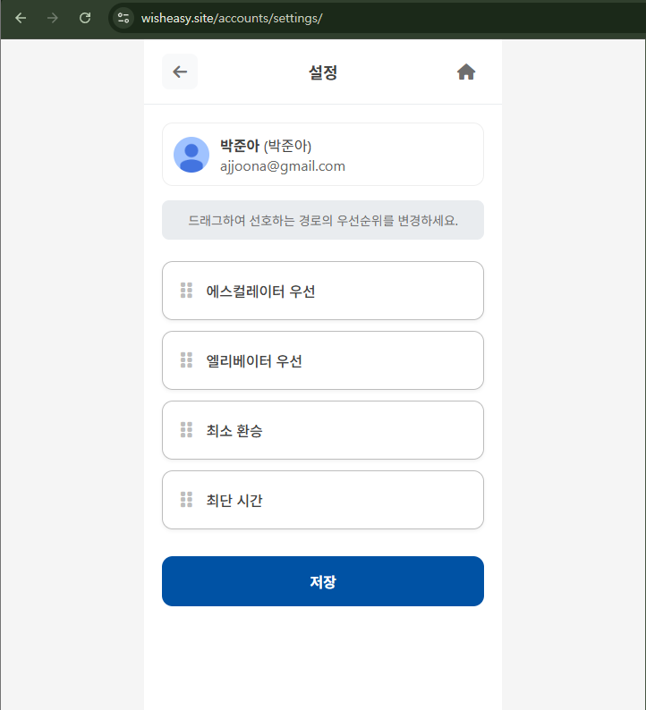

드디어 DB를 서버에 올리고, 경로 안내 로직을 view 함수에 추가했습니다!

그래서 프로젝트 구조가 바뀌었는데요, 주요 변경 사항은 길 찾기 페이지와 세션 관리를 결합했다는 것입니다.
기존에 경로 안내 로직을 모두 js 스크립트에 목업 정보를 입력했었다면,
변경된 구조에서는 경로 안내 로직을 guide.py에서 실행하고 그 결과를 받아와 세션에 관련 정보를 저장합니다.

### /journeys/ 뷰 핵심 규칙 (PRG 및 세션 관리)

**1. PRG (Post-Redirect-Get) 패턴 도입**

/journeys/ URL의 역할을 GET(조회)과 POST(처리)로 명확히 분리했습니다.

- GET /journeys/: 화면 조회 (세션 유무에 따라 폼 모드 / 경로 안내 모드)
- POST /journeys/: 경로 계산 등 실제 동작 요청. 처리 완료 후 무조건 GET으로 리다이렉트(Redirect).

[원리] 세션(Session)은 서버에 저장되는 사용자의 "진행 상태"입니다. (예: steps[...], "idx": 0) POST 요청은 이 **세션 상태를 '수정'**하는 역할을 합니다.

[적용 이유: POST 중복 실행 방지] 만약 사용자가 POST 요청(예: '다음 단계') 직후 '새로고침'이나 '뒤로가기'를 누르면, 브라우저는 같은 POST 요청을 서버에 다시 보냅니다.

  - 기존 문제: idx가 0에서 1이 된 후, 새로고침하면 1에서 2가 되어 단계가 건너뛰어지거나, 경로 계산이 중복 실행되어 세션이 꼬이는 오류가 발생했습니다.
  - PRG 해결: POST(수정) → Redirect → GET(조회) 흐름을 강제합니다. 사용자가 '새로고침'을 눌러도 마지막 요청인 GET(조회)만 반복되므로, 서버의 세션 상태는 안전하게 보호됩니다.

**2. `?new=1` 파라미터 도입 (세션 초기화)**

홈 화면에서 '길찾기' 버튼을 누르면, `/journeys/?new=1` 링크로 이동하도록 변경했습니다.

- 동작: views.py (GET 처리 구간)에서 `new=1` 파라미터가 감지되면, 기존 request.session의 "journey" 데이터를 강제로 삭제합니다.

[원리] ?new=1은 GET 요청 파라미터를 이용해 서버 세션을 명시적으로 제어하는 규칙입니다.

[적용 이유: 이전 경로 잔류 문제 해결]

- 기존 문제: 사용자가 경로 안내(예: 3단계)를 보다가 이탈한 후 다시 앱에 접속하면, 폼 화면이 아닌 보던 3단계 화면이 그대로 나타났습니다.

- UX 규칙 적용: '홈'에서 '길찾기'로 진입하는 것은 항상 '새로운 여정'의 시작이어야 합니다.

- PRG 해결: ?new=1 파라미터로 기존 세션을 삭제하고 '폼 모드'로 진입시켜, 사용자가 항상 새 경로 탐색을 시작할 수 있도록 UX 흐름을 명확히 했습니다.


이렇게 수정하는 과정에서 화면단에서도 몇 가지 수정사항과 문제가 생겼습니다.
commit 메세지와 변경된 코드 내용을 바탕으로 수정이 필요한 사항들을 아래 정리해보았습니다.
내일 백엔드 담당자와 상의해봐야겠네요.


## 체크리스트

### 메인 페이지 (index.html)

- 길찾기 버튼
- [ ]  ~~a 태그 button으로 바꾸거나, style 변경~~
- [ ]  ~~goToRoutePage() 내에 url 루트 변경, href 변경~~
- [x]  로딩 제거 → goToRoutePage, goToStationPage 함수 제거
- [x]  메인 버튼 두개 다 a 태그로 변경

```html
수정 전 코드
<button class="main-btn route-btn" onclick="goToRoutePage()">
  <div class="btn-icon">
      <i class="fas fa-paper-plane"></i>
  </div>
  <span class="btn-text">길찾기</span>
</button>

수정된 코드
<!-- 길찾기: 항상 새 여정 시작 -->
<a class="main-btn route-btn" href="?new=1">
  <div class="btn-icon"><i class="fas fa-paper-plane"></i></div>
  <span class="btn-text">길찾기</span>
</a>
```


❓ `feat(common/index): 길찾기 진입 시 항상 새 여정 시작 (?new=1)` 에서 route 링크를 /journeys/?new=1 로 설정한 이유가 뭔지 궁금합니다.. 매번 새 여정을 시작하는 거면 new=1밖에 안생기는건데, boolean값을 1로 표현한건가..?
=> 맞습니다! 기존 로직을 하면 계속 세션에 데이터가 남아서 세션 지속 기간과 상관없이 이미 저장된 세션을 불러와 보던 로직을 보였습니다.(예를 들어, step3을 보고 있었으면 그 화면으로만 접속됨. 뒤로 가기를 하더라도 무조건 폼 화면으로 돌아가지지 않음)  또한 사용자가 얼마나 세션 데이터를 사용할지 예측하기가 어렵습니다. (가다가 멈출 수도 있음) 따라서 재접속시 무조건 폼 입력 화면을 볼 수 있게끔 조치하였습니다.

### 길찾기 페이지 (route.html)

- 입력 페이지
- [x]  헤더 복구

```html
수정 전 코드
<!-- Header -->
<header class="page-header">
    <button class="back-btn" onclick="goBack()">
        <i class="fas fa-arrow-left"></i>
    </button>
    <div class="page-title">경로 안내</div>
    <a href="" class="home-btn" aria-label="메인으로 돌아가기">
        <i class="fas fa-home"></i>
    </a>
</header>

수정된 코드
<!-- Header -->
<header class="page-header">
  <a href="" class="home-btn" aria-label="메인으로 돌아가기">
    <i class="fas fa-home"></i>
  </a>
</header>
```


- [x]  입력 자동완성 - `search-util.js`, `route.js` 스크립트 복구
    - [ ]  `search-util.js` 내부 함수 DB랑 연결할 수 있는지 확인

```html
수정 전

<script src=""></script>
<script src=""></script>


수정 후

<script>
  // 열차 아이콘 이동
  (function () {
    var icon = document.getElementById('trainIcon');
    if (!icon) return;
    var idx = parseInt(icon.dataset.idx || '0', 10);
    var count = parseInt(icon.dataset.count || '1', 10);
    var ratio = (count > 1) ? (idx / (count - 1)) : 0;
    icon.style.left = 'calc(' + (ratio * 100) + '% - 12px)';
  })();
</script>

<script>
  // 마지막 스텝: '다음' 클릭 시 모달 → 홈 이동
  (function () {
    var nextBtn = document.getElementById('nextBtn');
    if (!nextBtn) return;
    nextBtn.addEventListener('click', function (ev) {
      var hasNext = this.dataset.hasNext === '1';
      if (hasNext) return; // 다음이 있으면 정상 submit
      ev.preventDefault();
      var m = document.getElementById('thankyouModal');
      if (m) m.style.display = 'flex';
      setTimeout(function () {
        window.location.href = "";
      }, 1400);
    });
  })();
</script>

```

- 경로 안내 페이지
- [ ]  버튼 너비 문제
    - 처음부터에만 `flex: 1;` 이 적용이 안 됨. button 태그 안에 form 태그를 두어야 하는건가??
- [ ]  편의시설, 이용불가 버튼 동작 안 함


```html
<form method="post" style="display:inline;">

<button class="action-btn" name="action" value="restart" title="처음부터">
<i class="fas fa-rotate-left"></i>
<span>처음부터</span>
</button>
</form>
```

- [ ]  지하철 헤더에 표시되는 현위치 (빨간 점)는 현재 안내되고 있는 역의 위치와 일치하도록

    (경로 안내하고 있는 위치는 출발역/환승역/도착역 중 하나일 수 밖에 없음)


### 마이페이지 (settings.html)

- [ ]  로그아웃인 경우, 홈화면에서 마이페이지 버튼 삭제(안 보이도록)
- [ ]  로그인인 경우, 홈화면에서 마이페이지 버튼 보이도록 (현상 유지)

- 마이페이지 화면
- [ ]  현재 경로안내 우선순위 보여주는 것 삭제 (→ 다른 페이지에 백업)
- [ ]  헤더 = [ ←  마이페이지  (홈) ]
- [ ]  content = 프로필 (user.profile.profile_image, [user.profile.name](http://user.profile.name/), user.profile.nickname, user.profile.google_mail)
- [ ]  URL = [wisheasy.site/accounts/mypage/](http://wisheasy.site/accounts/mypage/)

