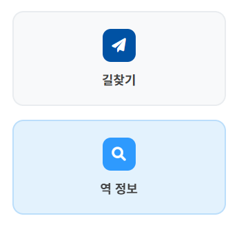

## 오늘 한 일 feat/route-restore

### 1. 메인 버튼 (`길찾기`, `역 정보`) <a> 태그 적용

| 파일명 | 수정사항 |
| --- | --- |
| `index.html` | 메인 버튼 2개(길찾기, 역 정보)를 <button>에서 <a> 태그로 변경 |
| `index.js` | <a> 태그로 변경되면서 불필요해진 goToRoutePage, goToStationPage 함수를 주석 처리 |
| `index.css` | <a> 태그 버튼에 기본으로 적용되는 밑줄 스타일 제거 |

```html
수정 전 코드
<button class="main-btn route-btn" onclick="goToRoutePage()">
  <div class="btn-icon">
      <i class="fas fa-paper-plane"></i>
  </div>
  <span class="btn-text">길찾기</span>
</button>

수정된 코드
: 세션 개념이 추가되면서 로직 변경 -> a 태그로 변경
<!-- 길찾기: 항상 새 여정 시작 -->
<a class="main-btn route-btn" href="?new=1">
  <div class="btn-icon"><i class="fas fa-paper-plane"></i></div>
  <span class="btn-text">길찾기</span>
</a>
```


a 태그 적용 직후


최종 수정 결과

백엔드 로직이 도입되면서, 길찾기 페이지의 구조가 바뀌었습니다. 이에 따라 기존 `<button>`과 `onclick="goToRoutePage()"`으로 구동되었던 페이지 이동 기능이, `<a>`태그와 `href` 속성으로 변경되었습니다. 이때 기존 함수가 삭제되어 `goToRoutePage`함수의 기능이 작동하지 않았습니다.

`goToRoutePage()`의 기능은 아래와 같습니다.

1. `loading` 클래스 추가 (로딩 보임)
2. **0.5초 대기**
3. 페이지 이동

이전 코드가 로딩을 보여줄 수 있었던 유일한 이유는 `setTimeout`으로 500ms(0.5초)를 인위적으로 지연시켰기 때문입니다.

이를 해결하기 위한 과정입니다.

1. a 태그에 `onclick="goToRoutePage()"` 속성을 추가한다.

    → `<a>` 태그의 `href` 속성(페이지 이동)이 `onclick` 함수가 실행된 *직후*에 바로 동작해버립니다.

    → `goToRoutePage()`가 실행되어 클래스가 추가되자마자, 브라우저는 다음 페이지 로드를 위해 현재 페이지를 떠나버립니다. 즉, CSS가 적용되어 로딩 애니메이션이 사용자 눈에 보일 틈도 없이(0.1초도 안 걸림) 페이지가 넘어갑니다.

    → a 태그가 페이지 이동 역할을 하기 때문에 goToRoutePage에서 `3. 페이지 이동` 기능이 필요 없어 집니다.

2. 로딩 기능을 삭제한다. (a 태그로 변경한다.)

    → 로딩 애니메이션 구현을 하지 않는다면, a 태그의 href 속성(페이지 이동)으로 `goToRoutePage`함수를 대체할 수 있습니다.

    → `goToRoutePage` 함수는 제거합니다.


결국 로딩 기능을 삭제하고, <a> 태그로 변경하는 방식을 채택했습니다.

페이지가 로드되는 동안 브라우저 탭 자체가 로딩 중(스피너)으로 표시됩니다. 이것이 사용자가 학습한 가장 표준적인 로딩 신호이기 때문에 별도의 로딩 애니메이션이 불필요하다고 판단했습니다. 빠르고 직관적인 UX를 제공했습니다.

추가로 a 태그의 text-decoration 속성 값을 none으로 설정하여 밑줄을 제거했습니다.

---

### 2. 길찾기 페이지 (route.html)의 헤더 복구

```html
수정 전 코드
<!-- Header -->
<header class="page-header">
  <a href="" class="home-btn" aria-label="메인으로 돌아가기">
    <i class="fas fa-home"></i>
  </a>
</header>

수정 후 코드 (원상복구)
<!-- Header -->
<header class="page-header">
    <button class="back-btn" onclick="goBack()">
        <i class="fas fa-arrow-left"></i>
    </button>
    <div class="page-title">길찾기</div>
    <a href="" class="home-btn" aria-label="메인으로 돌아가기">
        <i class="fas fa-home"></i>
    </a>
</header>

최종 수정 코드
: a 태그로 입력 화면별로 이동할 페이지 분기 처리
<!-- Header -->
<header class="page-header">
  
  <a href="" class="back-btn" aria-label="메인으로 돌아가기">
    <i class="fas fa-arrow-left"></i>
  </a>
  
  <a href="?new=1" class="back-btn" aria-label="경로 입력 페이지로 돌아가기">
    <i class="fas fa-arrow-left"></i>
  </a>
  
  <div class="page-title">길찾기</div>
  <a href="" class="home-btn" aria-label="메인으로 돌아가기">
    <i class="fas fa-home"></i>
  </a>
</header>
```


수정 전 화면


수정 후 화면

원래 제가 의도했던 헤더의 역할은 다음과 같습니다.

- 뒤로가기 버튼(⬅️)의 기대 역할:
    - 출발역/도착역(경로) 입력 화면 -> 홈화면
    - 경로 안내 화면 -> 경로 입력 화면
- 홈 버튼(🏠)의 기대 역할:
    - 어느 페이지에서든 누르면 홈화면으로 연결

view함수와 URL 경로가 달라짐에 따라, goBack() 함수가 작동하지 않았습니다. 생각해볼 수 있는 해결방법은 다음과 같습니다.

1. goBack 함수를 a태그로 대체한다.

    → 폼/가이드 모드에서 뒤로가기 링크를 분기처리해야 합니다.

2. goBack 함수를 수정한다.

    → 바뀐 구조에서 폼/가이드 모드를 request method로 구분했기 때문에 기존 로직을 적용할 수 없습니다.


결국 goBack 함수를 삭제하고 a 태그로 대체하는 방식을 채택했습니다.

route.js의 goBack() 함수에 의존하던 헤더 뒤로가기 버튼의 오류가
이전 `goBack()` 함수는 `document.getElementById('routeGuidance').style.display` 값을 확인해서 현재 상태('form'인지 'guide'인지)를 추측했습니다. 만약 다른 개발자가 CSS를 수정해서 `display: 'block'` 대신 `display: 'flex'`를 쓰게 되면, `goBack` 함수는 상태를 잘못 판단하고 엉뚱하게 동작하게 됩니다.

현재 상태가 'form'인지 'guide'인지는 서버(Django)가 가장 정확하게 알고 있습니다 (`views.py`에서 `mode` 변수를 만들었죠).
JS가 CSS를 보고 추측하는 대신, 서버가 100% 정확한 `mode` 값을 템플릿에 직접 전달해줍니다. 이는 "추측"이 아닌 "사실"에 기반한 로직이므로 훨씬 견고합니다.

이러한 route.js의 goBack() 함수에의 의존성 문제를 해결하고 정확성을 높이기 위해, 템플릿(`route.html`) 안에서 Django의 `mode` 변수를 사용해 분기 처리했습니다. <button onclick> 대신 <a> 태그를 사용하고, Django 템플릿의  분기문을 활용하여 서버사이드에서 직접 링크를 제어하도록 변경했습니다.

- mode="form"일 때: '홈' (journeys:leave)으로 이동
- mode="guide"일 때: '경로 입력창' (journeys:route?new=1)으로 이동


### 3. `이용 불가` 버튼 알림창 변경

- 수정 전 화면


- 수정 후 화면


현재 저희는 대체 경로를 안내하고 있지 않으므로, ‘이용 불가’ 버튼과 관련된 js 스크립트를 모두 비활성화했습니다. 백엔드 담당자와 회의한 결과, ‘이용 불가’ 버튼을 삭제하는 대신, “아직 구현되지 않은 기능입니다” 와 같은 안내 메세지를 띄우기로 결정했습니다.

```jsx
수정 후 코드
// '이용 불가' 버튼 -> 임시 알림창
function reportClosure() {
    // '아직 구현되지 않은 기능입니다.' 라는 알림창을 띄웁니다.
    alert('아직 구현되지 않은 기능입니다.');
}

수정 전 코드
// '이용 불가' 버튼 -> 대체 경로 안내
function reportClosure() {
     if (confirm('현재 경로에서 문제가 발생했나요? 대체 경로를 안내해드리겠습니다.')) {
         alert('죄송합니다. 빠른 대체 경로를 안내합니다');

         // Mock alternative route
         setTimeout(() => {
             currentStep = 1;
             currentRoute.steps = generateAlternativeRoute();
             updateRouteStep();
         }, 2000);
     }
 }
```

근데 수정하고 보니, alert()가 기본 브라우저 알림창으로 실행되는거라 못생겼네요,,ㅠ 여유가 있다면 모달 형태로 수정해보겠습니다.

