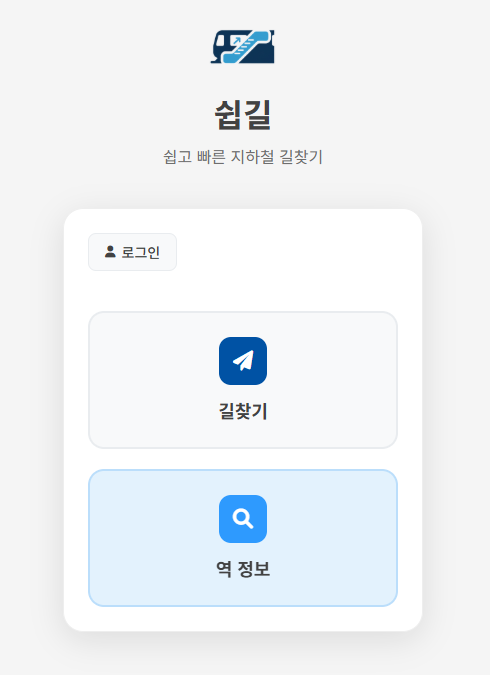
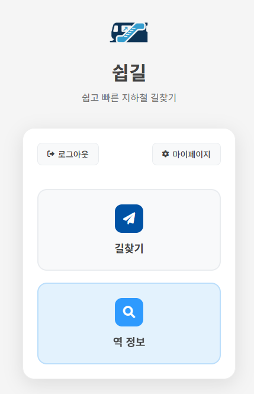
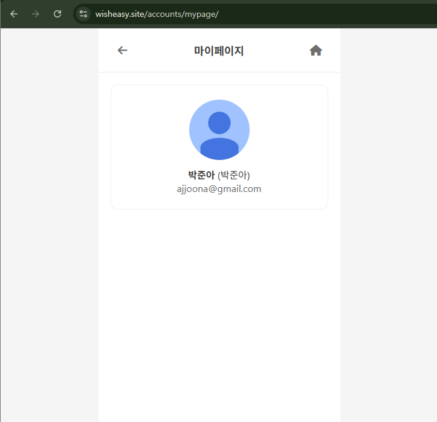

## 오늘 한 일

| 브랜치명 | PR no. | 주요 내용 |
| --- | --- | --- |
| `feat/mypage-ui` | # 128 | 마이페이지 (mypage.html)와 경로 우선순위 설정 (settings.html) 화면 분리 |
| `feat/mypage-ui` | # 129 | 마이페이지 프로필 카드 UI 스타일 개선 |
| `feat/mypage-ui` | # 130 | 마이페이지 프로필 카드 UI 스타일 개선 |

### 1. 마이페이지 (settings.html)

- [x]  로그아웃인 경우, 홈화면에서 마이페이지 버튼 삭제(안 보이도록)
- [x]  로그인인 경우, 홈화면에서 마이페이지 버튼 보이도록 (현상 유지)

- 마이페이지 화면
- [x]  현재 경로안내 우선순위 보여주는 것 삭제 (→ 다른 페이지에 백업)
- [x]  헤더 = [ ←  마이페이지  (홈) ]
- [x]  content = 프로필 (user.profile.profile_image, [user.profile.name](http://user.profile.name/), user.profile.nickname, user.profile.google_mail)
- [x]  URL = [wisheasy.site/accounts/mypage/](http://wisheasy.site/accounts/mypage/) 만드는건 어떤지?


before

**수정한 코드**

```html

    <div class="app-container">
        <!-- Header -->
        <header class="page-header">
            <button class="back-btn" onclick="goBack()">
                <i class="fas fa-arrow-left"></i>
            </button>
            <div class="page-title">마이페이지</div>
            <a href="" class="home-btn" aria-label="메인으로 돌아가기">
                <i class="fas fa-home"></i>
            </a>
        </header>

        <!-- Main Content -->
        <main class="main-content">
            {# 프로필 프리뷰: 로그인 상태에서만 노출, 테스트용 코드 #}
            
                 signals로 Profile이 항상 만들어진다는 전제 
                <div class="profile-card">
                    
                    <br>
                    <div>
                        <div><strong>{{ user.profile.name }}</strong> ({{ user.profile.nickname }})</div>
                        <div style="color:#666;">{{ user.profile.google_mail }}</div>
                    </div>
                </div>
            
        </main>
    </div>


```

```html

    <div class="app-container">
        <!-- Header -->
        <header class="page-header">
            <button class="back-btn" onclick="goBack()">
                <i class="fas fa-arrow-left"></i>
            </button>
            <div class="page-title">경로 우선순위 설정</div>
            <a href="" class="home-btn" aria-label="메인으로 돌아가기">
                <i class="fas fa-home"></i>
            </a>
        </header>

        <!-- Main Content -->
        <main class="main-content">
            <div class="info-box">
                <p>드래그하여 선호하는 경로의 우선순위를 변경하세요.</p>
            </div>

            <div class="priority-list" id="priorityList">
                <div class="priority-item" draggable="true" data-priority="escalator">
                    <i class="fas fa-grip-vertical handle"></i>
                    <span>에스컬레이터 우선</span>
                </div>
                <div class="priority-item" draggable="true" data-priority="elevator">
                    <i class="fas fa-grip-vertical handle"></i>
                    <span>엘리베이터 우선</span>
                </div>
                <div class="priority-item" draggable="true" data-priority="transfer">
                    <i class="fas fa-grip-vertical handle"></i>
                    <span>최소 환승</span>
                </div>
                <div class="priority-item" draggable="true" data-priority="time">
                    <i class="fas fa-grip-vertical handle"></i>
                    <span>최단 시간</span>
                </div>
            </div>

            <button class="save-btn" onclick="savePriorityOrder()">저장</button>
        </main>
    </div>


```

```python
from django.shortcuts import render

# Create your views here.
def mypage(request):
    return render(request, "accounts/mypage.html")

# 사용자의 경로 안내 우선 순위를 설정한다.
def settings(request):
    return render(request, "accounts/settings.html")

```

```python
from django.urls import path
from . import views

app_name = "accounts"
urlpatterns = [
    path("mypage/", views.mypage, name="mypage"),
    path("settings/", views.settings, name="settings"),
]
```

```css
/* Profile */
.profile-card {
    display: flex;
    gap: 12px;
    align-items: center;
    margin-bottom: 16px;
    padding: 12px;
    border: 1px solid #eee;
    border-radius: 12px;
}

.profile-image { 
    width: 100px;
    height: 100px;
    border-radius: 50%;
    padding-left: auto;
    padding-right: auto;
    object-fit: cover;
}

```

```html
    <!-- Main -->
    <main class="main-card">
      <div class="card-header">
        
          <a class="login-btn" href="">
            <i class="fas fa-sign-out-alt"></i>
            로그아웃
          </a>
          <a class="mypage-btn" href="">
            <i class="fas fa-cog"></i>
            마이페이지
          </a>
        
          <button class="login-btn" onclick="showLoginModal()">
            <i class="fas fa-user"></i>
            로그인
          </button>
        
      </div>

```



로그인 안 한 경우



로그인 한 경우



마이페이지 화면

