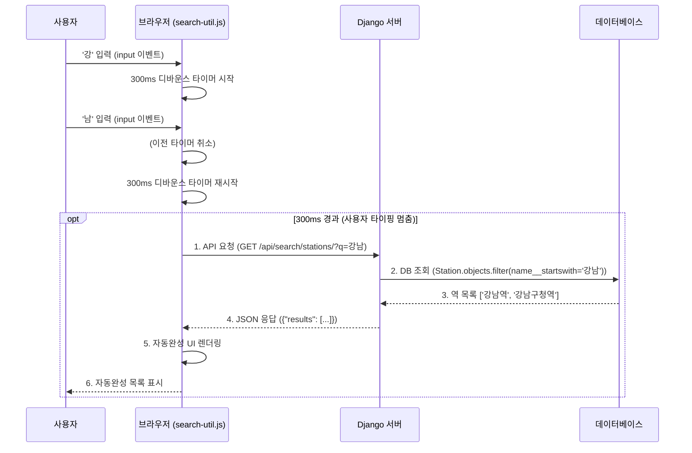

## 자동 완성 [`feat/search-autocomplete` / `#132`]

- [x]  `search-util.js` 내부 함수 DB랑 연결할 수 있는지 확인

### **자동완성 기능 실행 과정**

1. **클라이언트 (JS):** 사용자가 "강남"이라고 입력합니다.
2. **클라이언트 (JS):** "강남"이라는 텍스트를 서버의 특정 URL(API)로 보냅니다. (AJAX/Fetch)
3. **서버 (Django):** 요청을 받고, "강남"이 포함된 역을 DB에서 검색합니다.
4. **서버 (Django):** 검색 결과(예: ["강남역", "강남구청역"])를 JSON 형태로 클라이언트에게 응답합니다.
5. **클라이언트 (JS):** JSON 응답을 받아 자동완성 목록을 화면에 그려줍니다.



### **구현 과정**

### `search-util.js` 내부 함수 DB 연결 방법

프론트엔드 JavaScript(`search-util.js`)가 백엔드(Python/Django) DB에 **직접** 연결할 수는 없습니다. 보안상으로도 매우 위험합니다.

대신 **API 엔드포인트**를 만들어야 합니다.

1. **[Backend] Django 뷰 생성**: 사용자가 입력한 검색어를 받는 API 뷰(예: `search_stations`)를 `journeys/views.py`에 만듭니다.
2. **[Backend] URL 연결**: `journeys/urls.py`에 이 뷰를 연결합니다. (예: `path('api/search-stations/', views.search_stations, name='api_search_stations')`)
3. **[Backend] DB 쿼리 및 JSON 응답**: `search_stations` 뷰는 `request.GET.get('term')` 등으로 검색어를 받아, DB에서 `Station.objects.filter(name__startswith=term)` 처럼 쿼리합니다. 결과를 **JSON** 형식으로 직렬화하여 `JsonResponse`로 반환합니다.
4. **[Frontend] API 호출**: `search-util.js`에서는 `fetch()`나 `XMLHttpRequest`를 사용해 이 API 엔드포인트(예: `/journeys/api/search-stations/?term=강남`)를 호출합니다.
5. **[Frontend] 자동완성 UI**: 서버에서 받은 JSON 데이터를 파싱하여 자동완성 목록 UI를 생성합니다.

#### **1단계: (Django) DB 검색 API 엔드포인트 생성**

- **`views.py`에 검색 뷰 추가**
    - 역(Station) 정보를 다루는 앱 (예: `journeys` 또는 `stations`앱)의 `views.py`에 다음 코드를 추가합니다.
    - `q`라는 파라미터로 검색어를 받아서, `Station` 모델에서 `name` 필드에 해당 검색어가 포함된(`__icontains`) 역을 찾습니다.
    - 결과를 `JsonResponse`로 반환합니다.
- **'역 검색 API'**를 `stations/` 앱에 만든 이유?? **"앱의 책임"** 때문!
    1. **`stations/` 앱의 책임:**
        - `stations/` 앱은 **'역(Station) 정보'**에 관련된 모든 것을 책임져야 합니다.
        - "역 목록 조회", "역 상세 정보 보기", 그리고 "역 검색하기"는 모두 '역 정보'의 범주에 속합니다.
        - 따라서 '역 검색 API'는 `stations` 앱이 제공하는 것이 구조적으로 가장 올바릅니다.
    2. **`journeys/` 앱의 책임:**
        - `journeys/` 앱은 **'경로(Journey)'**와 관련된 것을 책임집니다. (예: "A역에서 B역까지 길찾기")
        - `journeys/` 앱은 '역 정보'가 *필요할* 뿐, '역 정보' 자체를 제공하는 주체가 되어서는 안 됩니다.
    
    만약 '역 검색 API'를 `journeys/views.py`에 만들면, `journeys` 앱이 두 가지 책임(경로 탐색 + 역 검색)을 갖게 되어 코드가 복잡해집니다.
    
- **추신 (기술 부채에 관하여):**
    
    사실 `Station` 모델은 `journeys` 앱이 아닌 `stations` 앱에 있는 것이 더 이상적이었습니다. 지금은 `stations/views.py`가 `journeys/models.py`를 참조하게 되어 앱 간 의존성이 조금 어색해졌습니다. 일단은 이렇게 진행하되, 나중에 리팩토링할 기회가 되면 `Station` 모델을 `stations` 앱으로 옮기는 것을 고려해볼 수 있습니다.
    
    (이런 것을 **'기술 부채(Technical Debt)'**를 인지하고 관리한다고 합니다.)
    

```python
# stations/views.py

from django.http import JsonResponse
from .models import Stations  # 실제 역 모델(Station)을 import 해야 합니다.
import json

def search_stations(request):
    """
    역 이름 검색 자동완성 API
    /api/search/stations/?q=검색어
    """
    query = request.GET.get('q', None)
    results = []

    if query and len(query) > 0: # 검색어가 있고 0글자 이상일 때
        # 'name__icontains' : 대소문자 구분 없이 포함
        # 'name__startswith' : 해당 글자로 시작 (이걸 더 추천)
        stations = Stations.objects.filter(name__startswith=query)[:10] # 최대 10개

        for station in stations:
            results.append({
                'name': station.name,
                'line': station.line,
            })
            
    return JsonResponse({'results': results})
```

- **`urls.py`에 API URL 연결**

```python
# stations/urls.py

from django.urls import path
from . import views

app_name = 'stations'
urlpatterns = [
    # /api/stations/search/ 로 요청이 오도록 설정
    path('search/', views.search_stations, name='search_stations'),
]
```

```python
# config/urls.py

from django.contrib import admin
from django.urls import path, include

urlpatterns = [
    path("", include(("apps.common.urls", "common"), namespace="common")),
    path("accounts/", include(("apps.accounts.urls", "accounts"), namespace="accounts")),
    path("accounts/", include("allauth.urls")),  # allauth는 그대로
    path("stations/", include(("apps.stations.urls", "stations"), namespace="stations")),
    path("journeys/", include(("apps.journeys.urls", "journeys"), namespace="journeys")),
    # /api/stations/로 시작하는 모든 URL은 stations.urls로 위임
    path("api/stations/", include("apps.stations.urls")),
]
```

#### 2단계: (JavaScript) `search-util.js`에서 API 호출

이제 가짜 데이터를 사용하던 JavaScript 코드를 수정하여 1단계에서 만든 API를 호출(Fetch)합니다.

`async/await` 문법을 사용하면 비동기 코드를 깔끔하게 작성할 수 있습니다.

**파일 역할 구분**

- **`search-util.js` (유틸리티/서비스)**
    - `debounce` 함수 (어디서든 쓸 수 있는 범용 기능)
    - `fetchStations` 함수 (서버에 API를 요청해 **데이터**를 가져오는 범용 기능)
- **`route.js` (페이지 컨트롤러)**
    - `startStation`, `endInput` 등 `route.html`의 **DOM 요소를 초기화**하고 (`setupStationInputs`)
    - `input`, `blur`, `mousedown` 같은 **이벤트**를 감지하고,
    - `fetchStations`로 가져온 데이터를 `suggestion-item` 같은 **HTML로 그려주는** (`setupAutocomplete` 내부 로직)
    - 사용자가 항목을 선택하면 `input.value`를 채우는 (`selectStation`)

- `search-util.js`에 핵심 로직 추가
    - 이 파일은 **"어떻게(HOW)"** 데이터를 가져오는지 정의합니다.

```jsx
// static/js/search-util.js

/**
 * 역 검색 API 호출 함수 (범용 유틸리티)
 * @param {string} query - 검색어
 * @returns {Promise<Array>} - 검색 결과 (예: [{name: "강남역"}, {name: "강남구청역"}])
 */
async function fetchStations(query) {
    if (!query || query.trim() === "") {
        return [];
    }

    // (멘토) 이 URL은 stations/urls.py에 정의한 경로입니다.
    const url = `/api/stations/search/?q=${encodeURIComponent(query)}`;

    try {
        const response = await fetch(url);
        if (!response.ok) {
            console.error("API request failed:", response.status);
            return [];
        }
        const data = await response.json();
        return data.results; 
    } catch (error) {
        console.error("Error fetching stations:", error);
        return [];
    }
}
```

- `static/js/route.js` 수정
    - 이 파일은 '길찾기' 페이지(`route.html`)의 자동완성을 담당합니다.

```jsx
// static/js/route.js

// ...기존 코드...

function setupAutocomplete(input, suggestionsId) {
    const suggestionsContainer = document.getElementById(suggestionsId);

    // Use event delegation for suggestion clicks
    suggestionsContainer.addEventListener('mousedown', function(e) {
        if (e.target && e.target.matches('div.suggestion-item')) {
            selectStation(e.target.dataset.stationName, input.id);
        }
    });

    // debounce와 fetchStations 사용
    input.addEventListener('input', debounce(async function() { // <--- 1. debounce 적용
        const value = this.value;
        suggestionsContainer.innerHTML = ''; // 이전 제안 삭제

        if (value.length < 1) {
            suggestionsContainer.style.display = 'none';
            return;
        }

        // 2. API 호출로 stations 데이터를 가져옴 (search-util.js의 함수 사용)
        const stations = await fetchStations(value);

        if (stations.length > 0) {
            stations.forEach(station => {
                const div = document.createElement('div');
                div.className = 'suggestion-item';
                // 3. API 응답 구조에 맞게 수정 (station.line이 있는지 확인)
                div.innerHTML = station.line 
                                ? `${station.name} (${station.line})` 
                                : station.name;
                div.dataset.stationName = station.name;
                suggestionsContainer.appendChild(div);
            });
            suggestionsContainer.style.display = 'block';
        } else {
            suggestionsContainer.style.display = 'none';
        }
    }, 300)); // 300ms 지연

    input.addEventListener('blur', function() {
        // Use a short delay to allow click events on suggestions to fire
        setTimeout(() => {
            suggestionsContainer.style.display = 'none';
        }, 200);
    });
}
```

- `static/js/station_info.js` 수정
    - 이 파일은 '역 정보' 페이지(`station_info.html`)의 자동완성을 담당합니다.

```jsx
// static/js/station_info.js

// Station search functionality
function setupStationSearch() {
    const searchInput = document.getElementById('stationSearch');
    const suggestionsContainer = document.getElementById('searchSuggestions');

    // Use event delegation for suggestion clicks
    suggestionsContainer.addEventListener('mousedown', function(e) {
        if (e.target && e.target.matches('div.suggestion-item')) {
            selectStation(e.target.dataset.stationName);
        }
    });
    
    // debounce와 fetchStations 사용
    searchInput.addEventListener('input', debounce(async function() { // <--- 1. debounce 적용
        const value = this.value;
        suggestionsContainer.innerHTML = ''; // 이전 제안 삭제

        if (value.length < 1) {
            suggestionsContainer.style.display = 'none';
            return;
        }

        // 2. API 호출로 stations 데이터를 가져옴 (search-util.js의 함수 사용)
        const stations = await fetchStations(value);

        if (stations.length > 0) {
            stations.forEach(station => {
                const div = document.createElement('div');
                div.className = 'suggestion-item';
                // 3. API 응답 구조에 맞게 수정
                div.innerHTML = station.line 
                                ? `${station.name} (${station.line})` 
                                : station.name;
                div.dataset.stationName = station.name;
                suggestionsContainer.appendChild(div);
            });
            suggestionsContainer.style.display = 'block';
        } else {
            suggestionsContainer.style.display = 'none';
        }
    }, 300)); // 300ms 지연
    
    searchInput.addEventListener('blur', function() {
        // Use a short delay to allow click events on suggestions to fire
        setTimeout(() => {
            suggestionsContainer.style.display = 'none';
        }, 200);
    });
}
```

#### 3단계: 디바운싱 (Debouncing) 적용

- **`input` 이벤트 리스너:** `searchInput.addEventListener('input', ...)` 코드는 사용자가 '검색' 버튼을 `click`하는 것이 아니라, 키보드 자판을 눌러 **값이 입력될 때마다**(`input`) `handleSearchInput` 함수를 실행시킵니다.
- **`debounce`:** 만약 `debounce`가 없다면 'ㄱ', '가', '강' ... 칠 때마다 API가 수십 번 호출될 겁니다. `debounce(handleSearchInput, 300)`는 이 이벤트를 0.3초(300ms)간 모아서, **사용자의 타이핑이 0.3초 동안 멈췄을 때** 딱 한 번만 `handleSearchInput` 함수(즉, API 요청)를 실행시킵니다.

```jsx
// static/js/search-util.js

let debounceTimer;  // 디바운스 타이머 변수

/**
 * 디바운스 함수 (범용 유틸리티)
 */
function debounce(func, delay) {
    return function(...args) {
        clearTimeout(debounceTimer);
        debounceTimer = setTimeout(() => {
            func.apply(this, args);
        }, delay);
    };
}
```

---

## 해야 할 일

### 1. 자동완성 → 클릭

사용자 입력하는 경우의 수:

1. 자동완성없이 사용자가 입력한다.(엔터, 버튼) → 유효성 검사 필요
2. 자동완성된 검색 결과를 클릭한다. → 유효성 검사 불필요

- [ ]  자동완성 목록 중 클릭 → 입력칸을 채워준다.
- [ ]  자동완성을 사용하지 않아도 사용자가 입력 후 엔터치면 버튼이 눌리는 것과 동일한 기능을 한다.
    - [ ]  유효성 검사 필요
    - [ ]  유효성 검사를 통과하지 못한 경우, 오류 메세지(왜 안되었는지)를 모달로 띄운다?! {{ messages }}

자동완성 결과에 호선정보를 포함한다면 (예: ‘강남역 (2호선, 신분당선)’), 
입력받은 정보를 길찾기 로직에 넘길 때 역 이름 (예: 강남역)만 넘겨야 할 듯.

즉, 사용자가 보는 것은 **역명+호선** 정보이지만, 자동완성 목록에서 사용자가 선택하여 입력창에 입력되는 값은 **역명** 정보만!

### 2. 경로 안내 시 지하철 헤더 현위치

- [ ]  지하철 헤더에 표시되는 현위치 (빨간 점)는 현재 안내되고 있는 역의 위치와 일치하도록
    
    (경로 안내하고 있는 위치는 출발역/환승역/도착역 중 하나일 수 밖에 없음)
    
    ### 지하철 헤더 현위치 (빨간 점) 표시
    

### 3. 기타 자질구래한 디자인요소들

- [ ]  ‘처음부터’ 버튼 너비
- [ ]  ‘이용불가‘ 안내창 대신 모달로 수정
- [ ]  모달 클래스로 만들거나 일관된 스타일 적용
- [ ]  경로 안내 페이지 화면 디자인 수정
- [ ]  Html 파일 내에 스크립트 작성된거 js 파일로 옮기기
- [ ]  역 정보 페이지에서 ‘실시간 도착정보’를 첫번째 탭으로 옮기기 (사용자 편의)
- [ ]  역 정보 페이지 헤더에 ‘뒤로가기 ←’ 추가

### 4. 역 정보 데이터 파싱

DB, 백엔드 완료되면 역 정보 받아와서 화면에 어떻게 보여줄건지