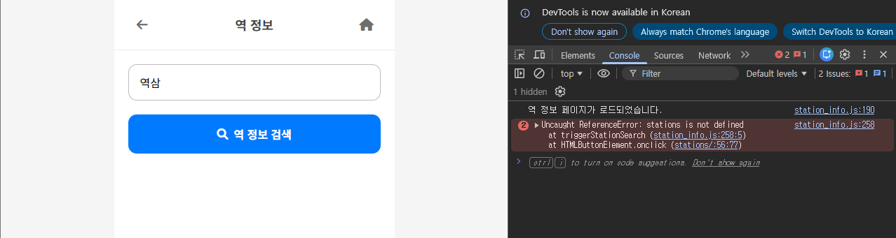

## 오늘 한 일

### 검색 자동완성 그룹화 `feat/search-autocomplete`

DB 구조 개편 및 서버에 DB 적재 과정 후에 자동완성 기능이 정상적으로 작동하는지 확인했다.

자동완성 쿼리를 참조하는 데이터 테이블과 필드명을 일치시키고, 호선 정보가 한 줄에 출력되도록 수정했다.


호선 정보가 여러 개인 역(강남)이 중복해서 출력되는 문제


자동완성 기능 수정 후 테스트

### action-buttons 너비 동일하게 수정 `feat/route-layout`

‘처음부터’ 버튼은 form 태그 안에 button 태그가 중첩된 구조이고, 나머지 두 버튼은 button 태크로만 이루어져 있어서 flex가 제대로 적용되지 않는 문제가 있었다.

`display: flex;` 에서 `display: grid;` 로 수정하고 3등분하여 공간을 균등 분배하는 방법으로 해결했다.

1. `route.html`에서 `<form>` 태그의 `style="display:inline;"`을 **제거**
2. `route.css`에서 `.action-buttons`, `.action-btn`, `.action-buttons > form` 속성을 수정

```css
/* route.css */
.action-buttons {
    display: grid;
    grid-template-columns: 1fr 1fr 1fr;
    ...
}

.action-buttons > form {
    margin: 0;
    padding: 0;
    display: contents;
}

.action-btn {
    /* flex: 1; */
    ...
    width: 100%;
    height: 100%;
    justify-content: center;
}
```


액션 버튼 수정 전


액션 버튼 수정 후

### ‘이용불가’ 안내창을 모달로 수정 `feat/route-layout`

‘이용 불가’ 액션 버튼을 누르면 신고할 수 있도록 하는 기능을 위한 요소로 남겨두었다.

안내창으로 안내되었는데, 전체 디자인과의 통일성을 위해 모달로 수정했다.

```html
<!-- route.html -->
  {# 이용 불가 모달 #}
  <div id="reportClosureModal" class="modal">
    <div class="modal-content">
      <div class="modal-header">
        <h3><i class="fas fa-exclamation-triangle"></i> 기능 안내</h3>
        <button class="close-btn" onclick="closeReportClosureModal()">
          <i class="fas fa-times"></i>
        </button>
      </div>
      <div class="report-modal-body"> 
        <p>
          '이용 불가' 신고 기능은 현재 준비 중입니다.
          <br>
          빠른 시일 내에 더 좋은 서비스로 찾아뵙겠습니다.
        </p>
      </div>
    </div>
  </div>
```

```jsx
// route.js
// '이용 불가' 버튼 -> 모달 창 띄우기
function reportClosure() {
    document.getElementById('reportClosureModal').classList.add('show');
}

// (추가) '이용 불가' 모달 닫기
function closeReportClosureModal() {
    document.getElementById('reportClosureModal').classList.remove('show');
}
```

```css
/* route.css */
/* '이용 불가' 모달 전용 스타일 */
#reportClosureModal .report-modal-body {
    padding: 24px 16px 16px 16px; 
    text-align: center; 
}

#reportClosureModal .report-modal-body p {
    margin: 0 0 24px 0; 
    font-size: 16px;
    line-height: 1.6;
    color: var(--text-color-secondary); 
}
```


‘이용 불가’ 안내창


‘이용 불가’ 모달

### 경로 안내 화면 디자인 수정 `feat/route-layout`

1. "스텝 1/2" : 아이콘 상단에 작은 글씨로
2. {{ step_text }} : 이전/다음 버튼과 겹치지 않도록, 작은 글씨로, 가독성 있게
3. 이전/다음 버튼 : 더 작게, 더 화면 외곽으로 배치, '<' '>' 화살표 모양으로 변경
4. 지하철 마커 : 출발/도착역과 일치하게 변경


Before


---

## 공유하고 싶어요



지금 ‘역 정보 검색’ 버튼이 작동하지 않습니다.

기존 station_info.js 파일에 목업 데이터를 가져오던 방식에서, DB 데이터를 활용하는 방식으로 바꾸는 과정에서 검색 버튼을 눌렀을 때 실행되는 `triggerStationSearch` 함수는 수정하지 않았기 때문입니다. 여전히 API를 호출하지 않고 파일 상단에 있는 (지금은 삭제되었거나 오래된) 가짜 데이터 `stations` 배열을 검색하고 있습니다.

수정하기에 앞서, 기존의 역 정보 페이지를 남겨둘 것인지, 실시간 도착 정보만 제공할 것인지 (이 경우 메인 버튼이 ‘길찾기’, ‘실시간 도착 정보’로 개편) 결정해야 합니다.

1. 기존 페이지를 유지한다면, DB에 저장된 역 정보 데이터를 가져오기 위해 API를 호출해야 합니다. stations/views.py 함수를 추가하고 api용 url을 정의하고, 관련 js 함수를 수정해야 합니다.
2. 실시간 도착 정보 페이지로 개편한다면, http request를 통해 새로운 페이지를 랜더링하는 방법으로 새로 구성해야 합니다. 실시간 도착 정보 페이지 템플릿을 추가하고, 랜더링하는 view 함수를 추가해야 합니다.

---

### 해보고 싶은 것

- [ ]  리팩토링 및 코드 정리
    - [ ]  모달 클래스로 만들거나 일관된 스타일 적용
    - [ ]  Html 파일 내에 스크립트 작성된거 js 파일로 옮기기
    - [ ]  JavaScript 리팩토링 - eslint