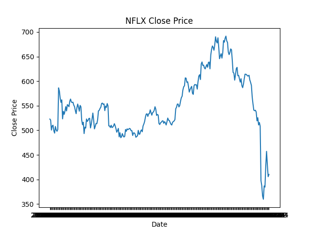
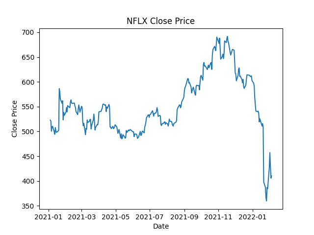

# [관통 PJT] 2회차 도전 과제 | 금융 서비스

## 코드 파일 보러가기 → [](https://github.com/ajjoona-git/pjt-02.git)

### 요구사항

본 프로젝트는 넷플릭스 주가 데이터를 활용한 시계열 데이터 분석 프로젝트로, Pandas와 Matplotlib 등 데이터 분석에 필요한 핵심 라이브러리를 실습하며 데이터 사이언스의 기초를 학습하는 것을 목표로 한다. 외부 데이터를 활용한 전처리, 분석, 시각화, AI 기반 예측까지의 전체 흐름을 직접 수행함으로써 실무와 유사한 데이터 처리 경험을 제공한다.

## 프로젝트 개요

NFLX(넷플릭스)의 주가 데이터를 분석하고 시각화하는 파이썬 프로젝트. 
2021년 이후의 데이터를 중심으로 Pandas와 Matplotlib 라이브러리를 활용했다.

- 데이터 수집: Kaggle의 NFLX.csv 파일을 GitHub URL을 통해 가져와 사용

- 데이터 전처리: 2021년 이후의 데이터만 필터링하고 날짜 형식 통일

- 데이터 분석: 최고/최저 종가 및 월별 평균 종가 계산

- 데이터 시각화: 종가 추이, 월별 평균 종가, 최고가/최저가/종가를 종합한 복합 그래프를 작성하여 데이터의 흐름을 시각적으로 파악할 수 있도록 함

## 담당한 코드

- `nflx_analysis.ipynb` 

    - B. 데이터 전처리

    - C. 데이터 분석 (오류해결)

## 배운점 / 오류 해결

### 1. [pandas] 날짜 형식 지정

`pd.to_datetime` 날짜 형식으로 변환하는 함수

```python
# 2021년 이후의 데이터만 필터링한다.
# def year_extract(date):
#     '''주어진 문자열(date, yyyy-mm-dd)에서 연도만 추출해서 반환'''
#     return int(date[:4])

# df_after2021 = df[df['Date'].apply(year_extract) >= 2021]
"""
위 코드로 진행 시, x축(날짜)의 간격을 지정하지 못한다...
그래서 'Date'열을 날짜 형식으로 형변환을 진행 후 필터링해서 해결했다.
"""
df['Date'] = pd.to_datetime(df['Date'])
df_after2021 = df[df['Date'] >= "2021-01-01"].copy()
```

| 수정 전 | 수정 후 |
|---|---|
|  |  |


### 2. [pandas] 명시적 복사본 만들기

```python
# 연도 - 월 열 추가
df_after2021['Date_Ym'] = df_after2021['Date'].apply(year_extract)
```

- `SettingWithCopyWarning` 경고

원인: `df_after2021 = df[df['Date'] >= "2021-01-01"]`와 같이 원본 DataFrame에서 일부를 필터링하여 새로운 DataFrame을 만들 때, Pandas는 이 DataFrame을 원본의 '뷰(view)'로 간주할 수 있다. 여기에 새로운 열(`Date_Ym`)을 추가하려 하자, 원본 데이터와 복사본 사이의 불확실성 때문에 경고가 발생했다.

해결: `df_after2021 = df[df['Date'] >= "2021-01-01"].copy()`와 같이 필터링 시점에 `.copy()`메서드를 명시적으로 사용하여 원본과 완전히 독립된 새로운 DataFrame을 생성함으로써 문제를 해결했다.


### 3. [matplotlib] plot()할 때 데이터 타입의 호환성 문제

```python
# 그래프로 시각화하기
# plt.figure(figsize=(12, 6))
plt.plot(df_monthly['Date_Ym'], df_monthly['Close'])
plt.title('Monthly Average Close Price')
plt.xlabel("Date")
plt.ylabel("Average Close Price")
tick_positions = range(0, len(df_monthly['Date_Ym']), 2)
plt.xticks(ticks=tick_positions, rotation=45)
plt.show()
```

- `matplotlib.units.ConversionError` 경고 발생

원인: 하나의 matplotlib 그림 영역(Figure)에 여러 그래프를 그릴 때, x축 데이터의 타입이 일치하지 않아 발생한 오류이다. 'Date' 열을 `pd.to_datetime()`으로 변환 후, `plt.plot(df_monthly['Date_Ym'], df_monthly['Close'])`를 호출할 때 다시 str으로 변환하게 된다. 특히 `plt.plot()`을 여러 번 호출하면서 x축 데이터 타입이 `datetime`에서 `str`로 변경되어 호환성 문제가 생겼다.

-> 해결 방법1: 한 번 실행할 때 한 개만 plot한다.

-> 해결 방법2: plot하기 전에 `plt.figure(figsize=(12, 6))`을 추가하여 새로운 그림 영역을 만든다.


## 느낀점

데이터를 자르고 붙이고 변형하면서 나한테 필요한 형태로 바꾸고, 분석하는 데 비교적 간단한 python 문법으로 가능하다는 것을 배웠다. 방법이 간단한 만큼, 어떤 데이터를 활용해서 어떤 방식으로 분석을 진행할 것인가를 결정하는 것이 중요하다고 생각한다. 복잡한 데이터들 속에서 유의미한 결과를 찾아내기 위해서 다양한 도메인에 대한 관심과 인사이트가 필요하다고 느꼈다.

그리고 시각화 하는 과정에서 제목, 축 라벨, 범례 등 다양한 시각적 요소를 활용해 해당 그래프를 보는 사람을 고려하는 것도 중요하다고 느꼈다. 결국 데이터를 시각화하는 것은 다른 사람에게 해당 그래프를 근거로 어떠한 결과를 제안하기 위한 것이다. 

여담으로 5년 전 numpy, pandas, matplotlib 패키지를 이용해서 데이터 분석 공모전에 출전한 경험이 있다. 한번 해봤던 거라 만만하게 생각했는데, 다 까먹어서 그런지 어려웠다.