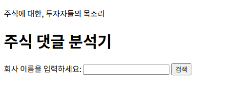
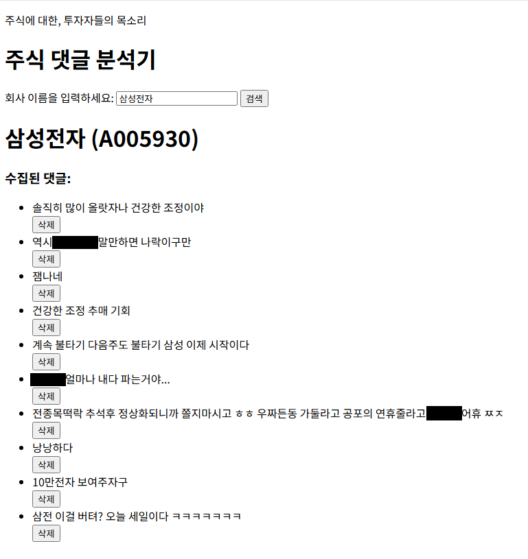
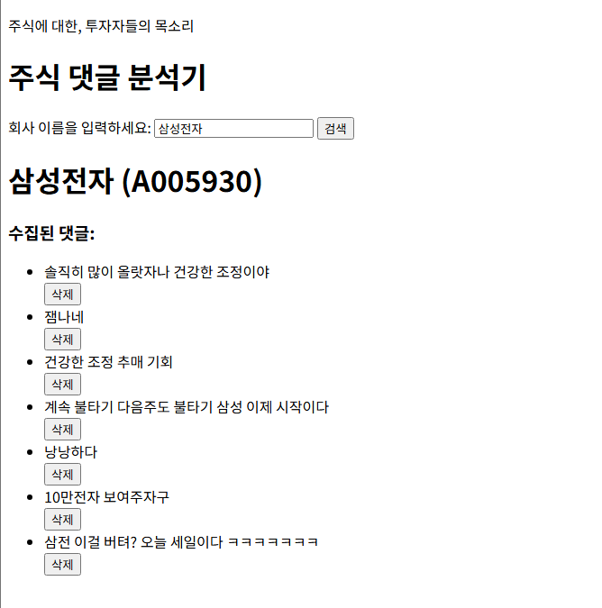
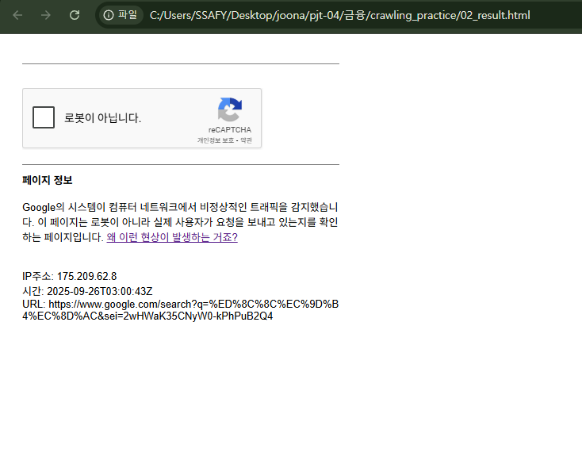
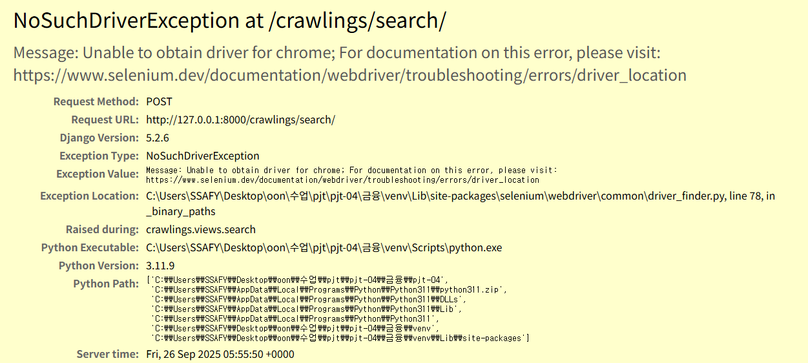
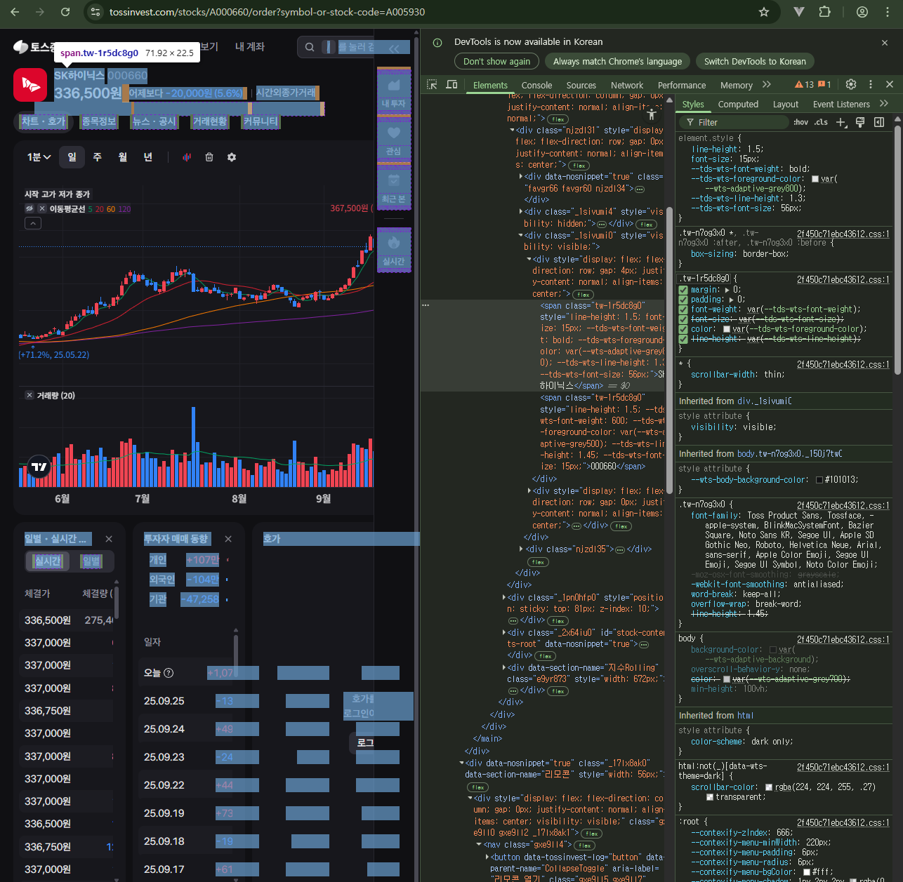
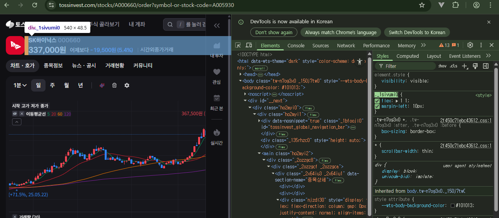
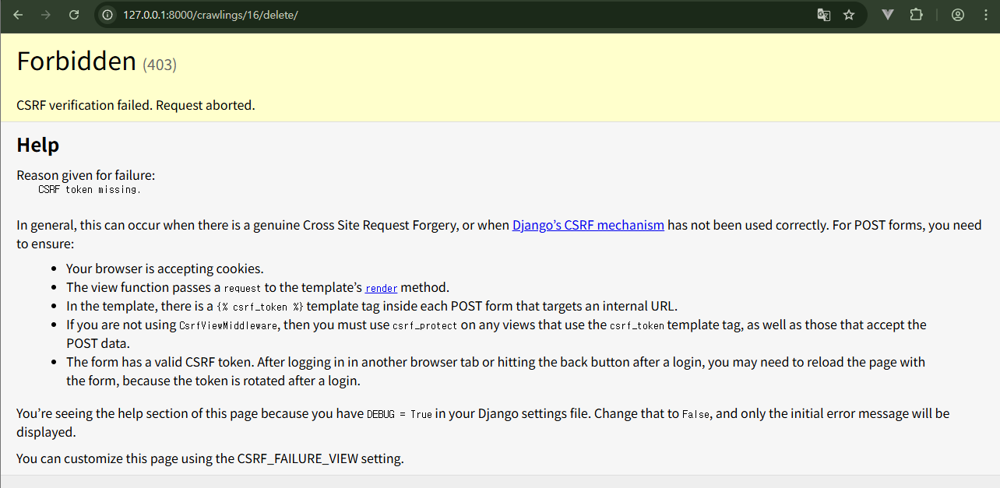
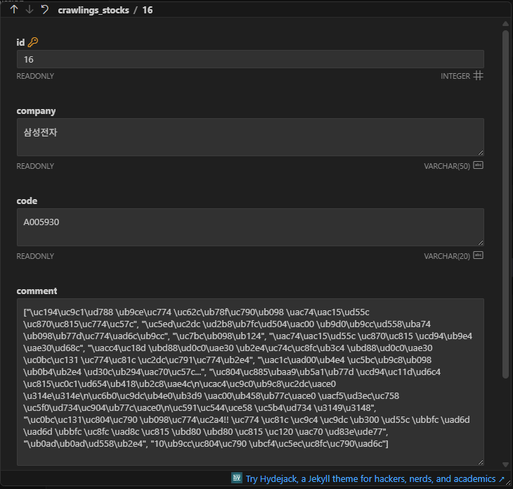
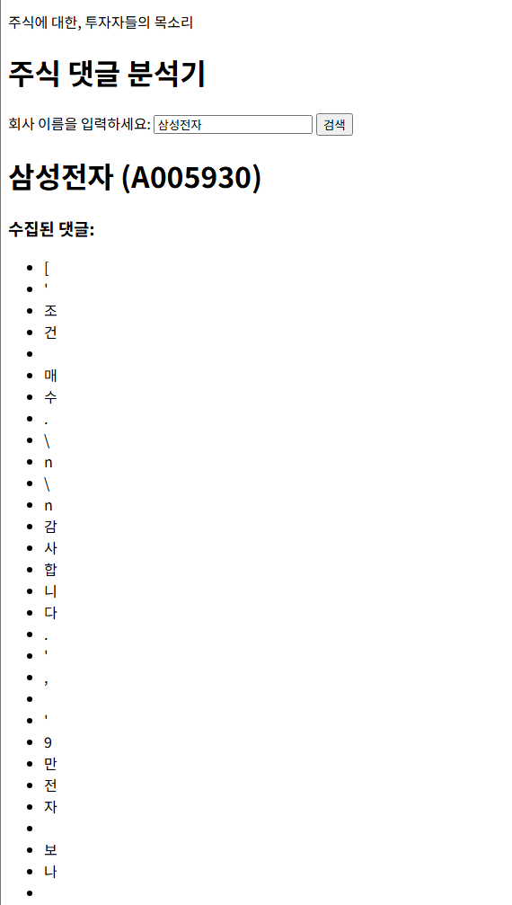

#  [관통 PJT] 4회차 도전 과제 | 주식 정보 크롤링 및 게시판 서비스

## 코드 파일 보러가기 → [](https://github.com/ajjoona-git/pjt-04.git)

<aside>
💡 금융 | 박영운 박준아
</aside>

### 요구사항
셀레니움(Selenium)을 활용하여 동적 웹 페이지에서 주식 정보를 크롤링하고, Django 프레임워크를 이용해 웹 페이지에 시각화하며 댓글 기능을 구현합니다.

## 담당 기능 및 구현 화면

| 구분 | 내용 |
| --- | --- |
| **페이지명** | **메인 페이지 (`crawlings/`)** |
| **이미지** |  |
| **설명** | 주식 정보 크롤링 및 목록 표시 |

| 구분 | 내용 |
| --- | --- |
| **페이지명** | **상세 페이지 (crawlings/detail/<int:pk>/)** |
| **이미지** |  |
| **설명** | 상세 정보 및 댓글 생성/조회 |

| 구분 | 내용 |
| --- | --- |
| **페이지명** | **댓글 삭제 기능 (crawlings/delete/<int:pk>/)** |
| **이미지** |  |
| **설명** | 특정 댓글 삭제 후 상세 페이지로 리다이렉트 |

## 주요 해결 과정 및 배운 점

### 1. Selenium을 활용한 동적 페이지 크롤링

```python
# ===== 드라이버 생성 함수 =====
def get_driver():
    """
    크롬 드라이버를 초기화하여 WebDriver 객체를 반환합니다.
    - 옵션 및 경로 설정을 한 곳에서 관리
    """
    chromedriver_path = Path("chromedriver-win64/chromedriver.exe")
    if not chromedriver_path.exists():
        raise FileNotFoundError(
            "chromedriver-win64/chromedriver.exe 파일이 존재하지 않습니다."
        )

    # 크롬 옵션 세팅
    chrome_options = webdriver.ChromeOptions()
    # chrome_options.add_argument("--headless")  # 필요시 활성화
    chrome_options.add_argument(
        "user-agent=Mozilla/5.0 (Windows NT 10.0; Win64; x64) "
        "AppleWebKit/537.36 (KHTML, like Gecko) Chrome/90.0.4430.93 Safari/537.36"
    )
    chrome_options.add_experimental_option(
        "excludeSwitches", ["enable-automation"]
    )
    chrome_options.add_experimental_option("useAutomationExtension", False)
    chrome_options.add_argument("disable-blink-features=AutomationControlled")

    service = Service(executable_path=str(chromedriver_path))
    return webdriver.Chrome(service=service, options=chrome_options)
```

- `chrome_options.add_argument("--headless")` 브라우저 창을 띄우지 않고 크롤링을 진행하는 옵션
    - 캡차(CAPTCHA) 인증이 필요한 페이지에서는 사용할 수 없음을 확인했다. 이 경우 해당 옵션을 주석 처리하고 직접 인증해야 원하는 페이지 정보를 저장할 수 있다.



캡차 입력하지 않은 경우 저장된 파일 (’—headless’ 활성화 시)

### 2. 토스 예제: 01_toss_practice.py — 메인 페이지 접속

```python
# 크롬 드라이버 옵션 설정
chrome_options = Options()
chrome_options.add_argument("--disable-gpu")  # GPU 비활성화
chrome_options.add_argument("--disable-extensions")  # 확장 프로그램 비활성화
chrome_options.add_argument("--no-sandbox")  # 샌드박스 모드 비활성화
chrome_options.add_argument(
    "--disable-dev-shm-usage"
)  # /dev/shm 공유 메모리 사용 제한 해제
```

- `chrome_options.add_argument("--no-sandbox")` 크롬의 샌드박스 보안 모델을 비활성화한다.
    - 샌드박스(Sandbox) 모드: 외부 프로그램이나 코드를 **시스템의 나머지 부분과 격리된, 제한된 환경에서 실행**하는 보안 메커니즘

### 3. 경로 설정 문제 해결 (NoSuchDriverException)



```python
# 이전 폴더의 크롬 드라이버 경로 (오류 발생)
# service = Service("../chromedriver-win64/chromedriver.exe")

# 해결 방법 1: 절대 경로 지정
DRIVER_PATH = Path(__file__).resolve().parent.parent / "chromedriver-win64" / "chromedriver.exe"
service = Service(executable_path=str(DRIVER_PATH))

# 해결 방법 2: 정확한 상대 경로 지정
service = Service("chromedriver-win64\chromedriver.exe")
```
- 문제 발생: chromedriver.exe의 상대 경로를 잘못 설정하여 NoSuchDriverException 오류가 발생했다.

- 해결 방안: Path(__file__).resolve()를 사용하여 파일의 절대 경로를 기준으로 드라이버 경로를 설정하거나, 파일 탐색기에서 '상대 경로 복사' 기능을 이용해 정확한 경로를 입력하여 문제를 해결했다.


### 4. CSS 선택자를 이용한 정확한 요소 추출




- 문제 발생: `soup.select_one(".tw-1r5dc8g0")`처럼 단일 클래스 선택자 사용 시, 여러 요소가 동일한 클래스를 공유하여 원하지 않는 정보가 추출되었다.

- 해결 방안:
1. `soup.select_one(".tw-1r5dc8g0")` : 처음에는 ‘SK하이닉스’의 클래스를 선택함

    ⇒ 출력 결과: `/`

    클래스 이름을 모두 선택해본 결과, 종목 이름뿐만 아니라 다른 요소들에도 동일한 클래스가 적용됨을 확인했다. (상기 이미지 참고)

2. `soup.select_one("._1sivumi0")` : 종목 이름을 감싸고 있는 부모 태그 혹은 클래스를 찾아 적용함

    ⇒ 출력 결과: `SK하이닉스000660336,500원어제보다 -20,000원 (5.6%)`

    해당 출력 결과에서 split을 할까 생각했지만, 공백으로 구분된 문자열이 아니기 때문에 불가능했다.

3. `soup.select_one("._1sivumi0 .tw-1r5dc8g0")` : 두 가지 클래스 선택자를 결합함

    ⇒ 출력 결과: `SK하이닉스`


### 5. Django - 403 Forbidden 오류 해결



하나의 페이지에 `form` (HTTP request method=POST) 태그가 2개 이상 존재할 경우, 각각의 `form` 태그 내부에 ``을 개별적으로 작성해야 한다!

### 6. Django - JSONField를 활용한 댓글 기능 구현

Django 모델에는 리스트를 직접 저장하는 ListField가 없어, models.JSONField()를 활용하여 댓글 목록을 저장했다.



- `comment = models.JSONField()`: 댓글들을 리스트 형태로 저장한다.

```html
<!-- crawlings/detail.html -->
  
  <li>
    {{ comment }}
    <form action="" method="POST">
      
      <input type="hidden" name="comment_index" value="{{ forloop.counter0 }}">
      <input type="submit" value="삭제" name>
    </form>
  </li>
  
```

- `{{ forloop.counter0 }}` : **0부터 시작**하는 루프 카운터로, 리스트의 인덱스와 정확히 일치한다.

```python
def delete(request, pk):
    stock = Stocks.objects.get(pk=pk)
    # 삭제할 댓글의 인덱스를 받아 온다.
    index = int(request.POST.get('comment_index'))
    # comment 리스트에서 index에 해당하는 값을 삭제한다.
    del stock.comment[index]
    # 변경 사항을 저장한다.
    stock.save()

    return redirect('crawlings:detail', stock.pk)
```

- 리스트이기 때문에 index로 접근 가능하다.


- comment = TextField()로 설정했을 때

각 문자열을 순회하면서 출력하기 때문에 한 글자씩 출력된다.