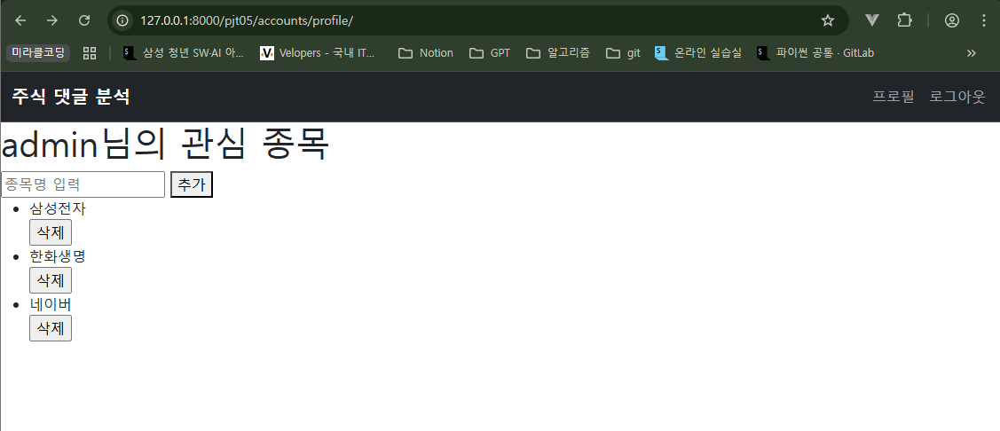
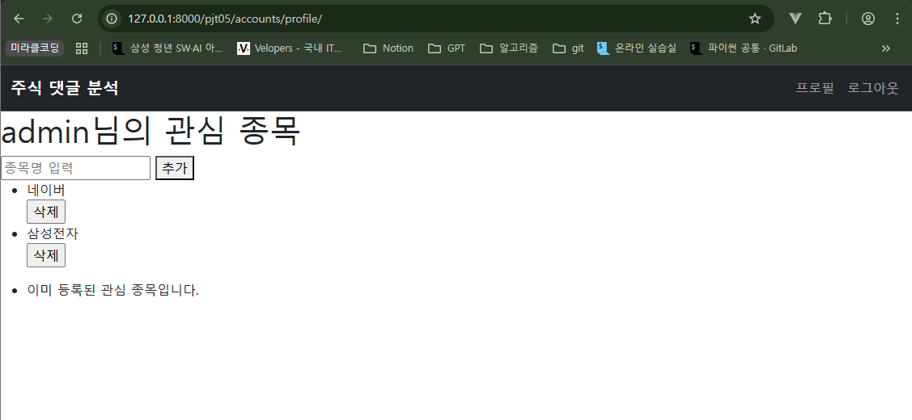
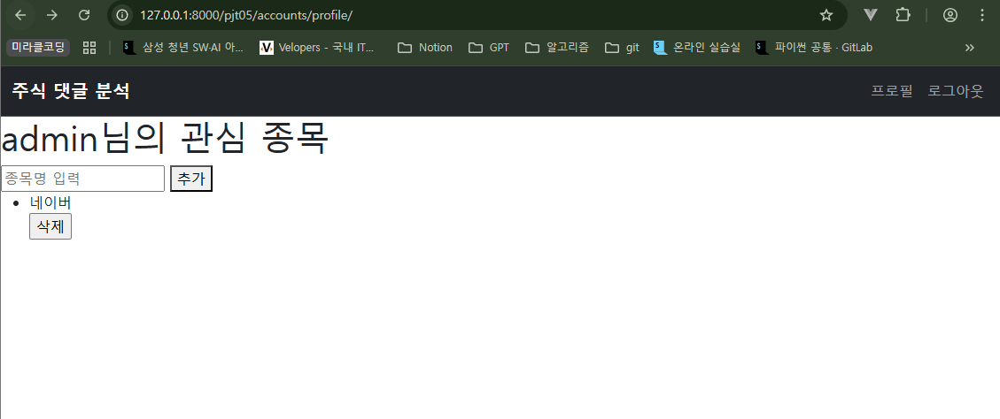
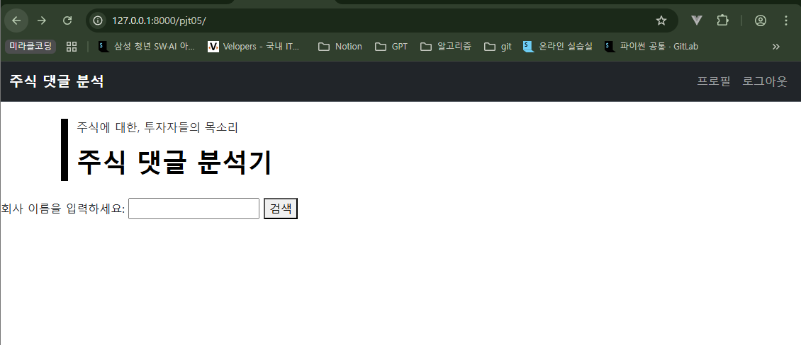

# [관통 PJT] 5회차 도전 과제 | 금융 서비스

## 코드 파일 보러가기 → [](https://github.com/ajjoona-git/pjt-05.git)


## 프로젝트 개요

기존 주식 데이터 수집 프로젝트에 Django 인증 시스템을 활용한 회원 기능을 추가합니다. 사용자별 프로필 페이지에서 관심 종목을 저장, 조회, 삭제하고 , 종목 클릭 시 크롤링 데이터와 연동하여 보여주는  개인화된 웹 서비스 개발을 목표로 합니다.

### 요구사항

- **회원 관리 기능**
    - **네비게이션 바 구현**: 로그인 상태에 따라 '회원가입/로그인' 또는 '로그아웃/프로필' 메뉴가 동적으로 표시되어야 합니다.
    - **회원가입**: Django의 기본 User 모델을 활용하며, `username`과 `password`를 입력받아 가입을 처리합니다. 가입 성공 시 자동으로 로그인 상태가 되고 메인 페이지로 이동합니다.
    - **로그인/로그아웃**: Django의 인증 시스템(`django.contrib.auth`)을 사용하여 안전한 로그인 및 로그아웃 기능을 구현합니다.
- **관심 종목 기능**
    - **모델 구현**: 사용자별로 관심 종목을 저장하는 모델을 설계합니다. 한 사용자가 동일한 종목을 중복 저장할 수 없도록 `UniqueConstraint`를 적용해야 합니다.
    - **프로필 페이지**: 사용자는 프로필 페이지에서 관심 종목을 조회, 추가, 삭제할 수 있어야 합니다. 등록된 종목이 없으면 안내 메시지를 출력합니다.
    - **크롤링 연동**: 프로필 페이지에서 특정 종목을 클릭하면, DB에 데이터가 있으면 즉시 출력하고, 데이터가 없으면 크롤링을 수행하여 결과를 저장하고 출력해야 합니다.
- **문서화 및 환경 관리**
    - **README 작성**: 프로젝트의 분석 과정, 학습 내용, 어려웠던 점 등을 `README.md` 파일에 상세히 기록해야 합니다.
    - **환경변수 관리**: `.gitignore` 파일을 작성하여 민감한 정보(Secret Key 등)나 불필요한 파일이 Git에 포함되지 않도록 관리해야 합니다.

### 담당 기능

- **회원 관리**: 로그인, 로그아웃 기능 `views.login`, `views.logout`
- **모델 구현**: 사용자(User)와 관심 종목(UserinterestStock) 간의 관계 모델링 `CustomUserCreationForm`, `StockForm`
- **프로필 페이지**: `views.profile`
    - 로그인한 사용자의 관심 종목 목록 조회
    - 신규 관심 종목 추가 기능
    - 관심 종목 삭제 기능

### 구현 화면









## 주요 해결 과정 및 배운점

### 1. 회원가입 시 CustomUserCreationForm 쓰는 이유

```python
# accounts/forms.py
from django.contrib.auth.forms import UserCreationForm
from django.contrib.auth import get_user_model

class CustomUserCreationForm(UserCreationForm):
    class Meta(UserCreationForm.Meta):
        # model = 과거의 기본 User 클래스
        #       => 우리의 현재 User 클래스로 대체
        # get_user_model 함수는 현재 프로젝트에 활성화 되어있는 유저 클래스를 자동으로 반환
        model = get_user_model()
```

- **`get_user_model()`**: 이 함수는 특정 모델을 직접 가리키는 대신, `settings.AUTH_USER_MODEL` 설정을 확인하여 **현재 프로젝트에서 활성화된 사용자 모델을 동적으로 찾아 반환**합니다.
- `CustomUserCreationForm`은 `get_user_model()`을 통해 우리 프로젝트의 공식 사용자 모델(`accounts.User`)이 무엇인지 스스로 찾아내어 연결됩니다. 이를 통해 **모델과 폼의 불일치 문제를 해결하고, 유연하며 재사용 가능한 회원가입 폼을 구현**할 수 있습니다.

### 2. Form 과 ModelForm의 차이

```python
def signup(request):
    if request.method == "POST":
        form = CustomUserCreationForm(request.POST)  # Form
        if form.is_valid():
            user = form.save()
            auth_login(request, user)
            return redirect('contentfetch:stock_finder')
    else:
        form = CustomUserCreationForm()
    context = {
        'form': form,
    }
    return render(request, 'accounts/signup.html', context)

def login(request):
    if request.method == "POST":
        form = AuthenticationForm(request, request.POST)  # ModelForm
        if form.is_valid():
            auth_login(request, form.get_user())
            return redirect('contentfetch:stock_finder')
    else:
        form = AuthenticationForm()

    context = {
        'form': form,
    }
    return render(request, 'accounts/login.html', context)
```

- **`ModelForm`**: **모델과 직접 연결**되어 모델의 필드를 기반으로 폼을 자동 생성합니다. `.save()` 메서드로 객체를 쉽게 생성/수정할 수 있습니다. `CustomUserCreationForm`이 여기에 해당합니다.
- **`Form`**: 모델과 직접적인 관련 없이, 독립적인 폼 필드를 정의합니다. 데이터베이스에 저장되지 않는 로그인 폼(`AuthenticationForm`), 검색 폼 등에 적합합니다.

`signup` 기능에서는 `ModelForm`을 사용해 사용자 객체를 DB에 직접 저장했고, `login` 기능에서는 `Form`을 사용해 입력된 정보의 유효성만 검증하고 DB와는 별개인 인증 로직을 수행했습니다.

### 3. `ForeignKey`와 `UniqueConstraint`를 이용한 관계 모델링

```python
class UserinterestStock(models.Model):
    user_name = models.ForeignKey(
        settings.AUTH_USER_MODEL,
        on_delete=models.CASCADE
    )
    stock_name = models.CharField(max_length=255)
    created_at = models.DateTimeField(auto_now_add=True)

    class Meta:
        constraints = [
            models.UniqueConstraint(
                fields=["user_name", "stock_name"],
                name='unique_user_stock',
            )
        ]
```

- **`ForeignKey` (외래 키)**: `User`와 `UserinterestStock` 모델 간의 1:N 관계를 설정했습니다. Django ORM이 `ForeignKey` 필드(`user`)를 실제 데이터베이스에는 `user_id`라는 컬럼으로 생성한다는 것을 확인했습니다.
- **`UniqueConstraint` (고유성 제약)**: **한 명의 사용자가 동일한 주식을 중복으로 등록하는 것을 방지**하기 위해 `Meta` 클래스에 제약 조건을 추가했습니다. `fields`에 `['user', 'stock_name']`을 함께 지정하여, 두 필드의 조합이 테이블 전체에서 고유하도록 설정했습니다. 이는 애플리케이션 레벨이 아닌 **데이터베이스 레벨에서 데이터의 무결성을 보장**하는 강력한 방법임을 배웠습니다.

### 4. UniqueConstraint → IntegrityError

```python
from django.db import IntegrityError
from django.contrib import messages

@login_required
def stock_add(request):
    if request.method == "POST":
        form = StockForm(request.POST)
        if form.is_valid():
            try:
                # 1. commit=False로 객체 생성
                interest_stock = form.save(commit=False)
                # 2. user 할당
                interest_stock.user_name = request.user
                # 3. 최종 저장
                interest_stock.save()
            # UniqueConstraint 위반 시 오류 발생
            except IntegrityError:
                messages.error(request, '이미 등록된 관심 종목입니다.')

            return redirect('accounts:profile')
    else:
        form = StockForm()
    context = {
        'form': form,
    }
    return render(request, 'accounts/profile.html', context)
```

`UniqueConstraint`를 위반하여 중복된 데이터를 저장하려 할 때, 서버가 `IntegrityError`를 발생시키며 멈추는 문제를 해결해야 했습니다. `try...except` 구문을 사용해 이 오류를 처리하고, Django의 `messages` 프레임워크를 활용해 사용자에게 상황을 친절하게 안내했습니다.

이를 통해 서버가 다운되는 것을 막고, 사용자에게 "이미 등록된 관심 종목입니다."와 같은 명확한 피드백을 제공하여 UX를 크게 향상시킬 수 있었습니다.

### 5. 단일 View에서의 GET/POST 처리와 Context 데이터 관리

관심 종목을 추가할 때 빈 값을 제출하는 등 폼 유효성 검사(validation)에 실패하면 관심 종목 목록이 사라지는 문제가 있었습니다. 이는 폼 처리 로직의 흐름을 잘못 이해하여, 템플릿을 다시 렌더링할 때 필요한 모든 데이터(context)를 전달하지 않았기 때문이었습니다.

이 문제를 해결하기 위해 `profile` 뷰의 로직을 다음과 같이 수정했습니다. 하나의 뷰 함수 내에서 **GET 요청(페이지 최초 로드)과 POST 요청(폼 제출)을 모두 처리**하되, **어떤 경우에도 템플릿에 필요한 모든 Context 데이터가 전달되도록** 구조를 개선했습니다.

`if/else` 블록 바깥에서 `stocks` 목록을 조회함으로써, GET 요청이든 유효성 검사에 실패한 POST 요청이든 관계없이 항상 관심 종목 목록을 템플릿으로 전달할 수 있었습니다.

```python
@login_required
def profile(request):
    if request.method == "POST":
        form = StockForm(request.POST)
        if form.is_valid():
            try:
                # 1. commit=False로 객체 생성
                interest_stock = form.save(commit=False)
                # 2. user 할당
                interest_stock.user_name = request.user
                # 3. 최종 저장
                interest_stock.save()
            # UniqueConstraint 위반 시 오류 발생
            except IntegrityError:
                messages.error(request, '이미 등록된 관심 종목입니다.')
            return redirect('accounts:profile')

    else:
        form = StockForm()

    stocks = UserinterestStock.objects.all()
    context = {
        'stocks': stocks,
        'form': form,
    }
    return render(request, 'accounts/profile.html', context)
```