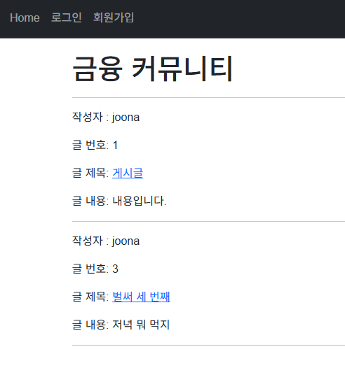
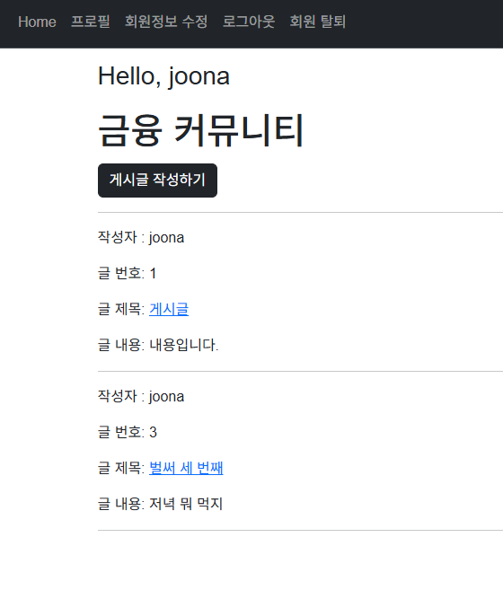
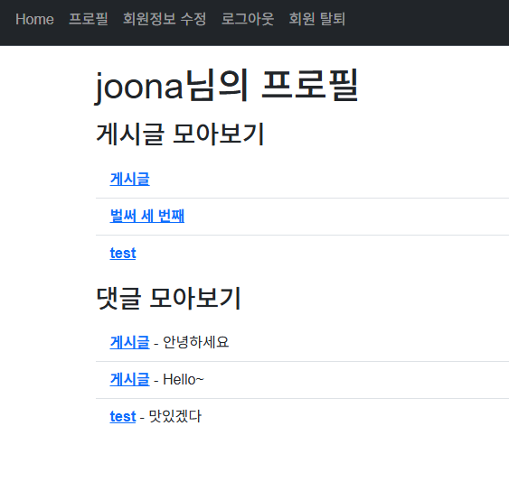

# [관통 PJT] 6회차 도전 과제 | 금융 서비스

## 코드 파일 보러가기 → [](https://github.com/ajjoona-git/pjt-06.git)


## 프로젝트 개요

AI 기반 금융 커뮤니티 서비스의 기반을 구축하는 프로젝트입니다. Django의 인증 시스템을 활용해 회원가입, 로그인, 정보 수정, 비밀번호 변경 기능을 구현합니다. 또한, 금융 게시판의 게시글과 댓글 CRUD 기능을 완성합니다.

### 요구사항

- **Accounts**
    - 회원가입, 로그인, 로그아웃 기능 
    - 회원정보 수정, 회원 탈퇴, 비밀번호 변경 기능
    - 로그인한 사용자의 프로필 페이지
- **Posts**
    - 전체 게시글 목록 조회 (index) 
    - 게시글 생성(create), 상세 조회(detail), 수정(update), 삭제(delete) 
    - 댓글 생성(comment_create) 및 삭제(comment_delete)
- **비기능적 요구사항**
    - Git을 활용한 버전 관리 및 협업 
    - 일관성 있는 URL 구조 설계 
    - 허용된 HTTP Method만 접근 가능하도록 설정

### 담당 기능

- **프로필 페이지**
    - 로그인한 사용자만 접근 가능
    - 본인이 작성한 게시글과 댓글 모아보기
- **base 템플릿 생성 및 적용**
    - 모든 페이지가 공유할 base template 작성
    - 로그인/로그아웃 상태에 따른 Navbar 항목 구성
- **Bootstrap 적용**


### 구현 화면

#### 메인페이지 (로그인 전/후)




#### 게시글 상세 페이지

- 댓글 개수 추가


#### 사용자 프로필 페이지

- 사용자가 작성한 게시글과 댓글 모아보기

```python
# accounts/views.py
@login_required
def profile(request):
    posts = request.user.post_set.all()
    comments = request.user.comment_set.all()
    context = {
        'posts': posts,
        'comments': comments,
    }
    return render(request, 'accounts/profile.html', context)
```

```HTML
<!-- accounts/profile.html -->



  <h1>{{ user.username }}님의 프로필</h1>
  
  <h3>게시글 모아보기</h3>
  <ul class="list-group list-group-flush">
    
      <li class="list-group-item">
        <a class="fw-bold" href="">{{ post.title }}</a>
      </li>
    
  </ul>

  <h3>댓글 모아보기</h3>
  <ul class="list-group list-group-flush">
    
      <li class="list-group-item">
        <a class="fw-bold" href="">{{ comment.post }}</a> - {{ comment.content }}
      </li>
    
  </ul>


```

