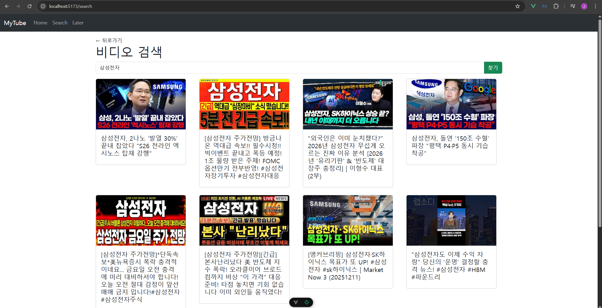
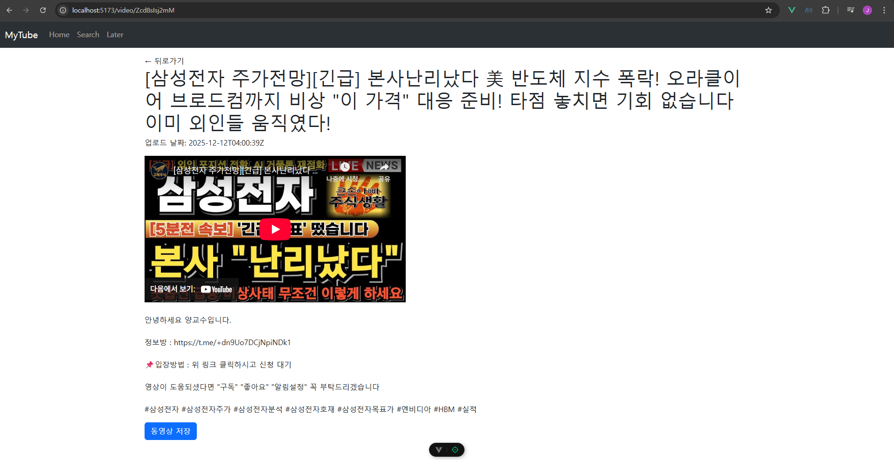
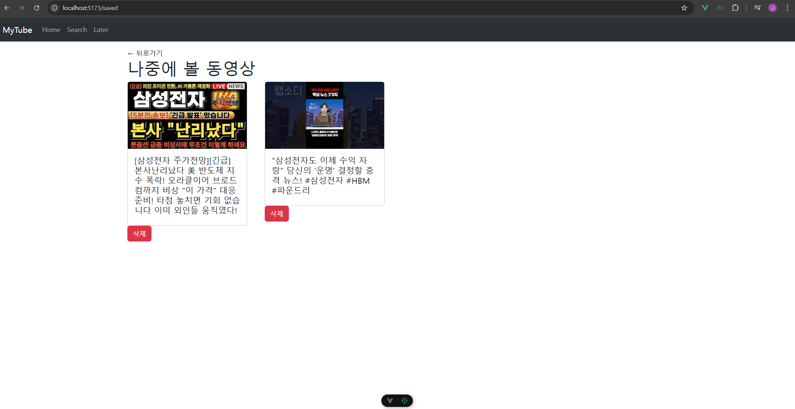

# [관통 PJT] 11회차 도전 과제 | 관심 종목 영상 검색 서비스 (MyTube)

## 프로젝트 개요

YouTube Data API v3를 활용하여 영상을 검색하고, 상세 정보를 확인하며, 로컬 스토리지(Local Storage)를 이용해 '나중에 볼 영상'을 저장 및 관리하는 Vue.js 기반의 SPA(Single Page Application) 서비스입니다.

## 요구사항

| ID | 요구사항명 | 상세 내용 |
| --- | --- | --- |
| **F01** | 동영상 검색결과 출력 | 검색어를 입력하여 YouTube API를 호출하고, 결과를 카드 리스트 형태로 출력한다. |
| **F02** | 동영상 상세 페이지 | 특정 영상 클릭 시 상세 정보를 출력하고 iframe을 통해 영상을 재생한다. |
| **F03** | 나중에 볼 영상 관리 | Local Storage를 활용해 영상을 저장/삭제하고, 저장된 목록을 별도 페이지에서 확인한다. |

### [F01] 동영상 검색결과 출력

> VideoCard 컴포넌트와 Pinia Store를 활용하여 구현했습니다.
> 
- **API 연동:** `axios`를 사용하여 YouTube Data API의 `/search` 엔드포인트에 요청을 보냅니다.
- **상태 관리:** Pinia Store(`videos.js`)에서 검색 결과(`videos`)를 관리하며, 컴포넌트에서는 `v-for`를 통해 리스트를 렌더링합니다.
- **컴포넌트 분리:** 개별 영상 정보는 `VideoCard.vue` 컴포넌트로 분리하여 재사용성을 높였습니다.

### [F02] 동영상 상세 페이지

> vue-router의 동적 라우팅과 /videos 엔드포인트를 활용했습니다.
> 
- **상세 조회:** `useRoute`로 URL의 `id` 파라미터를 받아 API(`videos` 엔드포인트)를 호출하여 상세 정보를 가져옵니다.
- **데이터 가공:** 제목의 HTML Entity(`&#39;` 등) 깨짐 현상을 해결하기 위해 `DOMParser`를 활용한 디코딩 함수를 구현했습니다.
- **영상 재생:** `iframe` 태그를 사용하여 YouTube 영상을 임베딩했습니다.

### [F03] 나중에 볼 영상 관리

> Pinia의 persist 플러그인과 computed 속성을 활용해 데이터 동기화를 구현했습니다.
> 
- **저장/삭제:** Store에 `savedVideos` 배열을 생성하고 `addSavedVideo`, `deleteSavedVideo` 액션을 구현했습니다. `pinia-plugin-persistedstate`를 사용해 Local Storage와 자동으로 동기화됩니다.
- **상태 토글:** 상세 페이지에서 `computed` 속성(`isSaved`)을 활용해 현재 영상의 저장 여부를 실시간으로 감지하고, 버튼 UI(저장/취소)를 동적으로 변경합니다.
- **데이터 구조 변환:** '나중에 볼 영상' 목록(`LaterView`)에서 `VideoCard`를 재사용하기 위해, 저장된 단순 데이터 객체를 API 응답 구조(`snippet` 형태)로 변환하여 props로 전달했습니다.

## 배운 점

### 1. Vue Template vs Script 문법 차이 (`.value`)

- **문제:** `<template>` 태그 내에서 `{{ isSaved.value }}`와 같이 사용하여 데이터가 출력되지 않는 문제가 발생했습니다.
- **해결:** Vue의 템플릿 문법에서는 `ref` 객체가 자동으로 언래핑(Unwrapping)되므로 `.value`를 생략해야 함을 알게 되었습니다. 반면 `<script setup>` 내부에서는 반드시 `.value`를 사용해야 합니다.

### 2. 이벤트 핸들러와 파라미터 전달

- **문제:** `@click="addSavedVideo"` 호출 시, 함수 인자로 비디오 데이터가 아닌 브라우저의 `MouseEvent` 객체가 전달되어 `undefined` 에러가 발생했습니다.
- **해결:** 함수 파라미터로 데이터를 받는 대신, `script` 내에 정의된 반응형 변수(`video.value`)를 직접 참조하도록 수정하여 해결했습니다.

### 3. API 데이터의 HTML Entity 처리

- **문제:** YouTube API에서 받아온 제목에 `&#39;`와 같은 HTML 특수문자가 그대로 출력되었습니다.
- **해결:** `DOMParser`를 이용해 HTML 문자열을 일반 텍스트로 변환하는 `decodeHtml` 유틸리티 함수를 만들어 적용했습니다.

### 4. 컴포넌트 재사용 시 데이터 구조 불일치

- **문제:** 검색 결과(API 원본 구조)와 로컬 스토리지 저장 데이터(단순 구조)의 형태가 달라 `VideoCard` 컴포넌트에서 에러가 발생했습니다.
- **해결:** `LaterView`에서 저장된 데이터를 `VideoCard`에 넘겨줄 때, `VideoCard`가 기대하는 API 구조(`id`, `snippet` 등)에 맞춰 객체를 재구성(Wrapping)하여 전달함으로써 컴포넌트를 수정하지 않고 재사용했습니다.

### 5. API 비동기 처리와 상태 할당

- **문제:** API 호출은 성공했으나 화면에 리스트가 뜨지 않는 현상이 있었습니다.
- **해결:** `axios` 응답(`res.data.items`)을 받아오기만 하고 Pinia 상태 변수(`videos.value`)에 할당하지 않은 실수를 발견하여 수정했습니다. 비동기 통신 후 데이터를 반응형 변수에 갱신해주는 과정의 중요성을 확인했습니다.