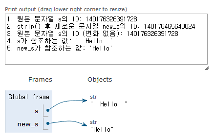
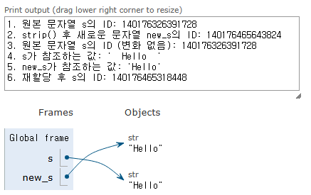

# 스스로 학습

## [문자열 조작 메서드]

### 문자열은 불변 객체

> 새로운 문자열을 반환하는 것이면, **기존 문자열은 어디에 있나? 다시 찾을 수 있나?**
> 

**기존 문자열은 여전히 원래 있던 메모리 공간에 존재한다.** 그리고 해당 문자열을 참조하던 변수가 없다면, 파이썬의 가비지 컬렉터(Garbage Collector)에 의해 언젠가 메모리에서 제거될 것이다.

새로운 문자열 객체를 생성하는 것은 '제거' 행위가 **원본 객체를 수정하는 것이 아니라, 특정 규칙에 따라 새롭게 조합된 내용을 가진 객체를 만드는 것**이기 때문이며, 이는 파이썬 문자열의 **불변성**이라는 근본적인 특성에서 비롯된다. 

한 번 생성된 문자열 객체의 내용은 **절대 변경될 수 없다.** 변경이 필요한 경우 항상 새로운 객체가 생성되므로 원본 데이터의 무결성이 보장된다.

```python
s = '  Hello  '
print(f"1. 원본 문자열 s의 ID: {id(s)}") # s가 참조하는 객체의 메모리 주소 확인

# s.strip()은 새로운 문자열을 만듭니다.
new_s = s.strip()
print(f"2. strip() 후 새로운 문자열 new_s의 ID: {id(new_s)}") # new_s가 참조하는 객체의 메모리 주소 확인
print(f"3. 원본 문자열 s의 ID (변화 없음): {id(s)}") # s는 여전히 원래 객체를 참조

print(f"4. s가 참조하는 값: '{s}'")
print(f"5. new_s가 참조하는 값: '{new_s}'")

# 이제 s에 새로운 문자열을 재할당해 봅시다.
s = s.strip() # s 변수에 strip()이 반환한 '새로운' 문자열을 다시 할당
print(f"6. 재할당 후 s의 ID: {id(s)}") # s가 이제 새로운 객체를 참조하게 됨

# 기존의 '  Hello  ' 객체는 어떻게 될까요?
# 이제 이 객체를 가리키는 변수는 없습니다.
# 파이썬의 가비지 컬렉터가 나중에 이 객체를 메모리에서 회수합니다.
```





- **어디에 있나?**: `s = s.strip()`처럼 변수를 재할당하게 되면, 처음에 `s`가 가리키던 `' Hello '` 객체는 더 이상 어떤 변수도 참조하지 않게 된다. 이처럼 더 이상 참조되지 않는 객체들은 파이썬의 가비지 컬렉터(Garbage Collector)의 대상이 된다.
- **다시 찾을 수 있나?**: 일반적으로, 한 번 참조를 잃은 객체는 **코드 상에서 직접적으로 다시 찾거나 접근할 수 없다.** 가비지 컬렉터가 작동하여 메모리에서 해당 객체를 지워버리면 완전히 사라지게 된다.

### `.strip([chars])`

- 공백 제거하는 경우(default)
    - `strip()` 메서드를 인자 없이 호출하면, 문자열의 **양 끝에 있는 모든 종류의 공백 문자** (스페이스, 탭 `\t`, 줄 바꿈 `\n` 등)를 제거한다.
    - 문자열 중간에 있는 공백은 제거하지 않는다.

```python
# strip 공백 제거(기본 동작)
text = '  Hello, world!  '
new_text1 = text.strip()
print(new_text1)  # Hello, world!
```

- 특정 문자 제거하는 경우
    - 인자로 **제거하고 싶은 문자들을 담은 문자열**을 전달하면, 해당 문자열에 포함된 모든 문자를 **양 끝에서 발견되는 대로 제거**한다.
    - 여기서 중요한 것은 인자로 전달된 문자열 자체가 제거되는 것이 아니라, **그 문자열에 포함된 개별 문자들**이 제거 대상이 된다는 점이다. 순서는 중요하지 않다.

```python
# strip 특정 문자 제거
s= 'abcHello, world!bca'
new_text = s.strip('abc')
print(new_text)  # Hello, world!
```

- 문자열의 한쪽 끝만 공백/특정 문자 제거하는 경우
    - `lstrip()` 문자열의 왼쪽(앞) 끝에서만 공백 또는 특정 문자를 제거
    - `rstrip()` 문자열의 오른쪽(뒤) 끝에서만 공백 또는 특정 문자를 제거

```python
# strip 한쪽 끝만 공백/특정 문자 제거
s = '---Hello, world!---'
new_s1 = s.lstrip('-')
print(new_s1)  # Hello, world!---
new_s2 = s.rstrip('-')
print(new_s2)  # ---Hello, world!
```

### `separator.join(iterable)`

`separator`에 지정된 **문자열**이 `iterable` (리스트, 튜플 등) 내의 각 요소 사이에 끼워져 하나의 새로운 문자열을 만든다.

문자열이라면 그 내용이 무엇이든 (빈 문자열이든, 단일 문자든, 여러 문자든, 공백 포함이든) 상관없이 구분자로 사용될 수 있다.

```python
## join
words = ['Hello', 'world!']
# 구분자로 단일 문자
new_text = '-'.join(words)
print(new_text)  # Hello-world!
# 구분자로 공백(빈 문자열)
new_text = ''.join(words)
print(new_text)  # Helloworld!
# 구분자로 문자 두 가지 이상
new_text = '-''a''1'.join(words)
print(new_text)  # Hello-a1world!
# 구분자로 여러 문자
new_text = 'abc'.join(words)
print(new_text)  # Helloabcworld!
# 구분자로 긴 문자열
new_text = ' Good Day! '.join(words)
print(new_text)  # Hello Good Day! world!
```

**주의:** `new_text = '-''a''1'.join(words)`는 파이썬에서 `'a'`와 `'1'`이 각각 독립적인 문자열 리터럴로 인식되어 `'-a1'`이라는 하나의 문자열로 자동 연결(concatenation)되며, 이는 마치 `new_text = ('-a1').join(words)`와 같다.

## [리스트 메서드]

### `.append(x)`

항목을 여러개 추가하는 경우 → TypeError 발생

단, 리스트로 묶여있으면 가능 → append()는 요소 하나를 추가하는 것이기 때문에 중첩 리스트로 들어가게 된다.

```python
# extend
my_list = [1, 2, 3]
my_list.append([5, 6, 7])
print(my_list)  # [1, 2, 3, [5, 6, 7]]
my_list.append(4, 5, 6)
print(my_list)  # TypeError: list.append() takes exactly one argument (3 given)
```

## [리스트 컴프리헨션]

```python
# List Comprehension 활용 예시
# "2차원 배열 생성 시 (인접행렬 생성 시)"
data1 = [[0] * (5) for _ in range(5)]
# 또는
data2 = [[0 for _ in range(5)] for _ in range(5)]

"""
[[0, 0, 0, 0, 0],
 [0, 0, 0, 0, 0],
 [0, 0, 0, 0, 0],
 [0, 0, 0, 0, 0],
 [0, 0, 0, 0, 0]]
"""
```

→ 가독성 좋은 원래 코드로 표현

```python
# comprehension 사용하지 않고 표현
data3 = []
for _ in range(5):
    data3.append([0] * 5)
```

## 메서드와 내장 함수 비교

### reverse와 reversed의 차이

- `list.reverse()` 리스트의 메서드. 값을 반환하지 않는다(None). 리스트만 가능.

- `reversed()` 내장 함수. **iterator를 반환**한다. → list, tuple로 형변환을 통해 사용. **반복 가능한 객체(예: 리스트, 튜플, 문자열)**에 적용 가능.

```python
l = ['a', 'b', 'c']
t = ('a', 'b', 'c')
d = {'a': 1, 'b': 2, 'c': 3}
s = 'abc'

# 내장 함수 reversed
print(reversed(l))  # <list_reverseiterator object at 0x000001CCA421B970>
print(reversed(t))  # <reversed object at 0x000001CCA421B970>
print(reversed(d))  # <dict_reversekeyiterator object at 0x000001CCA43340E0>
print(reversed(s))  # <reversed object at 0x000001CCA421B970>

# 메소드 reverse
print(l.reverse())  # None
print(l)  # ['c', 'b', 'a']
# t.reverse()  # AttributeError: 'tuple' object has no attribute 'reverse'
print(t)  # ('a', 'b', 'c')
# d.reverse()  # AttributeError: 'dict' object has no attribute 'reverse'
print(d)  # {'a': 1, 'b': 2, 'c': 3}
# s.reverse()  # AttributeError: 'str' object has no attribute 'reverse'
print(s)  # abc
```

### Q. 딕셔너리는 순서가 없는 자료형인데, 어떻게 reversed()를 적용할 수 있는가?

**딕셔너리의 '삽입 순서 유지'와 '순서가 있다는 것'의 차이**

파이썬 3.7+ 버전부터 딕셔너리는 **삽입 순서를 유지**한다. 이는 딕셔너리에 키-값 쌍을 추가한 순서가 그대로 보존된다는 의미이다.

딕셔너리가 본질적으로 **순서가 있는 자료형이 되었다는 의미는 아니며, 여전히 인덱싱이나 슬라이싱 같은 위치 기반 접근은 불가능하다.** 딕셔너리는 여전히 키를 통해 값을 검색하는 '매핑'의 역할에 충실하다.

- **삽입 순서 유지 (Insertion Order Preservation)**: 딕셔너리에 요소를 `A`, `B`, `C` 순서로 넣었다면, `for` 루프로 순회하거나 `list(my_dict.keys())`를 할 때 `A`, `B`, `C` 순서로 나오는 것을 보장한다. `reversed(my_dict)`를 하면 이 삽입 순서의 역순(`C`, `B`, `A`)으로 키를 반환하는 것.

- **'순서가 있다는 것' (Ordered Collection)**: 이와 달리 '순서가 있다'는 것은 인덱싱(indexing)이나 슬라이싱(slicing)과 같이 **위치 기반으로 요소에 접근할 수 있다**는 의미가 강하다. 예를 들어, 리스트는 순서가 있으므로 `my_list[0]`, `my_list[1:3]`처럼 특정 위치의 요소에 직접 접근할 수 있다.

### sort와 sorted의 차이

- `list.sort()` 리스트의 메서드. 값을 반환하지 않는다.

- `sorted()` 이터러블(iterable)을 받아서 **새로운 정렬된 리스트를 반환**하는 내장 함수

```python
def sort_tuple(my_tuple):
    '''
    주어진 튜플을 정렬하여 새로운 튜플로 반환하는 함수 
    튜플을 인자로 받아 정렬된 새로운 튜플을 반환해야 한다.
    1. 리스트로 변환 -> 정렬 -> 튜플로 변환
    2. sorted() 내장 함수 사용 -> 튜플로 변환
    '''
    # 1번 방법
    # sorted_list = list(my_tuple)
    # sorted_list.sort()
    # new_tuple = tuple(sorted_list)

    # 2번 방법
    sorted_list = sorted(my_tuple)
    new_tuple = tuple(sorted_list)
    return new_tuple
```


## 실습

### [1468. 메서드를 활용한 중복 요소 제거_Lv2]

> 주어진 리스트에서 중복된 요소를 제거한 새로운 리스트를 반환하는 remove_duplicates 함수를 작성하시오. 리스트를 인자로 받아 중복이 제거된 새로운 리스트를 반환해야 한다.
> 

```python
def remove_duplicates(duplicated_list):
    '''중복된 요소를 제거한 새로운 리스트를 반환하는 함수
    1. set 사용 -> 순서를 보장할 수 없다.
    2. list 내부 인자를 하나씩 받아 
        new_lst에 없으면 append
    '''
    new_lst = []
    pass
    # new_lst = list(set(duplicated_list))

    for i in duplicated_list:
        if i not in new_lst:
            new_lst.append(i)
    return new_lst
```

### [1444. List.pop() List.extend()_Lv5]

```python
def even_elements(my_list):
    '''주어진 리스트에서 홀수를 모두 제거하고, 짝수만을 남긴 리스트를 반환하는 함수
    단, extend와 pop을 활용하여 구현해야 한다.
    '''
    pass
    even_list = []
    for element in my_list:
        if element % 2 == 1:
            index = my_list.index(element)
            _ = my_list.pop(index)
        else:
            pass

    even_list.extend(my_list)
    return even_list

my_list = [1, 2, 3, 4, 5, 6, 7, 8, 9, 10, 11, 111, 32]
result = even_elements(my_list)
print(result)  # [2, 4, 6, 8, 10, 111, 32]

my_list = [1, 2, 3, 4, 5, 6, 7, 8, 9, 10, 20, 111, 32]
result = even_elements(my_list)
print(result)  # [2, 4, 6, 8, 10, 20, 32]
```

- 시나리오 1: `my_list = [..., 10, 11, 111, 32]`일 때

    >1. `for` 루프가 `my_list`를 앞에서부터 순회합니다.
    >2. `element`가 `11`이 됩니다. (인덱스 10)
    >3. `11 % 2 == 1`은 참이므로, `if` 블록으로 진입합니다.
    >4. `index = my_list.index(11)`: `my_list`에서 `11`의 첫 번째 인덱스인 `10`을 찾아 `index`에 저장합니다.
    >5. `_ = my_list.pop(index)`: `my_list`의 인덱스 `10`에 있는 `11`을 제거합니다.
        - 이제 `my_list`는 `[1, 2, ..., 9, 10, 111, 32]` (원래 인덱스 10의 `11`이 제거됨)가 됩니다.
        - **리스트의 길이가 줄어들고, 모든 뒤쪽 요소의 인덱스가 한 칸씩 당겨집니다.** 즉, 원래 인덱스 11이었던 `111`은 이제 인덱스 10이 됩니다.
    >6. **여기서 문제가 발생합니다.** `for` 루프는 다음 반복에서 원래 계획했던 **다음 인덱스(즉, 현재 제거된 요소의 다음 인덱스)**를 보려고 합니다.
        - `11`이 제거되기 전, `11`의 다음 인덱스는 `111`을 가리키는 인덱스 11이었습니다.
        - `11`이 제거되면서 `111`은 인덱스 10으로 당겨졌습니다.
        - 그러나 `for` 루프는 내부적으로 다음 요소를 가져올 때, **새로운 인덱스 11 (원래 111의 자리)**을 보게 됩니다. 하지만 이미 `111`은 인덱스 10으로 옮겨졌습니다.
        - **결과적으로 `111`은 `for` 루프에서 건너뛰어져 버립니다.** `my_list.index(element)`를 사용하는 것은 리스트에 중복된 값이 있을 경우 첫 번째 값의 인덱스만 찾아 제거하기 때문에 의도치 않은 결과를 초래할 수도 있습니다.
    >7. `111`이 검사되지 않았으므로 제거되지 않고 남아있게 됩니다.

- 시나리오 2: `my_list = [..., 10, 20, 111, 32]`일 때
    
    >1. `for` 루프가 `my_list`를 앞에서부터 순회합니다.
    >2. `element`가 `20`이 됩니다. (인덱스 10)
    >3. `20 % 2 == 1`은 **거짓**이므로, `if` 블록을 건너뛰고 `pass`합니다.
    >4. **여기서는 `my_list`에서 어떤 요소도 `pop()`되지 않습니다.**
    >5. `my_list`의 길이가 변하지 않으므로, `for` 루프는 예상대로 다음 인덱스(원래 인덱스 11)의 `111`을 정확히 검사하게 됩니다.
    >6. `111`은 홀수이므로 정상적으로 `pop()`되어 제거됩니다.

- 문제 해결 방법
    - **리스트의 복사본을 순회하면서 원본을 수정**: `for element in my_list[:]`
    - **역순으로 순회**: `for i in range(len(my_list) - 1, -1, -1)` (제가 위에 수정한 코드에서 사용한 방식)
    - **새로운 리스트에 조건에 맞는 요소만 추가**: 가장 깔끔하고 파이써닉한 방법.

- while로 풀기
```python
def even_elements(lst):
    '''주어진 리스트에서 홀수를 모두 제거하고, 짝수만을 남긴 리스트를 반환하는 함수
    단, extend와 pop을 활용하여 구현해야 한다.
    '''
    # 짝수만 담을 빈 리스트 생성
    result = []
    # while
    # 원본 리스트가 빌 때까지 반복
    while len(lst) > 0:
        # 리스트의 첫 번째 요소를 제거하면서 따로 담기
        element = lst.pop(0)
        # 제거한 요소(element)가 짝수인지 확인
        if element % 2 == 0:
            # 짝수면 새로운 리스트에 추가
            result.extend([element])
    return result
```

- 새로운 리스트 생성하지 않고 for문으로 풀기
```python
def even_elements(lst):
    '''주어진 리스트에서 홀수를 모두 제거하고, 짝수만을 남긴 리스트를 반환하는 함수
    단, extend와 pop을 활용하여 구현해야 한다.
    '''
    
    # 리스트의 길이만큼 반복
    for _ in range(len(lst)):
        # 리스트의 첫번째 요소를 꺼냄
        num = lst.pop(0)
        # 꺼낸 요소가 짝수인지 확인
        if num % 2 == 0:
            # 짝수면 리스트의 맨 뒤에 다시 추가
            lst.extend([num])
    # 홀수는 버려지고 짝수만 남은 리스트가 남게 됨
    return lst
```


<br><br>

# 수업 필기

## Data Structure 자료 구조

여러 데이터를 효과적으로 사용 관리하기 위한 구조 (str, list, dict 등)

### 메서드

객체에 속한 함수. 객체가 특정 작업을 수행하도록 클래스 내부에 정의된 함수.

- 객체: 특정 데이터(정보)와 그 데이터를 처리하는 기능(메서드)을 하나로 묶은 것
- 메서드는 **클래스에 속해 있는 함수**이며, 각 데이터 타입별로 다양한 **기능**을 가진 메서드가 존재한다.
- `.append()` 리스트에 요소를 추가하는 메서드
- 메서드 호출 방법: `데이터 타입 객체.메서드()`

```python
# 문자열 메서드 예시
print('hello'.capitalize())  # Hello

# 리스트 메서드 예시
numbers = [1, 2, 3]
numbers.append(4)
print(numbers)  # [1, 2, 3, 4]
```

## 시퀀스 데이터 구조

### 문자열

- 문자열 조회/탐색 및 검증 메서드

| 메서드 | 설명 |
| --- | --- |
| `.find(x)` | x의 첫 번째 위치를 반환. 없으면 -1을 반환 |
| `.index(x)` | x의 첫 번째 위치를 반환. 없으면 오류 발생 |
| `.isupper()` | 모든 문자가 대문자인지 확인 |
| `.islower()`  | 모든 문자가 소문자인지 확인 |
| `.isalpha()`  | 모든 문자가 알파벳(유니코드 상 letter, 한국어도 포함)인지 확인  |

- 문자열 조작 메서드 → 문자열은 변경불가한 자료형이기 때문에, **새로운 문자열을 반환**한다.

| 메서드 | 설명 |
| --- | --- |
| `.replace(old, new[,count])` | 바꿀 대상 글자를 새로운 글자로 바꿔서 반환. count는 바꿀 개수를 결정하는 인자, 설정하지 않으면 해당하는 모든 글자를 바꾼다. |
| `.strip([chars])` | 공백이나 특정 문자(chars)를 제거 |
| `.split(sep=None, maxsplit=-1)`  | sep을 구분자 문자열로 사용하여 문자열에 있는 단어들의 **리스트를 반환.** 최대 maxsplit번만 분할을 수행한다. |
| `separator.join(iterable)`  | 구분자로 iterable의 문자열을 연결한 **문자열을 반환** |
| `.capitalize()` | 가장 첫 번째 글자를 대문자로 변경. 나머지는 소문자로 변경. |
| `.title()` | 문자열 내 띄어쓰기 기준으로 각 단어의 첫 글자는 대문자로, 나머지는 소문자로 변환 |
| `.upper()` | 모두 대문자로 변경 |
| `.lower()` | 모두 소문자로 변경 |
| `.swapcase()`  | 대 ↔ 소문자 서로 변경 |

### 리스트

- 리스트 값 추가 및 삭제 메서드 → **원본을 조작**한다. → **반환값이 없다.**

| 메서드 | 설명 |
| --- | --- |
| `.append(x)` | 리스트 마지막(우측 끝)에 항목 x를 추가 |
| `.extend(iterable)` | Iterable의 모든 항목들을 리스트 끝에 추가 (+=과 같은 기능). 반복 가능한 객체가 아니면 추가 불가, TypeError |
| `.insert(i, x)` | 리스트 인덱스 i에 항목 x를 삽입. 원래 있던 자료들은 유지된다. |
| `.remove(x)` | 리스트에서 **첫 번째로 일치하는 항목** x를 제거. 항목이 없으면 ValueError |
| `.pop()` | 리스트 가장 오른쪽에 있는 항목(마지막)을 **반환 후 제거** |
| `.pop(i)` | 리스트의 **인덱스 i에 있는 항목을 반환 후 제거** |
| `.clear()` | 리스트의 모든 항목 삭제. 뼈대인 리스트는 남아있음. |

```python
my_list = [1, 2, 3]
# append는 None을 반환합니다.
print(my_list.append(4))  # None

# my_list.extend(100)  # TypeError: 'int' object is not iterable
```

- 리스트 탐색 및 정렬 메서드

| 메서드 | 설명 |
| --- | --- |
| `.index(x)`  | 리스트에서 첫 번째로 일치하는 항목 x의 **인덱스를 반환** |
| `.count(x)`  | 리스트에서 항목 x의 개수를 반환 |
| `.reverse()`  | 리스트의 순서를 **역순**으로 변경 **(정렬 X)** |
| `.sort([reverse=False])` | 리스트를 오름차순으로 정렬. reverse=True면 내림차순 정렬. |

```python
# reverse
my_list = [1, 3, 2, 8, 1, 9]
my_list.reverse()
# reverse는 None을 반환합니다.
# print(my_list.reverse())  # None
# reverse는 원본 리스트를 변경합니다.
print(my_list)  # [9, 1, 8, 2, 3, 1]

# sort는 원본 리스트를 변경합니다.
print(my_list)  # [1, 2, 3, 100]

# sort(내림차순 정렬)
my_list.sort(reverse=True)
print(my_list)  # [100, 3, 2, 1]
```

- 참고 자료: https://docs.python.org/3.11/tutorial/datastructures.html#data-structures

## 복사

### 객체와 참조

- **가변 객체(Mutable)**: 생성 후 내용을 변경할 수 있는 객체
    - list, dict, set
    - 객체의 내용이 변경되어도 같은 메모리 주소를 유지한다.
- **불변 객체(Immutable)**: 생성 후 내용을 변경할 수 없는 객체
    - int, float, str, tuple
    - 새로운 값을 할당하면 새로운 객체가 생성되고, 변수는 새 객체를 참조하게 된다.
- `=` 변수 할당은 객체에 대한 참조를 생성하는 과정. 할당 시 새로운 객체가 생성되거나 기존 객체에 대한 참조가 생성된다.
    - 변수는 **객체의 메모리 주소를 가리키는** label 역할을 한다.

```python
# 가변(mutable) 객체 예시
print('가변(mutable) 객체 예시')
a = [1, 2, 3, 4]
b = a
b[0] = 100

print(f'a의 값: {a}')  # [100, 2, 3, 4]
print(f'b의 값: {b}')  # [100, 2, 3, 4]
print(f'a와 b가 같은 객체를 참조하는가? {a is b}')  # True

# 불변(immutable) 객체 예시
print('\n불변(immutable) 객체 예시')
a = 20
b = a
b = 10

print(f'a의 값: {a}')  # 20
print(f'b의 값: {b}')  # 10
print(a is b)  # False

# id() 함수를 사용한 메모리 주소 확인
print('\n메모리 주소 확인')
x = [1, 2, 3]
y = x
z = [1, 2, 3]

print(f'x의 id: {id(x)}')  # 2035924149184
print(f'y의 id: {id(y)}')  # 2035924149184
print(f'z의 id: {id(z)}')  # 2035924253504
print(f'x와 y는 같은 객체인가? {x is y}')  # True
print(f'x와 z는 같은 객체인가? {x is z}')  # False
```

- 메모리 관리 방식의 이유 → 성능 최적화, 메모리 효율성
    - 가변 객체: 객체 생성 및 삭제에 드는 비용 절감, 크기가 큰 데이터 효율적으로 수정 가능
    - 불변 객체: 안전하게 공유, 메모리 사용 최소화

### 얕은 복사

객체의 **최상위 요소만** 새로운 메모리에 복사하는 방법

- 내부에 중첩된 객체가 있다면 그 객체의 참조만 복사된다.
- 리스트 슬라이싱, copy() 메서드, list() 함수
- 새로운 리스트에 복사되는 것은 요소 자체의 값이 아니라, **해당 요소들이 참조하는 주소**이다.

```python
# 얕은 복사의 한계
print('\n다차원 리스트 얕은 복사의 한계')
a = [1, 2, [3, 4, 5]]
b = a[:]

b[0] = 999
print(a)  # [1, 2, [3, 4, 5]]
print(b)  # [999, 2, [3, 4, 5]]

b[2][1] = 100
print(a)  # [1, 2, [3, 100, 5]]
print(b)  # [999, 2, [3, 100, 5]]

print(f'a[2]와 b[2]가 같은 객체인가? {a[2] is b[2]}')  # True
```

### 깊은 복사

객체의 모든 수준의 요소를 새로운 메모리에 복사하는 방법

- 중첩된 객체까지 모두 새로운 객체로 생성된다.
- copy 모듈에서 제공하는 `deepcopy()` 함수

```python
# 복잡한 중첩 객체 예시
print('복잡한 중첩 객체 깊은 복사')
original = {
    'a': [1, 2, 3],
    'b': {'c': 4, 'd': [5, 6]},
}
copied = copy.deepcopy(original)

copied['a'][1] = 100
copied['b']['d'][0] = 500

print(f'원본: {original}')  # {'a': [1, 2, 3], 'b': {'c': 4, 'd': [5, 6]}}
print(f'복사본: {copied}')  # {'a': [1, 100, 3], 'b': {'c': 4, 'd': [500, 6]}}
print(
    f"original['b']와 copied['b']가 같은 객체인가? {original['b'] is copied['b']}"
)  # False
```

## 참고

### List Comprehension

`[표현식 for 변수 in 순회 가능한 객체 if 조건]`

간결하고 효율적인 리스트 생성 방법. “Pythonic”한 코드!

- 쓰지 않는 것이 **가독성**이 좋음 → comprehension을 남용하지 말자.
- 2차원 배열 생성 시(인접행렬 생성)

```python
# List Comprehension 활용 예시
# "2차원 배열 생성 시 (인접행렬 생성 시)"
data1 = [[0] * (5) for _ in range(5)]
# 또는
data2 = [[0 for _ in range(5)] for _ in range(5)]

"""
[[0, 0, 0, 0, 0],
 [0, 0, 0, 0, 0],
 [0, 0, 0, 0, 0],
 [0, 0, 0, 0, 0],
 [0, 0, 0, 0, 0]]
"""
```

### 리스트 생성하는 방법

1. list comprehension
2. map
3. for loop

```python
# 리스트를 생성하는 방법 비교

# 1. for loop
result1 = []
for i in range(10):
    result1.append(i)

# 2. list comprehension
result2 = [i for i in range(10)]
# result2 = list(i for i in range(10))

# 3. map
result3 = list(map(lambda i: i, range(10)))

print(result1)
print(result2)
print(result3)

"""
성능 비교

1. list comprehension
    - 가장 'Pythonic'하고 대부분의 경우 우수한 성능을 보임
2. map
    - 특정 상황(int, str 등 내장 함수와 함께 사용할 때)에서 가장 빠름
    - 사용자가 직접 만든 함수나 lambda와 함께 사용될 때는 list comprehension과 성능이 비슷하거나 약간 느릴 수 있음
3. for loop
    - 일반적으로 가장 느리다고 알려져 있지만,
      python 버전이 올라가면서 다른 방식과 비슷하거나 때로는 더 나은 결과를 보이기도 함
    - 하지만, 여러 줄에 걸친 복잡한 조건문이나 예외 처리 등이 필요할 때는 유일한 선택지이며, 그 자체로 매우 유용함

결론
- 성능 차이는 대부분의 경우 마이크로초 단위로 미미하므로, 
  코드의 가독성과 유지보수성을 최우선으로 고려하여 상황에 맞는 가장 명확한 방법을 선택하는 것을 권장
"""

```

### 메서드 체이닝

여러 메서드를 연속해서 호출하는 방식

- 메서드의 반환값을 다음 메서드의 입력값으로 사용한다.
- **반환값이 없는(None) 메서드는 메서드 체이닝이 불가능하다.**

```python
# 잘못된 체이닝 방식 1
numbers = [3, 1, 4, 1, 5, 9, 2]
result = numbers.copy().sort()
print(numbers)  # [3, 1, 4, 1, 5, 9, 2] (원본은 변경되지 않음)
print(result)  # None (sort() 메서드는 None을 반환하기 때문)

# 잘못된 체이닝 방식 2
# numbers.append(7)의 반환값은 None이기 때문
result = numbers.append(7).extend([8, 9])  # AttributeError: 'NoneType' object has no attribute 'extend'

# 개선된 방식
# 필요한 경우 새로운 리스트 객체를 반환하는 함수를 사용하는 것이 좋음
# sorted()는 정렬된 객체를 반환하는 함수
sorted_numbers = sorted(numbers.copy())
print(sorted_numbers)  # [1, 1, 2, 3, 4, 5, 9]

```

### 문자 유형 판별 메서드

| 메서드 | 설명 |
| --- | --- |
| `.isdecimal()` | 문자열이 모두 숫자 문자(0~9)로만 이루어져 있어야 True |
| `.isdigit()` | isdecimal() + 유니코드 숫자도 인식 |
| `.isnumeric()` | isdigit() + 분수, 지수, 루트 기호도 숫자로 인식 |