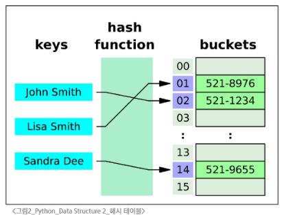

# 스스로 학습

## 해시 테이블

### 정수의 해시 난수화

**정수의 버킷 배치, 즉 해시 테이블에서의 버킷 인덱스는 난수 시드의 영향을 받지 않는다?**

YES. 정수는 해시 난수화의 영향을 받지 않는다. 즉, 난수 시드의 영향을 받지 않는다.

정수는 불변(immutable) 타입이며 그 값 자체가 고유하기 때문에, 파이썬은 정수에 대해 항상 동일한 해시 값을 반환하도록 설계했다. 

## frozenset()

set인데 변경 불가능(immutable)한 자료형

- 중복을 허용하지 않고, 순서가 없다.

- hashable

## 딕셔너리 활용

```python
# 딕셔너리를 입력받아 value와 key를 뒤집은 결과를 반환하는 함수 `dict_invert()`를 작성하기
'''
출력 결과
{1: 10, 2: 20, 3: 30}           # {10: [1], 20: [2], 30: [3]}
{1: 10, 2: 20, 3: 30, 4: 30}    # {10: [1], 20: [2], 30: [3, 4]}
{1: True, 2: True, 3: True}     # {True: [1, 2, 3]}
'''

# 1. [] 표기법을 사용한 방법
def dict_invert(input_dict):
    result = {}
    for key, value in input_dict.items():
        if value not in result:
            result[value] = [key]
        else:
            result[value].append(key)
    return result

# 2. get 메서드를 사용한 방법
def dict_invert(input_dict):
    result = {}
    # key 값에 (기존의 value값) 연결된 값을 반환하고 (없는 경우 빈 리스트를 반환하고), 
    # value 리스트에 기존의 key값을 더한다.
    for key, value in input_dict.items():
        result[value] = result.get(value, []) + [key]
    return result

# 3. setdefault 메서드를 사용한 방법
def dict_invert(input_dict):
    result = {}
    # 거꾸로 된 value 값에 (기존의 key값) 리스트를 생성하고, 그 리스트에 k를 집어넣는다.
    for key, value in input_dict.items():
        result.setdefault(value, []).append(key)
    return result
```


## 실습

### [1450. Dict.keys()_Lv4]

중첩 딕셔너리에서 딕셔너리의 값이 str일 때와 dict일 때를 구분해서 코드를 작성하고 싶은데, 자료형을 확인하는 방법?

- `isinstance(object, classinfo)` 함수: 객체가 특정 클래스의 인스턴스이거나, 해당 클래스를 상속받은 서브클래스의 인스턴스인지 여부를 확인

```markdown
**문제**

주어진 단일 딕셔너리에서 모든 키를 리스트로 반환하는 get_keys_from_dict 함수와

중첩된 딕셔너리 구조에서 모든 하위 딕셔너리의 키를 추출하여 리스트로 반환하는 get_all_keys_from_dict  함수를 작성하시오.

**요구사항**

- get_keys_from_dict
- 딕셔너리를 인자로 받아 모든 키를 담은 리스트를 반환해야 한다.
- get_all_keys_from_dict
- 최상위 딕셔너리의 키뿐만 아니라, 모든 하위 딕셔너리의 키를 추출하여 리스트로 반환해야 한다.
```

```python
def get_all_keys_from_dict(dictionary):
    '''최상위 딕셔너리의 키뿐만 아니라, 모든 하위 딕셔너리의 키를 추출하여 리스트로 반환해야 한다.'''
    keys = []
    for key in dictionary.keys():
        keys.append(key)
        value = dictionary.get(key)
        # value가 dict 형태라면 키를 한번 더 추출한다.
        if isinstance(value, dict):
            keys.extend(get_all_keys_from_dict(value))
    return keys

my_dict = {'person': {'name': 'Alice', 'age': 25}, 'location': 'NY'}
result = get_all_keys_from_dict(my_dict)
print(result)  # ['person', 'name', 'age', 'location']
```

<br><br>

# 수업 필기

## 비시퀀스 데이터 구조

### 딕셔너리

| 메서드 | 설명 |
| --- | --- |
| `.get(key[,default])`  | 키에 연결된 값을 반환. 키가 없으면 None 혹은 기본 값(default)을 반환 |
| `.keys()` | 딕셔너리의 키를 모은 객체를 반환.  |
| `.values()` | 딕셔너리의 값을 모은 객체를 반환. |
| `.items()` | 딕셔너리 키/값 쌍을 모은 객체를 반환. |
| `.pop(key[,default])` | 키를 제거하고 연결됐던 값을 반환. 없으면 에러나 default를 반환. |
| `.clear()` | 딕셔너리의 모든 키/값 쌍을 제거. 빈 딕셔너리를 반환. |
| `.setdefault(key[,default])`  | 키와 연결된 값을 반환. 키가 없다면 default와 연결한 키를 딕셔너리에 추가하고 default를 반환. ⇒ (.get()+생성) 잘 쓰면 조건문을 줄일 수 있는 유용한 메서드! |
| `.update([other])` | other가 제공하는 키/값 쌍(예: 키워드 인자, 딕셔너리)으로 딕셔너리를 갱신하고 기존 키는 덮어씀 |

```python
# get -> 키가 없으면 에러를 발생시키는 대신 None이나 기본 값을 반환
person = {'name': 'Alice', 'age': 25}
print(person.get('country'))  # None
print(person.get('country', '해당 키는 존재하지 않습니다'))  # 해당 키는 존재하지 않습니다.
print(person['country'])  # KeyError: 'country'

# key -> 실시간으로 동기화되는 확인 창(view) -> key가 추가되면 자동으로 업데이트
person_keys = person.keys()  # dict_keys(['name', 'age'])
person['country'] = 'KOREA'
print(person_keys)  # dict_keys(['name', 'age', 'country'])

# setdefault -> get + 값 추가
person = {'name': 'Alice', 'age': 25}
print(person.setdefault('country', 'KOREA'))  # KOREA
print(person)  # {'name': 'Alice', 'age': 25, 'country': 'KOREA'}

# update -> 덮어쓰기. other는 딕셔너리의 형태, 키워드 인자 형태 모두 가능
person = {'name': 'Alice', 'age': 25}
other_person = {'name': 'Jane', 'country': 'KOREA'}

person.update(other_person)
print(person)  # {'name': 'Jane', 'age': 25, 'country': 'KOREA'}
person.update({'age': 100}, address='SEOUL')
print(person)  # {'name': 'Jane', 'age': 100, 'country': 'KOREA', 'address': 'SEOUL'}
```

```python
## clear와 빈 딕셔너리를 할당하는 것의 차이
# 똑같은 딕셔너리 유지
D1 = {'name': 'Alice', 'age': 25}
D1. clear()

# 재할당 (다른 딕셔너리가 된 것. 메모리 주소가 다름.)
D2 = {'name': 'Alice', 'age': 25}
D2 = {}
```

### 세트

고유한 항목들(중복x)의 정렬되지 않은(순서x) 컬렉션. 

| 메서드 | 설명 |
| --- | --- |
| `.add(x)`  | 세트에 x를 추가 |
| `.update(iterable)` | 세트에 다른 iterable 요소를 추가 |
| `.clear()` | 세트의 모든 항목을 제거 |
| `.remove(x)` | 세트에서 항목 x를 제거, 없을 경우 KeyError |
| `.pop()` | 세트에서 **임의의** 요소(arbitrary, ≠random)를 제거하고 반환. <br>(임의의 해시 난수를 통해 배치된 버킷 순서대로 pop, 여전히 set은 순서가 없으므로 pop 되는 순서는 예측 불가능하다.) |
| `.discard(x)` | 세트에서 항목 x를 제거. remove와 달리 에러 없음. |

```python
# update
my_set = {'a', 'b', 'c', 1, 2, 3}
my_set.update([1, 4, 5])
print(my_set)  # {'c', 2, 3, 1, 'b', 4, 5, 'a'}

# clear
my_set = {'a', 'b', 'c', 1, 2, 3}
my_set.clear()
print(my_set)  # set()

# remove
my_set = {'a', 'b', 'c', 1, 2, 3}
my_set.remove(2)
print(my_set)  # {1, 3, 'c', 'b', 'a'}
my_set.remove(10)  # KeyError: 10
```

- 세트의 집합 메서드

| 메서드 | 연산자 | 설명 |
| --- | --- | --- |
| `set1.difference(set2)` | set1 `-` set2 | 차집합 |
| `set1.intersection(set2)`  | set1 `&` set2 | 교집합 |
| `set1.issubset(set2)`  | set1 `<=` set2 | set1의 항목이 모두 set2에 들어있으면 True |
| `set1.issuperset(set2)`  | set1 `>=` set2 | set1가 set2의 항목을 모두 포함하면 True |
| `set1.union(set2)`  | set1 `\|` set2 | 합집합 |

```python
# 집합 메서드
set1 = {0, 1, 2, 3, 4}
set2 = {1, 3, 5, 7, 9}
set3 = {0, 1}

print(set1.difference(set2))  # {0, 2, 4}
print(set1.intersection(set2))  # {1, 3}
print(set1.issubset(set2))  # False
print(set3.issubset(set1))  # True
print(set1.issuperset(set2))  # False
print(set1.union(set2))  # {0, 1, 2, 3, 4, 5, 7, 9}
```

## 참고

### 해시 테이블

키와 값을 짝지어 저장하는 자료구조

> 책 제목(키)을 색인(해시 함수)에서 찾아 몇 번째 책장(인덱스)에 있는지 알아내면, 해당 책장(배열)으로 바로 가서 책(값)을 꺼낼 수 있다.
> 
- 해시(Hash): 임의의 크기를 가진 데이터를 고정된 크기의 **고유한 값(정수)**으로 변환하는 것
- 해시 테이블의 원리
    - 키를 **해시 함수**를 통해 해시 값으로 변환
    - 변환된 해시 값을 인덱스로 삼아 데이터를 저장하거나 찾음
    - 이로 인해 검색, 삽입, 삭제를 매우 빠르게 수행
1. set
    - 각 요소를 해시 함수로 변환해 나온 해시 값에 맞춰 해시 테이블 내부 버킷에 위치시킨다.
    - **‘버킷 위치(인덱스)’가 요소의 위치를 결정한다**.
    - 따라서 set는 **순서를 보장하지 않는다.**
2. dict
    - 키 → 해시 함수 → 해시 값 → 해시 테이블에 저장한다.
    - 단, 출력할 때 삽입 순서는 유지해준다. (python 3.7 이상)

### 해시 함수

임의 길이 데이터를 입력 받아 고정 길이(정수)(=해시 값)로 변환해주는 함수.

- 키를 입력받아 데이터를 저장하거나 찾을 배열의 ‘정확한 인덱스’를 즉시 계산한다.
- 매우 빠른 검색 및 데이터 저장 위치 결정을 위해 활용
- **정수:** 같은 정수는 항상 같은 해시 값을 가진다. 해시 함수가 단순한 형태이므로 난수 시드의 영향을 받지 않는다. 실행마다 순서가 똑같다.
- **문자열:** 파이썬 인터프리터 시작 때 설정되는 난수 시드(seed)가 달라질 수 있다. 보안상 해시 난수화(Hash Randomization)가 적용되어 실행마다 순서가 달라질 수 있다.
- 해시 함수가 매번 바뀌는 것이 아니라, 해시 계산에 쓰이는 시드 값이 실행마다 달라지는 것. 결과적으로 매번 해시 값이 달라져 결과적으로 버킷 배치가 달라진다.



### Hashable

- 대부분의 불변 타입은 해시 가능(hashable)
    - int, float, str, tuple
- 가변형 객체는 기본적으로 해시 불가능.
    - 값이 변하면 해시 값도 달라지기 때문에 해시 테이블의 무결성이 깨짐.
    - list, dict, set
- 해시 테이블(예: set, dict의 key)에는 hashable만 저장 가능
- hashable 객체가 필요한 이유
    - 해시 테이블 기반 자료 구조 사용: set의 요소, dict의 키 → 중복 방지, 빠른 검색과 조회
    - 불변성을 통한 일관된 해시 값 → 해시 테이블 무결성 유지
    - 안정성과 예측 가능성 유지 → 동일한 데이터는 항상 동일한 해시 값을 반환한다.

### 파이썬 문법 규격

- BNF : 프로그래밍 언어의 문법을 통일하여 표현하기 위한 표기법
- EBNF (Extended-BNF)
    - `[선택적 요소], {0번 이상 반복}, (그룹화)`