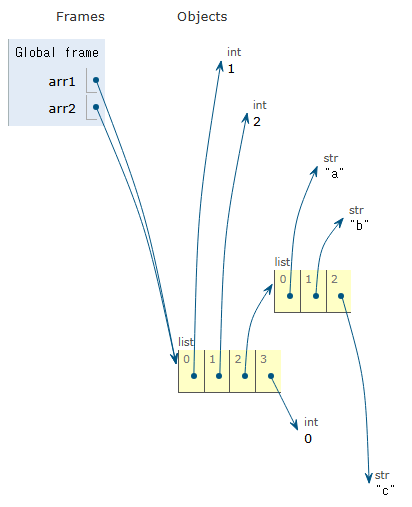
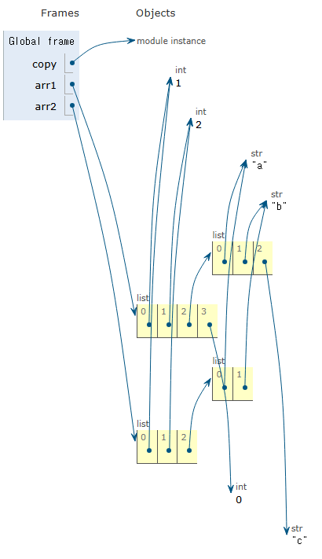

# 스스로 학습

## 얕은 복사와 깊은 복사

### **얕은 복사(mutable 객체의 복사)** 

객체 자체는 복사하지만 그 안에 있는 ‘참조된 객체’는 복사하지 않는다. 대신 **원본 객체와 동일한 참조를 공유**한다.
- 새로운 리스트에 복사되는 것은 요소 자체의 값이 아니라, **해당 요소들이 참조하는 주소**이다.
- 중첩 리스트에서 얕은 복사를 수행할 때, **가장 바깥쪽 리스트만 새롭게 생성**된다. 하지만 그 바깥쪽 리스트가 참조하는 **내부(중첩된) 리스트들은 복사되지 않고, 원본과 동일한 객체를 참조**한다.
- `copy` 모듈의 `copy()` 함수: `copy.copy(obj)`
- 슬라이싱: `new_list = old_list[:]` (리스트에만 해당)
- `list()`, `dict()`, `set()` 생성자: `new_list = list(old_list)`

```python
# 얕은 복사
arr1 = [1, 2, ['a', 'b']]
arr2 = arr1[:]  # 슬라이싱을 이용한 얕은 복사
print(arr1 == arr2)  # True, 값 비교
print(arr1 is arr2)  # False, 객체 비교

# 리스트에 값 추가
arr1.append(0)
# 리스트 내부 리스트에 값 추가
arr1[2].append('c')

print(arr1)  # [1, 2, ['a', 'b', 'c'], 0]
print(arr2)  # [1, 2, ['a', 'b', 'c']]

print(arr1 == arr2)  # False, 값 비교
print(arr1 is arr2)  # False, 객체 비교
```


### 단순 참조

`arr2 = arr1` 은 새로운 리스트를 만드는 것이 아니라, arr1이 가리키는 동일한 리스트 객체를 arr2도 가리키는 것이다.
- 같은 곳을 참조하기 때문에 원본 객체를 변경하면 복사된 객체도 변경된다.

```python
# 단순 참조
arr1 = [1, 2, ['a', 'b']]
arr2 = arr1  # arr1,2는 같은 곳을 참조한다.
print(arr1 == arr2)  # True, 값 비교
print(arr1 is arr2)  # True, 객체 비교

# 리스트에 값 추가
arr1.append(0)
# 리스트 내부 리스트에 값 추가
arr1[2].append('c')

print(arr1)  # [1, 2, ['a', 'b', 'c'], 0]
print(arr2)  # [1, 2, ['a', 'b', 'c'], 0]

print(arr1 == arr2)  # True, 값 비교
print(arr1 is arr2)  # True, 객체 비교
```



### **깊은 복사** 

객체 자체뿐만 아니라, 그 안에 중첩된 모든 리스트(및 그 리스트 안의 요소들)까지 재귀적으로 복사한다. 즉, **원본 객체와 완전히 독립적인 새로운 객체를 생성**한다.
- 원본 객체를 변경해도 복사된 객체에 영향을 주지 않는다.
- `copy` 모듈의 `deepcopy()` 함수: `copy.deepcopy(obj)`

```python
# 깊은 복사
import copy  # copy 모듈 불러오기

arr1 = [1, 2, ['a', 'b']]
arr2 = copy.deepcopy(arr1)  # copy 모듈 깊은 복사
print(arr1 == arr2)  # True, 값 비교
print(arr1 is arr2)  # False, 객체 비교

# 리스트에 값 추가
arr1.append(0)
# 리스트 내부 리스트에 값 추가
arr1[2].append('c')

print(arr1)  # [1, 2, ['a', 'b', 'c'], 0]
print(arr2)  # [1, 2, ['a', 'b']]

print(arr1 == arr2)  # False, 값 비교
print(arr1 is arr2)  # False, 객체 비교
```



## 논리 연산자의 단축 평가
### 질문
> 논리 연산자에 대한 코드를 두가지 제시할 건데, 1번 코드는 결과가 True/False 형태로 나오고 2번 코드는 문자열 형태로 나와. 
> 
> 내가 추론한 이유는 1번 코드는 피연산자가 표현식의 형태이고, 2번 코드는 값(문자열 그 자체)이기 때문이야. 진짜 이유는 무엇인지, 그리고 내가 추론한 이유는 맞는지 답변해줘.

```python
# Boolean context에서 피연산자를 평가한다.
# 즉 불리언 값에 대한 논리 연산이므로 결과는 항상 True 또는 False 형태로 나온다.

num = 15
result = (num > 10) and (num % 2 == 0)  # True and False
print(result)  # False

name = 'Alice'
age = 25
result = (name == 'Alice') or (age == 30)  # True (or False)
print(result)  # True
```

```python
# 불리언 값이 아닌 다른 타입의 피연산자(문자열, 숫자, 리스트 등)와 함께 사용될 경우
# 피연산자들의 참/거짓 여부(truthiness/falsiness)를 평가하여 연산의 결과를 결정한다.

# 1
item1 = '지도'
item2 = '나침반'
result = item1 and item2
print(f'최종적으로 챙긴 물건: {result}')
# >> 최종적으로 챙긴 물건: 나침반

# 2
item1 = '지도'
item2 = '' 
result = item1 and item2
print(f'최종적으로 챙긴 물건: "{result}"')
# >> 최종적으로 챙긴 물건: ''

# 3
item1 = ''  # False -> 바로 반환. item2는 무시
item2 = '나침반'
result = item1 and item2
print(f'최종적으로 챙긴 물건: "{result}"')
# >> 최종적으로 챙긴 물건: ''
```

*(Gemini의 답변)*

사용자님의 추론 "1번 코드는 피연산자가 표현식의 형태이고, 2번 코드는 값(문자열 그 자체)이기 때문이야"는 **일부분은 맞지만 핵심적인 이유는 아닙니다.**

1번 코드의 피연산자 `(num > 10)`이나 `(name == 'Alice')`는 비교 연산의 **결과가 불리언 값으로 확정**되기 때문에 최종적으로는 불리언 값을 가지고 논리 연산을 수행하게 됩니다.

2번 코드의 경우 피연산자가 문자열 값인 것은 맞습니다. 하지만 단순히 "문자열 그 자체"이기 때문에 문자열이 반환되는 것이 아니라, **파이썬의 논리 연산자가 단축 평가를 통해 불리언 컨텍스트에서 피연산자의 참/거짓을 평가하고, 최종적으로 평가된 피연산자 그 자체를 반환하기 때문**입니다.

정리하자면, 1번 코드는 불리언 값에 대한 논리 연산의 결과를 불리언으로 반환하는 것이고, 2번 코드는 단축 평가의 결과로 **참/거짓을 결정한 해당 피연산자 자체를 반환**하는 것입니다.

따라서 2번 코드에서 문자열이 반환된 이유는 피연산자가 문자열이기 때문이 아니라, **단축 평가 규칙에 따라 최종적으로 선택된 피연산자가 우연히 문자열이었기 때문**입니다.

### 단축 평가 규칙 정리

단축 평가 규칙으로 `or` 연산자는 첫번째 피연산자가 ‘참’이면 첫번째 값을 즉시 반환하고, 첫번째 피연산자가 ‘거짓’이면 두번째 값을 반환한다. `and` 연산자는 첫번째 피연산자가 ‘참’이면 두번째 피연산자를 반환하고, 첫번째 피연산자가 ‘거짓’이면 첫번째 피연산자를 즉시 반환한다. **이때 반환되는 값은 해당 피연산자의 원래 자료형을 유지한다.**

```python
# 단축 평가 규칙
name = 'Alice'
age = 25
result = (name == 'Alice') or (age == 30)
print(result)  # True
result = (name == 'Ace') or (age == 30)
print(result)  # False
result = (name == 'Alice') or age
print(result)  # 25
```

정리하자면,

| 피연산자1 | 피연산자2 | 논리 연산자 | 결과 |
| --- | --- | --- | --- |
| 참 | **참** | and | 참 |
| 참 | **거짓** | and | 거짓 |
| **거짓** | ~~참~~ | and | 거짓 |
| **거짓** | ~~거짓~~ | and | 거짓 |
| **참** | ~~참~~ | or | 참 |
| **참** | ~~거짓~~ | or | 참 |
| 거짓 | **참** | or | 참 |
| 거짓 | **거짓** | or | 거짓 |

### 퀴즈
문제. 기본 사용자 이름을 설정하기 위해 가장 적절한 코드는 무엇일까요?

A. `final_name = user_name and "Guest"`

B. `final_name = user_name or "Guest"`

C. `final_name = "Guest" or user_name`

D. `final_name = "Guest" and user_name`

> 정답: B!
> 
>  `user_name`이 비어있으면(Falsy) "Guest"를, 비어있지 않으면(Truthy) `user_name`을 반환하여 의도에 맞게 동작합니다.


## 실습

### [2985. 리스트 활용하기_Lv1]

> many_zero_list 변수에 숫자 0을 25만개 가지고 있는 리스트를 할당한다.
> 
> 
> 단, 리스트와 곱셈 연산자를 활용하여 할당한다.

```python
many_zero_list = [0] * 250000  # len(many_zero_list) = 250000
many_zero_list = [0 * 250000]  # len(many_zero_list) = 1
print(len(many_zero_list))
```

| `many_zero_list = [0] * 250000` | `many_zero_list = [0 * 250000]`  |
| --- | --- |
| 리스트 [0] 을 250000번 반복하여 새 리스트 생성 | 산술 연산 `0 * 250000`의 결과(=0)를 단일 요소로 하는 리스트 생성 |
| `[0, 0, 0, ..., 0]` (0이 25만 개) | `[0]` (0이 단 한 개) |

<br><br>

# 수업 필기

## Sequence Types

### 리스트 list

여러 개의 값을 순서대로 저장하는 변경 가능한 시퀀스 자료형

- 숫자, 문자열, 심지어 다른 리스트까지 모든 종류의 데이터를 담을 수 있음
- `,` 로 구분되는 덩어리가 하나의 요소라고 생각하면 된다.

```python
# 리스트의 표현
my_list_1 = []
my_list_2 = [1, 'a', 3, 'b', 5]
my_list_3 = [1, 2, 3, 'Python', ['hello', 'world', '!!!']] # 요소는 5개
```

- 값을 추가, 수정, 삭제 가능
- 인덱싱, 슬라이싱, 길이 확인, 반복 등 시퀀스의 공통 기능 사용 가능
- **슬라이싱 범위와 값의 범위가 일치하지 않아도 입력 가능하다.**

```python
# 리스트는 가변
# 1. 인덱싱으로 값 수정
my_list = [1, 2, 3, 4, 5]
my_list[1] = 'two'
print(my_list)  # [1, 'two', 3, 4, 5]

# 2. 슬라이싱으로 값 수정
my_list = [1, 2, 3, 4, 5]
my_list[2:4] = ['three', 'four']
print(my_list)  # [1, 2, 'three', 'four', 5]

my_list = [1, 2, 3, 4, 5]
my_list[2:4] = ['three', 'four', 'ssafy']
print(my_list)  # [1, 2, 'three', 'four', 'ssafy', 5]
```

### 중첩 리스트

다른 리스트를 값으로 가진 리스트

- 인덱스를 연달아 사용하여 안쪽 리스트 값에 접근할 수 있음

```python
# 중첩된 리스트 접근
my_list = [1, 2, 3, 'Python', ['hello', 'world', '!!!']]
print(len(my_list))  # 5
print(my_list[4])  # ['hello', 'world', '!!!']
print(my_list[4][-1])  # !!!
print(my_list[-1][1][0])  # w / 문자열도 시퀀스다!!
```

### 튜플 tuple

여러 개의 값을 순서대로 저장하는 변경 불가능한 시퀀스 자료형

- 모든 종류의 데이터를 담을 수 있음
- 소괄호 없이도 만들 수 있다. **단일 요소 튜플일 때는 반드시 후행 쉼표를 사용**해야 한다.
- 인덱싱, 슬라이싱, 길이 확인, 반복 등 가능

```python
# 튜플 표현
my_tuple_1 = ()
# my_tuple_2 = (1) => 1
my_tuple_2 = (1,)
my_tuple_3 = (1, 'a', 3, 'b', 5)
my_tuple_4 = 1, 'hello', 3.14, True  # type(my_tuple_4) = tuple
```

- **한번 만들어지면 그 내용을 절대 수정, 추가, 삭제할 수 없다! → 안정성과 무결성 보장**
    - 튜플의 불변 특성을 사용하여 내부 동작과 안전한 데이터 전달에 사용된다
    - 다중 할당, 값 교환, 함수 다중 반환 값 등

```python
# 튜플은 불변
# TypeError: 'tuple' object does not support item assignment
my_tuple[1] = 'z'
```

```python
# 다중 할당
x, y = 10, 20
print(x)  # 10
print(y)  # 20
# 실제 내부 동작
# (x, y) = (10, 20)
```

```python
# 값 교환
x, y = 1, 2
x, y = y, x
# 실제 내부 동작
# temp = (y, x)  # 튜플 생성
# x, y = temp  # 튜플 언패킹
# print(x, y)  # 2 1
```

### range

**연속된 정수 시퀀스를 생성**하는 변경 불가능한 자료형

- 주로 반복문과 함께 사용되어 특정 횟수만큼 코드를 반복 실행할 때 유용하다.
- 모든 숫자를 메모리에 저장하는 대신 시작 값, 끝 값, 간격이라는 ‘규칙’만 기억하여 메모리를 효율적으로 사용한다. → 모든 숫자를 보고싶다면 리스트로 형 변환이 필요하다.
- 1개, 2개, 또는 3개의 매개변수(인자)를 가질 수 있다.
    - `range(stop)` : start=0, step=1
    - `range(start, stop)` : step=1
    - `range(start, stop, step)`

```python
# range 표현
my_range_1 = range(5)
my_range_2 = range(1, 10)
my_range_3 = range(5, 0, -1)

print(my_range_1)  # range(0, 5)
print(my_range_2)  # range(1, 10)
print(my_range_3)  # range(5, 0, -1)

# 리스트로 형 변환 시 데이터 확인 가능
print(list(my_range_1))  # [0, 1, 2, 3, 4]
print(list(my_range_2))  # [1, 2, 3, 4, 5, 6, 7, 8, 9]
print(list(my_range_3))  # [5, 4, 3, 2, 1]
```

- 규칙
    - 값의 범위 규칙: stop의 값은 생성되는 시퀀스에 절대 포함되지 않음
    - 증가/감소 값(step) 규칙: step값은 숫자 시퀀스의 간격과 방향을 결정
        - step이 양수일 때, start 값은 stop 값보다 반드시 작아야 함
        - step이 음수일 때, start 값은 stop 값보다 반드시 커야 함
        - 단, 두 경우 모두 오류가 발생하지는 않는다. 출력되는 값이 없을 뿐.

## Non-Sequence Types

### 딕셔너리 dict

key - value 쌍으로 이루어진 **순서와 중복이 없는** 변경 가능한 자료형

- 각 값에는 순서가 없기 때문에 인덱스가 없다. 대신 키가 있다.
    - 파이썬 3.7 이상에서는 입력한 순서는 출력 시 그대로 유지된다. 그렇다고 순서가 생기는 건 아니다.
- 값 1개는 키와 값이 쌍으로 이루어져 있다.
- **key(키)**: 값을 식별하기 위한 고유한 ‘이름표’
    - **중복 불가**
    - 변경 불가능한 자료형만 사용 가능
        - 가능: str, int, float, tuple
        - 불가능: list, dict
- **value(값)**: 키에 해당하는 실제 데이터
    - 어떤 자료형이든 사용할 수 있다.

```python
# 딕셔너리 표현
my_dict_1 = {}
my_dict_2 = {'key': 'value'}  # 요소는 1개
my_dict_3 = {'apple': 12, 'list': [1, 2, 3]}
```

- key를 사용하여 해당 value를 꺼내올 수 있다.

```python
# 딕셔너리는 키에 접근해 값을 얻어냄
my_dict = {'name': '홍길동', 'age': 25}
print(my_dict['name'])  # '홍길동'
print(my_dict['test'])  # KeyError: 'test'
```

- 값(value)을 추가, 변경 가능

```python
# 딕셔너리 값 추가 및 변경
my_dict = {'apple': 12, 'list': [1, 2, 3]}
# 추가
my_dict['banana'] = 50
print(my_dict)  # {'apple': 12, 'list': [1, 2, 3], 'banana': 50}

# 변경
my_dict['apple'] = 100
print(my_dict)  # {'apple': 100, 'list': [1, 2, 3], 'banana': 50}
```

- 데이터에 순서가 필요 없고, 각 데이터에 의미 있는 이름(Key)을 붙여 관리하고 싶을 때 사용한다.
    - 사람의 인적 정보, 게임 캐릭터의 능력치 등

### 세트 set

순서와 중복이 없는 변경 가능한 자료형

- 수학에서의 집합과 동일한 연산 처리 가능

```python
# 세트 표현
my_set_1 = set()  # 딕셔너리와의 혼동을 피하기 위함
my_set_2 = {1, 2, 3}
my_set_3 = {1, 1, 1}

print(my_set_1)  # set()
print(my_set_2)  # {1, 2, 3}
print(my_set_3)  # {1} / 중복된 값을 허용하지 않는다.
```

- 중복을 허용하지 않는다. 똑같은 값은 단 하나만 존재할 수 있다.
- 순서가 없다. 인덱싱이나 슬라이싱을 사용할 수 없다.
- 집합 연산 - 합집합(`|`), 차집합(`-`), 교집합(`&`)

```python
# 세트의 집합 연산산
my_set_1 = {1, 2, 3}
my_set_2 = {3, 6, 9}

# 합집합
print(my_set_1 | my_set_2)  # {1, 2, 3, 6, 9}

# 차집합
print(my_set_1 - my_set_2)  # {1, 2}

# 교집합
print(my_set_1 & my_set_2)  # {3}
```

- **중복 제거할 때 주로 사용한다.**

## Other Types

### None

파이썬에서 ‘값이 없음’을 표현하는 특별한 데이터 타입 (≠ 無)

- 숫자 0이나 빈 문자열(’’)과는 다르다.
- ‘값이 존재하지 않음’, ‘아직 정해지지 않음’의 상태를 나타내기 위해 사용한다.

```python
# None
my_variable = None
print(my_variable)  # None
```

### Boolean

‘참(True)’과 ‘거짓(False)’ 단 두 가지 값만 가지는 데이터 타입

```python
# Boolean
is_active = True
is_logged_in = False

print(is_active)  # True
print(is_logged_in)  # False
print(10 > 5)  # True
print(10 == 5)  # False
```

- 비교/논리 연산의 평가 결과로 사용된다.
- 주로 **조건/반복문**과 함께 사용된다.

## Collection

여러 개의 값을 하나로 묶어 관리하는 자료형

⇒ str, list, tuple, range, set, dict

| 시퀀스/비시퀀스 | 컬렉션명 | 변경 가능 여부 | 순서 존재 여부 |
| --- | --- | --- | --- |
| 시퀀스 | str | x | o |
| 시퀀스 | list | o | o |
| 시퀀스 | tuple | x | o |
| 비시퀀스 | set | o | x |
| 비시퀀스 | dict | o | x |

### 불변 vs 가변

| 구분 | 불변(Immutable) | 가변(Mutable) |
| --- | --- | --- |
| 특징 | 변경 불가, 안전성, 예측 가능 | 변경 가능, 유연성, 효율성 | 
| 종류 | str, tuple, range | list, dict, set | 

## 형 변환 Type Conversion

한 데이터 타입을 다른 데이터 타입으로 변환하는 과정

### 암시적 형변환

파이썬이 연산 중에 자동으로 데이터 타입을 변환하는 것

데이터 손실을 막기 위해 더 정밀한 타입으로 자동 변환해주는 규칙

- 정수와 실수의 연산에서 정수가 실수로 변환됨
- boolean과 정수의 덧셈에서 boolean이 정수로 변환됨

```python
# 암시적 형변환
# 정수(int)와 실수(float)의 덧셈
print(3 + 5.0)  # 8.0
# 불리언(bool)과 정수(int)의 덧셈
print(True + 3)  # 4
# 불리언간의 덧셈
print(True + False)  # 1
```

### 명시적 형변환

개발자가 변환하고 싶은 타입을 직접 함수로 지정하여 변환하는 것

- `int(), float(), str(), list(), tuple(), set()`
- str → int : 형식에 맞는 숫자만 가능
- int → str : 모두 가능

```python
# 명시적 형변환
# str -> int
print(int('1'))  # 1
# ValueError: invalid literal for int() with base 10: '3.5'
# print(int('3.5'))
print(int(3.5))  # 3
print(float('3.5'))  # 3.5

# int -> str
print(str(1) + '등')  # 1등
```


## 연산자 (Operator)

### 산술 연산자

`+, -, *, /, //, %, **`

### 복합 연산자

`+=, -=, *=, /=, //=, %=, **=`

명시적인 것을 선호하기 때문에 남발하지는 말 것.

```python
# 복합 연산자
y = 10
y -= 4
# y = y - 4
print(y)  # 6

z = 7
z *= 2
print(z)  # 14

w = 15
w /= 4
print(w)  # 3.75

q = 20
q //= 3
print(q)  # 6
```

### 비교 연산자

`<, <=, >, >=, ==, !=, is, is not`

- `==` 와 `is` 비교

`==` 연산자

- 값(데이터)이 같은지를 비교
- 동등성(equality)
- 두 변수가 가리키는 객체의 내용, 즉 **‘값(value)’이 같은지**를 확인한다.

```python
# == 연산자
print(2 == 2.0)  # True
print(2 != 2)  # False
print('HI' == 'hi')  # False
print(1 == True)  # True
```

`is` 연산자

- 객체(값, 주소) 자체가 같은지를 비교
- 식별성(identity)
- 두 변수가 **완전히 동일한 객체**를 가리키는지, 즉 **메모리 주소가 같은지**를 확인할 때 사용

```python
# is 연산자
# SyntaxWarning: "is" with a literal. Did you mean "=="?
print(1 is True)  # False
print(2 is 2.0)  # False
```

- “두 객체의 값이 논리적으로 같은가?”를 묻는 경우가 많으므로 `==` 연산자를 주로 사용하게 된다.
- **싱글턴 객체를 비교할 때 `is` 연산자를 사용**한다.
    - **None, True, False**

```python
# is 연산자는 언제 사용하는가?
# 싱글턴 객체 비교할 때
x = None
# 권장
if x is None:
    print('x는 None입니다.')
# 비권장
if x == None:
    print('x는 None입니다.')

x = True
y = True
print(x is y)  # True
print(True is True)  # True
print(False is False)  # True
print(None is None)  # True
```

- 리스트나 객체 비교 시 주의사항
    - 리스트나 가변 객체를 비교할 때, 값 자체가 같은지를 확인하려면 `==`
    - 두 변수가 완전히 동일한 객체를 가리키는지를 확인하려면 `is`

```python
# 리스트나 객체 비교 시 주의사항
a = [1, 2, 3]
b = [1, 2, 3]
print(a == b) # True (두 리스트의 값은 동일)
print(a is b) # False (서로 다른 리스트 객체)

# b가 a를 그대로 참조하도록 할 경우
b = a
print(a is b) # True (같은 객체를 가리키므로 True)
```

### 논리 연산자

`and, or, not` 

- 비교 연산자와 함께 사용

```python
# 논리 연산자
print(True and False)  # False
print(True or False)  # True
print(not True)  # False
print(not 0)  # True

# 논리 연산자 & 비교 연산자
num = 15
result = (num > 10) and (num % 2 == 0)  # True and False
print(result)  # False

name = 'Alice'
age = 25
result = (name == 'Alice') or (age == 30)  # True (or False)
print(result)  # True
```

- **단축 평가**: 논리 연산에서 두 번째 피연산자를 평가하지 않고 결과를 결정하는 동작 → 코드 실행 최적화, 불필요한 연산을 피함
    - 거짓으로 취급되는 값들: `False, 숫자 0, 빈 문자열 “”, 빈 리스트 [], None 등` ‘비어있거나 없다’는 느낌의 값들
    - 참으로 취급되는 값들: `True, ‘거짓’이 아닌 모든 값`
- `and` 연산자: 하나라도 ‘거짓’이면 ‘거짓’. 처음 만나는 ‘거짓’값을 바로 반환
- `or` 연산자: 하나라도 ‘참’이면 ‘참’. 처음 만나는 ‘참’값을 바로 반환

```python
# 단축 평가

# 1
# 준비물 1: 내용이 있는 문자열
item1 = '지도' # True
# 준비물 2: 내용이 있는 문자열
item2 = '나침반' # 두 번째 값 반환. 반환되는 값은 해당 피연산자의 원래 자료형을 유지합니다.
result = item1 and item2
print(f'최종적으로 챙긴 물건: {result}')
# >> 최종적으로 챙긴 물건: 나침반

# 2
item1 = '지도'
# 준비물 2: 내용이 없는 빈 문자열
item2 = '' 
result = item1 and item2
print(f'최종적으로 챙긴 물건: "{result}"')
# >> 최종적으로 챙긴 물건: ''

# 3
# 준비물 1: 내용이 없는 빈 문자열
item1 = ''  # False -> 바로 반환. item2는 무시
item2 = '나침반'
result = item1 and item2
print(f'최종적으로 챙긴 물건: "{result}"')
# >> 최종적으로 챙긴 물건: ''
```

### 멤버십 연산자

`in, not in` 포함 여부를 확인

```python
# 멤버십 연산자

word = 'hello'
numbers = [1, 2, 3, 4, 5]

print('h' in word)  # True
print('z' in word)  # False

print(4 not in numbers)  # False
print(6 not in numbers)  # True
```

### 시퀀스형 연산자

`+(결합), *(반복)` 시퀀스 자료형에서 기능이 바뀜

```python
# 시퀀스형 연산자

print('Gildong' + ' Hong')  # Gildong Hong
print('hi' * 5)  # hihihihihi

print([1, 2] + ['a', 'b'])  # [1, 2, 'a', 'b']
print([1, 2] * 2)  # [1, 2, 1, 2]
```

### 연산자 우선순위

- 소괄호 그룹핑을 잘하자.

## 참고

### Trailing Comma (후행 쉼표)

컬렉션의 마지막 요소 뒤에 붙는 쉼표(선택사항)

- 하나의 요소로 구성된 튜플을 만들 때는 필수, 그 이외에는 선택 사항
- 각 요소를 별도의 줄에 작성하고, 마지막 요소 뒤에 trailing comma 추가
- 가독성 향상, 유지보수 용이
