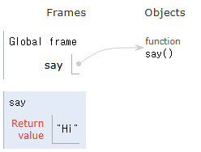
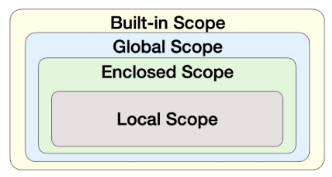

# 스스로 학습

## 함수의 입출력

### [출력 ≠ 반환(return)] print() 함수의 작동 원리

```python
return_value = print(1)  # 1
```

할당문은 `=`의 오른쪽부터 실행되기 때문에 다음과 같은 순서로 실행한다.

1. `print(1)` 평가 -> 1 “출력”; `print()`함수가 호출되어 인자로 받은 `1`을 터미널에 표시한다.

2. `print()`함수의 “반환” 값; `print()`함수는 특별히 명시된 `return`문이 없기 때문에 기본적으로 `None`을 반환한다.

3. “할당”; `return_value`에 반환값인 `None`이 할당된다.

그 결과, `return_value`에는 `None`이 저장되고, 터미널에는 `1`이 출력된다.

### [인자] 인자의 입력

1. **키워드 인자를 중복해서 주면? → SyntaxError 발생**

```python
def greet(name, age):
    print(f'안녕하세요, {name}님! {age}살이시군요.')

greet(age=35, age='Dave')  # SyntaxError: keyword argument repeated: age
```

2. **파라미터의 개수보다 인자의 개수가 적을(부족할) 경우 → TypeError 발생**

```python
def make_sum(pram1, pram2):
	return pram1 + pram2

result = make_sum(100)
print(result)  # TypeError: make_sum() missing 1 required positional argument: 'pram2'
```

3. **파라미터 개수보다 인자의 개수가 많을 경우 → TypeError 발생**

```python
def make_sum(pram1, pram2):
	return pram1 + pram2

# 케이스 1: 위치 인자 3개
result = make_sum(100, 40, 20)
print(result)  # TypeError: make_sum() takes 2 positional arguments but 3 were given

# 케이스 2: 위치 인자 2개와 키워드 인자 1개
result = make_sum(100, 40, pram1=20)
print(result)  # TypeError: make_sum() got multiple values for argument 'pram1'
```

- 케이스 2에서 SyntaxError(구문 오류)가 아닌 TypeError(타입 오류)가 발생한 이유

    : 코드의 구문 자체는 유효하지만, 런타임 시 의미론적인 문제(매개변수에 값을 두 번 할당하려는 시도)가 발생했기 때문이다.

    - `TypeError`: 문법적으로는 옳지만, 실제 실행했을 때 논리적으로나 타입적으로 맞지 않는 문제가 생기는 것

    - `SyntaxError` : 파이썬 문법 규칙을 위반했을 때 발생. 파이썬 인터프리터가 코드를 파싱(분석)하는 초기 단계에서 문제가 생기는 경우

        - `greet(age=35, age='Dave')`: 키워드 자체가 두 번 명시되어 있어 "무엇을 해야 할지 명확하지 않다"는 구문 규칙 위반

        - `result = make_sum(100, 40, pram1=20)` : 구문적으로는 문제없지만, "어떤 값을 어떤 매개변수에 할당하는 과정에서 논리적으로 문제가 생긴다"는 타입/값 할당 규칙 위반


**+. 기본값을 가진 파라미터와 인자 개수와의 관계**

```python
def make_complex_sum(pram1, pram2, pram3=0):
    return pram1 + pram2 + pram3

# 케이스 1: 기본값을 가진 파라미터는 생략 가능
result = make_complex_sum(10, 20)
print(result) # 출력: 30 (pram3는 기본값 0 사용)

# 케이스 2: 기본값을 가진 파라미터에 값을 명시적으로 전달
result = make_complex_sum(10, 20, 5)
print(result) # 출력: 35

# 케이스 3: 모든 파라미터에 대해 인자를 초과하여 전달
result = make_complex_sum(10, 20, 5, 1)
print(result) # TypeError가 발생하며, 3.의 첫 번째 케이스와 동일
```


### [매개변수와 인자] 매개변수, 인자의 자료형

**`default_arg='default'`에서 기본값이 string으로 설정되어 있는데 int형 `3`을 받을 수 있나?**

→ 기본값(`'default'`)의 자료형(type)을 string이라고 정한 적이 없다. 

`'default'`는 `default_arg`라는 매개변수에 **초기값**으로 문자열을 할당한 것일 뿐, 이 매개변수가 반드시 문자열만 받아야 한다고 **강제하는 것이 아니다.**

- 파이썬의 특성 - **동적 타이핑(Dynamic Typing)**: 파이썬은 변수를 선언할 때 명시적으로 자료형을 지정하지 않는다. 변수의 자료형은 값이 할당될 때 결정되며, 언제든지 다른 자료형의 값을 할당하여 변경할 수 있다.

```python
# 인자의 모든 종류를 적용한 예시
def func(pos1, pos2, default_arg='default', *args, **kwargs):
    print('pos1:', pos1)
    print('pos2:', pos2)
    print('default_arg:', default_arg)
    print('args:', args)
    print('kwargs:', kwargs)

func(1, 2, 3, 4, 5, 6, key1='value1', key2='value2')
"""
pos1: 1
pos2: 2
default_arg: 3
args: (4, 5, 6)
kwargs: {'key1': 'value1', 'key2': 'value2'}
"""
```

**그렇다면 매개변수의 자료형(type)을 정하는 것은 무엇인가?**

→ 파이썬에서는 자료형 ‘가이드’를 제공할 수 있지만, ‘강제’할 수는 없다. 파이썬은 기본적으로 매개변수가 어떤 자료형의 값을 받을지 강제하지 않는다. 

매개변수의 자료형은 **함수가 호출될 때 전달되는 실제 인자의 자료형**에 의해 결정된다. 타입 힌트는 개발자의 의도를 명확히 하고 잠재적 오류를 줄이는 데 도움을 주는 "약속" 또는 "가이드라인"일 뿐이다.

- 파이썬의 타입 힌트(Type Hinting): 함수를 정의할 때 매개변수와 반환값에 예상되는 자료형을 명시하는 방법으로, python 3.5부터 도입되었다.

```python
# 타입 힌트 예시
def add(a: int, b: int) -> int:
    return a + b
 
# a, b의 타입이 int라고 명시되어 있지만, 문자열을 전달해도 오류가 발생하지 않는다.
str_add = add("hello", "world")
print(str_add)  # helloworld
```

### [함수 정의] 입력값과 반환값

**1. 입력값이 없는 함수**

```python
def say():
	return 'Hi'
	
a = say()
print(a)  # Hi
```


- say→function say() 설명: 함수도 결국 하나의 ‘이름’이기 때문에 함수의 body가 저장된 곳을 ***참조**하는 것과 같다.

- 실행 순서
    1. `say()` 실행: `'Hi'`를 반환한다.

    2. 할당: `a` 에 반환값인 `Hi`를 할당한다.

    3. `print(a)`: 터미널에 `a`에 할당된 값인 `Hi`가 출력된다.


**2. return 값이 여러 개이면?**

→ return 값이 tuple로 저장되고, 객체 단 하나만 반환한다. (반환의 원칙)

```python
def add_and_mul(a,b): 
     return a+b, a*b

result = add_and_mul(2, 3)
print(result)  # (5, 6)
```

### *[용어 정리] 참조

파이썬에서 변수가 어떤 객체(값)의 메모리 주소(위치)를 가리키는 것. 

- 변수는 **메모리 어딘가에 존재하는 실제 데이터(객체)의 위치를 알려주는 '이름표' 또는 '포인터'와 같다.** 이 '이름표'가 가리키는 메모리 주소가 바로 '참조'하는 대상이 되는 것.

- 얕은 복사에서 원본 객체(a)의 **내부 가변 객체**를 수정했을 때 복사한 객체(b)도 같이 수정되는 현상은 **b가 a의 내부 객체에 대한 참조를 공유하고 있기 때문**이다. 즉, 객체의 껍데기(최상위 컨테이너)는 분리되었지만, 그 안에 담긴 요소들은 여전히 a와 b가 동일한 메모리 주소를 "바라보고" 있기 때문이다.

### [global 키워드] 함수 내에서의 전역 변수

**함수 내에서 전역 변수를 수정하는 경우, 예를 들어 `global num`을 하면, 함수 내에 (local scope) num 변수가 생성되고 global scope의 num을 참조하는 거야?**

→ 함수 내에 (local scope) 새로운 `num` 변수가 생성되는 것이 아니다. 오히려 그 반대다.

`global num`은 **새로운 지역 변수의 생성을 방지**하고, 전역 스코프(바깥쪽 스코프)에 **이미 존재하는 변수 `num`을 참조하고 그 값을 수정할 수 있도록 허용**하라는 의미이다.

- 함수 내부에서 어떤 변수에 값을 할당하면, 기본적으로 그 변수는 ‘지역 변수’로 간주, 함수 내에서만 유효하다.

- 함수 내부에서 외부 스코프의 변수(전역 변수)를 **읽기만** 한다면, `global` 키워드 없이도 가능!

- 함수 내부에서 외부 스코프의 변수를 **수정**하고 싶을 때는 `global` 키워드 필요! → Otherwise, UnboundLocalError 발생

```python
# Good
num = 0  # 전역 변수

def increment():
    global num  # num를 전역 변수로 선언
    num += 1

print(num)  # 0
increment()
print(num)  # 1
```

```python
# Bad
num = 0  # 전역 변수

def increment():
    num += 1

print(num)  # 0
increment()  # UnboundLocalError: cannot access local variable 'num' where it is not associated with a value
print(num)  
```

### [global 키워드] 사용 시 주의사항; 외않되?

**`global` 키워드 주의사항 - 1: `global` 키워드 선언 전에 참조 불가**

```python
# ‘global’ 키워드 주의사항 - 1
# global 키워드 선언 전에 참조 불가
num = 0

def increment():
    # SyntaxError: name 'num' is used # prior to global declaration
    print(num)  # 문제 발생 지점
    global num
    num += 1
```

- 파이썬은 함수 내부에서 어떤 변수 이름을 만나면, 해당 변수가 **지역 변수**인지 **전역 변수**인지를 **컴파일(해석) 시점**에 결정한다. 이때 `global` 키워드는 "이 함수 내에서 `num`이라는 이름은 지역 변수가 아니라 전역 변수를 의미한다"고 명시하는 역할을 한다.

- 파이썬은 "너 나중에 `global` 선언할 거면서, 왜 미리 지역 변수처럼 사용하려고 해?"라고 판단하며 `SyntaxError`를 발생시킨다. 이는 모호성을 피하고 코드의 일관성을 유지하기 위한 파이썬의 규칙이다.

**`global` 키워드 주의사항 - 2: 매개변수에는 `global` 키워드 사용 불가**

```python
# ‘global’ 키워드 주의사항 - 2
# 매개변수에는 global 키워드 사용 불가
num = 0

def increment(num):  # 문제 발생 지점: 매개변수로 'num'을 받음
    # SyntaxError: name 'num' is parameter and global
    global num  # 문제 발생 지점
    num += 1
```

- 함수가 정의될 때 매개변수(예: `increment(num)`)는 함수가 호출될 때 외부로부터 값을 받아들이기 위한 **지역 변수**의 역할을 한다. 함수가 호출되면, 인자로 전달된 값이 이 지역 변수 `num`에 할당된다.

- 그런데 함수 내부에서 다시 `global num`이라고 선언하면, 파이썬은 `num`이라는 이름이 "매개변수로 전달된 지역 변수"이면서 동시에 "전역 변수"여야 한다는 **모순적인 요구**를 받게 된다.

### [언패킹] 컬렉션 데이터 개수 불일치

1. 변수의 개수가 컬렉션의 개수보다 적을 때 → ValueError 발생

```python
data = (10, 20, 30)
a, b = data # Unpacking 시도

# 결과: ValueError: too many values to unpack (expected 2)
```

2. 변수의 개수가 컬렉션의 개수보다 많을 때 → ValueError 발생

```python
data = (10, 20)
a, b, c = data # Unpacking 시도

# 결과: ValueError: not enough values to unpack (expected 3, got 2)
```

3. `*`를 사용한 언패킹 
    
    a. `*` 변수가 나머지 값을 모두 가져가는 경우
    
    ```python
    data = (1, 2, 3, 4, 5)
    a, *rest, b = data # 언패킹 시도 (가운데 *rest)
    
    print(a)    # 결과: 1
    print(rest) # 결과: [2, 3, 4]
    print(b)    # 결과: 5
    ```
    
    b. `*` 변수가 빈 리스트가 되는 경우
    
    ```python
    data = (10, 20)
    a, *rest, b = data # 언패킹 시도
    
    print(a)    # 결과: 10
    print(rest) # 결과: [] (빈 리스트)
    print(b)    # 결과: 20
    ```
    
    c. `*` 변수가 하나만 있는 경우
    
    - `*all_data = data` → 콤마 없이 단일 요소 변수면 SyntaxError 발생
    
    ```python
    data = (1, 2, 3)
    *all_data, = data # 언패킹 시도
    
    print(all_data) # 결과: [1, 2, 3]
    ```
    
    d. `*` 연산자를 여러 번 사용할 때 → SyntaxError 발생. `*` 연산자는 단 한 번만 사용할 수 있다.
    
    ```python
    data = (1, 2, 3, 4)
    *a, *b = data # 언패킹 시도
    
    # 결과: SyntaxError: two starred expressions in assignment
    ```
    
- 케이스 1에서 `a, b = data`는 ValueError가 발생하고, 케이스 3-c에서 단일 요소 변수(`*all_data = data`)에서 SyntaxError가 발생하는 이유?

    - `a, b = data` : 구문 자체는 파이썬의 **문법적으로는 아무런 문제가 없다. 데이터의 '내용' 또는 '개수'와 연산의 기대치(변수의 개수)가 맞지 않아 발생하는 논리적 오류로, 코드가 실행되는 런타임 단계**에서 발생하기 때문에 `ValueError`

    - `*all_data = data` : `*` 연산자는 특정 문맥(튜플/리스트 언패킹, 함수 인자 패킹/언패킹)에서만 사용되도록 **문법적으로 정의**되어 있기 때문에, 단일 변수 할당 구문에서 `*`를 사용하는 것은 파이썬의 **문법 규칙을 위반**하는 것이다. **코드 실행 전, 파이썬 인터프리터가 코드를 분석(파싱)하는 단계**에서 발생하는 `SyntaxError`

### [람다 표현식] sorted() 함수에 활용

```python
"""
람다 표현식 활용 (with sorted 함수)
sorted() 함수는 리스트를 정렬해주며, key라는 매개변수에 함수를 전달하여 
"무엇을 기준으로 정렬할지"를 지정할 수 있습니다. 
이때 간단한 기준을 제시하기 위해 lambda를 사용하는 것이 매우 효과적입니다.

예시: 학생들의 점수를 나이순으로 정렬하기
학생 데이터가 (나이, 점수) 형태의 튜플로 묶여있는 리스트가 있다고 가정해 봅시다

# 목표: 학생들을 '나이'가 어린 순서대로 정렬하고 싶다!
"""
students = [(21, 90), (19, 95), (25, 85)]

# 1. lambda 미사용 (일반 함수 정의)
# 정렬의 기준(key)이 될 함수를 미리 정의
def get_age(student_data):
    # student_data는 (21, 90) 같은 튜플
    # 나이는 0번 인덱스에 있으므로, student_data[0]을 반환
    return student_data[0]

# sorted 함수의 key 매개변수에 우리가 만든 get_age 함수를 전달
sorted_students = sorted(students, key=get_age)
print(sorted_students)  # [(19, 95), (21, 90), (25, 85)]
# 2. lambda 사용
"""
get_age처럼 간단하고 한 번만 쓸 함수를 굳이 따로 정의할 필요 없이, lambda로 즉석에서 만들어 전달할 수 있습니다.
key=lambda student_data: student_data[0]
-> "정렬할 때 각 데이터를 student_data라고 부를게."
-> "그리고 그 데이터의 0번 인덱스 값(나이)을 기준으로 삼아줘."
"""
sorted_students = sorted(students, key=lambda student_data: student_data[0])
print(sorted_students)  # [(19, 95), (21, 90), (25, 85)]
```

<br>

## 실습

### [1681. 신규 고객 등록과 환영 인사_Lv2]

> 신규 유저의 이름과 나이, 주소를 입력하면 가입 축하 메시지를 출력하고, 고객 정보를 하나의 딕셔너리로 취합해 반환하는 함수 create_user 함수를 작성하고자 한다. 요구 사항을 참고하여 제시된 코드를 수정하시오.
>
> [요구사항]
> - create_user 함수가 실행 될 때, 실습 1에서 작성한 `increase_user` 함수를 호출하여 number_of_people 값이 증가하여야 한다.
>
> - create_user 함수는 각각 name, age, address를 인자로 받아 user_info에 적절한 키값에 값을 할당한다.
>
> - 완성된 user_info 딕셔너리를 반환한다.
>
> - create_user 함수가 호출되면 `{name}님 환영합니다!` 메시지가 출력되어야 한다.

- 내 답안
    
    ```python
    def create_user(name, age, address):
        increase_user()
        print(f'{name}님 환영합니다!')
    
        user_info = {}
        user_info['name'] = name
        user_info['age'] = age
        user_info['address'] = address
        return user_info
    ```
    
- 모범 답안: 가독성이 좋다.

    ```python
    def create_user(name, age, address):
        """
        이름, 나이, 주소를 인자로 받아 사용자 정보 딕셔셔너리를 생성하여 반환합니다.
        """
        increase_user()
        user_info = {'name': name, 'age': age, 'address': address}
        print(f'{name}님 환영합니다!')
        return user_info
    ```

### [1683. 대규모 신규 고객 등록_Lv4]

> 실습 2에서 작성한 create_user 함수를 활용하여 다수의 유저를 등록하고자 한다. 주어진 유저 정보 리스트와 모든 유저를 등록하고, 반환된 유저 정보를 하나의 리스트에 담아 출력할 수 있도록 map 함수를 사용하여 코드를 작성하시오.

```python
name = ['김시습', '허균', '남영로', '임제', '박지원']
age = [20, 16, 52, 36, 60]
address = ['서울', '강릉', '조선', '나주', '한성부']

# map은 결과를 내지 않고 일단 덩어리로 대기 (지연 평가)
user_info_list = map(create_user, name, age, address)
print(user_info_list)  # <map object at 0x000001F51048B970>

# 필요할 때 평가를 진행 (list로 형변환 할때, 반복문을 돌릴때)
print(list(user_info_list))
```
- `map` 함수의 지연 평가 [> 더 알아보기 <](lazy_evaluation.md)

### [1684. 대규모 도서 대여 서비스_Lv5]

>- 실습 4에서 작성한 코드를 활용하여 many_user 변수에 모든 신규 고객 정보 딕셔너리를 요소로 갖는 리스트를 할당한다.
>
>- 실습 3에서 작성한 코드를 활용하여 decrease_book 함수를 작성한다.
>
>- rental_book 함수는 info 인자 하나만 할당 받을 수 있다.
>
>    - info 인자는 신규 고객의 이름과 나이를 담은 딕셔너리이다.
>
>    - 신규 고객의 나이를 10으로 나눈 몫을 대여할 책의 수로 활용한다. (decrease_book 함수의 인자)
>
>    - info 인자에 사용될 딕셔너리는 many_user와 map을 사용해 새로운 딕셔너리를 생성한다.
>
>        - 이 때, map에 사용될 함수는 lambda로 구현한다.
>
>        - 그 결과를 rental_book 함수에 각각 전달하여 호출한다. 이 때 역시 map 함수를 사용한다.

1. 람다 사용 x

```python
def transform_user_for_rental(user_info):
    """
    기존 사용자 정보(user_info)를 받아, 책 대여에 필요한 형태로 가공하는 함수입니다.
    대여 규칙(나이를 10으로 나눈 몫)을 적용하여 새로운 딕셔너리를 반환합니다.

    Args:
        user_info (dict): 원본 사용자 정보 딕셔너리

    Returns:
        dict: 이름과, 대여할 책의 수가 담긴 새로운 딕셔너리
    """
    transformed_info = {
        'name': user_info['name'],
        'age': user_info['age'] // 10,  # 대여할 책 수는 나이를 10으로 나눈 몫
    }
    return transformed_info

# 'lambda' 대신 위에서 정의한 'transform_user_for_rental' 함수를 map에 사용합니다.
# map은 many_user 리스트의 각 사용자 정보를 transform_user_for_rental 함수에 전달하여
# 그 반환값들로 새로운 이터레이터를 생성합니다.
transformed_users = map(transform_user_for_rental, many_user)

# --- 책 대여 처리 단계 2: 실제 대여 실행 ---

# list()를 사용해 map 객체를 강제로 순회(iterate)하게 만들어,
# 그 과정에서 rental_book 함수가 각 사용자에 대해 한 번씩 호출되도록 합니다.
list(map(rental_book, transformed_users))
```

2. 람다 사용

```python
# --- 책 대여 처리 단계 1: 대여할 수량 정보 가공 ---
# map과 lambda를 사용하여, 기존 사용자 정보(many_user)를 새로운 규칙에 맞게 변환합니다.
# 대여할 책의 수는 '사용자 나이를 10으로 나눈 몫'이라는 규칙을 적용합니다.
# lambda x: ...는 일회용으로 사용할 간단한 익명 함수를 정의하는 방법입니다.
# 이 결과로 'transformed_users'는 변환 규칙을 담고 있는 'map 객체(이터레이터)'가 됩니다.
# (아직 실제 데이터 변환이 모두 일어난 상태는 아닙니다.)
transformed_users = map(
    lambda x: {'name': x['name'], 'age': x['age'] // 10}, many_user
)

# --- 책 대여 처리 단계 2: 실제 대여 실행 ---
# 'transformed_users' 이터레이터의 각 요소(변환된 사용자 정보)를 rental_book 함수에 전달합니다.
# rental_book 함수는 반환값이 'None'이고 오직 출력(side effect)만 일으킵니다.
# 만약 list()로 감싸지 않으면, map의 결과물을 아무도 사용하지 않으므로 파이썬은 연산을 실행하지 않습니다.
# list()를 사용해 map 객체를 강제로 순회(iterate)하게 만들어,
# 그 과정에서 rental_book 함수가 각 사용자에 대해 한 번씩 호출되도록 하는 것입니다.
# 결과적으로 [None, None, None, None, None] 리스트가 만들어지지만,
# 이 리스트를 변수에 저장하지 않으므로 그냥 버려지고, 우리는 함수 호출로 인한 출력 효과만 얻게 됩니다.
list(map(rental_book, transformed_users))
```

3. 개선안

```python
def rental_book(info):
    """
    사용자 정보(info)를 전달받아,
    1) 사용자 나이(info['age'])만큼 책의 수를 감소시키고,
    2) 대여 처리 후 출력할 메시지들을 튜플 형태로 반환(return)합니다.
    """
    global number_of_book
    rented_count = info['age']
    number_of_book -= rented_count  # 나이만큼 전역 변수 number_of_book 감소

    # 출력할 메시지들을 생성하여 반환
    remaining_msg = f'남은 책의 수 : {number_of_book}'
    rental_msg = f'{info["name"]}님이 {rented_count}권의 책을 대여하였습니다.'
    return remaining_msg, rental_msg

# 1) 사용자 정보에서 age를 10으로 나눈 결과로 변환하는 map
transformed_users = map(
    lambda x: {'name': x['name'], 'age': x['age'] // 10}, many_user
)

# 2) 변환된 사용자 정보를 rental_book에 넘겨 '출력할 메시지'들을 생성하는 map
#    이 시점에서 rental_book 함수가 실행되며 number_of_book 값이 변경됩니다.
rental_messages = map(rental_book, transformed_users)

# 3) map을 통해 반환된 메시지들을 실제로 출력하는 for 반복문
for remaining, rental in rental_messages:
    print(remaining)
    print(rental)

```


<br><br>

# 수업 필기

## 함수

### 함수 (Funtion)

특정 작업을 수행하기 위한 재사용 가능한 코드 묶음

- **재사용성**이 높아지고, 코드의 **가독성과 유지보수성** 향상

- `def function_name(arguments):`함수 정의

- `function_name(arguments)` 함수 호출 (function call)

### 함수 정의

함수의 코드 블록을 등록하는 것

```python
# 함수 정의
def make_sum(pram1, pram2):
	'''이것은 두 수를 받아 두 수의 합을 반환하는 함수입니다.
	>>> make_sum(1,2)
	3
	'''
	return pram1 + pram2
```

- `return` 을 만나면 함수의 실행을 종료한다. 결과를 반환하지 않는 경우, `return None`

### 함수 호출(call)

함수를 실행하기 위해 함수의 코드 블록을 실행하는 것

- 함수 정의가 선행되어야 한다.

```python
# 함수 호출 및 반환 값 할당
result = make_sum(100, 30)
print(result)  # 130
```

### 출력 ≠ 반환(return)

- 출력: 터미널에 값을 보여주는 것

- 반환: 함수를 실행하고 나온 결과값. output

- 반환 값이 없는 함수는 `None`을 반환한다.

    - `print()` 함수 → 화면에 값을 출력하기만 할 뿐, 반환 값이 없다(None).


```python
# print() 함수는 반환값이 없다.
return_value = print()
print(return_value)  # None
```

### 매개변수와 인자

- **parameter 매개변수**: 함수를 저장할 때, 함수가 받을 값을 나타내는 변수

- **argument 인자**: 함수를 호출할 때, 실제로 전달되는 값

    1. 위치 인자: 함수 호출 시 인자의 **위치에 따라** 전달되는 인자
    
    ```python
    # 1. Positional Arguments
    def greet(name, age):
        print(f'안녕하세요, {name}님! {age}살이시군요.')
    
    greet('Alice', 25)  # 안녕하세요, Alice님! 25살이시군요.
    greet(25, 'Alice')  # 안녕하세요, 25님! Alice살이시군요.
    greet('Alice')  # TypeError: greet() missing 1 required positional argument: 'age'
    ```
    
    2. 기본 인자 값: 함수 정의에서 매개변수에 **기본 값을 할당**하는 것
    
    ```python
    # 2. Default Argument Values
    def greet(name, age=20):
        print(f'안녕하세요, {name}님! {age}살이시군요.')
    
    greet('Bob')  # 안녕하세요, Bob님! 30살이시군요.
    greet('Charlie', 40)  # 안녕하세요, Charlie님! 40살이시군요.
    ```
    
    3. 키워드 인자: 함수 호출 시 인자의 **이름과 함께** 값을 전달하는 인자. 순서는 중요하지 않다.

        - 단, 호출 시 키워드 인자는 위치 인자 뒤에 위치해야 한다.
    
    ```python
    # 3. Keyword Arguments
    def greet(name, age):
        print(f'안녕하세요, {name}님! {age}살이시군요.')
    
    greet(name='Dave', age=35)  # 안녕하세요, Dave님! 35살이시군요.
    greet(age=35, name='Dave')  # 안녕하세요, Dave님! 35살이시군요.
    greet(age=35, 'Dave')  # Positional argument cannot appear after keyword arguments
    ```
    
    4. 임의의 인자 목록: 정해지지 않은 개수의 인자를 처리하는 인자. 여러 개의 인자를 **tuple**로 처리한다.
    
    ```python
    # 4. Arbitrary Argument Lists
    def calculate_sum(*args):
        print(args)  # (1, 100, 5000, 30)
        print(type(args))  # <class 'tuple'>
    
    calculate_sum(1, 100, 5000, 30)
    ```
    
    5. 임의의 키워드 인자 목록: 정해지지 않은 개수의 키워드 인자를 처리하는 인자. **dictionary**로 묶어 처리한다.
    
    ```python
    # 5. Arbitrary Keyword Argument Lists
    def print_info(**kwargs):
        print(kwargs)
    
    print_info(name='Eve', age=30)  # {'name': 'Eve', 'age': 30
    ```
    
- 함수 인자 권장 작성 순서: 위치 → 기본 → 가변 → 가변 키워드

## 재귀 함수

함수 내부에서 자기 자신을 호출하는 함수

- 특정 알고리즘 식을 표현할 때 사용 → 변수의 사용이 줄어들며 코드의 가독성이 높아짐

- 메모리 사용량이 많고 느릴 수 있다.

- 함수 호출이 계속 쌓이기 때문에 종료 조건이 잘못되면 **스택 오버플로우** 에러가 발생할 수 있다.

### 재귀함수의 조건

- **종료 조건**을 명확히 할 것

- 반복되는 호출이 종료 조건을 향하도록 할 것

### 예시 - 팩토리얼

```python
def factorial(n):
    # 종료 조건: n이 0이면 1을 반환
    if n == 0:
        return 1
    else:
        # 재귀 호출: n과 n-1의 팩토리얼을 곱한 결과를 반환
        return n * factorial(n - 1)

# 팩토리얼 계산 예시
print(factorial(5))  # 120
```

### 재귀 함수를 사용하는 이유

- 복잡한 문제를 간결하고 직관적으로 표현 가능

- 상황에 따라 반복문보다 알고리즘 코드가 더 간결하고 명확해질 수 있다.

- 수학적 정의가 재귀적으로 표현되는 경우, 직접적인 구현 가능

## 내장 함수 (Built-in function)

파이썬이 기본적으로 제공하는 함수(별도의 import 없이 바로 사용 가능)

`print(), len(), max(), min(), sum(), sorted() 등`

- 참고 - [파이썬 라이브러리](https://docs.python.org/ko/3/library/functions.html)

## 함수와 Scope

### python의 범위(scope)

함수는 코드 내부에 local scope를 생성하며, 그 외의 공간인 global scope로 구분한다.

- global scope : 코드 어디에서든 참조할 수 있는 공간

- local scope : 함수가 만든 공간 (함수 내부에서만 참조 가능)

```python
# Scope 예시
def func():
    num = 20
    print('local', num)  # local 20

func()
print('global', num)  # NameError: name 'num' is not defined 
# 함수가 종료되는 순간 (local variable) num은 사라진다.
```

### 변수의 수명주기

1. built-in scope : 파이썬이 실행된 이후부터 **영원히** 유지
2. global scope : 모듈이 호출된 시점 이후 혹은 인터프리터가 끝날 때까지 유지
3. local scope : 함수가 호출될 때 생성되고, **함수가 종료될 때까지** 유지

### 이름 검색 규칙 (LEGB Rule)

파이썬에서 사용되는 이름(식별자)들은 특정한 이름공간에 저장되어 있다.

- 순서: local → enclosed → global → built-in

- 함수 내에서는 바깥 scope의 변수에 접근 가능하나 수정은 할 수 없음



```python
# 내장 함수 sum의 이름을 사용해버려서 오류가 발생하는 예시
print(sum)  # <built-in function sum>
print(sum(range(3)))  # 3 (0+1+2)
sum = 5  # global variable
print(sum)  # 5
print(sum(range(3)))  # TypeError: 'int' object is not callable
```

```python
# LEGB Rule 퀴즈
x = 'G'
y = 'G'

def outer_func():
    x = 'E'
    y = 'E'

    def inner_func(y):
        z = 'L'
        print(x, y, z)  # E P L / 함수를 호출해야 실행하기 때문

    inner_func('P')
    print(x, y)  # E E / local 영역

outer_func()
print(x, y)  # G G / global 영역
```


### global 키워드

- 변수의 스코프를 전역 범위로 지정하기 위해 사용

- 일반적으로 **함수 내에서 전역 변수를 수정**하려는 경우에 사용

```python
num = 0  # 전역 변수

def increment():
    global num  # num를 전역 변수로 선언
    num += 1

print(num)  # 0
increment()
print(num)  # 1
```

- global 키워드 선언 전에 참조 불가 → SyntaxError

- 매개변수에는 global 키워드 사용 불가 → SyntaxError

## 함수 규칙들

### 함수 스타일 가이드

- snake case; 소문자와 언더스코어 사용

- 동사로 시작하여 함수의 동작 설명

- 약어 사용 지양

- 동사+(형용사)+명사, get/set 접두사, is/has 접두사(True/False 반환할 때)

    - `save_user()`, `calculate_total_price()` , `get_username()`, `set_username()`, `is_logined()`

### 단일 책임 원칙

모든 객체는 하나의 명확한 목적과 책임만을 가져야 한다.

- 함수 설계 원칙 - 명확한 목적, 책임 분리, 유지보수성

### Packing & Unpacking

- Packing: 여러 개의 데이터를 하나의 컬렉션으로 모아 담는 과정. 파이썬이 알아서 한다.

    - 한 변수에 콤마(,)로 구분된 값을 넣으면 자동으로 튜플로 처리한다.

    - `*` 을 활용한 함수 매개변수 → 튜플로 패킹

    - `**` 을 활용한 함수 매개변수 → 딕셔너리로 패킹

- Unpacking: 컬렉션에 담겨있는 데이터들을 개별 요소로 펼쳐 놓는 과정. ‘시퀀스 언패킹’ 혹은 ‘다중 할당’이라고 부른다.

    - 튜플이나 리스트 등의 객체 요소들을 개별 변수에 할당한다.

```python
# ‘*’ 을 활용한 언패킹 (함수 인자 전달)
def my_function(x, y, z):
    print(x, y, z)

names = ['alice', 'jane', 'peter']
my_function(*names)  # alice jane peter

# ‘**’을 활용한 언패킹 (딕셔너리 -> 함수 키워드 인자)
def my_function(x, y, z):
    print(x, y, z)

my_dict = {'x': 1, 'y': 2, 'z': 3}
my_function(**my_dict)  # 1 2 3
```

## 참고

### 반환의 원칙

- 파이썬 함수는 언제나 **단 하나의 값(객체)**만 반환할 수 있다.

- 여러 값을 반환하는 경우에도 **하나의 튜플로 패킹**하여 반환한다.

### 람다 표현식

`lambda 매개변수: 표현식` 

익명 함수를 만드는 데 사용되는 표현식. 간단한 연산이나 함수를 한 줄로 표현.

- 함수를 매개변수로 전달하는 경우

```python
# 람다 표현식 활용 (with map 함수)
numbers = [1, 2, 3, 4, 5]

# lambda 미사용
def square(x):
    return x**2

squared1 = list(map(square, numbers))
print(squared1)  # [1, 4, 9, 16, 25]

# lambda 사용
squared2 = list(map(lambda x: x**2, numbers))
print(squared2)  # [1, 4, 9, 16, 25]
```