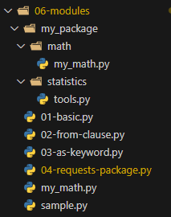

# 수업 필기

## 모듈

### 모듈 (Module)

한 파일로 묶인 변수와 함수의 모음 (.py)

### 내장 모듈 (Built-in Module)

- math

```python
import math
print(math.pi)  # 3.141592653589793
print(math.sqrt(4))  # 2.0
```

### import 문 / from 절

- `.(dot)` 연산자: “점의 왼쪽 객체에서 점의 오른쪽 이름을 찾아라”
  
- `import module_name` (권장)
  
- `from module_name import function_name`
  
    - 사용자가 선언한 변수 또는 함수와 겹치게 되어 모듈에서 정의한 값이나 동작이 이루어지지 않을 수 있다.
  
    - 이름 충돌: 마지막에 import된 것이 이전 것을 덮어쓰기 때문에, 나중에 import 된 것만 유효하다.
  

```python
# import 문 사용
import math

print(math.pi)  # 3.141592653589793
print(math.sqrt(4))  # 2.0

# from 절 사용
from math import pi, sqrt

print(pi)  # 3.141592653589793
print(sqrt(4))  # 2.0
```

```python
# from 절 단점
from math import sqrt

math_result = sqrt(16)  # 실수형 4.0

def sqrt(x):  # 사용자가 정의한 sqrt 함수
    return str(x**0.5)

my_result = sqrt(16)  # 문자열 4.0
```

### as 키워드

- ‘별칭’을 부여하여 이름 충돌을 해결한다.
  
- import 되는 함수나 변수명이 너무 길거나 자주 사용할 경우

```python
## as 키워드 사용 1
from math import sqrt
from my_math import sqrt as my_sqrt

print(sqrt(4))  # 2.0
print(my_sqrt(4))  # 2.0

## as 키워드 사용 2
import pandas as pd
import matplotlib.pyplot as plt
```

### 사용자 정의 모듈

코드의 규모가 커지면 파일을 나눠 모듈화

```python
# my_math.py
def add(x, y):
    return x + y
```

```python
# sample.py
import my_math

print(my_math.add(1, 2))  # 3
```

### 파이썬 표준 라이브러리 (PSL)

파이썬 언어와 함께 제공되는 다양한 모듈과 패키지의 모음

## 패키지

### 패키지 (Package)

연관된 모듈들을 하나의 디렉토리에 모아 놓은 것

- 모듈들의 이름공간(scope)을 구분하여 충돌을 방지하고, 모듈들을 효율적으로 관리할 수 있도록 돕는다.
  
- 비슷한 기능은 묶고, 관련 없는 것은 나누는 것이 사용하기 편한다.



```python
## 사용자 정의 패키지
from my_package.math import my_math
from my_package.statistics import tools

print(my_math.add(1, 2))
print(tools.mod(1, 2))
```

### PSL 내부 패키지

`math, os, sys, random 등` 

설치 없이 바로 import 해서 사용 가능

### 파이썬 외부 패키지

직접 설치해서 쓰는 패키지

- `pip install package_name` 버전에 따른 호환성 이슈 주의!
  
- requests 패키지: 웹에 요청을 보내고 응답을 받을 때 사용
    - API

```python
import requests

# Nager.Date API를 사용하여 2025년 대한민국의 공휴일 정보를 요청합니다.
url = "https://date.nager.at/api/v3/publicholidays/2025/KR"
response = requests.get(url).json()
print(response

```