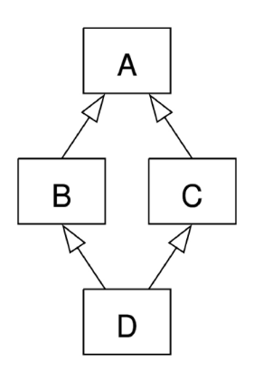

# 스스로 학습

## [메서드]

### 스태틱 메서드를 클래스 내부에 두는 이유

스태틱 메서드는 클래스 외부에 구현해도 되는데 클래스 내부에 구현한 함수라고 생각할 수 있다. 

1. **논리적 연관성, 명시적:** 해당 함수가 논리적으로 이 클래스와 관련되어 있다는 것을 표시해준다**.** 어떤 기능을 찾을 때 해당 클래스 안에서 찾을 수 있어 관리하기가 쉬워진다.
2. **네임스페이스 관리:** 클래스 내부에 메서드를 정의하면 해당 메서드는 클래스의 **네임스페이스(namespace)** 안에 존재한다. 이는 전역 네임스페이스를 오염시키는 것을 방지하고, 다른 모듈이나 코드 블록에서 이름 충돌이 발생할 가능성을 줄여준다. 

### 데코레이터와 상속의 차이

| 데코레이터 | 상속 |
| --- | --- |
| 원본 코드는 그대로 두고 | 자식 클래스 내부에 원본 코드가 포함, 변경될 수 있음 |
| 그 주변에 추가적인 기능을 덧붙이는 것 | 부모 클래스의 모든 것을 물려받아 새로운 자식 클래스 안에서 변경(오버라이드)/추가 |
| 함수를 인자로 받아서 새로운 함수를 반환하는 고차 함수(higher-order function) | "is-a" 관계 (예: `Dog` is a `Animal`) |
| 주로 **함수**의 기능을 수평적으로 확장/수정 (클래스에도 적용 가능) | 주로 **클래스**의 기능을 수직적으로 확장/재정의 |

**언제 무엇을 사용할까?**

- **상속**:
    - **"A는 B이다 (A is a B)"** 관계가 성립할 때.
    - 부모 클래스의 **핵심 기능**을 물려받아 **특정 부분만 변경**하거나 **필수적인 확장**을 할 때.
    - 다형성을 활용하여 같은 인터페이스를 가진 여러 객체를 다루어야 할 때.
- **데코레이터**:
    - 함수(또는 메서드)의 **기존 로직을 변경하지 않고**, 실행 전후에 **부가적인 기능(로깅, 인증, 시간 측정, 캐싱 등)을 유연하게 추가/제거**하고 싶을 때.
    - 동일한 부가 기능을 여러 함수에 반복적으로 적용해야 할 때.
    - 클래스 계층 구조를 복잡하게 만들지 않고 기능을 확장하고 싶을 때.

```python
## 상속의 예시
class Animal:
    def speak(self):
        return "동물이 소리를 냅니다."

class Dog(Animal): # Animal을 상속받아 Dog 클래스 생성
    def speak(self): # 부모의 메서드를 재정의 (오버라이드)
        return "멍멍!"

class SmartDog(Dog): # Dog의 기능을 물려받아 추가 확장
    def learn_trick(self):
        return "재주를 부립니다!"

# 사용
dog = Dog()
print(dog.speak()) # 멍멍!

smart_dog = SmartDog()
print(smart_dog.speak()) # 멍멍!
print(smart_dog.learn_trick()) # 재주를 부립니다!
```

```python
## 데코레이터 예시
# 데코레이터 정의
def my_decorator(func):
	def wrapper():
		# 함수 실행 전에 수행할 작업
		print("함수 실행 전")
		# 원본 함수 호출
		result = func()
		# 함수 실행 후에 수행할 작업
		return result
	return wrapper

# 데코레이터 사용
@my_decorator
def my_function():
	print("원본 함수 실행")
	
my_function()
"""
함수 실행 전
원본 함수 실행
함수 실행 후
"""
```


## [클래스]

### 입출금이 가능한 은행 계좌 클래스 만들기

```python
# 입출금이 가능한 은행 계좌 클래스 만들기
class BankAccount:
		# 클래스 변수
    interest_rate = 0.02  # 이자율
		# 생성자 메서드
    def __init__(self, owner, balance=0):
        self.owner = owner  # 소유주
        self.balance = balance  # 잔액
        
		# 입금
    def deposit(self, amount):
        self.balance += amount
    # 출금
    def withdraw(self, amount):
        if self.balance >= amount:
            self.balance -= amount
        else:
            print('잔액이 부족합니다.')
            
    # 클래스 메서드
    # 이자율 변경
    @classmethod
    def set_interest_rate(cls, rate):
        cls.interest_rate = rate
        
		# 스태틱 메서드
		# 잔액이 양수인지 확인
    @staticmethod
    def is_positive(amount):
        return amount > 0

# 인스턴스 생성
alice_acc = BankAccount('Alice', 1000)

alice_acc.deposit(500)
alice_acc.withdraw(200)
print(alice_acc.balance)  # 1300

BankAccount.set_interest_rate(0.03)
print(BankAccount.interest_rate)  # 0.03

print(BankAccount.is_positive(alice_acc.balance))  # True
```

## [메서드 오버라이딩]

### 메서드 오버라이딩 주의사항

- 파라미터 구조, 시그니처(Signature)를 동일하게 유지할 것.

→ 객체 지향 프로그래밍의 핵심 개념인 `다형성(Polymorphism)`을 위반하여 예기치 않은 오류를 유발합니다.

> 다형성(Polymorphism)
> 
> - 서로 다른 클래스의 객체가 **동일한 메서드 호출에 대해 각자의 방식대로 다르게 응답**하는 능력
> - 마치 우리가 여러 동물에게 "울어봐"라고 똑같이 명령했을 때, 개는 "멍멍", 고양이는 "야옹"처럼 **각자 다른 방식으로 행동**하는 것과 같음

```python
# 잘못된 오버라이딩 예시
class Animal:
    def eat(self):
        print('Animal이 먹는 중')

class Dog(Animal):
    def eat(self, food): # 시그니처가 다름!
        print(f'Dog가 {food}를 먹는 중')

# 동물들에게 밥을 주는 함수 (다형성 활용)
def feed_animal(animal):
    animal.eat() # 여기서 TypeError 발생 (food 인자 누락)

# 객체 생성
dog = Dog()
feed_animal(dog)  # TypeError: Dog.eat() missing 1 required positional argument: 'food'
"""
feed_animal 함수가 dog.eat()을 호출할 때 food 인자를 넘겨주지 않아서 생기는 
런타임(runtime) 오류입니다. 즉, 코드가 실행되다가 문제가 발생한 거죠.
"""
```

**데코레이터를 활용해서 메서드로 만들면 안 될까요?**

- `feed_animal` 함수의 주된 목적은 **입력받은 `animal` 객체의 `eat()` 메서드를 호출하는 것**입니다. `feed_animal`은 그 자체가 핵심 로직을 수행하는 함수이지, 다른 함수의 실행을 '꾸미는' 역할을 하는 것이 아닙니다.
- 데코레이터는 **기존 함수의 동작을 수정하거나 부가 기능을 추가**할 때 유용합니다 (예: 로깅, 시간 측정, 권한 검사 등).

### 추상 클래스(ABCs)를 활용한 시그니처 강제

- `abc` 모듈 (추상 클래스)를 사용하는 이유: '설계' 단계에서의 강제
- `abc` 모듈을 사용하면 명시적으로 추상 메서드(Abstract Method)를 정의하여, 해당 추상 메서드를 상속받는 모든 자식 클래스들이 반드시 그 메서드를 구현하도록 강제할 수 있다.
    - 파이썬의 덕 타이핑(Duck Typing): 특정 클래스가 어떤 메서드를 반드시 가져야 한다고 직접적으로 강제하지 않는다.

```python
# 추상 클래스(ABC)를 사용한 시그니처 강제
from abc import ABC, abstractmethod

class Animal(ABC):
    @abstractmethod
    def eat(self): # 추상 메서드로 정의 (매개변수 없음)
        pass

class Dog(Animal):
    def eat(self, food): # 시그니처가 다름!
        print(f'Dog가 {food}를 먹는 중')

# 여기서 바로 TypeError 발생!
# Dog 클래스 정의만으로도 문제가 있다는 것을 알려줌.
# 즉, 객체 생성 시점에 'TypeError: Can't instantiate abstract class Dog with abstract method eat' 발생.
dog = Dog() # <--- 여기서 에러가 발생하여, feed_animal(dog)까지 가지도 않습니다.
feed_animal(dog)
```

- '실행 전'에 오류 발견 (설계 오류 방지): abc 모듈의 추상 클래스를 사용하면, Dog 클래스가 Animal의 eat() 메서드를 잘못 구현한 시점에서 바로 오류를 감지할 수 있습니다.

| 특징 | 일반적인 TypeError (추상 클래스X) | abc 모듈을 사용한 추상 클래스 |
| --- | --- | --- |
| 발견 시점 | 런타임 시점 (코드가 실행되다가 문제 발생) | 객체 인스턴스화 시점 (코드 실행 전 또는 객체 생성 시점) |
| 목적 | 코드 실행 중 발생한 오류 알림 | 설계 단계에서 규칙 강제 및 오류 방지, 명확한 인터페이스 제공 |
| 강제 강도 | 느슨함 (실행해보지 않으면 모름) | 강력함 (규칙 위반 시 객체 생성 자체를 막음) |
| 코드 품질 | 오류 발생 가능성이 높고 디버깅 어려울 수 있음 | 더 안정적이고 예측 가능한 코드, 협업에 유리 |


## [다중 상속]

### [3006. 다중 상속의 이해_Lv3]

```python
class BaseModel:
    PK = 1
    TYPE = 'Basic Model'

    def __init__(self, data_type, title, content, created_at, updated_at):
        self.PK = BaseModel.PK
        self.data_type = data_type 
        self.title = title 
        self.content = content 
        self.created_at = created_at 
        self.updated_at = updated_at
        BaseModel.PK += 1
    def save(self):
        print('데이터를 저장합니다.')

class Novel(BaseModel):
    def __init__(self, data_type, title, content, created_at, updated_at, author):
        super().__init__(data_type, title, content, created_at, updated_at)
        self.author = author
    
class Other(BaseModel):
    TYPE = 'Other Model'

    def save(self):
        print('데이터를 다른 장소에 저장합니다.')    

class ExtendedModel(Novel, Other):
    '''
    ExtendedModel은 Novel과 Other 클래스를 다중 상속 받는다.
    - 새로운 속성 extended_type을 가진다.
    - display_info 메서드: 클래스 변수 PK와 클래스 변수 TYPE, 그리고 인스턴스 변수 extended_type을 출력한다.
    - save 메서드: 호출시 "데이터를 확장해서 저장합니다."를 출력하도록 수정한다.
    '''
    def __init__(self, data_type, title, content, created_at, updated_at, author, extended_type):
        super().__init__(data_type, title, content, created_at, updated_at, author)
        self.extended_type = extended_type

    def display_info(self):
        print(f'PK: {self.PK}, TYPE: {self.TYPE}, Extended Type: {self.extended_type}')

    def save(self):
        print('데이터를 확장해서 저장합니다.')

extended_instance1 = ExtendedModel('data type', 'title', 'content', 'created_at', 'updated_at', 'author', 'Extended Type')
extended_instance1.display_info()  # MRO 상 가장 먼저 발견되는 ExtendedModel의 display_info 메서드 실행
extended_instance1.save()
extended_instance2 = ExtendedModel('data type', 'title', 'content', 'created_at', 'updated_at', 'author', 'Extended Type')
extended_instance2.display_info()

'''출력 결과:
PK: 1, TYPE: Other Model, Extended Type: Extended Type
데이터를 확장해서 저장합니다.
PK: 2, TYPE: Other Model, Extended Type: Extended Type
'''
```

- `self.PK`는 인스턴스 생성 시 설정된다.


### 다중상속에서 자식(말단) 클래스의 인스턴스 생성 시 작동 순서

- ExtendedModel 클래스의 MRO

```python
# [<class '__main__.ExtendedModel'>, <class '__main__.Novel'>, <class '__main__.Other'>, <class '__main__.BaseModel'>, <class 'object'>]
print(ExtendedModel.mro())
```

ExtendedModel 클래스의 인스턴스 extended_instance 를 생성하면 MRO에 따라서,

1. `ExtendedMode.__init__()` 실행

2. ExtendedMode의 super()를 호출: `Novel.__init__()` 실행

3. Novel의 super()를 호출: `Other.__init__()` 실행

**4-1. 생성자가 없는 경우 (현재 코드):** `BaseModel.__init__()` 실행

Other의 생성자 메서드는 정의되어 있지 않다. 이 경우 파이썬은 MRO를 따라 `Other`의 다음 클래스인 `BaseModel`에서 `__init__`를 찾아 호출한다.

4-2. Other의 super()를 호출: `BaseModel.__init__()` 실행

```python
def __init__(self, data_type, title, content, created_at, updated_at):
    super().__init__(data_type, title, content, created_at, updated_at)
```

~~4-3. pass: MRO의 다음 클래스가 실행되지 않는다.~~

```python
def __init__(self, data_type, title, content, created_at, updated_at):
    pass
```

5. `BaseModel.__init__() `실행
    - `self.PK = BaseModel.PK` : extended_instance의 self.PK = 1
    - `BaseModel.PK += 1` : 클래스 변수 `BaseModel.PK` = 2

6. `Novel.__init__()` 실행 재개

7. `ExtendedModel.__init__()` 실행 재개

### [정리] 다중상속에서 생성자 메서드

- 생성자가 없는 경우: 부모의 메서드를 자동으로 상속받는다.

- `super().__init__()`을 호출하는 경우: 본인 클래스에 정의된 **init** 메서드를 먼저 실행하고, 메서드 안의 super().__init__(…) 호출을 통해 부모의 생성자를 호출한다. 부모의 메서드를 호출하는 역할을 명시적으로 작성해준 것.

명시적으로 `super()`를 호출하면 MRO에 따라 다음 부모 클래스의 생성자를 체인처럼 계속 호출하게 되어, 모든 부모 클래스의 초기화 로직이 순서대로 실행됩니다. 반면 생성자가 없는 클래스는 MRO의 흐름을 단순히 통과시키는 역할을 합니다.

### 클래스 메서드를 활용하여 클래스 변수 수정

```python
class BaseModel:
    PK = 1
    TYPE = 'Basic Model'

    @classmethod
    def get_next_pk(cls):
        current_pk = cls.PK
        cls.PK += 1
        return current_pk

    def __init__(self, data_type, title, content, created_at, updated_at):
        self.PK = BaseModel.get_next_pk()  # 클래스 메서드를 통해 PK를 가져오고 1 증가시킴
        self.data_type = data_type 
        self.title = title 
        self.content = content 
        self.created_at = created_at 
        self.updated_at = updated_at

    def save(self):
        print('데이터를 저장합니다.')
```


<br><br>

# 수업 필기

## 프로그래밍 패러다임

### 절차 지향 프로그래밍 (Procedural Programming)

**함수**와 로직 중심으로 작성하며, 데이터를 **순차적으로** 처리한다.

- 순차적인 명령어 실행
- 데이터와 함수(절차)의 분리
- 함수 호출의 **흐름**이 중요하다.
- 복잡성 증가 - 전역 변수 증가, 프로그램 규모가 커지면 관리 어려움
- 코드 수정 시 영향 범위 파악이 어렵다.

⇒ 개선한 게 ‘객체 지향 프로그래밍’

### 객체 지향 프로그래밍 (Object Oriented Programming)

프로그램을 데이터(변수)와 그 데이터를 처리하는 함수(메서드)를 하나의 단위(객체)로 묶어서 조직적으로 관리한다.

- **데이터 + 메서드 = 객체**
- 데이터가 스스로 기능을 수행하는 능동적 존재가 됨
- 사람의 실제 사고 회로와 비슷하다.
- 상속, 코드 재사용성, 유지보수성 등에 이점

### 절차 지향과 객체 지향

| 절차 지향 | 객체 지향 |
| --- | --- |
| 데이터와 해당 데이터를 처리하는 함수(절차)가 분리 | 데이터와 해당 데이터를 처리하는 메서드를 하나의 객체로 묶음 |
| 함수 호출의 흐름이 중요 | 객체 간 상호작용과 메시지 전달이 중요 |
| 어떤 순서로 처리할까? | 어떤 객체가 이 문제를 해결할까?
이 객체는 어떤 속성과 기능을 가질까? |

주의: 절차 지향과 객체 지향은 대조되는 개념이 아니다. 절차 지향을 보완하기 위해 생겨난 개념이 객체 지향.

## 객체와 클래스

### 객체 object

실제 존재하는 사물을 추상화한 것. 각 객체는 고유한 특성을 가진다.

1. **속성** : 객체의 상태/데이터(예: 이름, 직업, 국적, 나이 등)
2. **메서드** : 객체의 기능/행동(예: 뛰기, 댄스, 랩, 바이브레이션 등)

### 클래스 class

하나의 구조 안에 데이터(변수)와 기능(변수)을 함께 정의하는 도구

- 데이터와 기능을 함께 묶는 방법을 제공. 파이썬에서 타입을 표현하는 방법.
- **사용자 정의 객체를 만드는 수단**이자 속성과 메소드를 정의
- 클래스 이름은 파스칼 케이스(Pascal Case) 방식으로 작성한다.
- `__init__` 생성자 메서드: 새로운 객체를 만들 때 필요한 초기값(인스턴스 속성)을 설정
    - `self.변수명` 인스턴스 변수(속성): 인스턴스마다 독립적인 값 유지
    - 클래스 변수(속성): 모든 인스턴스가 공유하는 속성

```python
# 클래스 정의
class Circle:
    # 클래스 변수(속성)
    pi = 3.14
    # 생성자 메서드
    def __init__(self, radius):
        # 인스턴스 변수(속성)
        self.radius = radius
```

### 인스턴스 instance

클래스를 통해 생성된 객체

- 같은 클래스로 여러 인스턴스를 만들 수 있다.
- 각 인스턴스는 클래스 구조를 따라 동작하지만, **서로 독립된 데이터**를 가질 수 있다.

```python
# 인스턴스 생성
# 인스턴스 = 클래스 호출
p1 = Person('Alice', 25)
p2 = Person('Bella', 30)

# 인스턴스 변수 접근 및 출력
print(p1.name)  # Alice
print(p2.name)  # Bella

# 메서드 호출
p1.introduce()  # 안녕하세요. 저는 Alice, 나이는 25살입니다.
p2.introduce()  # 안녕하세요. 저는 Bella, 나이는 30살입니다.
```

### 클래스와 인스턴스

- 클래스를 정의한다 = 공통된 특성과 기능을 가진 ‘틀’을 만드는 것 = 새로운 타입을 만드는 행위
- 실제 활동하는 개별 객체들은 이 틀에서 생성된 인스턴스
- 데이터 타입은 사실 모두 클래스였다.
    - `name = 'Alice'` 변수 name은 str 클래스의 인스턴스이다.
    - `print(type(name))  # <class 'str'>`
- 클래스 변수와 동일한 이름으로 인스턴스 변수 생성 시, **인스턴스 변수에 먼저 참조**한다.

```python
class Circle:
    pi = 3.14
    def __init__(self, radius):
        self.radius = radius

c1 = Circle(5)
c2 = Circle(10)

# c1이 본인 인스턴스 변수 pi를 생성
c1.pi = 100
print(c1.pi)  # 100
print(Circle.pi)  # 3.14

# 반면 c2는 인스턴스 변수 pi가 없음. 그래서 클래스에 pi를 찾아가서 조회
print(c2.pi)  # 3.14
```

## 메서드

### 1. 인스턴스 메서드

인스턴스의 상태를 변경하거나, 해당 인스턴스의 특정 동작을 수행한다.

- 반드시 첫 번째 인자로 **인스턴스 자신(self)**을 받는다. → 객체 지향 방식의 메서드로 호출하는 단축형 호출 표현이기 때문이다. (표현법의 차이)

```python
## 인스턴스 메서드의 첫 번째 인자가 self인 이유
# 문자열의 upper 메소드
'hello'.upper()
# 실제 파이썬 내부 동작: 객체 스스로 메서드를 호출하고 코드를 동작하는 객체 지향적인 표현인 것
str.upper('hello')
```

### 1-1. 생성자 메서드

인스턴스 객체가 생성될 때 **자동으로 호출**되는 메서드

- 인스턴스 변수들의 **초기값**을 설정한다.
- 생략해도 파이썬 내부적으로 초기화를 진행한다.
- 인스턴스를 생성하는 즉시 생성자 메서드가 실행된다.

```python
class Person:
    # 생성자 메서드
    def __init__(self, name):
        self.name = name
        print("인스턴스가 생성되었습니다.")
person1 = Person('지민')  # 인스턴스가 생성되었습니다.
```

### 2. 클래스 메서드

클래스 변수를 조작하거나 클래스 레벨의 동작을 수행한다.

- `@classmethod` 데코레이터를 사용하여 정의한다.
- 호출 시, 첫 번째 인자로 **해당 메서드를 호출하는 클래스(cls)**가 전달된다.
- **인스턴스의 상태에 의존하지 않는 기능**을 정의한다.

```python
class Person:
    population = 0
		# 생성자 메소드
    def __init__(self, name):
        self.name = name
        # 인스턴스 생성 시 클래스 변수(population)를 조작한다.
        Person.increase_population()
        # 똑같이 동작한다.
        # 하지만 객체 지향적인 설계 관점에서 볼 때, 인스턴스를 생성하는 즉시 클래스 변수를 조작하는 게 적절하지 않다.
        # Person.population += 1 

    # 클래스 메서드
    @classmethod
    def increase_population(cls):
        cls.population += 1
```

### 3. 스태틱(정적) 메서드

클래스, 인스턴스와 상관없이 독립적으로 동작하는 메서드

- `@staticmethod` 데코레이터를 사용하여 정의한다.
- 호출 시 자동으로 전달 받는 인자가 없다. (self, cls 를 받지 않는다.)
- 인스턴스나 클래스 속성에 직접 접근하지 않는다.
- 기술적으로는 클래스 외부에 구현해도 무방하지만 클래스 내부에 구현함으로써 얻는 이점이 있는 함수

주의: 클래스와 인스턴스 모두 모든 메서드를 호출할 수 있음(기능적으로 가능). 하지만 **클래스는 클래스 메소드와 스태틱 메서드만 사용하고, 인스턴스는 인스턴스 메서드만 사용할 것.**


## 상속

한 클래스(부모)의 속성과 메서드를 다른 클래스(자식)가 물려받는 것

- 자식 클래스를 정의할 때 반드시 상속하려는 부모 클래스 이름을 함께 선언해야 한다.
- 상속을 통해 기존 클래스의 속성과 메서드를 **재사용**할 수 있다.
- 기존 클래스를 수정하지 않고도 **기능을 확장**할 수 있다.
- 클래스들 간의 **계층 구조**를 형성할 수 있다.
- 수정이 필요한 범위를 최소화할 수 있다.

### 클래스 상속

중복되는 속성을 부모 클래스에서 한 번만 정의하고, 필요한 클래스들은 자식 클래스에 구현한다.

```python
# 상속을 사용한 계층구조 변경
class Person:
    def __init__(self, name, age):
        self.name = name
        self.age = age

    def talk(self):  # 메서드 재사용
        print(f'반갑습니다. {self.name}입니다.')

# Person의 자식 클래스
class Professor(Person):
    def __init__(self, name, age, department):
        self.name = name
        self.age = age
        self.department = department

# Person의 자식 클래스
class Student(Person):
    def __init__(self, name, age, gpa):
        self.name = name
        self.age = age
        self.gpa = gpa

# 부모 Person 클래스의 talk 메서드를 활용
p1 = Professor('김교수', 50, '컴퓨터공학과')
p1.talk()

# 부모 Person 클래스의 talk 메서드를 활용
s1 = Student('김학생', 20, 3.5)
s1.talk()
```

### 메서드 오버라이딩 (Overriding)

부모 클래스의 메서드를 같은 이름, 같은 파라미터 구조로 재정의하는 것 (덮어쓰기)

- 자식 클래스의 인스턴스에서는 오버라이드된 (자식 클래스의) 메서드가 호출된다.

```python
class Animal:
    def eat(self):
        print('Animal이 먹는 중')

class Dog(Animal):
    # 오버라이딩 (부모 클래스 Animal의 eat 메서드를 재정의)
    def eat(self):
        print('Dog가 먹는 중')

# 자식 클래스의 인스턴스
my_dog = Dog()
my_dog.eat()  # Dog가 먹는 중

# 부모 클래스의 인스턴스
my_animal = Animal()
my_animal.eat()  # Animal이 먹는 중
```

### [참고] 오버로딩 (Overloading)

하나의 클래스 안에서 동일한 이름, 다른 파라미터를 가진 여러 메서드를 정의하는 것

- 파이썬은 지원하지 않는다.
- 파이썬에서는 메서드 이름이 같으면 앞선 정의를 덮어쓰기 때문에, **마지막으로 선언한 메서드만 인식**한다.

## 다중 상속

- 중복된 속성이나 메서드가 있는 경우 **상속 순서에 의해 결정**된다.

### 다이아몬드 문제

두 클래스 B와 C가 A에서 상속되고 클래스 D가 B와 C 모두에서 상속될 때 발생하는 모호함

- D는 B의 메서드 중 어떤 버전을 상속하는가? 아니면 C의 메서드 버전을 상속하는가?

### MRO 알고리즘

파이썬이 메서드를 찾는 순서에 대한 규칙

- 기본적으로 왼쪽 → 오른쪽, 계층 구조에서 **중복되는 클래스는 한 번만 확인**
- `mro()`, `__mro__` 메서드 통해서 MRO 순서 확인 가능
- 예측 가능하게 유지되어 코드의 재사용성과 유지보수성이 향상된다.

```python
## 상속받는 순서에 따라 달라지는 MRO 순서
# MRO : D -> B -> C -> A -> object
class D(B, C):
    def __init__(self):
        super().__init__()
        print('D Constructor')

# [<class '__main__.D'>, <class '__main__.B'>, <class '__main__.C'>, <class '__main__.A'>, <class 'object'>]
print(D.mro())

# MRO : D -> C -> B -> A -> object
class D(C, B):
    def __init__(self):
        super().__init__()
        print('D Constructor')

# [<class '__main__.D'>, <class '__main__.C'>, <class '__main__.B'>, <class '__main__.A'>, <class 'object'>]
print(D.__mro__)
```



### super()

**MRO에 따라** 현재 클래스의 부모(상위) 클래스의 메서드나 속성에 접근할 수 있게 해주는 내장 함수

- 단일 상속에서, 클래스 이름이 바뀌거나 부모 클래스가 교체되어도 코드 수정이 용이하다.
- MRO 순서를 기반으로 **“현재 클래스의 다음 순서” 클래스(또는 메서드)**를 가리킨다.
- **시작점이 누구냐에 따라 MRO 순서가 달라지고, 이에 따라 super()가 가리키는 클래스도 달라진다.**

```python
# 다중 상속
class ParentA:
    def __init__(self):
		    # ParentA의 super()는 아직 모른다.
		    # child 인스턴스가 생성되는 순간, Child 클래스의 MRO가 결정된다.
        # super().__init__()
        self.value_a = 'ParentA'

    def show_value(self):
        print(f'Value from ParentA: {self.value_a}')

class ParentB:
    def __init__(self):
        self.value_b = 'ParentB'

    def show_value(self):
        print(f'Value from ParentB: {self.value_b}')

class Child(ParentA, ParentB):
    def __init__(self):
        super().__init__()  # ParentA 클래스의 __init__ 메서드 호출
        self.value_c = 'Child'

    def show_value(self):
        super().show_value()  # ParentA 클래스의 show_value 메서드 호출
        print(f'Value from Child: {self.value_c}')

child = Child()
child.show_value()
"""
Value from ParentA: ParentA
Value from Child: Child
"""

print(child.value_c)  # Child
print(child.value_a)  # ParentA
print(
    child.value_b
)  # AttributeError: 'Child' object has no attribute 'value_b'

"""
<Child 클래스의 MRO>
Child -> ParentA -> ParentB

super()는 단순히 “직계 부모 클래스를 가리킨다”가 아니라, 
MRO 순서를 기반으로 “현재 클래스의 다음 순서” 클래스(또는 메서드)를 가리킴

따라서 ParentA에서 super()를 부르면 MRO상 다음 클래스인 ParentB.__init__()가 호출됨
"""
```


## 참고

### 클래스와 인스턴스 간의 이름 공간

- 인스턴스를 만들면, 인스턴스 객체가 생성되고 독립적인 이름 공간이 생성된다.
- 인스턴스에서 속성 접근 시, 인스턴스 → 클래스 순서로 탐색
- 각 인스턴스는 **독립적인 메모리 공간**을 가지며, 클래스와 다른 인스턴스 간에는 서로의 데이터나 상태에 직접적인 접근이 불가능하다.
- 코드의 가독성, 유지보수성, 재사용성을 높이는 데 도움을 준다.

### 매직 메서드

`__` 더블 언더스코어가 있는 메서드

- 특정 상황에 자동으로 호출된다.
    - 인스턴스 메서드
- `__str__(self)` 내장함수 print()에 의해 호출되어 객체 출력을 문자열 표현으로 변경

```python
class Circle:
    def __init__(self, radius):
        self.radius = radius

    # __str__ 메서드 정의
    # 인스턴스를 문자열로 표현할 때 호출됨
    # print(c1) 호출 시 사용됨
    # 이 메서드를 정의하면 인스턴스를 print()로 출력할 때 더 읽기 쉬운 형식으로 출력됨
    # __str__ 메서드는 문자열을 반환해야 함
    def __str__(self):
        return f'원의 반지름: {self.radius}'

c1 = Circle(10)
print(c1)  # 원의 반지름: 10
```

### 데코레이터 (Decorator)

다른 함수의 코드를 유지한 채로 수정하거나 확장하기 위해 사용되는 함수


### 클래스의 의미와 활용

- 프로그램 규모가 커지면 서로 관련 있는 정보와 기능을 따로따로 관리하기가 어려워진다.
- 클래스를 활용하면 데이터와 기능을 한 덩어리로 묶어 구조를 명확히 할 수 있다.
- 오류를 찾거나 기능을 개선하는 데에 유리하다.