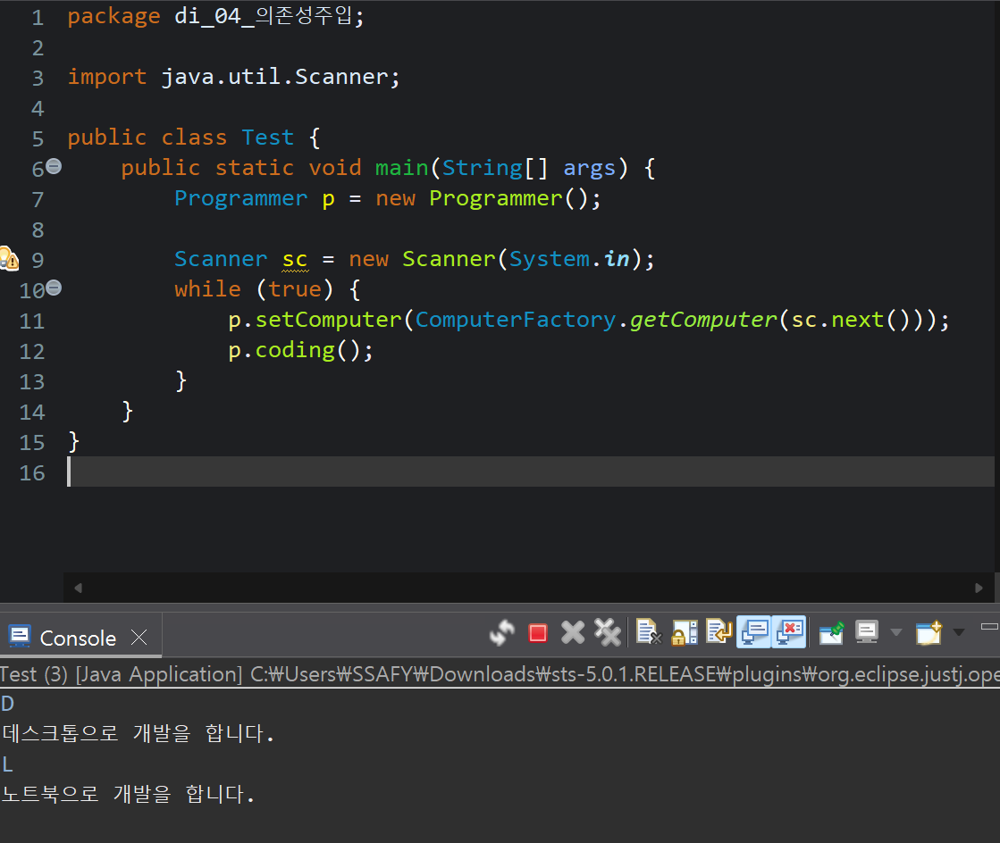
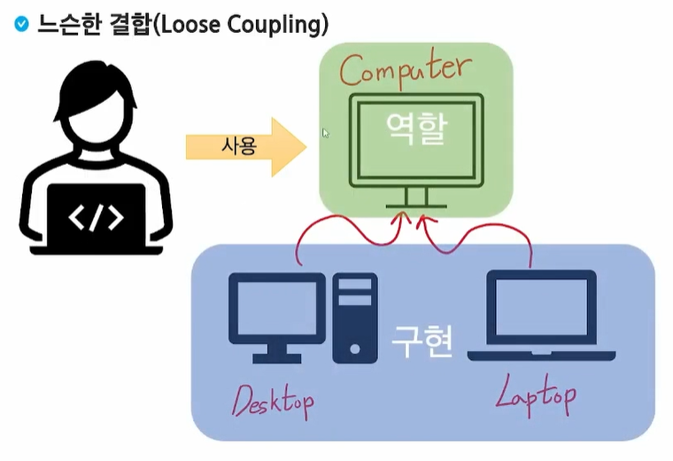

# 의존성 주입 (DI)의 원리

## 의존성 주입 (DI, Dependency Injection)

### 의존성 (Dependency)

- Class A 객체가 어떤 일을 처리하기 위해서 Class B의 객체의 도움을 받아야만 일을 처리할 수 있다면, **“Class A는 Class B에 의존한다”고 표현**

### 의존성 주입 (DI)

- 예전에는 프로그래머가 직접 매장에 가서 컴퓨터를 사와야 했다(`this.desktop = new Desktop()`)
- **주입** 방식은 프로그래머는 가만히 있고, 외부(Spring)에서 "자, 여기 컴퓨터야" 하고 넣어주는 방식이다.

### 생성자 이용

```java
package di_04_의존성주입;

public class Programmer {
    private String name;
    private int age;
    private Computer computer;
    
    // 생성자를 이용한 의존성 주입
    public Programmer(Computer computer) {
        this.computer = computer;
    }
    
    public void coding() {
        System.out.println(computer.getInfo()+"으로 개발을 합니다.");
    }
}

```

### 설정자 이용

```java
package di_04_의존성주입;

public class Programmer {
    private String name;
    private int age;
    private Computer computer;
    
    public Programmer() {
    }
    
    // setter를 이용한 의존성 주입
    public void setComputer(Computer computer) {
        this.computer = computer;
    }
    
    public void coding() {
        System.out.println(computer.getInfo()+"으로 개발을 합니다.");
    }
}

```

```java
package di_04_의존성주입;

public class Test {
    public static void main(String[] args) {
        // 프로그래머가 데스크톱에 대한 의존성을 가지고 있다.
        Desktop desktop = new Desktop();		
//		Programmer p = new Programmer(desktop);
        
        Programmer p = new Programmer();
        p.setComputer(desktop);
        
        p.coding();
    }
}

```

### 메서드 이용

```java
package di_04_의존성주입;

public class Programmer {
    private String name;
    private int age;
    private Computer computer;
    private Keyboard keyboard;
    
    // 메서드 주입 (여러 개를 동시에 주입할 수 있음)
    public void init(Computer computer, Keyboard keyboard) {
        this.computer = computer;
        this.keyboard = keyboard;
    }
    
    public void coding() {
        System.out.println(computer.getInfo()+"으로 개발을 합니다.");
    }
}

```

### Factory

```java
package di_04_의존성주입;

public class ComputerFactory {
    public static Computer getComputer(String type) {
        if(type.equals("D"))
            return new Desktop();
        else if (type.equals("L"))
            return new Laptop();
        return null;
    }
}

```

```java
package di_04_의존성주입;

import java.util.Scanner;

public class Test {
    public static void main(String[] args) {
        Programmer p = new Programmer();

        Scanner sc = new Scanner(System.in);
        while (true) {
            p.setComputer(ComputerFactory.getComputer(sc.next()));
            p.coding();
        }
    }
}

```




## 의존관계 역전 과정

### 객체 직접 생성 (강한 결합)

```jsx
// Desktop.java

package di_01_의존성개념;

public class Desktop {
	private String CPU;
	private String RAM;
	private String SSD;
	private String GPU;
	
	// 설정자, 접근자
	// 생성자
	
	public String getInfo() {
		return "데스크톱";
	}
}
```

```jsx
// Programmer.java

package di_01_의존성개념;

public class Programmer {
	private String name;
	private int age;
	// 요게 핵심
	private Desktop desktop;
	
	// 생성한다 -> 고용한다
	public Programmer() {
		this.desktop = new Desktop();  // 컴퓨터 하나 사준다.
	}
	
	public void coding() {
		System.out.println(desktop.getInfo()+"으로 개발을 합니다.");
	}
}

```

```jsx
// Test.java

package di_01_의존성개념;

public class Test {
	public static void main(String[] args) {
		// 프로그래머가 데스크톱에 대한 의존성을 가지고 있다.
		Programmer p = new Programmer(); // 컴퓨터를 하나 사서 알아서 넣어 줬다.
		
		p.coding();
		
		// 출력 결과: 데스크톱으로 개발을 합니다.
	}
}

```

- 프로그래머(`Programmer`)는 데스크톱(`Desktop`)이 있어야만 개발(`coding()`)을 할 수 있다.
    
    **⇒ `Programmer`는 `Desktop`에 의존한다.**
    

### 객체 생성 의존성 제거

- Desktop에 대한 객체 생성 의존성을 Programmer → Test 로 변경 (의존 관계 역전)

```jsx
package di_02_객체생성의존성제거;

public class Programmer {
	private String name;
	private int age;
	// 요게 핵심
	private Desktop desktop;
	
	// 생성한다 -> 고용한다
	// 객체 생성 의존성을 제거하겠다.
	public Programmer(Desktop desktop) {
		this.desktop = desktop;
	}
	
	public void coding() {
		System.out.println(desktop.getInfo()+"으로 개발을 합니다.");
	}
}

```

```jsx
package di_02_객체생성의존성제거;

public class Test {
	public static void main(String[] args) {
		// 프로그래머가 데스크톱에 대한 의존성을 가지고 있다.
		Desktop desktop = new Desktop();
		
		Programmer p = new Programmer(desktop);
		
		p.coding();
		
		// 출력 결과: 데스크톱으로 개발을 합니다.
	}
}

```

### 타입 의존성 제거
- Interface (`Computer`) 도입

```java
package di_03_타입의존성제거;

public interface Computer {
	public abstract String getInfo();
}
```

```java
package di_03_타입의존성제거;

public class Desktop implements Computer {
	private String CPU;
	private String RAM;
	private String SSD;
	private String GPU;
	
	// 설정자, 접근자
	// 생성자
	
	public String getInfo() {
		return "데스크톱";
	}
}
```

```java
package di_03_타입의존성제거;

public class Laptop implements Computer {
	private String CPU;
	private String RAM;
	private String SSD;
	private String GPU;
	
	// 설정자, 접근자
	// 생성자
	
	public String getInfo() {
		return "노트북";
	}
}

```

```java
package di_03_타입의존성제거;

public class Programmer {
	private String name;
	private int age;
	// 요게 핵심 -> 느슨한 결합을 했다
	private Computer computer;
	
	// 생성한다 -> 고용한다
	// 객체 생성 의존성을 제거하겠다.
	public Programmer(Computer computer) {
		this.computer = computer;
	}
	
	public void coding() {
		System.out.println(computer.getInfo()+"으로 개발을 합니다.");
	}
}

```

```java
package di_03_타입의존성제거;

public class Test {
	public static void main(String[] args) {
		// 프로그래머가 데스크톱에 대한 의존성을 가지고 있다.
		Desktop desktop = new Desktop();
		Laptop laptop = new Laptop();
		
//		Programmer p = new Programmer(desktop);
		Programmer p = new Programmer(laptop);
		
		p.coding();
	}
}

```


### 느슨한 결합 (Loose Coupling)

*만약 데스크톱 대신 노트북을 써야 한다면?*

직접 사오던 방식에서는 내 코드를 고쳐야 하지만, 
주입 방식에서는 나는 Computer 인터페이스만 보고 있으면 된다. 
외부에서 주는 물건만 데스크톱에서 노트북으로 바꿔주면 내 코드는 단 한 줄도 고칠 필요가 없게 된다. 이를 **느슨한 결합(Loose Coupling)**이라고 한다.


*느슨한 결합*
