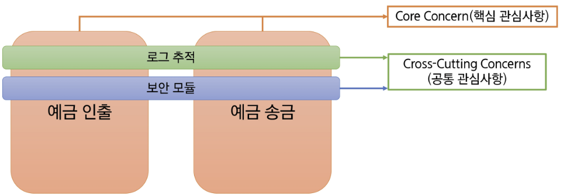
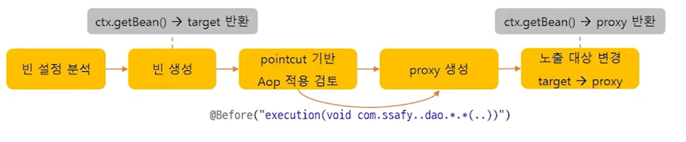
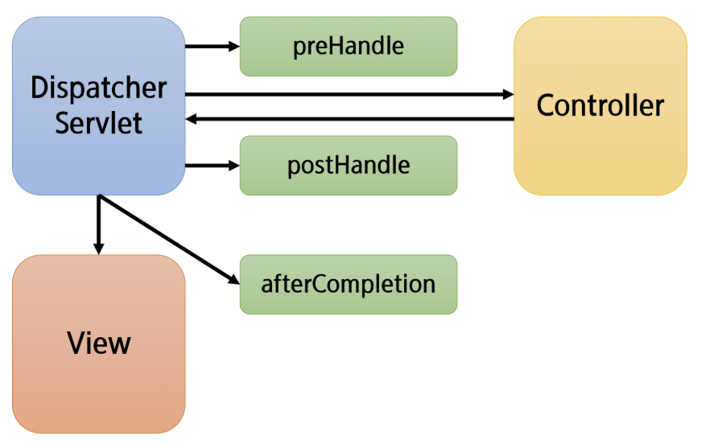

# Spring: AOP와 인터셉터(Interceptor)

## AOP (Aspect Oriented Programming)

### 관점 지향 프로그래밍

- 기능을 비즈니스 로직이 아니라 필요한 개별 관점으로 바라본다.
- **Core Concern (핵심 관심사항):** 객체가 제공하는 고유의 기능
- **Cross-Cutting Concerns (공통 관심사항):** 핵심 기능을 보조하기 위한 기능
    - 시간 측정, 성능 측정, 보안, 암호화, 로그 추적, 트랜잭션 관리 등
    - 반복 가능

### OOP와의 비교

- OOP에서 모듈화의 단위는 클래스,
AOP에서 모듈화의 단위는 Aspect
- Aspect는 여러 타입과 객체에 거쳐서 사용되는 기능 (Cross-Cutting, 트랜잭션 관리 등)의 모듈화
- AOP는 OOP를 대체하는 것이 아닌, 보조하는 목적!

### AOP 핵심 용어

- **Target**: 핵심 비즈니스 로직을 포함한 빈 객체로 AOP가 적용될 대상
- **Aspect**: 여러 클래스에 공통적으로 적용되는 공통 관심 사항. AOP의 기본 모듈.
    - 하나 이상의 advice로 구성
- **Advice**: 공통 관심 코드를 모듈화한 메서드. 부가 기능, 특정 Join Point에서 취해지는 행동
    - Around, Before, After 등의 타입이 존재한다.
    - Point Cut과 횡단 관심사 코드 (메서드 body)로 구성
- **Join Point**: Advice가 적용될 수 있는 위치.
    - 필드 값 변경, 메서드 실행(execution), 생성자 호출 등
    - Spring AOP에서는 **메서드 실행** 지점으로 제한한다.
- **Point Cut:** Join Point 중에서 Advice를 적용하기 위한 표현식
    - Aspect는 지정한 Point Cut에 일치하는 모든 Join Point에서 실행
- **Weaving**: Point Cut으로 결정한 Target의 Join Point에 Advice를 적용하는 행위 자체
    - 컴파일 시점, 클래스 로딩 시점, 런타임 시점에서 수행 가능
    - Spring AOP는 런타임에 수행
- **AOP Proxy:** AOP를 구현하기 위해 AOP Framework에 의해 생성된 객체
    - Spring AOP는 JDK dynamic proxy 또는 CGLIB proxy 사용

### Point Cut 표현식

- `execution([접근제어자] 반환타입 [선언타입] 메서드명(파라미터))`
- `*` 사용 가능

## Spring AOP

### Spring AOP Proxy

- 실제 기능이 구현된 Target 객체를 호출하면, target 이 호출되는 것이 아니라 advice 가 적용된 Proxy 객체가 호출된다.
- 프록시 서버: 클라이언트가 자신을 통해서 다른 네트워크 서비스에 간접적으로 접속할 수 있게 해주는 컴퓨터 시스템이나 응용프로그램
    - 접근 제어와 부가 기능 추가
- Spring은 Proxy 기반의 Bean을 이용해서 AOP 구현

### AOP의 Proxy 동작 원리

- Proxy 기반의 Bean 생성 및 가로채기 (Intercept) 메커니즘

1. **빈(Bean) 생성 및 분석**

Spring 컨테이너가 뜰 때 등록된 빈들을 분석한다. 이때 특정 빈이 AOP 설정(Pointcut)에 해당되는지 확인한다.

2. **Proxy 객체 생성**

만약 해당 빈이 AOP 대상이라면, Spring은 원본 객체(Target) 대신 **Proxy 객체**를 만들어 컨테이너에 등록한다.

- 사용자가 `@Autowired`로 객체를 주입받으면, 원본이 아닌 **Proxy**가 주입된다.
3. **메서드 호출 (가로채기)**

사용자가 메서드를 호출하면, 호출 신호는 원본이 아니라 **Proxy**에게 먼저 전달된다.

4. **Advice 실행 및 Target 호출**

Proxy는 설정된 Advice에 따라 다음과 같이 동작한다.

    1. **Before Advice:** 원본 로직 실행 전 공통 기능 실행.
    2. **Target 메서드 호출:** 실제 비즈니스 로직 실행.
    3. **After Advice:** 원본 로직 실행 후 공통 기능 실행.

### Advice Type

| 타입 | 시점 |
| --- | --- |
| before | target 메서트 호출 이전 |
| after | target 메서드 호출 이후, java exception 문장의 finally와 같이 동작 |
| after returning | target 메서드 정상 동작 후 |
| after throwing | target 메서드 에러 발생 후 |
| around | target 메서드의 실행 시기, 방법, 실행 여부를 결정 |

## 인터셉터 (Interceptor)

### Interceptor

- `HandlerInterceptor`를 구현한 것
    - PreHandle(), postHandle(), afterCompletion()
- 요청 (request)를 처리하는 과정에서 요청을 가로채서 처리한다.
- 비즈니스 로직과 구분되는 반복적이고 부수적인 로직 처리
    - 접근 제어 (Auth), 로그 (log) 등

### preHandle

- Controller (핸들러) 실행 이전에 호출
- true를 반환하면 계속 진행
- false를 반환하면 요청 종료

### postHandle

- Controller (핸들러) 실행 후 호출
- 정상 실행 후 추가 기능 구현 시 사용
- Controller에서 예외 발생 시 해당 메서드는 실행되지 않는다.

### afterCompletion

- 뷰가 클라이언트에게 응답을 전송한 뒤 실행
- Controller에서 예외 발생 시, 네 번째 파라미터로 전달된다. (기본은 null)
- Controller에서 발생한 예외 혹은 실행 시간 같은 것들을 기록하는 등 후처리 시 사용