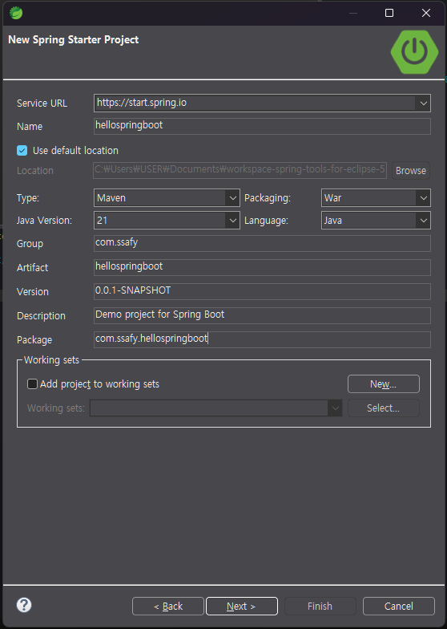
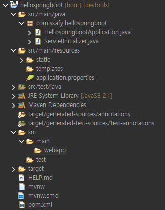
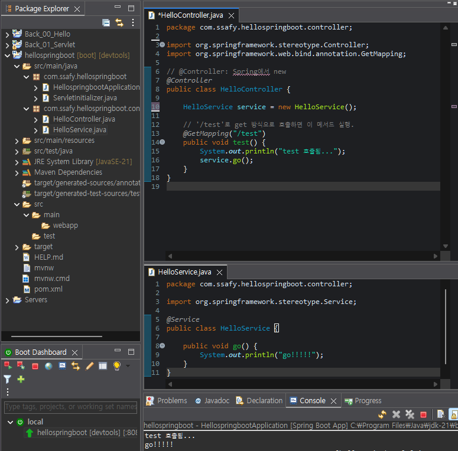
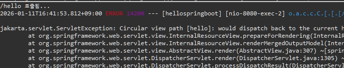
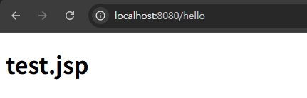
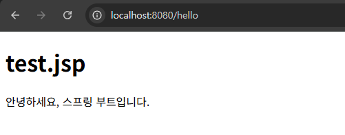
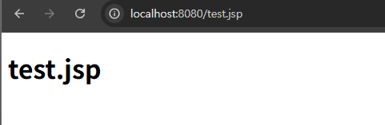
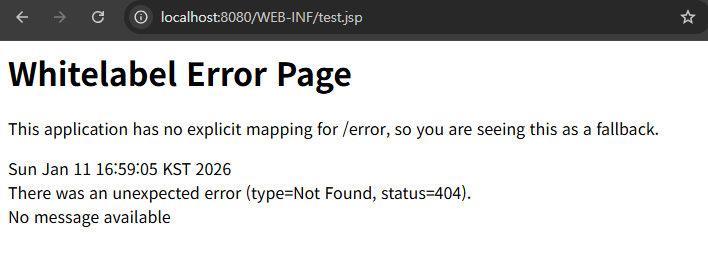
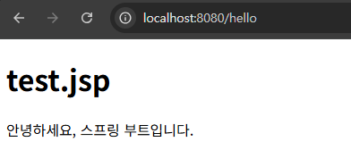

# Spring Boot: 설정 자동화와 개발 기초

## Spring Boot

### Spring Boot

- project에 따라 자주 사용되는 library들이 미리 조합되어 있다.
- 복잡한 설정을 자동으로 처리
- WAS에 배포하지 않고도 실행할 수 있는 JAR 파일로 Web Application을 개발할 수 있다.
- Spring의 경우 Application을 개발하려면 사전에 많은 작업을 해야 한다.
    - library 추가, dependency 설정, SpringFramework 가 처리해야 하는 여러 가지 구성 및 설정 파일 등

### STS에서 Spring Boot 시작하기

- Spring Boot 프로젝트 생성



- src/main/resources/static 폴더에 index.html 작성

```html
<!-- src/main/resources/static/index.html -->
<h1>hello Spring Boot!!!</h1>
```


### 프로젝트 구조



| 위치 | 설명 |
| --- | --- |
| `src/main/java` | java source directory |
| `HellospringbootApplication.java` | application을 시작할 수 있는 main method가 존재하는 스프링 구성 메인 클래스. 최상위 패키지에 두는 것을 권장함 |
| `ServletInitializer.java` | war로 생성하면 만들어지는 servlet 초기 설정 파일. 수정하지 않는다. |
| `src/main/resources/static/` | css, js, img 등 정적 resource directory |
| `src/main/resources/templates/` | SpringBoot에서 사용가능한 여러 가지 view Template (Thymeleaf, Velocity, FreeMarket 등) 위치 |
| `src/main/resources/application.properties` | application 설정 등을 저장하는 파일. 추후 사용할 여러 가지 property 를 저장한 file |
| `src/main/webapp/` | jsp가 위치하는 WEB-INF 폴더가 있어야 하는 경로 |

### 의존성 관리

- `pom.xml`에 parent로 설정되어 있는 spring-boot-starter-parent을 살펴보면 관리해주는 의존성들의 version이 나와있다.

### 메인 클래스 `@SpringBootApplication`

- `@SpringBootConfiguration`: spring boot의 설정을 나타낸다.
    - 스프링의 `@Configuration`을 대체
- `@ComponentScan`: 개발자가 annotaion으로 등록한 Controller, Service 등을 Bean으로 등록한다.
- `@EnableAutoConfiguration`: Spring 내부에서 미리 생성해 놓은 Bean을 등록한다.
    - 메인 클래스(`@SpringBootApplication`)를 실행하면 `@EnableAutoConfiguration`에 의해 `AutoConfiguration.imports` 안에 들어있는 수많은 자동 설정들이 조건에 따라 적용되어 Bean들이 생성되고, 스프링 부트 어플리케이션이 실행된다.

### Static Content

- `/src/main/resources`아래에 `/static`, `/public`, `/resources`는 모두 static 파일의 접근 경로이다.
- port 번호를 지정하고 싶다면, `application.properties` 파일에 지정한다.
    - `server.port=80`

### Dependency Injection (DI)

- 객체가 다른 객체를 참조할 때, 직접 생성하지 않고, 외부에서 주입받는 디자인 패턴
- 직접 생성(`new`)하지 않고, Spring Boot이 Bean을 생성하도록 만든다.
- DI를 통해 클래스 간의 결합도를 낮추고, 코드의 재사용성과 테스트 용이성을 높일 수 있다.

```java
//직접 생성 (권장하지 않음) - 강한 결합
public class userService {
	private UserRepository userRepository = new UserRepository();
}

//DI 사용 - 낮은 결합도
public class userService {
	private final UserRepository userRepository;
	
	public UserService(UserRepository userRepository) {
		this.userRepository = userRepository;
	}
}
```

| 방식 | 특징 및 예시 | 장단점 |
| --- | --- | --- |
| 생성자 주입 | 생성자를 통해 의존성 주입 `@Autowired` | 불변성, 테스트 용이, 권장 방식 |
| Setter 주입 | Setter 메서드에 `@Autowired` | 선택적 의존성, 순환 참조 대응 가능 |
| 필드 주입 | 필드에 직접 `@Autowired` | 코드 간결, 테스트 어려움 |

### IoC (Inversion of Control)

- Spring Boot는 **IoC Container**를 통해 객체(Bean) 생성과 의존성 주입 (DI)을 관리한다.
    - IoC의 구현 방법 중 하나가 DI이다.
- 개발자는 객체 생성과 의존성 관리에 신경쓰지 않고, 비즈니스 로직에 집중할 수 있다.
- 의존성 주입이 Spring Framework의 핵심 기능

### DI 예시

**직접 주입**

```java
// @Controller: Spring에서 new
@Controller
public class HelloController {
	// 직접 new로 객체 생성 - 강한 결합
	HelloService service = new HelloService();
	
	// '/test'로 get 방식으로 호출하면 이 메서드 실행.
	@GetMapping("/test")
	public void test() {
		System.out.println("test 호출됨...");
		service.go();
	}
}
```



**생성자 주입**

```java
@Controller
public class HelloController {
	
	private HelloService service;
	
	@Autowired
	public HelloController (HelloService service) {
		this.service = service;
	}
	
	// '/test'로 get 방식으로 호출하면 이 메서드 실행.
	@GetMapping("/test")
	public void test() {
		System.out.println("test 호출됨...");
		service.go();
	}
}

```

**Setter 주입**

```java
@Controller
public class HelloController {
	
	private HelloService service;
	
	@Autowired
	public void setService (HelloService service) {
		this.service = service;
	}
	
	// '/test'로 get 방식으로 호출하면 이 메서드 실행.
	@GetMapping("/test")
	public void test() {
		System.out.println("test 호출됨...");
		service.go();
	}
}

```

**필드 주입**

```java
@Controller
public class HelloController {
	
	@Autowired
	private HelloService service;
	
	// '/test'로 get 방식으로 호출하면 이 메서드 실행.
	@GetMapping("/test")
	public void test() {
		System.out.println("test 호출됨...");
		service.go();
	}
}

```

## JSP 설정

### pom.xml에 JSP 의존성 추가

```xml
		<!-- JSP setting -->
	    <dependency>
	        <groupId>jakarta.servlet</groupId>
	        <artifactId>jakarta.servlet-api</artifactId>
	    </dependency>
	    <dependency>
	        <groupId>jakarta.servlet.jsp.jstl</groupId>
	        <artifactId>jakarta.servlet.jsp.jstl-api</artifactId>
	    </dependency>
	    <dependency>
	        <groupId>org.glassfish.web</groupId>
	        <artifactId>jakarta.servlet.jsp.jstl</artifactId>
	    </dependency>
	
	    <!-- Tomcat Embed Jasper (for Spring Boot specifically) -->
	    <dependency>
	        <groupId>org.apache.tomcat.embed</groupId>
	        <artifactId>tomcat-embed-jasper</artifactId>
	    </dependency>
```

### Controller 생성

```java
@Controller
public class HelloController {
	
	@GetMapping("/hello")
	public void hello() {
		System.out.println("/hello 호출됨...");
	}
}
```

### Controller 호출



- 로그는 찍히는데, 오류 발생
    - 사용자 요청은 Controller 에서 받고, View(JSP)에서 응답을 주는 것이 Spring의 기본동작인데, 어떤 View(JSP)로 응답할지 작성하지 않았다.

```java
	@GetMapping("/hello")
	public String hello() {
		System.out.println("/hello 호출됨...");
		return "/test.jsp";
	}
```



### jsp로 값 전달하기

- Model 클래스를 활용하여 값을 전달한다.
- EL (Expression Language)로 출력

```java
@GetMapping("/hello")
	public String hello(Model model) {
		System.out.println("/hello 호출됨...");
		model.addAttribute("msg", "안녕하세요, 스프링 부트입니다.");
		return "/test.jsp";
	}
```

```html
<body>
	<h1>test.jsp</h1>
	${msg}
</body>
```



- 단, `/hello`로 호출하면 Model에 값을 담아서 test.jsp에서 출력하는데, test.jsp를 직접 호출하면 msg 변수 값이 없으므로 화면에 출력되지 않는다.



### JSP 접근 제한

- test.jsp를 webapp/WEB-INF/ 폴더 하위로 이동
- 서버 내부에서는 호출할 수 있고, 외부 browser에서는 접근할 수 없다.

```java
	@GetMapping("/hello")
	public String hello(Model model) {
		System.out.println("/hello 호출됨...");
		model.addAttribute("msg", "안녕하세요, 스프링 부트입니다.");
		return "/WEB-INF/test.jsp";
	}
```





### prefix, suffix 설정

- application.properties에 아래 코드 작성

```java
spring.mvc.view.prefix=/WEB-INF/
spring.mvc.view.suffix=.jsp
```

- Controller 에서는 jsp 파일의 이름만 return 하면 된다.

```java
	@GetMapping("/hello")
	public String hello(Model model) {
		System.out.println("/hello 호출됨...");
		model.addAttribute("msg", "안녕하세요, 스프링 부트입니다.");
		return "test";
	}
```

## 로깅 (logging)

### 로깅

- 정보를 제공하는 일련의 기록인 로그 (log)를 생성하도록 시스템을 작성하는 활동
- 재현하기 힘든 버그가 개발 완료된 환경에서 발생했을 경우, 그런 버그들에 대한 정보를 알려주며 구문들 사이에 걸리는 시간 등 성능에 관한 통계와 정보를 제공할 수 있다.
- 로그기 제공하는 정보의 양은 프로그램이 실행되는 중에도 설정이 가능한 것이 이상적이다.
- 설정이 가능할 때, 로그는 예기치 못한 특정 문제들을 디버그하기 위해 코드를 수정하고 다시 적용하지 않아도, 일반적인 정보를 갈무리할 수 있게 해준다.

### Spring Boot의 로깅 원리

- 스프링 부트는 기본적으로 Apache commons logging(JCL-Jakarta…)을 기반으로 한 **SLF4J (Simple Logging Facade for Java)**를 사용한다.
- 로깅에 대한 추상 레이어를 제공하는 인터페이스의 모임
- 인터페이스를 구현한 로거들 간에는 쉽게 바꾸어 낄 수 있는 장점이 있다.
- 스프링 부트는 기본 로거로 Logback 로거를 선택한다.

### 로그 형식

- 날짜와 시간: 밀리세컨드 단위로 꼼꼼하고 쉽게 정렬이 가능하다.
- 로그 레벨: ERROR, WARN, INFO (default), DEBUG, TRACE
- 프로세스 ID
- `---` : 실제 로그 메시지가 출력되는 부분을 나누기 위한 구분자
- Logger name: 소스 클래스 네임
- 로그 메시지