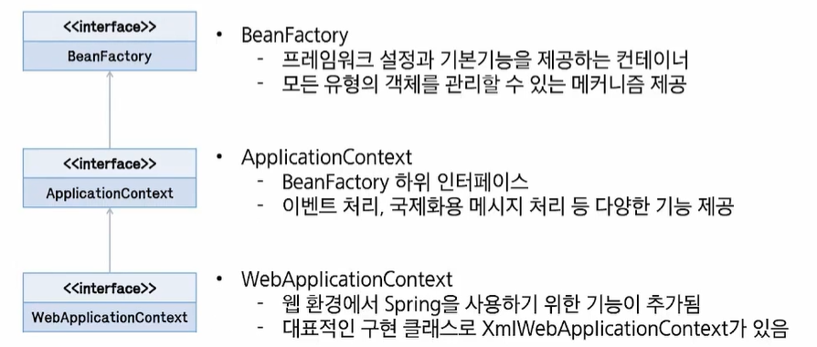

# 스프링 컨테이너와 Bean

## Spring Container Build

### Spring IoC Container

- Spring은 거대한 **객체 관리소 (Container)**다.
- Container: Bean의 인스턴스화 조립, 관리의 역할, 사용 소멸에 대한 처리를 담당한다.


*Spring Container*

### Bean의 개념
- Bean: 스프링에서 핵심적인 역할을 하는 객체
- 개발자가 "이 클래스(Desktop, Programmer)는 Spring이 관리해줘!"라고 표시 (`@Component` 등) 
- 이렇게 Spring이 관리하는 객체를 **Bean**이라고 한다.

### 스프링 설정 정보

- 애플리케이션 작성을 위해 생성할 Bean과 설정 정보, 의존성 등의 방법을 나타내는 정보
- 설정 정보를 작성하는 방법은 **XML, Annotation, Java Config** 방식이 있다.

### Container 빌드 과정

- 애플리케이션이 켜질 때, Spring은 설정 정보(XML, Annotation 등)를 읽어 필요한 객체들을 미리 다 만들어 둔다.

**1. 설정:** `pom.xml`에 필요한 라이브러리(Spring Context 등)를 넣는다.

```xml
<!-- pom.xml -->

<project xmlns="http://maven.apache.org/POM/4.0.0" xmlns:xsi="http://www.w3.org/2001/XMLSchema-instance" xsi:schemaLocation="http://maven.apache.org/POM/4.0.0 https://maven.apache.org/xsd/maven-4.0.0.xsd">
  ...
  <dependencies>
    <!-- https://mvnrepository.com/artifact/org.springframework/spring-context -->
        <dependency>
            <groupId>org.springframework</groupId>
            <artifactId>spring-context</artifactId>
            <version>6.2.15</version>
        </dependency>
  </dependencies>
</project>
```

**2. Bean 정의:** 클래스 위에 `@Component`를 붙이거나 Java Config 파일에서 `@Bean`으로 등록한다.

```xml
<!-- applicationContext.xml -->

<?xml version="1.0" encoding="UTF-8"?>
<beans xmlns="http://www.springframework.org/schema/beans"
    xmlns:xsi="http://www.w3.org/2001/XMLSchema-instance"
    xmlns:context="http://www.springframework.org/schema/context"
    xsi:schemaLocation="
        http://www.springframework.org/schema/beans https://www.springframework.org/schema/beans/spring-beans.xsd
        http://www.springframework.org/schema/context https://www.springframework.org/schema/context/spring-context.xsd">

    <!-- bean 등록 (풀패키지명) -->
    <bean class="com.ssafy.di.Desktop" id="desktop"></bean>
    <bean class="com.ssafy.di.Programmer" id="programmer"></bean>

</beans>
```

**3. 의존성 주입:** `@Autowired`를 사용하여 필요한 객체를 가져다 쓴다.

**4. 실행:** `ApplicationContext`를 통해 Spring이 다 만들어 놓은 객체를 꺼내서 사용한다.

```java
package com.ssafy.di;

import org.springframework.context.ApplicationContext;
import org.springframework.context.support.GenericXmlApplicationContext;

public class Test {
    public static void main(String[] args) {
        // 설정파일에 대한 경로 작성
        ApplicationContext context = new GenericXmlApplicationContext("applicationContext.xml");
        
        // getBean으로 가져온 것은 "객체"
        Desktop desktop = (Desktop)context.getBean("desktop");
        Programmer p = context.getBean("programmer", Programmer.class);
        
        p.setComputer(desktop);
        
        p.coding();
    }
}

```

### Bean Scope

```java
package com.ssafy.di;

import org.springframework.context.ApplicationContext;
import org.springframework.context.support.GenericXmlApplicationContext;

public class Test {
    public static void main(String[] args) {
        // 설정파일에 대한 경로 작성
        ApplicationContext context = new GenericXmlApplicationContext("applicationContext.xml");
        
        Desktop desktop = (Desktop)context.getBean("desktop");
        Desktop desktop2 = (Desktop)context.getBean("desktop");
        Programmer p = context.getBean("programmer", Programmer.class);
        
        p.setComputer(desktop);
        
        p.coding();
        
        System.out.println(desktop == desktop2); // true (같은 객체)
    }
}

```

- Bean 정의를 작성하는 것은 Bean 객체를 생성하는 것과는 다르다
- Bean 범위 (Scope)를 정의해서 객체의 범위를 제어할 수 있다.

| Scope | 설명 |
| --- | --- |
| singleton (기본값) | Spring IoC 컨테이너에 대한 단일 객체 인스턴스 |
| prototype | 빈을 요청할 때마다 새로운 인스턴스 생성 |
| request | HTTP Request 주기로 bean 인스턴스 생성 |
| session | HTTP Session 주기로 bean 인스턴스 생성 |
