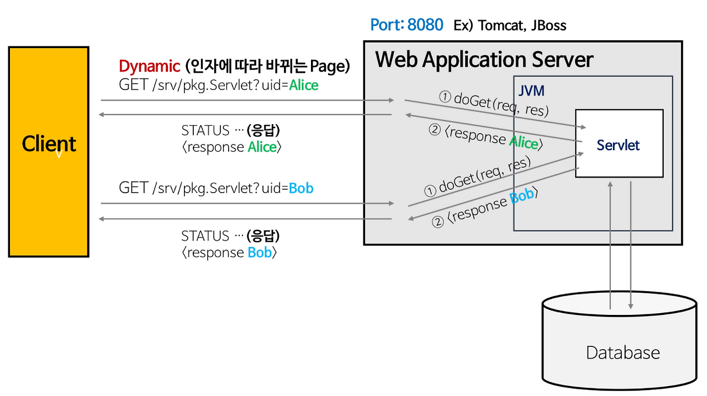
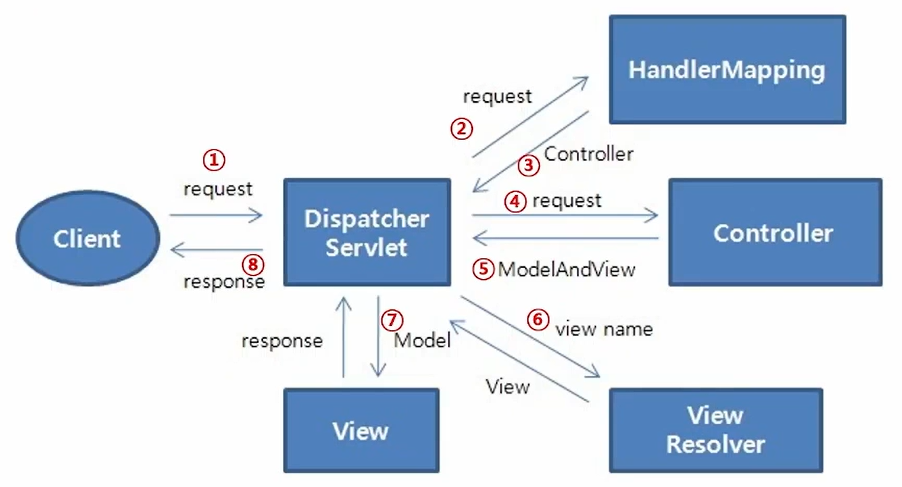
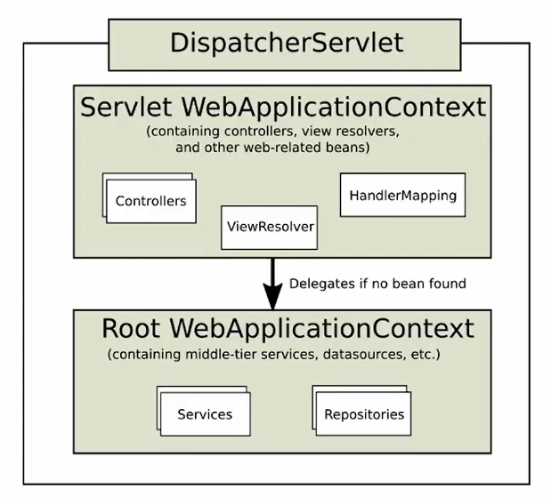
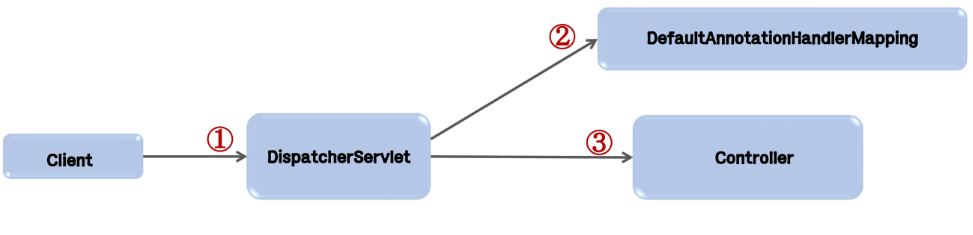
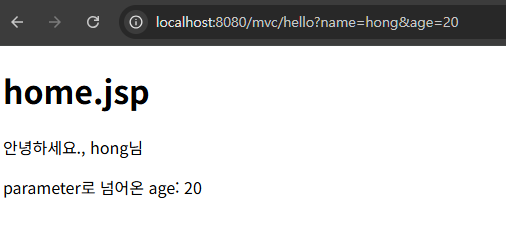
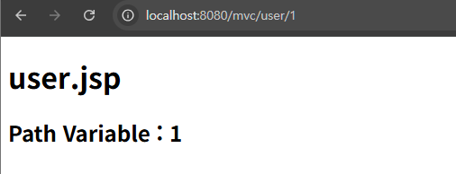
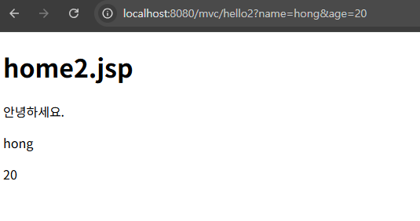
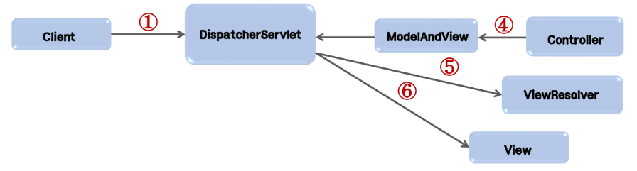

# Spring MVC 아키텍처와 요청 흐름

## Django vs Spring MVC 구조 비교

| **역할** | **Django (DRF)** | **Spring Boot** |
| --- | --- | --- |
| **DB 테이블 정의** | `models.py` | `@Entity` 클래스 (JPA) |
| **DB 쿼리/조작** | `objects` (QuerySet) | **Repository Interface** (JPA) |
| **입출력 데이터 정의** | `serializers.py` | **DTO** Class |
| **API 로직 처리** | `views.py` (ViewSet) | **Controller** Class |
| **URL 연결** | `urls.py` | `@RequestMapping` (Controller 내부) |

## MVC 패턴의 구성 요소와 역할

### 요청과 응답의 흐름



- 서버 (WAS)
    - spring boot는 자체 내장된 서버가 있음. 톰캣 등록 불필요.
    - Tomcat: **웹 애플리케이션 서버(WAS).** 자바 서블릿(Servlet)과 자바 서버 페이지(JSP)를 실행하는 서블릿 컨테이너 역할

1. 서블릿 (Servlet) **(=Controller)**
    - 웹 요청과 응답의 흐름을 간단한 메서드 호출만으로 체계적으로 다룰 수 있게 해주는 기술
    - 서블릿은 자바 클래스로 웹 애플리케이션을 작성한 뒤 이후 웹 서버 안에 있는 웹 컨테이너에서 이것을 실행하고,
    - 웹 컨테이너에서는 서블릿 인스턴스를 생성 후 서버에서 실행되다가 웹 브라우저에서 서버에 요청(Request)을 하면 요청에 맞는 동작을 수행하고 웹 브라우저에 HTTP형식으로 응답(Response)합니다.
    
    ### Servlet (서블릿)
    
    https://coding-factory.tistory.com/742
    
    
    
2. **Service (=Model)**
    - DTO
3. DAO(**Repository**)
    - MySQL, JDBC
4. JSP **(=View)**
    - 포워딩 (내부)
    - 리다이렉트 (외부)
    - 기본 객체 (page, request, session, application)

### Model

- 데이터 질의에 대한 정보를 제공하는 기능 및 데이터에 대한 수정을 담당
- 동작을 수행하는 코드
    - **Entity:** DB 테이블 모양 (`models.py`의 클래스 정의 부분)
    - **Repository:** 데이터 가져오기 (`.objects` 매니저 역할)
    - **Service:** 비즈니스 로직 (Django View나 Model 메서드에 있던 로직)
    - **DTO:** 데이터를 나르는 객체
- 사용자 View에 어떻게 보일지에 대해서는 신경쓰지 않는다.

### View

- Django MTV 패턴에서의 Template
- 사용자가 화면에 무엇을 어떻게 볼 것인지를 결정
- 사용자 화면에 보이는 부분
- Frontend 영역의 Vue.js가 담당한다.
    - 혹은 JSP
- 모델의 정보를 받아와 사용자에게 보여주는 역할 수행
- 자체적으로 모델의 정보를 보관하지 않는다.

### Controller

- Django MTV 패턴에서의 View
- 요청을 받아 검증하고 비즈니스 로직을 수행
    - Service 호출
- 모델과 뷰를 연결하는 역할
- 사용자에게 데이터를 가져오고 수정하고 제공한다.
- 사용자의 요청(URL)을 가장 먼저 받는 곳

## Spring Web MVC 요청 처리 흐름

### Spring Web MVC

- Servlet API를 기반으로 구축된 Web Framework
- DI, AOP 뿐 아니라 WEB 개발을 위한 기능을 제공
- DispatcherServlet(Front-Controller)를 중심으로 디자인되었으며,
- View Resolver, Handler Mapping, Controller 와 같은 객체와 함께 요청을 처리하도록 구성됨

### 주요 구성 요소

- DispatcherServlet: 클라이언트 요청 처리 (요청 및 처리 결과 전달)
- HandlerMapping: 요청을 어떤 Controller가 처리할 지 결정
- Controller: 요청에 따라 수행할 메서드를 선언하고, 요청 처리를 위한 로직 수행 (비즈니스 로직 호출)
- ModelAndView: 요청 처리를 하기 위해서 필요한 혹은 그 결과를 저장하기 위한 객체
- ViewResolver: Controller에 선언된 view이름을 기반으로 결과를 반환할 View를 결정
- View: 응답화면 생성

### Spring Web MVC 흐름



1. 클라이언트 요청이 들어오면 DispatcherServlet이 받는다.
2. HandlerMapping이 어떤 Controller가 요청을 처리할 지 결정한다.
3. DispatcherServlet은 Controller에 요청을 전달한다.
4. Controller는 요청을 처리한다.
5. 결과(요청처리를 위한 data 결과를 보여줄 view의 이름)를 ModelAndView에 담아 반환한다.
6. ViewResolver에 의해서 실제 결과를 처리할 View를 결정하고 반환한다.
7. 결과를 처리할 View에 ModelAndView를 전달한다.
8. DispatcherServlet은 View가 만들어낸 결과를 응답한다.

### DispatcherServlet



컨테이너 구성

## Controller 구현 및 파라미터 처리

### `@Controller`

- client의 요청을 처리한다.
- method 단위의 mapping 가능
- DefaultAnnotaionHandlerMapping과 AnnotationHandlerAdapter 사용
		- Spring 기본 설정이므로 별도의 추가 없이 동작
- Component Scan으로 annotation을 인식하므로 프로젝트의 하위 package로 생성하는 것이 일반적



### `@RequestMapping`

- URL을 클래스 또는 특정 핸들러(메서드)에 매핑
- HTTP Method (GET, POST 등)에 따라 다른 Method로 설정할 수 있다.
- 여러 개의 요청을 하나의 controller에서 처리할 때 전체의 경로를 지정할 수 있다.

```java
@RequestMapping(value="home", method=RequestMethod.GET)
public ModelAndView homeHandle1() {
	// 데이터를 담을 바구니, View 정보를 저장할 객체
	ModelAndView mav = new ModelAndView();
	
	// 데이터를 저장
	mav.addObject("msg", "Welcome to Spring MVC(GET)");
	
	// View 이름 지정 (포워딩)
	mav.setViewName("home");
	return mav;
}

@RequestMapping(value="home", method=RequestMethod.POST)
public ModelAndView homeHandle2() {
	ModelAndView mav = new ModelAndView();
	mav.addObject("msg", "Welcome to Spring MVC(POST)");
	mav.setViewName("home");
	return mav;
}
```


MyController.java


index.jsp


/home POST 요청 결과

### Controller Parameter

| 파라미터 타입 | 설명 |
| --- | --- |
| **`HttpServletRequest**
HttpServletResponse
**HttpSession**` | Servlet API를 사용할 수 있다 |
| `Locale` | 요청 클라이언트의 Locale 정보를 포함 |
| `InputStream, Reader
OutputStream, Writer` | 요청으로부터 직접 데이터를 읽어보거나, 응답을 직접 생성하기 위해서 사용 |
| `Map, **Model**, ModelMap` | View 데이터를 전달하기 위해서 사용 |
| `RedirectAttributes` | 리디렉션(쿼리 문자열에 추가) 시 사용할 속성 지정 |
| `Errors, BindingResult` | 에러와 데이터 바인딩 결과에 접근하기 위해서 사용 |
| **`@PathVariable`** | URI 템플릿 변수에 대한 엑세스 |
| **`@RequestParam`** | multipart 파일을 포함하여 요청 파라미터에 엑세스 |
| `@RequestHeader` | 요청 헤더에 액세스 |
| `@CookieValue` | 쿠키에 대한 엑세스 |
| `@RequestAttribute` | 모든 세션 속성에 대한 엑세스 |
| `@SessionAttribute` | 요청 속성에 엑세스 |
| **`@ModelAttribute`** | 모델의 속성에 액세스 |
| `@ResponseBody` | HttpMessageConverter 구현을 통해 변환되어 응답 |
| `HttpHeaders` | 헤더가 있고 body가 없는 response를 반환 |
| **`String`** | 뷰 이름 반환 (ViewResolver 선언과 함께 사용) |
| `View` | 렌더링 하는데 사용할 View 인스턴스 |
| `Map, **Model**` | 명시적으로 모델을 작성하지 않은 경우 사용 |
| `ModelAndView` | 사용할 view와 속성을 포함하는 객체 |
| `void` | method에 ServletResponse, HttpServletResponse 인자가 있는 경우, 모든 요청이 처리된 것으로 간주, 그렇지 않으면 요청 URI를 view name으로 처리 |

### `@GetMapping`

```java
@GetMapping("/test1")
public String test1() {
	// String 반환 := View 이름이라고 생각을 하겠다
	return "test1"; // WEB-INF/view/test1.jsp
}
```

```java
@GetMapping("/test2-1")
public String test2_1(Model model) {
	// model 이라는 바구니를 파라미터로 준비
	model.addAttribute("msg", "model data");
	return "test2"; // WEB-INF/view/test2.jsp
}

@GetMapping("/test2-2")
public String test2_2(Map<String, Object> map) {
	map.put("msg", "map data");
	return "test2"; // WEB-INF/view/test2.jsp
}
```

### `@RequestParam`

```java

@Controller
@RequestMapping("/mvc")
public class HomeController {
	private static final Logger log = LoggerFactory.getLogger(HomeController.class);
	
	// http://localhost:8080/mvc/hello?name=hong&age=20
	@GetMapping("/hello")
	public String home(Model model, String name, int age) {
		log.debug("name: {}, age: {}", name, age);
		
		model.addAttribute("msg", "안녕하세요.");
		model.addAttribute("name", name);
		model.addAttribute("age", age);
		
		return "home";
	}
}

```



### `@PathVariable`

```java
	// http://localhost:8080/user/1
	@GetMapping("/user/{id}")
	public String user(Model model, @PathVariable String id) {
		log.debug("id: {}", id);
		model.addAttribute("id", id);
		return "user";
	}
```



### HttpServletRequest

```java
// 파라미터 처리
@GetMapping("/test3-1")
public String test3_1(Model model, HttpServletRequest request) {
	String id = request.getParameter("id");
	model.addAttribute("id", id);
	return "test3"; // WEB-INF/view/test3.jsp
}

@GetMapping("/test3-2")
public String test3_2(Model model, @RequestParam("myid") String id,
				@RequestParam(value="pw", defaultValue="0000") String pw) {
	model.addAttribute("id", id);
	return "test3"; // WEB-INF/view/test3.jsp
}

```

### `@PostMapping`

```java
// @PostMapping("/regist")
// public String regist(@RequestParam("id") String id, @RequestParam("pw") String pw) {
// 	 User user = new User(id, pw);
// 	 return "result"; //이슈방지용
// }

@PostMapping("/regist")
public String regist(@ModelAttrribute User user) {
	return "result";
}
```

### 데이터 바인딩 (Command 객체)

```java
@GetMapping("/hello2")
	public String home(Model model, UserDto dto) {
		
		log.debug("name: {}, age: {}", dto.getName(), dto.getAge());
		
		model.addAttribute("msg", "안녕하세요.");
		model.addAttribute("dto", dto);
		
		return "home2";
	}
```

```html
<h1>home2.jsp</h1>
<p>${msg}</p>
<p>${dto.name}</p>
<p>${dto.age}</p>
```




- Command 객체 (DTO, controller mapping 되어서 입력된 객체)는 model에 자동으로 추가된다.
- DTO 클래스의 첫글자를 소문자로 변환한 이름으로 추가된다.
- `@ModelAttribute`를 사용하면 임의의 이름을 정할 수 있다.

```java
package com.ssafy.hellospringboot.controller;

public class UserDto {
	private String name;
	private int age;
	
	
	public String getName() {
		return name;
	}
	public void setName(String name) {
		this.name = name;
	}
	public int getAge() {
		return age;
	}
	public void setAge(int age) {
		this.age = age;
	}
}
```


## View 결과 반환 및 리다이렉트

### view 지정

- ModelAndView와 String 리턴 타입
- view 이름에 `redirect:` 접두어를 붙이면, 지정한 페이지로 redirect 된다.

