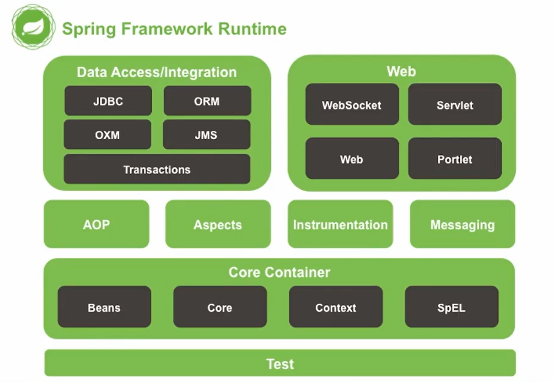

# Spring 개요 및 Django 비교

## Spring Framework 특징

- POJO (Plain Old Java Object) 방식의 프레임워크
- 의존성 주입 (Dependency Injection)을 통한 객체관계 구성
- 관점지향 프로그래밍 (AOP, Aspect Oriented Programming)
- 제어 역전 (IoC, Inversion of Control)
- 높은 확장성과 다양한 라이브러리

## Django(MTV) vs Spring(MVC) 비교

| **비교 항목** | **Django (MTV)** | **Spring (MVC)** | **설명** |
| --- | --- | --- | --- |
| **비즈니스 로직** | **View** | **Controller** | 요청을 받고 로직을 처리하는 핵심 계층입니다. |
| **화면 UI** | **Template** | **View** | 사용자에게 보여지는 HTML/JSP 등입니다. |
| **데이터 처리** | **Model** (ORM) | **Model/Entity** | 데이터베이스와의 연결을 담당합니다. |
| **객체 관리** | Django 내부에서 자동 처리 | **IoC 컨테이너** (DI) | Spring은 개발자가 객체 관계를 직접 설계합니다. |

### 런타임 구조

*spring framework runtime*
