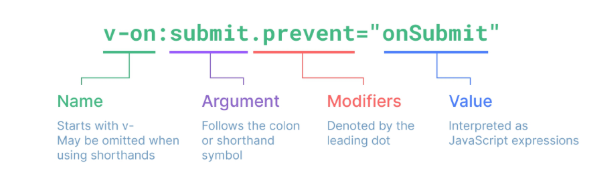
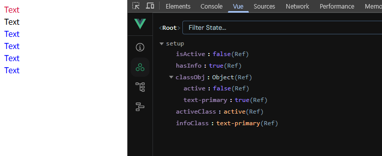
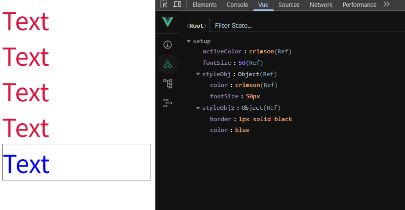
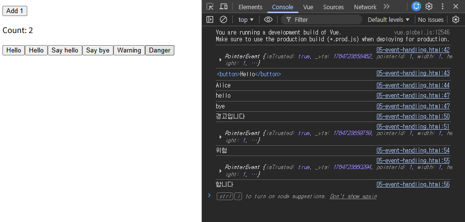
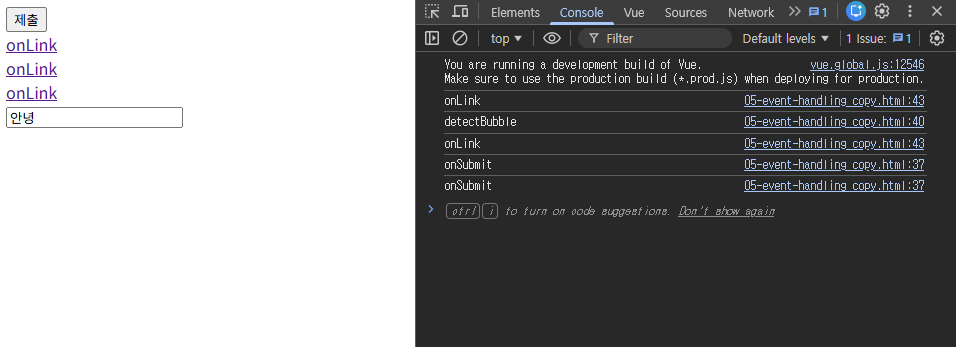
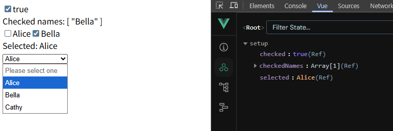

# [Vue.js] 기본 문법 (Basic Syntax)

## Template Syntax

### Template Syntax란?

- HTML에 Vue만의 문법을 사용하는 것
- 선언적 바인딩: JavaScript 데이터(state)가 바뀌면 DOM이 알아서 업데이트 된다.

### Text Interpolation

- 데이터 바인딩: 자바스크립트 데이터와 HTML 화면을 동기화하여 연결하는 것
- 콧수염 구문 (`{{ }}`) 사용

### 접두어 $

- Vue가 제공하는 공용 프로퍼티
- 사용자가 지정한 반응형 변수나 메서드와 구분하기 위함
- 주로 Vue 인스턴스 내부 상태를 다룰 때 사용


### Raw HTML (`v-html`)

- `v-html` 실제 HTML을 출력
- 보안상 문제로 추천하지 않음

### Attribute Bindings

- `v-bind`: HTML의 id 속성 값을 Vue의 dynamicId 속성과 동기화되도록 한다.
- 바인딩 값이 null이나 undefined인 경우, 해당 속성은 렌더링 요소에서 제거된다.

### JavaScript Expressions

- Vue는 모든 데이터 바인딩 내에서 JavaScript 표현식의 모든 기능을 지원
- 콧수염 구문 내부, 모든 디렉티브의 속성 값(`v-`)에 사용할 수 있다.
- 각 바인딩에는 하나의 단일 표현식만 포함될 수 있다.

### Directive

- `v-` 접두사가 있는 특수 속성
    - `v-text`, `v-show`, `v-if`, `v-for` 등
- DOM 요소에 특정 반응형 동작을 적용하는 명령어
- 단일 JavaScript 표현식이어야 한다.



directive 전체 구문 예시

- Name: 어떤 종류의 기능을 수행할지
- Argument: 무엇에 대해 동작할지 알려주는 구체적인 대상 (트리거)
- Modifiers: 기본 동작. 여러 개의 수식어를 이어붙일 수 있다.
- Value: JavaScript 표현식

---

## Dynamically Data Binding

### v-bind (속성 바인딩)

- 하나 이상의 속성 또는 컴포넌트 데이터를 표현식에 동적으로 바인딩
- 데이터 값에 따라 이미지, 스타일, 클래스 등을 자유롭게 변경할 수 있다.
- Attribute Bindings (속성 바인딩): HTML 속성 값을 Vue의 상태 속성 값과 동기화
    - `v-bind`를 생략해서 표현하기도 한다.
        - `v-bind:src="imageSrc"` → `:src="imageSrc"`

```html

<a :href="myUrl">Link</a>

<script>
...
setup() {
  const imageSrc = ref('https://picsum.photos/200')
  const myUrl = ref('https://google.com')
  return {
    imageSrc,
    myUrl,
  }
}
</script>
```

- Dynamic Attribute name (동적 인자 이름): 동적으로 평가된 값을 argument 값으로 사용
    - 대괄호(`[]`)로 감싸서 directive argument에 JavaScript 표현식 사용
    - 대괄호 안에는 소문자만 가능! 띄어쓰기, 따옴표 사용 불가!

### Binding HTML Classes (객체/배열 바인딩)

- Binding to **Objects**: 객체를 `:class`에 전달하여 클래스를 동적으로 전환
- Binding to **Arrays**: `:class`를 배열에 바인딩하여 클래스 목록을 적용

```html
<head>
  ...
  <style>
    .active {
      color: crimson;
    }

    .text-primary {
      color: blue;
    }
  </style>
</head>

<body>
  <div id="app">

    <!-- Binding to Objects -->
    <div class="active">Text</div>
    <div :class="{ active: isActive }">Text</div>
    <div class="static" :class="{ active: isActive, 'text-primary': hasInfo }">Text</div>
    <div class="static" :class="classObj">Text</div>

    <!-- Binding to Arrays -->
    <div :class="[activeClass, infoClass]">Text</div>
    <div :class="[{ active: isActive }, infoClass]">Text</div>
  </div>

  <script src="https://unpkg.com/vue@3/dist/vue.global.js"></script>
  <script>
    const { createApp, ref } = Vue

    const app = createApp({
      setup() {
        const isActive = ref(false)
        const hasInfo = ref(true)
        const classObj = ref({
          active: isActive,
          'text-primary': hasInfo
        })
        const activeClass = ref('active')
        const infoClass = ref('text-primary')
        return {
          isActive,
          hasInfo,
          classObj,
          activeClass,
          infoClass
        }
      }
    })

    app.mount('#app')
  </script>
</body>
```



### Binding Inline Styles

- Binding to Objects: `:style`은 HTML의 style 속성에 JavaScript 객체를 바인딩
- Binding to Arrays: 여러 스타일 객체를 배열에 작성해서 `:style`을 바인딩
    - 작성한 객체는 병합되어 동일한 요소에 적용된다.

 

```html
<div id="app">
  <!-- Binding to Objects -->
  <div style="color: crimson; font-size: 50px;">Text</div>
  <div :style="{ color: activeColor, fontSize: fontSize + 'px' }">Text</div>
  <div :style="{ color: activeColor, 'font-size': fontSize + 'px' }">Text</div>
  <div :style="styleObj">Text</div>

  <!-- Binding to Arrays -->
  <div :style="[styleObj, styleObj2]">Text</div>
</div>

<script src="https://unpkg.com/vue@3/dist/vue.global.js"></script>
<script>
  const { createApp, ref } = Vue

  const app = createApp({
    setup() {
      const activeColor = ref('crimson')
      const fontSize = ref(50)
      const styleObj = ref({
        color: activeColor,
        fontSize: fontSize.value + 'px'
      })
      const styleObj2 = ref({
        color: 'blue',
        border: '1px solid black'
      })
      return {
        activeColor,
        fontSize,
        styleObj,
        styleObj2
      }
    }
  })

  app.mount('#app')
</script>
```




---

## Event Handling

### v-on (@)

- `@이벤트명="실행함수"`
- DOM 요소에 이벤트 리스너 연결 및 수신
- 버튼 클릭, 키보드 입력 등 사용자의 이벤트를 감지하고 지정된 코드를 실행시키는 디렉티브

### Inline Handlers vs Method Handlers

- Inline Handlers: 이벤트가 트리거될 때 실행될 JavaScript 코드
    - 재사용 불가능
    - `$event` 변수를 사용하여 메서드에 전달, 위치는 상관 없음
- Method Handlers: 컴포넌트에 정의된 메서드 이름
    - setup에 정의된 메서드를 호출하는 방식
    - `@click="myFunc"`처럼 괄호 없이 메서드 이름만 연결하면 핸들러의 첫번째 인자로 DOM event 객체가 자동으로 전달됨

```html
<div id="app">
  <!-- Inline Handlers -->
  <button @click="count++">Add 1</button>
  <p>Count: {{ count }}</p>

  <!-- Method Handlers -->
  <button @click="increase">Hello</button>
  <button @click="myFunc">Hello</button>
  <button @click="greeting('hello')">Say hello</button>
  <button @click="greeting('bye')">Say bye</button>

  <!-- Accessing Event Argument in Inline Handlers -->
  <button @click="warning('경고입니다', $event)">Warning</button>
  <button @click="danger('위험', $event, '합니다')">Danger</button>
</div>

<script src="https://unpkg.com/vue@3/dist/vue.global.js"></script>
<script>
  const { createApp, ref } = Vue

  const app = createApp({
    setup() {
      const count = ref(0)
      const increase = function () {
        count.value += 1
      }
      const name = ref('Alice')
      const myFunc = function (event) {
        console.log(event)
        console.log(event.currentTarget)
        console.log(name.value)
      }
      const greeting = function (message) {
        console.log(message)
      }
      const warning = function (message, event) {
        console.log(message)
        console.log(event)
      }
      const danger = function (msg1, event, msg2) {
        console.log(msg1)
        console.log(event)
        console.log(msg2)
      }
      return {
        count,
        increase,
        greeting,
        warning,
        danger,
        myFunc,
      }
    }
  })

  app.mount('#app')
</script>

```



### Event Modifiers

- 디렉티브 뒤에 점(`.`)으로 붙여 특별한 동작을 추가하는 기능
    - stop, prevent, self 등
- chaining 가능하나, 작성된 순서대로 실행되기 때문에 작성 순서에 유의한다.

### Key Modifiers

- 키보드 이벤트를 수신할 때 특정 키에 관한 별도 modifiers를 사용할 수 있다.

```html
<div id="app">
  <!-- event modifiers -->
  <form @submit.prevent="onSubmit">
    <input type="submit">
  </form>

  <div v-on:click="detectBubble">
	  <!-- 버블링 현상으로 인해 detectBubble 메서드 호출 -->
    <a href="https://www.google.com/">onLink</a><br>
    <!-- onLink(click 이벤트 발생), detectBubble(버블링 현상) 메서드 호출되었으나,
			   prevent modifier로 인해 a 태그 이벤트의 기본 동작 취소 -->
    <a @click.prevent="onLink" href="https://www.google.com/">onLink</a><br>
    <!-- onLink(click 이벤트 발생) 메서드 호출, stop modifier로 버블링 현상 중단 후
		     prevent modifier로 인해 a 태그 이벤트의 기본 동작 취소 -->
    <a @click.stop.prevent="onLink" href="https://www.google.com/">onLink</a>
  </div>

  <!-- key modifiers -->
  <input @keyup.enter="onSubmit">
</div>

<script src="https://unpkg.com/vue@3/dist/vue.global.js"></script>
<script>
  const { createApp, ref } = Vue

  const app = createApp({
    setup() {
      const onSubmit = function () {
        console.log('onSubmit')
      }
      const detectBubble = function () {
        console.log('detectBubble')
      }
      const onLink = function () {
        console.log('onLink')
      }
      return {
        onSubmit,
        detectBubble,
        onLink
      }
    }
  })

  app.mount('#app')
</script>

```



```html
<style>
  .text-crimson {
    color: crimson;
  }

  .text-decorate {
    text-decoration: line-through;
  }
</style>

<div id="app">
  <h1 v-bind:class="colorCrimson">Heading</h1>
  <p v-bind:class="{ 'text-decorate': isDecorate }">Lorem, ipsum dolor sit amet consectetur adipisicing elit. Nemo, ipsum.</p>
  <button v-on:click="toggleDecorate">Toggle Text Style</button>
</div>

<script src="https://unpkg.com/vue@3/dist/vue.global.js"></script>
<script>
  const { createApp, ref } = Vue

  const app = createApp({
    setup() {
      const colorCrimson = 'text-crimson'
      const isDecorate = ref(false)
      const toggleDecorate = function () {
        isDecorate.value = !isDecorate.value
      }

      return {
        colorCrimson,
        isDecorate,
        toggleDecorate,
      }
    }
  })
  app.mount('#app')
</script>
```

- CSS 클래스 이름에 **하이픈(`-`)**이 포함되어 있다면 반드시 **따옴표(`' '`)**로 감싸주어야 한다!
    - 자바스크립트 객체 키(key) 규칙: 연산자(빼기)로 인식할 수 있어 문법 오류가 발생

---

## Form Input Bindings

- form을 처리할 때 사용자가 input에 입력한 값을 실시간으로 JavaScript 상태에 동기화해야 하는 경우 (양방향 바인딩)

### v-bind with v-on

- `v-bind`로 input 요소의 value 속성을 반응형 변수에 연결
- `v-on`으로 input 이벤트가 발생할 때마다, input의 현재 값을 반응형 변수에 저장

### v-model (양방향 바인딩)

- form input 요소 또는 컴포넌트의 값과 Vue의 데이터를 실시간으로 동기화
- 양방향 바인딩
- IME (Input Method Editor)가 필요한 언어 (한국어, 일본어, 중국어 등)의 경우 v-model이 제대로 업데이트되지 않는다.
- Checkbox, Select, Radio, textarea 등에 활용 가능

```html
<div id="app">
  <!-- single checkbox -->
  <input type="checkbox" id="checkbox" v-model="checked">
  <label for="checkbox">{{ checked }}</label>

  <!-- multiple checkbox -->
  <div>Checked names: {{ checkedNames }}</div>

  <input type="checkbox" id="alice" value="Alice" v-model="checkedNames">
  <label for="alice">Alice</label>

  <input type="checkbox" id="bella" value="Bella" v-model="checkedNames">
  <label for="bella">Bella</label>

  <!-- single select -->
  <div>Selected: {{ selected }}</div>

  <select v-model="selected">
    <option disabled value="">Please select one</option>
    <option>Alice</option>
    <option>Bella</option>
    <option>Cathy</option>
  </select>
  
</div>

<script src="https://unpkg.com/vue@3/dist/vue.global.js"></script>
<script>
  const { createApp, ref } = Vue

  const app = createApp({
    setup() {
      const checked = ref(false)
      const checkedNames = ref([])
      const selected = ref('')

      return {
        checked,
        checkedNames,
        selected
      }
    }
  })

  app.mount('#app')
</script>
```



