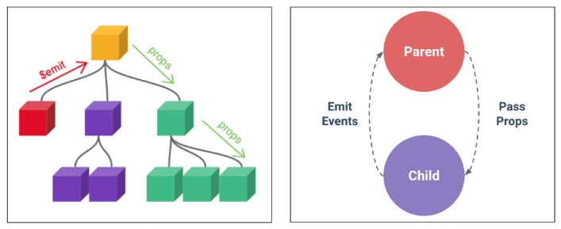
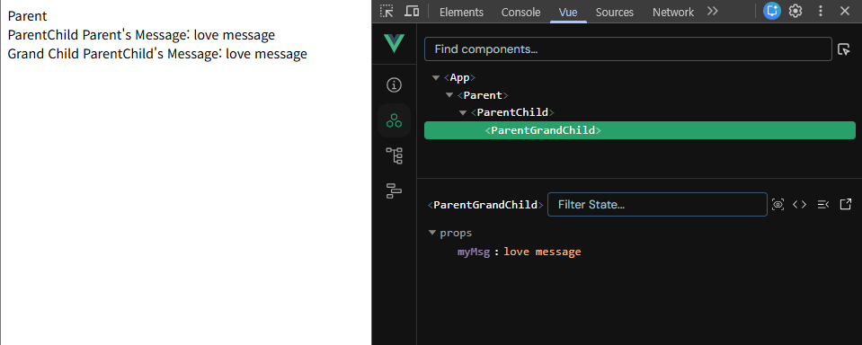
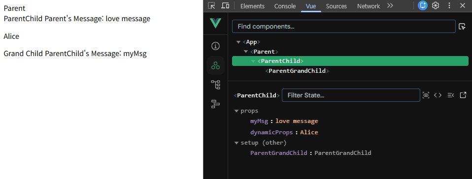
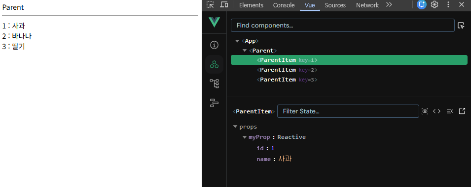
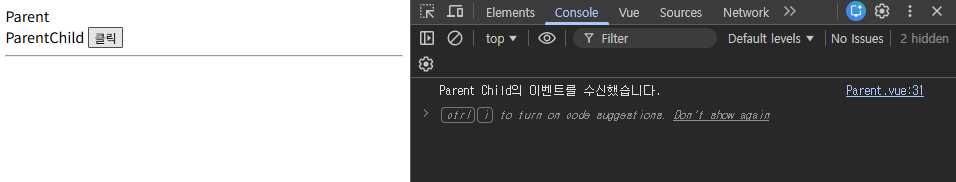
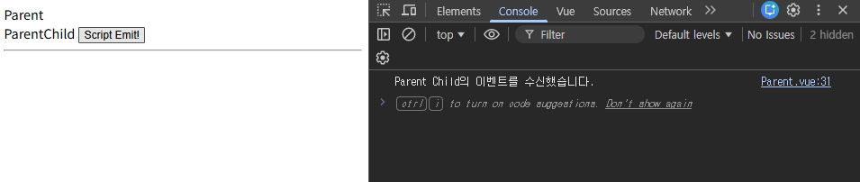
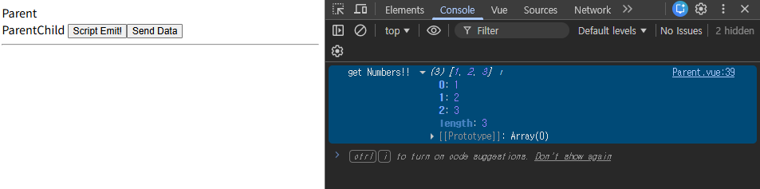

# Component State Flow (Props & Emit)


## 데이터 흐름도 요약

**[부모] -> [자식] : Props** (데이터 내려줌 / Pass Props)
**[자식] -> [부모] : Emit** (이벤트 올림 / Emit Events)

1. 부모는 자식에게 Props로 데이터를 준다. (자식은 이거 못 고침!)
2. 자식은 데이터 변경이 필요하면 Emit으로 부모에게 요청한다.
3. 부모가 신호를 받고 자신의 데이터를 변경한다.
4. 변경된 데이터가 다시 Props를 타고 자식에게 내려간다.


## Passing Props (부모 -> 자식)

### Props

- 부모 컴포넌트가 자식 컴포넌트에게 데이터를 전달할 때 사용하는 속성
- **하향식 단방향 바인딩** (One-way-down binding)
    - 자식 컴포넌트 내부에서 props를 변경 불가능! (**읽기 전용**)
    - 데이터 흐름의 일관성 및 예측 가능성을 높인다.
- 부모 컴포넌트가 업데이트될 때마다 이를 사용하는 자식 컴포넌트의 모든 props가 최신 값으로 자동 업데이트된다.
- 객체/배열 props는 자식에서 내부 값을 바꾸면 부모의 원본도 바뀐다.
- 부모는 자식에게 데이터를 전달한다 (Pass Props)
    - 직계 자식에게만 전달할 수 있다. 손주에게 직접 전달 불가능.
- 자식은 자신에게 일어난 일을 부모에게 알림 (Emit event)



### Props 선언

- 부모 컴포넌트: HTML 속성처럼 값을 전달한다.
    - Static Props: 고정된 값 전달 (`prop-name="값"`)
    - Dynamic Props: 변수 전달 (`:prop-name="변수"`) -> `v-bind` 사용

```html
<!-- Parent.vue -->

<template>
  <div>
    Parent
    <ParentChild my-msg="love message" />
  </div>
</template>
```

- 자식 컴포넌트: `defineProps()` 매크로를 사용하여 전달받은 props를 선언한다.
    - **문자열 배열**을 사용한 선언: 배열의 문자열 요소로 props의 이름을 사용한다.
    - **객체**를 사용한 선언 (권장): 객체 속성의 키가 전달받은 props 이름, 해당 데이터 타입을 값으로 작성한다.
        - 컴포넌트의 의도를 명확히 하여 가독성을 높이고, 다른 개발자가 잘못된 타입의 데이터를 전달했을 때 콘솔에 경고를 출력하여 실수를 방지한다.
        - 추가로 props에 대한 유효성 검사에 활용 가능

```html
<!-- ParentChild.vue -->

<template>
  <div>
    ParentChild
    Parent's Message: {{ myMsg }}
  </div>
</template>

<script setup>
	// 1. 문자열 배열을 사용한 선언
  // defineProps(['myMsg'])
  
  // 2. 객체를 사용한 선언
  defineProps({
    myMsg: String
  })
</script>
```

- ParentChild 컴포넌트에서 Parent로부터 받은 props를 다시 ParentGrandChild에게 전달

```html
<!-- ParentChild.vue -->

<template>
  <div>
    ParentChild
    Parent's Message: {{ myMsg }}
    <ParentGrandChild my-msg="myMsg" />
  </div>
</template>

<script setup>
  import ParentGrandChild from '@/components/ParentGrandChild.vue';
  defineProps({
    myMsg: String
  })
</script>
```

```html
<!-- ParentGrandChild.vue -->

<template>
  <div>
    Grand Child
    ParentChild's Message: {{ myMsg }}
  </div>
</template>

<script setup>
  defineProps({
    myMsg: String
  })
</script>
```



### Props 이름 컨벤션

- 부모 템플릿에서 전달 시 (HTML 속성): kebab-case (예: `my-message`)
- 자식 스크립트에서 선언 시 (JavaScript): camelCase (예: `myMessage`)
- Vue가 자동으로 변환해서 매핑해준다.

### Dynamic props

- v-bind를 사용하여 동적으로 할당된 props를 사용할 수 있다.
- vue의 ref()를 사용하려면 `import { ref } from 'vue'`를 선언해야 한다.

```html
<!-- Parent.vue -->

<template>
  <div>
    Parent
    <ParentChild my-msg="love message" :dynamic-prop="name" />
  </div>
</template>

<script setup>
  import ParentChild from '@/components/ParentChild.vue';
  import {ref} from 'vue'
  const name = ref('Alice')
</script>
```

```html
<!-- ParentChild.vue -->

<template>
  <div>
    ParentChild
    Parent's Message: {{ myMsg }}
    <p>{{ dynamicProps }}</p>
    <ParentGrandChild my-msg="myMsg" />
  </div>
</template>

<script setup>
  import ParentGrandChild from '@/components/ParentGrandChild.vue';
  defineProps({
    myMsg: String,
    dynamicProps: String
  })
</script>
```



### 정적/동적 props 주의사항

```html
<!-- 1. 정적 props - 문자열 "1" -->
<SomeComponent num-props="1" />

<!-- 2. 동적 props - 숫자 1 -->
<SomeComponent :num-props="1" />
```

- 첫 번째는 정적 props로 **문자열 “1”**을 전달한다.
- 두 번째는 동적 props로 **숫자 1**을 전달한다.

### Props 활용: `v-for`와 함께 사용하기

```html
<!-- Parent.vue -->

<template>
  <div>
    Parent
    <hr>
    <ParentItem 
      v-for="item in items" 
      :key="item.id" 
      :my-prop="item"  
    />
  </div>
</template>

<script setup>
  import {ref} from 'vue'
  import ParentItem from '@/components/ParentItem.vue';
  
  const items = ref([
    {id:1, name: '사과'},
    {id:2, name: '바나나'},
    {id:3, name: '딸기'},
  ])
</script>
```

```html
<!-- ParentItem.vue -->

<template>
  <div>
    <div>{{ myProp.id }} : {{ myProp.name }}</div>
  </div>
</template>

<script setup>
defineProps({
  myProp: Object
})
</script>
```



### Props 유효성 검사

- 필수 여부(`required`), 기본값(`default`), 유효성 검사 함수(`validator`) 등을 설정할 수 있다.

```js
// 자식 컴포넌트
defineProps({
  // 기본 타입 체크
  title: String,

  // 상세 옵션
  likes: {
    type: Number,
    default: 0,
    required: true
  },

  // 커스텀 유효성 검사
  status: {
    type: String,
    validator(value) {
      // 값이 이 세 가지 중 하나여야 함
      return ['success', 'warning', 'danger'].includes(value)
    }
  }
})
```

---

## Component Events - Emit (자식 -> 부모)

### Emit

- 자식 컴포넌트가 부모 컴포넌트에게 특정 이벤트가 발생했음을 알리고 데이터를 전달하는 메서드
- `$emit(event, ...args)`
    - `$`: vue 인스턴스의 내부 변수
    - `event`: 커스텀 이벤트 이름
    - `args`: 추가 인자

### 이벤트 발신 및 수신

- 자식 컴포넌트: `$emit`을 사용하여 템플릿 표현식에서 직접 사용자 정의 이벤트를 발신

```html
<!-- ParentChild.vue -->

<template>
  <div>
    <button @click="$emit('someEvent')">클릭</button>
  </div>
</template>
```

- 부모 컴포넌트: `v-on` (`@`) 디렉티브를 사용하여 자식의 이벤트를 수신

```html
<!-- Parent.vue -->

<template>
  <div>
    Parent
    <ParentChild my-msg="message" @some-event="someCallBack" />
  </div>
</template>

<script setup>
  import ParentChild from '@/components/ParentChild.vue';
  
  const someCallBack = function () {
    console.log('Parent Child의 이벤트를 수신했습니다.')
  }
</script>
```



### emit 이벤트 선언

- `defineEmits()`: 발신할 이벤트 선언
    - 배열을 활용한 선언
    - 객체를 활용한 선언 (권장)
        - 유효성 검사에 활용 가능
- `<script setup>` 내에서 이벤트를 발신하기 위한 emit 함수를 반환

```html
<!-- ParentChild.vue -->

<template>
  <div>
    ParentChild
    <!-- <button @click="$emit('someEvent')">클릭</button> -->
    <button @click="buttonClick">Script Emit!</button>
  </div>
</template>

<script setup>
  const emit = defineEmits(['someEvent'])

  const buttonClick = function () {
    emit('someEvent')
  }
</script>
```



### 이벤트 인자 전달

- ParentChild에서 이벤트를 발신하여 Parent로 추가 인자 전달하기

```html
<!-- ParentChild.vue -->

<template>
  <div>
    ParentChild
    <button @click="buttonClick">Script Emit!</button>
    <button @click="sendData">Send Data</button>
  </div>
</template>

<script setup>
  const emit = defineEmits(['someEvent', 'emitArgs'])

  const buttonClick = function () {
    emit('someEvent')
  }

  const sendData = function () {
    emit('emitArgs', 1, 2, 3)
  }
</script>
```

- ParentChild에서 발신한 이벤트를 Parent에서 수신
    - spread syntax (`…`)를 활용

```html
<!-- Parent.vue -->

<template>
  <div>
    Parent
    <ParentChild 
      my-msg="message" 
      @some-event="someCallBack" 
      @emit-args="getNumbers"
    />
  </div>
</template>

<script setup>
  import ParentChild from '@/components/ParentChild.vue';

  const someCallBack = function () {
    console.log('Parent Child의 이벤트를 수신했습니다.')
  }

  const getNumbers = function (...number) {
    console.log('get Numbers!!', number)
  }
</script>

```



### 실습: 최하단 컴포넌트에서 최상위 데이터 변경 요청하기

```html
<!-- ParentGrandChild.vue -->

<template>
  <div>
    <button @click="updateName">GrandChild Update Name</button>
  </div>
</template>

<script setup>
  const emit = defineEmits(['updateName'])
  const updateName = function() {
    emit('updateName')
  }
</script>
```

```html
<!-- ParentChild.vue -->

<template>
  <div>
    ParentChild
    <ParentGrandChild @update-name="updateName" />
  </div>
</template>

<script setup>
  import ParentGrandChild from '@/components/ParentGrandChild.vue';

  const emit = defineEmits(['updateName'])
  const updateName = function () {
    emit('updateName')
  }
</script>
```

```html
<!-- Parent.vue -->

<template>
  <div>
    Parent's Name : {{ name }}
    <ParentChild 
      @update-name="updateName"
    />
  </div>
</template>

<script setup>
  import {ref} from 'vue'
  import ParentChild from '@/components/ParentChild.vue';
  
  const name = ref('Alice')

  const updateName = function () {
    name.value = 'Bella'
  }
</script>
```

### Emit 유효성 검사

```js
const emit = defineEmits({
  // 유효성 검사 없음
  click: null,

  // submit 이벤트의 payload 검사
  submit: ({ email, password }) => {
    if (email && password) {
      return true
    } else {
      console.warn('이메일과 비번이 없습니다!')
      return false
    }
  }
})
```
