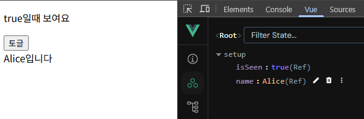
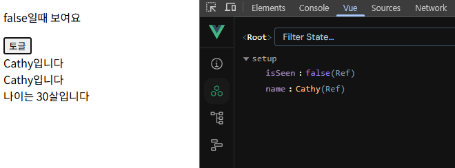
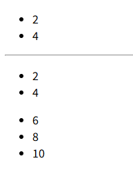
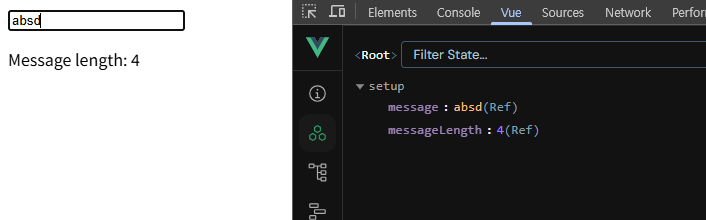
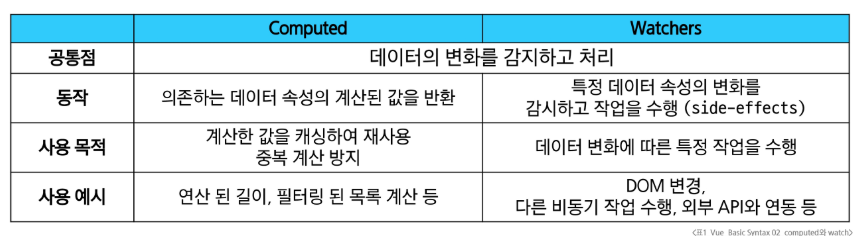
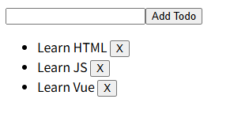

# [Vue.js] 반응형 로직과 생명주기

## Computed Property

### Computed() 함수와 특징

- **계산된 속성**을 정의하는 함수
- 미리 계산된 속성을 만들어 템플릿의 표현식을 단순하게 하고, 불필요한 연산을 줄여준다.
- 한 번 계산된 값은 캐싱(임시 저장)되어, 의존하는 데이터가 바뀌기 전까지는 다시 계산하지 않는다.

```html
<div id="app">
  <h2>남은 할 일</h2>
  <p>{{ restOfTodos }}</p>
</div>

<script src="https://unpkg.com/vue@3/dist/vue.global.js"></script>
<script>
  const { createApp, ref, computed } = Vue

  const app = createApp({
    setup() {
      const todos = ref([
        { text: 'Vue 실습' },
        { text: '자격증 공부' },
        { text: 'TIL 작성' }
      ])

      const restOfTodos = computed(() => {
        return todos.value.length > 0 ? '아직 남았다' : '퇴근!'
      })
	    
	    ...
```

- 값을 사용할 때는 괄호를 제거한다.
- 반환되는 값은 계산된 ref(computed ref)이며, 일반 ref와 유사하게 계산된 결과를 .value로 참조 가능
    - 템플릿에서는 .value 생략 가능
- computed 속성은 의존된 반응형 데이터를 자동으로 추적
- 의존하는 반응형 데이터가 변경될 때만 재평가
    - restOfTodos의 계산은 todos에 의존하고 있다.
    - 따라서 todos가 변경될 때만 restOfTodos가 업데이트된다.

### computed 주의사항

- computed 반환 값은 변경하지 말 것
    - computed의 반환 값은 이미 의존하는 데이터에 의해 계산이 완료된 값이다.
    - 계산된 값은 읽기 전용으로 취급되어야 하며, 변경되어서는 안 된다.
    - 새 값을 얻기 위해서는 의존하는 데이터를 업데이트 해야 한다.
- computed 사용 시 원본 배열은 변경하지 말 것
    - 원본 배열을 변경하는 메서드를 사용할 때에는 반드시 원본 배열의 복사본을 만들어 처리해야 한다.
    - 변화 메서드: push, pop, shift, unshift, splice, sort, reverse
    - 배열 교체 메서드: filter, concat, slice
- computed 값에 직접 값을 할당하면, 기본적으로 경고가 발생하며 값이 변경되지 않는다.

### Computed vs Methods

```jsx
// computed 예시
<p>{{ restOfTodos }}</p>

const { createApp, ref, computed } = Vue
const restOfTodos = computed(() => {
  return todos.value.length > 0 ? '아직 남았다' : '퇴근!'
})

// method 예시
<p>{{ getRestOfTodos() }}</p>

const getRestOfTodos = function () {
  return todos.value.length > 0 ? '아직 남았다' : '퇴근!'
}
```

- computed 속성 대신 method로도 동일한 기능을 정의할 수 있다.
- 템플릿에서 computed는 괄호 없이, method는 괄호를 붙여 호출한다.
- computed
    - computed 속성은 의존하는 반응형 데이터를 기반으로 그 결과를 캐시(cached), 의존하는 데이터가 변경된 경우에만 재평가한다.
    - 의존하는 데이터가 변경되지 않는 한, 해당 computed 속성에 여러 번 접근해도 함수를 다시 실행하지 않고 캐시된 결과를 즉시 반환한다.
    - 의존하는 데이터에 따라 결과가 바뀌는 계산된 속성을 만들 때 유용하다.
    - 동일한 의존성을 가진 여러 곳에서 사용할 때 계산 결과를 캐싱하여 중복 계산 방지
- method
    - method 호출은 다시 렌더링이 발생할 때마다 항상 함수를 실행한다.
    - 단순히 특정 동작을 수행하는 함수를 정의할 때 사용한다.
    - 데이터에 의존하는지 여부와 관계없이 항상 동일한 결과를 반환하는 함수
    - 계산에 인자가 필요하다면, computed가 아닌 method를 사용해야 한다.

### 캐시 (Cache)

- 데이터나 결과를 일시적으로 저장해두는 임시 저장소
- 데이터를 요청할 때 먼저 캐시를 확인하고, 없을 경우에만 원본 데이터에 접근하여 가져온 뒤 캐시에 저장한다.

---

## Conditional Rendering

### v-if

- `v-if`, `v-else-if`, `v-else`
- 특정 조건이 true일 때만 HTML 요소를 화면에 보여주도록 하는 Directive
- 조건이 false이면, 해당 요소는 DOM에서 완전히 제거되어 보이지 않게 된다.
    - 조건에 해당되지 않는 코드는 생성되지 않는다.
- 사용자의 로그인 상태에 따라 다른 메뉴를 보여주거나, 특정 상황에만 경고 메시지를 표시하는 등 조건부 렌더링에 사용된다.
- `<template>` 요소에 `v-if`를 사용하면, 여러 요소를 하나의 조건부 블록으로 묶을 수 있다.

```html
<div id="app">
  <!-- if else -->
  <p v-if="isSeen">true일때 보여요</p>
  <p v-else>false일때 보여요</p>
  <button @click="isSeen = !isSeen">토글</button>

  <!-- else if -->
  <div v-if="name === 'Alice'">Alice입니다</div>
  <div v-else-if="name === 'Bella'">Bella입니다</div>
  <div v-else-if="name === 'Cathy'">Cathy입니다</div>
  <div v-else>아무도 아닙니다.</div>

  <!-- v-if on <template> -->
  <template v-if="name === 'Cathy'">
    <div>Cathy입니다</div>
    <div>나이는 30살입니다</div>
  </template>

  <!-- v-show -->
  <div v-show="isShow">v-show</div>
</div>

<script src="https://unpkg.com/vue@3/dist/vue.global.js"></script>
<script>
  const { createApp, ref } = Vue

  const app = createApp({
    setup() {
      const isSeen = ref(true)
      const name = ref('Cathy')
      const isShow = ref(false)

      return {
        isSeen,
        name
      }
    }
  })

  app.mount('#app')
</script>
```





### v-show

- 표현식 값의 true/false를 기반으로 요소의 가시성을 전환
- 조건이 false이면, 해당 요소는 CSS의 `display: none;` 으로 설정되어 화면에서만 보이지 않게 숨긴다.
    - 조건과 관계없이 항상 DOM에 렌더링된다.
- 초기 렌더링 비용이 높기 때문에, 콘텐츠를 자주 전환해야 하는 경우에 적합

---

## List Rendering

### v-for (배열/객체 순회)

- 소스 데이터를 기반으로 요소 또는 템플릿 블록을 반복 렌더링
- `alias in expression`
- 객체는 key-value 쌍으로 이루어져 있어, value, key, index를 조합하여 순회할 수 있다.

```html
<!-- 가장 기본적인 구조 -->
<div v-for="(item, index) in arr"></div>

<!-- 값만 순회 -->
<div v-for="value in object"></div>

<!-- 값과 키를 순회 -->
<div v-for="(value, key) in object"></div>

<!-- 값과 키, 인덱스를 순회 -->
<div v-for="(value, key, index) in object"></div>
```

### v-for with key

- key: 각 항목을 고유하게 식별할 수 있는 문자열(string)이나 숫자(number)
    - 데이터베이스의 고유 ID, 항목 고유 식별자 (예: UUID), 시간 등
- Vue의 내부 가상 DOM 알고리즘이 이전 목록과 새 노드 목록을 비교할 때 각 node를 식별하는 용도로 사용
    - 변경 시에도 올바른 항목만 효율적으로 업데이트할 수 있다.
- **반드시 v-for와 key를 함께 사용한다.**
    - 내부 컴포넌트의 상태를 일관되게 하여 데이터의 예측 가능한 행동을 유지하기 위함

### v-for with v-if

- **문제**: v-if가 v-for보다 우선순위가 높기 때문에, v-for 범위의 데이터를 v-if에서 사용할 수 없다.
- **해결**: computed 활용
    - 이미 필터링된 목록을 반환하여 반복하도록 설정
- **해결**: v-for와 <template> 요소 활용
    - v-for와 <template> 요소를 사용하여 v-if 위치를 이동

```html
<!-- [Bad] v-for with v-if -->
<ul>
  <li v-for="todo in todos" v-if="!todo.isComplete" :key="todo.id">
    {{ todo.name }}
  </li>
</ul>

<!-- [Good] v-for with v-if (computed)-->
<ul>
  <li v-for="todo in completeTodos" :key="todo.id">
    {{ todo.name }}
  </li>
</ul>

<!-- [Good] v-for with v-if -->
<ul>
  <template v-for="todo in todos" :key="todo.id">
    <li v-if="!todo.isComplete">
      {{ todo.name }}
    </li>
  </template>
</ul>

...
const completeTodos = computed(() => {
  return todos.value.filter((todo) => !todo.isComplete)
})

return {
  todos,
  completeTodos
}
```

### 배열을 활용한 필터링/정렬

- 원본 데이터를 수정하거나 교체하지 않고 필터링하거나 정렬된 새로운 데이터를 표시하는 방법
- **computed 활용:** 원본 기반으로 필터링된 새로운 결과를 생성한다.
- **method 활용**: computed가 불가능한 중첩된 v-for의 경우, 매개변수가 필요한 경우

```html
<!-- v-for와 배열을 활용해 “필터링/정렬” 활용하기 -->
<div id="app">
  <!-- 1. computed 활용 -->
  <!-- 단순 배열의 필터링/정렬에 적합 -->
  <ul>
    <li v-for="number in evenNumbers">
      {{ number }}
    </li>
  </ul>

  <hr>

  <!-- 2. method (computed가 불가능한 중첩된 v-for 경우) -->
  <!-- 중첩된 v-for에서 사용 / 매개변수가 필요한 경우 사용 -->
  <ul v-for="numbers in numberSets">
    <li v-for="num in evenNumberSets(numbers)">
      {{ num }}
    </li>
  </ul>
</div>

<script src="https://unpkg.com/vue@3/dist/vue.global.js"></script>
<script>
  const { createApp, ref, computed } = Vue

  const app = createApp({
    setup() {
      const numbers = ref([1, 2, 3, 4, 5])
      const numberSets = ref([
        [1, 2, 3, 4, 5],
        [6, 7, 8, 9, 10]
      ])

      // computed를 사용한 짝수 필터링
      const evenNumbers = computed(() => {
        return numbers.value.filter((number) => number % 2 === 0)
      })

      // method를 사용한 짝수 필터링
      const evenNumberSets = function (numbers) {
        return numbers.filter((number) => number % 2 === 0)
      }

      return {
        numberSets,
        evenNumbers,
        evenNumberSets
      }
    }
  })

  app.mount('#app')
</script>
```



---

## Watchers

### watch() 함수

- 하나 이상의 반응형 데이터(ref)를 감시하고, 감시하는 데이터가 변경되면 콜백 함수를 호출한다.
- 배열을 활용하여 여러 대상을 감시할 수 있다.
    - 콜백의 인자(newValue, oldValue)도 같은 순서의 배열로 전달된다.
    - 배열 속 ref(객체)의 내부까지 감시하려면 `{deep: true}`옵션을 추가로 설정해야 한다.
- 데이터가 바뀔 때 특정 행동(side effect)을 수행하기 위해 사용한다.

```jsx
watch(source, (newValue, oldValue) => {
	// do something
}
```

- `source`: watch가 감시하는 대상
    - 반응형 변수, 값을 반환하는 함수 등
- callback function: source가 변경될 때 호출되는 콜백 함수
    - `newValue`: 감시하는 대상이 변화된 값
    - `oldValue`(optional): 감시하는 대상의 기존 값

```html
<div id="app">
  <input v-model="message">
  <p>Message length: {{ messageLength }}</p>
</div>

<script>
  const { createApp, ref, watch } = Vue

  const app = createApp({
    setup() {
      const message = ref('')
      const messageLength = ref(0)

      watch(message, (newValue, oldValue) => {
        messageLength.value = newValue.length
      })

      return {
        message,
        messageLength
      }
    }
  })
  app.mount('#app')
</script>

```



### computed vs watch

- computed와 watch 모두 의존(감시)하는 원본 데이터를 직접 변경하지 않는다.



---

## Lifecycle Hooks

### Lifecycle Hooks


- Vue  컴포넌트가 생성되고, DOM에 마운트되고, 업데이트되고, 소멸되는 각 생애주기 단계에서 실행되도록 제공되는 함수
- 개발자는 컴포넌트의 특정 시점에 원하는 로직을 실행할 수 있다.

### 주요 훅: onMounted, onUpdated

- `onMounted`: Vue 컴포넌트 인스턴스가 초기 렌더링 및 DOM 요소 생성이 완료된 후 특정 로직을 수행하기
- `onUpdated`: 반응형 데이터의 변경으로 인해 컴포넌트의 DOM이 업데이트된 후 특정 로직을 수행하기

```html
<!-- Lifecycle hooks를 활용한 Cat 애플리케이션 -->
<!-- mounted 시점에 api 요청하면서 애플리케이션 시작하기 -->
<div id="app">
  <button @click="getCatImage">냥냥펀치</button>
</div>

<script src="https://cdn.jsdelivr.net/npm/axios/dist/axios.min.js"></script>
<script src="https://unpkg.com/vue@3/dist/vue.global.js"></script>
<script>
  const { createApp, ref, onMounted } = Vue
  
  const app = createApp({
    setup() {
      const getCatImage = function () {
      const URL = 'https://api.thecatapi.com/v1/images/search'
      
        axios({
          method: 'get',
          url: URL,
        })
          .then((response) => {
            imgUrl = response.data[0].url
            return imgUrl
          })
          .then((imgData) => {
            imgElem = document.createElement('img')
            imgElem.setAttribute('src', imgData)
            document.body.appendChild(imgElem)
          })
          .catch((error) => {
            console.log('실패했다옹')
          })
      }

      // mounted 시점에 api 요청하기
      onMounted(() => {
        getCatImage()
      })

      return { getCatImage }
    }
  })

  app.mount('#app')
</script>
```


### Lifecycle Hooks 주의사항

- Lifecycle Hooks는 반드시 동기적으로 작성해야 한다.
    - Vue는 컴포넌트가 초기화될 때 모든 Hooks를 한 번에 스캔하고 준비하기 때문
- 비동기(예: setTimeout)로 훅을 등록하려고 하면, 이미 Lifecycle 단계가 지나간 후에 hooks를 설정하는 상황이 생긴다.
    - Vue는 해당 훅을 인식하지 못하며 원래 의도한 타이밍에 실행되지 않게 된다.

---

## 실습: Todo 애플리케이션 구현

- v-model, v-on, v-bind, v-for 활용

```html
<body>
  <!-- v-model, v-on, v-bind, v-for를 활용한 todo 애플리케이션 구현 -->
  <div id="app">
    <form @submit.prevent="addTodo">
      <input v-model="newTodo">
      <button>Add Todo</button>
    </form>
    <ul>
      <li v-for="todo in todos" :key="todo.id">
        {{ todo.text }}
        <button @click="removeTodo(todo)">X</button>
      </li>
    </ul>
  </div>

  <script src="https://unpkg.com/vue@3/dist/vue.global.js"></script>
  <script>
    const { createApp, ref } = Vue

    const app = createApp({
      setup() {
        let id = 0

        const newTodo = ref(null)
        const todos = ref([
          { id: id++, text: 'Learn HTML' },
          { id: id++, text: 'Learn JS' },
          { id: id++, text: 'Learn Vue' }
        ])

        // 새로운 Todo 항목을 추가하는 함수
        const addTodo = function () {
          // todos 배열에 새로운 Todo 객체 추가
          todos.value.push({ id: id++, text: newTodo.value })
          // 입력 필드 초기화
          newTodo.value = null
        }

        // 선택한 Todo 항목을 삭제하는 함수
        const removeTodo = function (selectedTodo) {
          // filter를 사용하여 선택한 Todo를 제외한 새로운 배열 생성
          todos.value = todos.value.filter((todo) => todo !== selectedTodo)
        }

        return {
          newTodo,
          todos,
          addTodo,
          removeTodo
        }
      }
    })

    app.mount('#app')
  </script>
</body>
```



