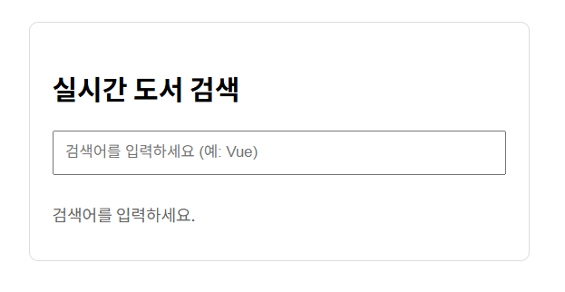
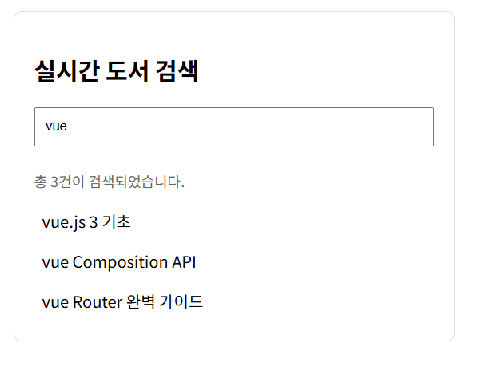

# [Vue.js] 반응형 로직 (Computed, Watch) 활용

## Todo 애플리케이션 구현

- v-model, v-on, v-bind, v-for 활용

```html
<body>
  <!-- v-model, v-on, v-bind, v-for를 활용한 todo 애플리케이션 구현 -->
  <div id="app">
    <form @submit.prevent="addTodo">
      <input v-model="newTodo">
      <button>Add Todo</button>
    </form>
    <ul>
      <li v-for="todo in todos" :key="todo.id">
        {{ todo.text }}
        <button @click="removeTodo(todo)">X</button>
      </li>
    </ul>
  </div>

  <script src="https://unpkg.com/vue@3/dist/vue.global.js"></script>
  <script>
    const { createApp, ref } = Vue

    const app = createApp({
      setup() {
        let id = 0

        const newTodo = ref(null)
        const todos = ref([
          { id: id++, text: 'Learn HTML' },
          { id: id++, text: 'Learn JS' },
          { id: id++, text: 'Learn Vue' }
        ])

        // 새로운 Todo 항목을 추가하는 함수
        const addTodo = function () {
          // todos 배열에 새로운 Todo 객체 추가
          todos.value.push({ id: id++, text: newTodo.value })
          // 입력 필드 초기화
          newTodo.value = null
        }

        // 선택한 Todo 항목을 삭제하는 함수
        const removeTodo = function (selectedTodo) {
          // filter를 사용하여 선택한 Todo를 제외한 새로운 배열 생성
          todos.value = todos.value.filter((todo) => todo !== selectedTodo)
        }

        return {
          newTodo,
          todos,
          addTodo,
          removeTodo
        }
      }
    })

    app.mount('#app')
  </script>
</body>
```


---

## 실시간 검색 기능 구현

- 사용자가 검색어를 입력할 때마다 `watch`가 이를 감지하고, 가상의 API를 호출하여 결과를 가져오는 패턴으로 구현
- **디바운싱 (Debouncing, 입력 대기)**: 사용자가 타자를 칠 때마다 API를 호출하는 것을 막고, 입력이 끝난 후(0.5초 뒤) 한 번만 요청하도록 한다. 서버 부하를 줄이기 위해 필수!
- **Promise(프로미스):** 자바스크립트에서 "미래에 완료될 작업의 결과"를 담는 객체
    - 나중에 작업이 끝나면 "성공(resolve)"하거나 "실패(reject)"했다는 신호를 주겠다는 약속
- `setTimeout()`: "1초 뒤에 안쪽의 화살표 함수(`() => { ... }`)를 실행해줘"
- `resolve(results)`: Promise의 성공 버튼. 함수를 호출했던 곳으로 results 데이터가 전달된다.

```html
<!DOCTYPE html>
<html lang="en">
<head>
  <meta charset="UTF-8">
  <meta name="viewport" content="width=device-width, initial-scale=1.0">
  <title>Document</title>
  <script src="https://unpkg.com/vue@3/dist/vue.global.js"></script>
  <style>
    body {
      font-family: sans-serif;
      padding: 20px;
    }

    .search-container {
      max-width: 400px;
      margin: 0 auto;
      border: 1px solid #ddd;
      padding: 20px;
      border-radius: 8px;
    }

    input {
      width: 100%;
      padding: 10px;
      margin-bottom: 10px;
      box-sizing: border-box;
    }

    .status {
      color: #666;
      font-size: 0.9rem;
      margin-bottom: 10px;
    }

    .loading {
      color: blue;
      font-weight: bold;
    }

    .result-list {
      list-style: none;
      padding: 0;
      margin: 0;
    }

    .result-list li {
      padding: 8px;
      border-bottom: 1px solid #eee;
    }

    .result-list li:last-child {
      border-bottom: none;
    }
  </style>
</head>
<body>
  
  <div id="app">
    <div class="search-container">
      <h2>실시간 도서 검색</h2>

      <input type="text" v-model="searchQuery" placeholder="검색어를 입력하세요 (예: Vue)" />

      <p class="status"> {{ statusMessage }} </p>

      <div v-if="isLoading" class="loading">
        데이터를 불러오는 중입니다...
      </div>

      <ul v-else class="result-list">
        <li v-for="(item, index) in searchResults" :key="index">
          {{ item }}
        </li>
      </ul>
    </div>
  </div>

  <script>
    const { createApp, ref, watch } = Vue

    createApp({
      setup() {
        const searchQuery = ref('')
        const searchResults = ref([])
        const isLoading = ref(false)
        const statusMessage = ref('검색어를 입력하세요.')

        // 가상의 API 호출 함수 (비동기 시뮬레이션)
        const fetchSearchResults = async (query) => {
          return new Promise((resolve) => {
            setTimeout(() => {
              const mockData = [
                'vue.js 3 기초',
                'vue Composition API',
                'vue Router 완벽 가이드',
                'Vite로 시작하는 웹 개발',
                'JavaScript 심화'
              ]
              // 검색어가 포함된 항목만 필터링
              const results = mockData.filter(item =>
                item.toLowerCase().includes(query.toLowerCase())
              )
              resolve(results)
            }, 1000) // 1초 지연
          })
        }

        // Watcher 정의
        let timer = null

        watch(searchQuery, (newQuery) => {
          // 검색어가 없으면 초기화
          if (newQuery.trim() === '') {
            searchResults.value = []
            statusMessage.value = '검색어를 입력하세요.'
            return
          }

          // 디바운싱: 이전 타이머가 있다면 취소 (연속 입력 방지)
          if (timer) clearTimeout(timer)

          isLoading.value = true
          statusMessage.value = '검색 중 ...'

          // 0.5초 뒤에 API 호출 실행
          timer = setTimeout(async () => {
            try {
              const data = await fetchSearchResults(newQuery)
              searchResults.value = data

              if (data.length === 0) {
                statusMessage.value = '검색 결과가 없습니다.'
              } else {
                statusMessage.value = `총 ${data.length}건이 검색되었습니다.`
              }
            } catch (error) {
              statusMessage.value = '오류가 발생했습니다.'
              console.error(error)
            } finally {
              isLoading.value = false
            }
          }, 500)
        })

        return {
          searchQuery,
          searchResults,
          isLoading,
          statusMessage
        }
      }
    }).mount('#app')
  </script>
</body>
</html>
```



