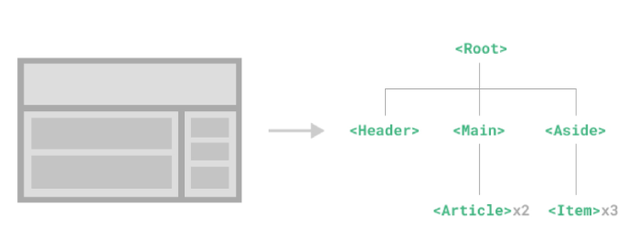
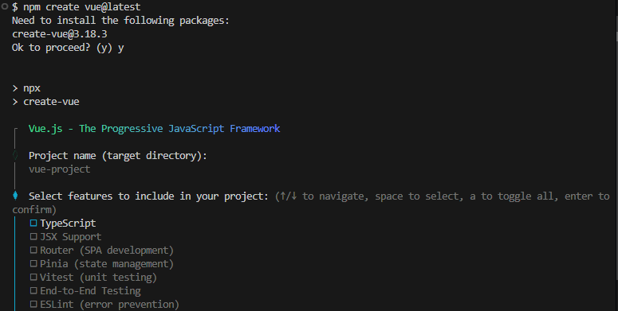
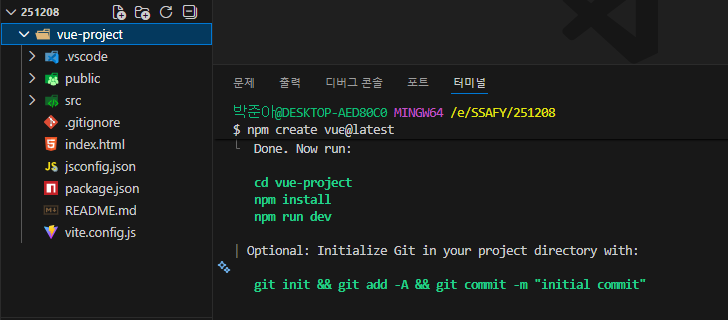
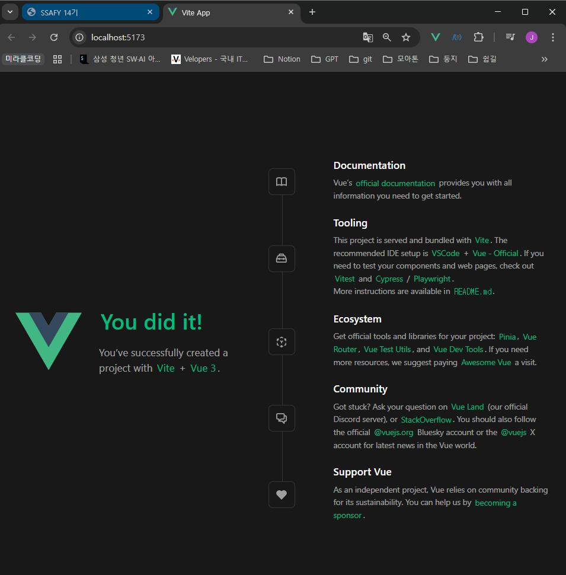
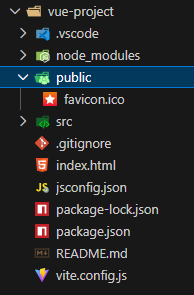
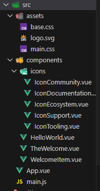
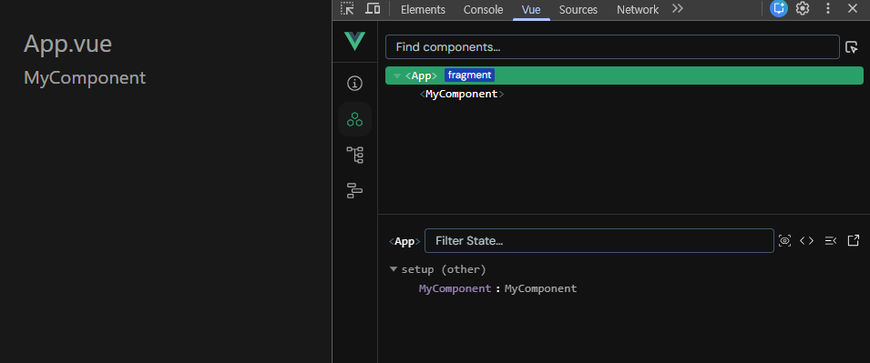
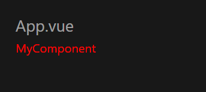

# Vue.js의 컴포넌트 구조: Single File Components (SFC)

## SFC (Single File Components)

### Component

- 웹 페이지를 구성하는 재사용 가능한 UI, 코드 블록
- UI를 독립적이고 재사용 가능한 일부분으로 분할하고 각 부분을 개별적으로 다룰 수 있다.
- 애플리케이션은 중첩된 component의 트리 형태로 구성된다.



### Single-File Components

- 컴포넌트의 템플릿, 로직 및 스타일을 하나의 파일로 묶어낸 특수한 파일 형식
- 하나의 `.vue`파일 안에 컴포넌트의 HTML, CSS, JavaScript 코드를 모두 담는 Vue의 개발 방식

### SFC 구성요소

- `<template>`: 화면 구조 HTML
    - 각 `.vue` 파일은 최상위 <template> 블록을 하나만 포함할 수 있다.
- `<script>`: 로직 JS
    - `<script setup>`: 컴포넌트의 setup() 함수로 사용, 컴포넌트의 각 인스턴스에 대해 실행된다.
    - 각 `.vue` 파일은 최상위 `<script setup>`블록을 하나만 포함할 수 있다.
- `<style>`: 스타일 CSS
    - 여러 <style> 태그가 포함될 수 있다.
    - `<style scoped>`: 현재 컴포넌트에만 CSS가 적용된다.
- 언어 블록은 독립된 형태이므로 작성 순서는 상관없다.
    - 일반적으로 template → script → style 순서로 작성한다.

---

## Vue 프로젝트 환경

### Vite

- 프론트엔드 개발을 위한 빌드 도구
- 개발 서버의 시작 속도가 빠르다.
    - 코드 수정 시 즉각적으로 반영된다.
- 개발 시, 필요할 때만 파일을 요청해 속도를 높이고
배포 시, 최적화된 파일로 묶어주는(번들링) 역할을 수행한다.

### Build

- 프로젝트의 소스 코드를 최적화하고 번들링하여 배포할 수 있는 형식으로 변환하는 과정
    - 번들링: 여러 개로 흩어진 코드 파일을 하나로 합쳐주는 작업
- 개발 중에 사용되는 여러 소스 파일 및 리소스(JavaScript, CSS, 이미지 등)를 최적화된 형태로 조합하여 최종 소프트웨어 제품을 생성하는 것

### Vue Project 생성하기

- Vue Project (Application) 생성: Vite 기반 빌드

```bash
$ npm create vue@latest
```





### Vue Project 서버 실행하기

- 프로젝트 폴더 이동 후 패키지 설치

```bash
# 프로젝트 폴더로 이동
$ cd vue-project

# 패키지 설치
$ npm install

# vue 프로젝트 서버 실행
$ npm run dev
```



서버 실행 화면

- `npm install` 패키지 설치
    - 항상 프로젝트 루트 디렉토리에서 실행할 것!
- npm (Node Package Manager): Node.js의 기본 패키지 관리자
    - 프로젝트에 사용된 모든 패키지들의 목록과 버전을 `package.json` 파일에 기록하여 다른 사람과 협업하거나 다른 환경에서 작업할 때도 동일한 개발 환경을 쉽게 구축할 수 있도록 도와준다.

### Node.js

- Server-side 실행 환경: 브라우저 안에서만 동작할 수 있었던 JavaScript를 브라우저가 아닌 서버 측에서도 실행할 수 있게 함
    - 프론트엔드와 백엔드에서 동일한 언어로 개발할 수 있게 되었다.
- npm을 활용해 오픈 소스 패키지와 라이브러리를 제공한다.

### 모듈 (Module)

- 프로그램을 구성하는 독립적인 코드 블록
- `.js` 파일 하나가 하나의 모듈
- 애플리케이션이 발전함에 따라 성능 병목 현상 발생
- 모듈 간의 의존성이 깊어지면서 특정한 곳에서 발생한 문제가 어떤 모듈 간의 문제인지 파악하기 어려워짐

### 번들러 (Bundler)

- 여러 모듈과 파일의 의존성 관계를 파악해서 필요한 내용을 하나의 파일로 묶어준다.
    - 복잡하고 깊은 모듈 간 의존성 문제를 해결
- 브라우저가 수많은 파일을 각각 요청하여 생기는 네트워크 부담을 줄이고, 코드를 브라우저가 이해할 수 있는 형태로 변환해준다.
- 웹사이트의 로딩 속도를 높이고 성능을 최적화하는 역할
- 의존성 관리, 코드 최적화, 리소스 관리
- import하지 않은 코드는 ‘트리 쉐이킹’을 통해 최종 번들 파일에서 자동으로 제거된다.

---

## Vue 프로젝트 구조

### `public/`

- 주로 다음 정적 파일을 포함한다.
    - favicon.ico, robots.txt, sitemap.xml 등
    - 소스코드에서 참조되지 않는 코드: 번들러로 합쳐질 필요가 없는 파일
    - 항상 같은 이름을 갖는 코드
    - import 할 필요 없는 코드
- 항상 root 절대 경로를 사용하여 참조한다.



### `src/`

- `src/assets/`
    - 프로젝트 내에서 사용되는 정적 자원 (이미지, 폰트, 스타일 시트 등)을 관리
    - 컴포넌트 자체에서 참조하는 내부 파일을 저장
    - 컴포넌트가 아닌 곳에서는 public 디렉토리에 위치한 파일을 사용
- `src/components/`
    - 프로젝트의 주요 소스 코드를 포함하는 곳
    - 컴포넌트, 스타일, 라우팅 등 프로젝트의 핵심 코드를 관리한다.
- `src/App.vue`
    - Vue 앱의 Root 컴포넌트
    - 다른 하위 컴포넌트들을 포함한다.
    - 애플리케이션 전체의 레이아웃과 공통적인 요소를 정의
- `src/main.js`
    - Vue 애플리케이션을 초기화하고, App.vue를 DOM에 마운트하는 시작점
    - 필요한 라이브러리를 import하고 전역 설정을 수행



```jsx
// src/main.js

import './assets/main.css'

import { createApp } from 'vue'
import App from './App.vue'

createApp(App).mount('#app')

```

### `index.html`

- Vue 앱의 기본 HTML 파일
    - 실제로 유저가 받는 HTML 파일
- main.js에서 App.vue 컴포넌트를 렌더링하고, index.html 특정 위치를 마운트 시킨다.
    - Vue 앱이 SPA (Single Page Application)인 이유
- 필요한 스타일 시트, 스크립트 등의 외부 리소스 (예: bootstrap CDN)를 로드할 수 있다.

```html
<!-- index.html -->

<!DOCTYPE html>
<html lang="">
  <head>
    <meta charset="UTF-8">
    <link rel="icon" href="/favicon.ico">
    <meta name="viewport" content="width=device-width, initial-scale=1.0">
    <title>Vite App</title>
  </head>
  <body>
    <div id="app"></div>
    <script type="module" src="/src/main.js"></script>
  </body>
</html>

```

### 기타 설정 파일

- `jsconfig.json`: 컴파일 옵션, 모듈 시스템 등 설정
- `vite.config.js`: Vite 프로젝트 설정 파일
    - 플러그인, 빌드 옵션, 개발 서버 설정 등

### `package.json`

- 프로젝트에 관한 기본 정보와 패키지 의존성을 정의하는 메타데이터 파일
    - 프로젝트 이름, 버전, 스크립트 명령, 패키지 의존성 등
- `npm install` 실행 시, 패키지 설치의 기준을 제공한다.
    - 의존성 (Dependencied) 목록: 어떤 패키지를 사용하는지 어떤 버전 범위를 허용하는지를 기록

### `package-lock.json`

- `package.json`을 기반으로 실제 설치된 패키지들의 **정확한 버전 정보**를 기록하는 파일
- 다른 환경에서도 동일한 패키지 구성을 재현할 수 있게 한다.
- `npm install` 결과가 반영되어 매번 자동 업데이트된다.
    - 직접 수정하지 않는다.

### `node_modules/`

- `package.json`과 `package-lock.json`에 따라 실제로 설치된 모든 패키지가 저장되는 곳
- 프로젝트 실행 시 필요한 모든 라이브러리와 코드 파일을 보관한다.
- `npm install`을 통해 설치된 모든 패키지(모듈)들이 실제로 저장된다.
    - 직접 수정하지 않는다. 필요 시 `npm install`로 언제든 재생성 가능하다.
- 용량이 매우 크기 때문에 `.gitignore`에 포함한다.
- 패키지 버전 충돌이나 이상 동작이 의심될 때는 `node_modules/` 폴더를 삭제하고 다시 `npm install`을 실행한다.

---

## 컴포넌트 기본 사용법

### Vue Component 등록하기

**1. App.vue 초기화**

```html
<!-- src/App.vue -->

<template>
  <h1>App.vue</h1>
</template>

<script setup>
</script>

<style scoped>
</style>
```

**2. 컴포넌트 파일 생성**

- `vbase-3-setup` 키워드로 기본 뼈대를 생성할 수 있음

```html
<!-- src/components/MyComponent.vue -->
 
<template>
  <div>
    <h2>MyComponent</h2>
  </div>
</template>

<script setup>
</script>

<style scoped>
</style>
```

**3. 컴포넌트 등록**

- App (부모) - MyComponent (자식) 관계 형성
- `@`는 `src/` 경로를 의미한다.

```html
<!-- src/App.vue -->

<template>
  <h1>App.vue</h1>
  <!-- 2. 컴포넌트 사용 -->
  <MyComponent />
</template>

<script setup>
// 1. 컴포넌트 import
import MyComponent from '@/components/MyComponent.vue'
</script>

<style scoped>
</style>
```



### Composition API vs Option API

| 스타일 | Composition API | Option API |
| --- | --- | --- |
| 작성 방식 | import해서 가져온 API 함수들을 사용하여 컴포넌트의 로직을 정의 | data, methods 및 mounted 같은 객체를 사용하여 컴포넌트의 로직을 정의 |
| 버전 | Vue3 | Vue2 (Vue3에서도 지원) |
| 활용 | 규모가 있는 앱의 전체를 구축하려는 경우 | 빌드 도구를 사용하지 않거나 복잡성이 낮은 프로젝트에서 사용하려는 경우 |

---

## 참고 사항

### Single Root Element

- 모든 컴포넌트에는 최상단 HTML 요소가 작성되는 것이 권장
- 가독성, 스타일링, 명확한 컴포넌트 구조를 위해 각 컴포넌트에는 최상단 HTML 요소를 작성해야 한다.

### CSS scpoed 및 스타일 전파

- <style scoped>를 사용하면 해당 컴포넌트 내부의 스타일이 현재 컴포넌트 내부 요소에게만 적용되도록 범위를 제한하는 기능
- 스타일이 컴포넌트 바깥으로 유출되거나, 다른 컴포넌트에서 정의한 스타일이 현재 컴포넌트를 침범하지 않도록 막아준다.
- CSS scoped를 사용하지 않을 경우, 해당 스타일이 전역(모든 컴포넌트)에 영향을 미친다.

**부모-자식 관계에서의 스타일 전파**

- 일반적으로 scoped 스타일은 부모 컴포넌트의 스타일이 자식 컴포넌트에 영향을 미치지 않는다.
- 하지만 예외적으로 자식 컴포넌트의 ‘최상위 요소(root element)’에는 부모 컴포넌트의 scoped 스타일도 영향을 줄 수 있다.
    - 부모가 자식 컴포넌트를 레이아웃 할 때 필요한 경우가 있기 때문

```html
<!-- src/App.vue -->

<template>
  <h1>App.vue</h1>
  <MyComponent />
</template>

<script setup>
import MyComponent from '@/components/MyComponent.vue'
</script>

<style scoped>
div {
  color: red;
}
</style>
```



- 부모(App) 컴포넌트에 적용한 스타일에 scoped가 작성되어 있어도, 자식(MyComponent)의 최상위 요소(div)는 부모와 본인의 CSS 모두의 영향을 받기 때문에 부모 컴포넌트에 지정한 스타일이 적용된다.

### Scaffolding (스캐폴딩)

- 새로운 프로젝트나 모듈을 시작할 때 초기 구조와 코드를 자동으로 생성하는 과정