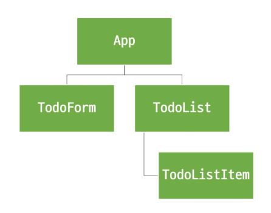
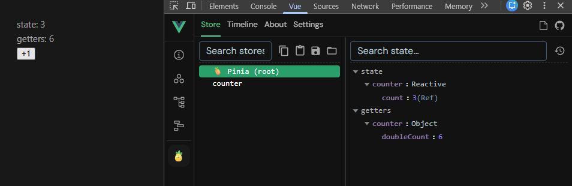
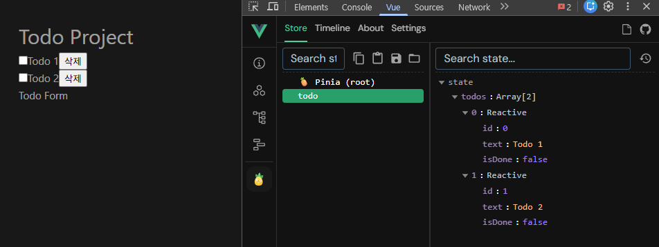
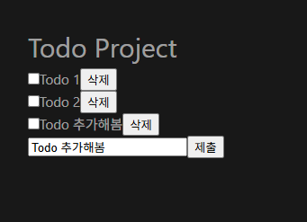
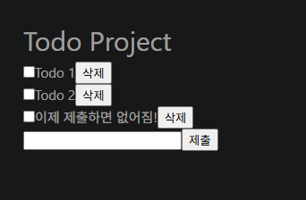
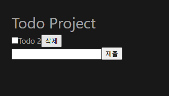
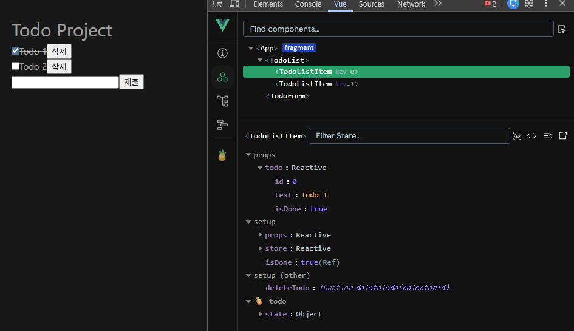
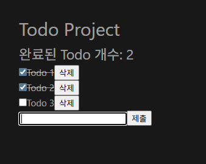
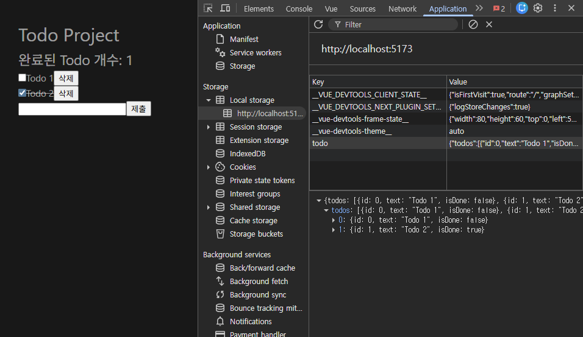

# State Management와 Pinia (전역 상태 관리)

## State Management

### Vue의 컴포넌트 구조

- 단방향 데이터 흐름
- **상태 (State):** 앱 구동에 필요한 기본 데이터
- **뷰 (View):** 상태를 선언적으로 매핑하여 시각화
- **기능 (Actions):** 뷰에서 사용자 입력에 대해 반응적으로 상태를 변경할 수 있게 정의된 동작

### 단방향 데이터 흐름의 한계

- 여러 뷰가 동일한 상태에 종속되는 경우
- 서로 다른 뷰의 기능이 동일한 상태를 변경시켜야 하는 경우

## Pinia

### Pinia

- Vue 공식 상태 관리 라이브러리
- 여러 컴포넌트가 함께 사용해야 하는 공통 데이터를 중앙 저장소에서의 통합 관리를 도와준다.
- 중앙 저장소에 직접 접근하여 데이터를 읽거나 수정할 수 있다.
- Vite 프로젝트 빌드 시 Pinia 라이브러리를 추가할 수 있다.
    - `src/stores/`

### Pinia 활용 시점

- pinia는 공유된 상태를 관리하는 데 유용하지만, 구조적인 개념을 이해하고 시작하는 비용이 크다.
- 애플리키에션이 단순하다면 pinia가 없는 것이 더 효율적일 수 있다.
- 중대형 규모의 SPA를 구축하는 경우 pinia를 자연스럽게 선택하는 단계가 온다.

### Pinia 구성 요소

```jsx
// stores/counter.js
import { ref, computed } from 'vue'
import { defineStore } from 'pinia'

export const useCounterStore = defineStore('counter', () => {
  // state
  const count = ref(0)
  
  // getters
  const doubleCount = computed(() => count.value * 2)

  // actions
  function increment() {
    count.value++
  }

  // 반환 값
  return { count, doubleCount, increment }
})
```

- **srote**: 공통 데이터를 관리하는 중앙 저장소
    - 모든 컴포넌트가 공유하는 상태이며, 기능이 작성된다.
    - `defineStore(저장소명, 콜백함수)`
- **state**: 중앙 저장소에 저장되는 반응형 상태 (데이터)
    - 값을 변경하면 이 데이터를 사용하고 있는 모든 컴포넌트의 화면은 자동으로 업데이트된다.
    - `ref()`와 같은 역할
- **getters**: 계산된 값
    - state를 기반으로 파생된 값을 정의하는 것
    - `computed()`와 같은 역할
- **actions**: state를 변경하는 역할
    - `methods`와 같은 역할
    - 컴포넌트에서 store의 state를 직접 변경하는 것은 권장하지 않는다. 변경 지점이 분산되어 있으면 추적하기 어렵고, 유지보수와 코드 가독성이 안 좋기 때문.
    - 대신 store에 정의된 action을 컴포넌트에서 호출하여 간접적으로 변경할 것!
- **반환 값**: pinia의 상태들을 사용하려면 반드시 반환해야 한다.
    - store에서는 공유하지 않는 private한 상태 속성을 가지지 않는다.
- **plugin**: 추가 기능을 제공하거나 확장하는 도구나 모듈
    - localStorage에 저장하고 복원해주는 플러그인 - 페이지를 새로고침해도 값이 초기화되지 않고 유지된다.

---

## Pinia 실습: Todo App 구현



컴포넌트 구조

### 프로젝트 구조 및 기초 설정

```html
<!-- App.vue -->

<template>
  <div>
    <p>state: {{ store.count }}</p>
    <p>getters: {{ store.doubleCount }}</p>
    <button @click="store.increment()"> +1 </button>
  </div>
</template>

<script setup>
  import { useCounterStore } from '@/stores/counter';
  
  const store = useCounterStore()
</script>
```




### READ: Todo 조회 (`state` 활용)

- store에 임시 todos 목록 state 정의

```jsx
// stores/todo.js

import { ref, computed } from 'vue'
import { defineStore } from 'pinia'

export const useTodoStore = defineStore('todo', () => {
  let id = 0

  const todos = ref([
    { id: id++, text: 'Todo 1', isDone: false },
    { id: id++, text: 'Todo 2', isDone: false },
  ])
  
  return { 
    todos,
   }
})
```

- store의 todos state를 참조

```html
<!-- TodoList.vue -->
<template>
  <div>
    <TodoListItem
      v-for="todo in store.todos"
      :key="todo.id"
      :todo="todo"
    />
  </div>
</template>

<script setup>
  import TodoListItem from '@/components/TodoListItem.vue';
  import { useTodoStore } from '@/stores/todo';

  const store = useTodoStore()
</script>
```

- props 정의 후 데이터 출력

```html
<!-- TodoListItem.vue -->
<template>
  <div>
    <input type="checkbox" id="todo-text">
    <label for="todo-text">{{ todo.text }}</label>
    <button>삭제</button>
  </div>
</template>

<script setup>
defineProps({
  todo: Object,
})
</script>
```



Todo 조회 실행 결과

### CREATE: Todo 생성 (`actions` 활용)

- todos 목록에 todo를 생성 및 추가하는 addTodo action 정의

```jsx
// stores/todo.js
export const useTodoStore = defineStore('todo', () => {
  ...
  const addTodo = function (todoText) {
    todos.value.push({
      id: id++,
      text: todoText,
      isDone: false
    })
  }

  return { 
    todos,
    addTodo,
  }
})
```

```html
<!-- TodoForm.vue -->
<template>
  <div>
      <form @submit.prevent="createTodo(todoText)">
        <input type="text" v-model="todoText">
        <input type="submit">
      </form>
  </div>
</template>

<script setup>
  import { ref } from 'vue';
  import { useTodoStore } from '@/stores/todo';

  const todoText = ref('')
  const store = useTodoStore()
  
  const createTodo = function (todoText) {
    store.addTodo(todoText)
  }
</script>
```



폼 제출 시 input 데이터가 남아있음

- form 요소를 선택하여 todo 입력 후 input 데이터를 초기화(`.reset`)할 수 있도록 처리
- addTodo 액션 전후로 추가 로직을 작성하기 위해 굳이 `createTodo`를 만들어서 사용함

```html
<!-- TodoForm.vue -->
<template>
  <div>
      <form @submit.prevent="createTodo(todoText)" ref="formElem">
        <input type="text" v-model="todoText">
        <input type="submit">
      </form>
  </div>
</template>

<script setup>
  ...
  const formElem = ref(null)

  const createTodo = function (todoText) {
    store.addTodo(todoText)
    formElem.value.reset()
  }
</script>
```



Todo 생성 실행 결과

### DELETE: Todo 삭제 (배열 조작 방식)

- todos state를 수정하기 때문에 store에 deleteTodo 액션을 정의한다.

```js
// stores/todo.js
export const useTodoStore = defineStore('todo', () => {
  ...
  const deleteTodo = function (selectedId) {
    // 1. findIndex + splice (하나만 삭제)
    const index = todos.value.findIndex((todo) => todo.id === selectedId)
    todos.value.splice(index, 1)

    // 2. filter (전체 배열 재생성)
    // todos.value = todos.value.filter(todo => todo.id !== selectedId)
  }

  return { 
    todos,
    addTodo,
    deleteTodo,
  }
})
```

```html
<!-- TodoListItem.vue -->
<template>
  <div>
    <input type="checkbox" id="todo-text">
    <label for="todo-text">{{ todo.text }}</label>
    <button @click="deleteTodo(todo.id)">삭제</button>
  </div>
</template>

<script setup>
  import { useTodoStore } from '@/stores/todo';

  defineProps({
    todo: Object,
  })

  const store = useTodoStore()
  const deleteTodo = function (selectedId) {
    store.deleteTodo(selectedId)
  }
</script>
```



Todo 1 삭제 결과

### UPDATE: Todo 수정 (상태 토글)

- 각 todo 상태의 isDone 속성을 변경하여 todo의 완료 유무를 처리하기
- 완료된 todo에는 취소선 스타일 적용하기
- todos 목록에서 특정 todo의 isDone 속성을 변경하는 updateTodo 액션 정의

```
// stores/todo.js
export const useTodoStore = defineStore('todo', () => {
  ...
  const updateTodo = function (selectedId) {
    // 1. forEach (하나만 수정)
    todos.value.forEach((todo) => {
      if (todo.id === selectedId) {
        todo.isDone = !todo.isDone
      }
    })

    // 2. map (전체 배열 재생성)
    // todos.value = todos.value.map((todo) => {
    //   if (todo.id === selectedId) {
    //     todo.isDone = !todo.isDone
    //   }
    //   return todo
    // })
  }

  return { 
    todos,
    addTodo,
    deleteTodo,
    updateTodo
  }
})
```

- 체크박스 클릭 → isDone ref 변경 → watch 감지 → store.updateTodo 호출

```html
<!-- TodoListItem.vue -->
<template>
  <div>
    <input type="checkbox" id="todo-text" v-model="isDone">
    <label for="todo-text" :class="{ 'is-done': todo.isDone }">{{ todo.text }}</label>
    <button @click="deleteTodo(todo.id)">삭제</button>
  </div>
</template>

<script setup>
  import { ref } from 'vue';
  import { useTodoStore } from '@/stores/todo';

  const props = defineProps({
    todo: Object,
  })

  const store = useTodoStore()
  const deleteTodo = function (selectedId) {
    store.deleteTodo(selectedId)
  }

  const isDone = ref(props.todo.isDone)
    watch(isDone, () => {
    store.updateTodo(props.todo.id)
  })
</script>

<style scoped>
.is-done {
  text-decoration: line-through;
}
</style>
```



isDone이 ture일 때 취소선 스타일 적용

**수정과 삭제 구현 방식**

- In-place 방식 (하나만 수정/삭제)
    - 배열 전체 재생성 없이, 필요한 항목만 바로 수정 또는 제거
- 전체 배열 재생성 방식
    - 배열을 순회하면서 특정 조건을 만족하지 않으면 누락하거나, 필요한 변경 사항만 반영해 새로운 배열을 만든 뒤 기존 배열에 재할당

### Todo 카운팅 (`getters` 활용)

- 완료된 todo 개수 계산
- todos 배열의 길이 값을 반환하는 함수 doneTodosCount getters를 작성

```jsx
// stores/todo.js

export const useTodoStore = defineStore('todo', () => {
  ...
  const doneTodosCount = computed(() => {
    const doneTodos = todos.value.filter(todo => todo.isDone)
    return doneTodos.length
  })

  return { 
    todos,
    addTodo,
    deleteTodo,
    updateTodo,
    doneTodosCount,
  }
})
```

```html
<!-- App.vue -->
<template>
  <h1>Todo Project</h1>
  <div>
    <h2>완료된 Todo 개수: {{ store.doneTodosCount }}</h2>
    <TodoList />
    <TodoForm />
  </div>
</template>

<script setup>
  import TodoForm from '@/components/TodoForm.vue';
  import TodoList from '@/components/TodoList.vue';
  import { useTodoStore } from './stores/todo';
  const store = useTodoStore()
</script>
```



Todo 카운팅 실행 결과

## Local Storage

### Local Storage

- 브라우저 내에 key-value 쌍을 저장하는 웹 스토리지 객체
- 웹 브라우저에 데이터를 영구적으로 저장할 수 있는 개인 하드디스크 같은 공간
- 새로고침을 하고 브라우저를 다시 실행해도 데이터가 유지된다.
- 네트워크 요청 시 서버로 전송되지 않는다.
- 여러 탭이나 창 간에 데이터를 공유할 수 있다.
- 주로 사용자 설정(예: 다크 모드, 언어) 등 서버와 관계없이 브라우저에만 기억해두면 되는 정보를 저장할 때 사용한다.
- 웹 애플리케이션에서 사용자 설정, 상태정보, 캐시 데이터 등을 클라이언트 측에서 보관하여 웹사이트의 성능을 향상시키고 **사용자 경험을 개선**하기 위함

### `pinia-plugin-persistedstate` 플러그인

- pinia의 플러그인
- 웹 애플리케이션의 state를 브라우저의 local storage나 session storage에 영구적으로 저장하고 복원하는 기능을 제공한다.

```bash
$ npm i pinia-plugin-persistedstate
```

```jsx
// main.js
...
import piniaPluginPersistedstate from 'pinia-plugin-persistedstate'

const app = createApp(App)
const pinia = createPinia()

pinia.use(piniaPluginPersistedstate)

// app.use(createPinia())
app.use(pinia)

app.mount('#app')
```

```jsx
// stores/todo.js

export const useTodoStore = defineStore('todo', () => {
  ...
}, { persist: true })
```

- 개발자 도구 > Application > Local Storage에서 확인 가능


