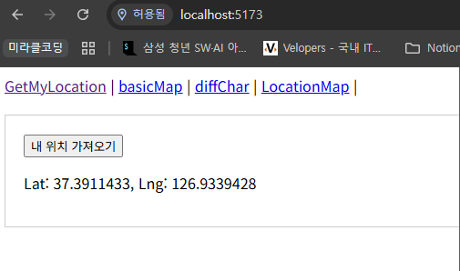
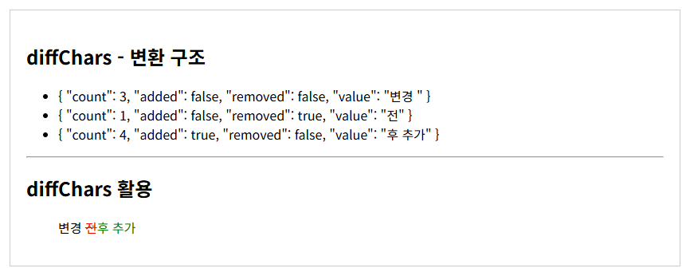

# 유용한 Web APIs 및 Libraries (Geolocation, jsdiff)

## Geolocation API (위치 정보)

### Geolocation API

- 사용자의 현재 위치 정보를 브라우저를 통해 간편하게 얻을 수 있는 인터페이스
- 지도, 내비게이션, 위치 기반 서비스 등 구현

```jsx
navigator.geolocation.getCurrentPosition(
  SuccessCallBack,
  ErrorCallBack,
  Options, ...
)
```

- `navigator`: 사용자 에이전트의 상태와 신원 정보
- `geolocation`: 장치의 위치 정보에 접근할 수 있는 객체
- `getCurrentPosition`: 사용자의 현재 위치를 불러오는 메서드



### iframe (Inline Frame)

- HTML 문서 안에 또 다른 HTML 문서를 삽입하는 태그
- 외부 페이지를 현재 페이지에 임베드(embedded)할 때 사용
- `src`: 삽입할 문서의 URL
- `width`, `height`: iframe의 크기
- `allowfullscreen`: 전체화면 전환 허용 여부
- `loading`: `lazy` 설정 시 화면에 보여야 할 때 최초 로딩

```jsx
// 위치 정보 가져오기
const getCurrentLocation = () => {
  navigator.geolocation.getCurrentPosition(
    (pos) => {
      lat.value = pos.coords.latitude
      lng.value = pos.coords.longitude
      updateMap() // 위치 받자마자 최초 1회 지도 표시
    },
  )
}

// iframe 지도 업데이트
const updateMap = () => {
  mapUrl.value =
    `https://maps.google.com/maps` +
    `?ll=${lat.value},${lng.value}` +
    `&z=14` +
    `&output=embed` +
    `&q=${keyword.value.trim()}`
}
```

## jsdiff (텍스트 비교)

### jsdiff 라이브러리

- JavaScript로 텍스트 구분을 구현한 것
- 이전 텍스트와 새 텍스트를 받아서 두 텍스트의 차이를 구분한다.

```jsx
$ npm install diff
```

### 주요 메서드

- `.diffChars(oldStr, newStr[, options])`
    - 두 텍스트를 비교하여 각 문자를 토큰으로 취급
- `.diffWords(oldStr, newStr[, options])`
    - 두 텍스트를 비교하여 각 단어와 각 구두점을 토큰으로 처리
- `.diffWordsWithSpace(oldStr, newStr[, options])`
    - 두 텍스트를 비교하여 각 단어, 구두점, 줄 바꿈 또는 공백을 토큰으로 처리

### diffChars 활용

- 두 문자열을 비교하여 변경된 문자열 시각화

```html
<span 
  v-for="(change, index) in changes" 
  :key="index"
  :class="{ add: change.added, removed: change.removed }"
>
  {{ change.value }}
</span>
```




- 변경 사항이 발생한 총 문자 수를 count

```jsx
// diffChars 활용 2
const diffCount = changes
  // 추가 되었거나 제거된 문자열만 filter
  .filter(function (char) {
    return char.added || char.removed
  })
  // 총 변경 단어 수를 count
  .reduce(function(sum, char) {
    return sum + char.count
  }, 0)
```
