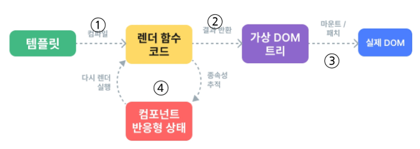

# Virtual DOM과 내부 렌더링 과정

## Virtual DOM의 개요

### Virtual DOM

- 가상의 DOM을 메모리에 저장하고 실제 DOM과 동기화하는 프로그래밍 개념
- 실제 DOM의 모습을 그대로 복사해 메모리 상에만 존재하는 가상 설계도
- 데이터의 변경을 감지하면 실제 DOM을 바로 건드리지 않고, 가상 DOM에서 변경 사항을 미리 시뮬레이션하고 차이점을 계산한다.
- 계산된 최소한의 변경 사항만 실제 DOM에 적용함으로써 불필요한 렌더링을 줄이고 성능 향상

### Vue에서 DOM 접근 방식

- Vue에서는 JavaScript에서 사용하는 **DOM 접근 관련 메서드 사용 금지**
    - querySelector, createElement, addEventListener 등
- 대신 Vue의 ref()와 Lifecycle Hooks 함수를 사용해 간접적으로 접근하여 조작한다.
    - 성능과 코드의 예측 가능성을 극대화하기 위함

## 내부 렌더링 과정

1. 작성한 HTML 템플릿을 virtual DOM을 그려내는 렌더 함수 코드로 변환한다.
2. 렌더 함수 코드를 바탕으로 virtual DOM을 생성한다.
3. virtual DOM을 실제 DOM에 마운트한다.
4. 컴포넌트의 데이터(반응형 상태)가 바뀔 때마다 새로운 virtual DOM을 만들어 이전과 비교하고, 바뀐 부분만 찾아 실제 DOM을 업데이트한다.
