# Authentication with DRF (인증과 권한)

## DRF Authentication 설정 (Backend)

### 인증 (Authentication)

- 클라이언트와 서버 간의 상태 정보를 유지하기 위해서 쿠키와 세션을 사용
- 사용자를 식별하기 위한 과정이 ‘인증(Authentication)’
- 아이디와 비밀번호, 소셜 로그인 (OAuth), 생체 인증 등

### DRF 에서의 인증

- 항상 view함수 시작 시 다른 코드의 진행이 허용되기 전에 실행된다.
- 수신 요청을 해당 요청의 사용자 또는 해당 요청이 서명된 토큰과 같은 자격 증명 자료와 연결
- 승인되지 않은 요청이 권한을 거부하는 경우
    - HTTP 401 Unauthorized: 요청에 유효한 인증 자격 증명 (Authentication Credentials)이 없어 사용자를 식별할 수 없음. API Key 문제.
    - HTTP 403 Forbidden (Permission Denied): 서버에 요청이 전달되었지만, 권한 때문에 거절되었다. 서버는 클라이언트가 누구인지 알고 있다.

### 인증 정책 설정

- 전역 설정: 로그인을 해야지만 요청을 처리한다.
    - `DEFAULT_AUTHENTICATION_CLASSES` 사용
    - 기본 값: `SessionAuthentication`, `BasicAuthentication`

```python
# settings.py

REST_FRAMEWORK = {
    # Authentication
    'DEFAULT_AUTHENTICATION_CLASSES': [
        'rest_framework.authentication.BasicAuthentication',
        'rest_framework.authentication.TokenAuthentication',
    ],
}
```

- View 함수별 설정: 특정 기능에만 로그인 요구
    - `@authentication_classes` 데코레이터 사용
    - 개별 view에 지정하여 재정의

```python
# articles/views.py
from rest_framework.decorators import authentication_classes
from rest_framework.authentication import TokenAuthentication, BasicAuthentication

@api_view(['GET', 'POST'])
@authentication_classes([TokenAuthentication, BasicAuthentication])
def article_list(request):
    pass
```

### DRF가 제공하는 인증의 종류

- BasicAuthentication: 요청마다 사용자 이름과 비밀번호를 Base64로 인코딩하여 Authorization 헤더에 담아 보내는 방식
- **TokenAuthentication**: 로그인 시 발급받은 고유한 토큰(Token)을 Authorization 헤더에 담아 요청함으로써 사용자를 인증하는 방식
    - 기본 데스크톱 및 모바일 클라이언트와 같은 클라이언트-서버 설정에 적합하다.
- SessionAuthentication: 장고의 기본 세션 시스템을 활용하여, 브라우저가 보내는 sessionId 쿠키를 통해 사용자를 인증하는 방식
- RemoteUserAuthentication: 웹 서버 등 외부 시스템이 이미 처리한 인증 결과를 신뢰하고, 전달받은 사용자 이름으로 사용자를 인증하는 방식

### TokenAuthentication 적용

```python
# settings.py

INSTALLED_APPS = [
    'articles',
    'accounts',
    'rest_framework',
    'rest_framework.authtoken',
    ...
]

REST_FRAMEWORK = {
    # Authentication
    'DEFAULT_AUTHENTICATION_CLASSES': [
        'rest_framework.authentication.TokenAuthentication',
    ],
]
```

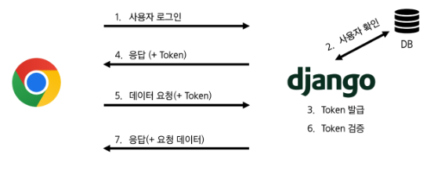

### dj-rest-auth 라이브러리

- 회원가입, 로그인/로그아웃, 비밀번호 재설정, 소셜 로그인 등 다양한 인증 관련 기능을 RESTful API 엔드포인트로 제공하는 라이브러리
- django.contrib.auth를 대체하는 것이 아니라, 그 위에 만들어져 기능을 확장하는 역할

```bash
$ pip install dj-rest-auth[with_social]
```

```python
# settings.py

INSTALLED_APPS = [
    ...
    'rest_framework.authtoken',
    'dj_rest_auth',
    'django.contrib.sites',
    'allauth',
    'allauth.account',
    'allauth.socialaccount',
    'dj_rest_auth.registration',
    ...
]

SITE_ID = 1

MIDDLEWARE = [
    ...
    'allauth.account.middleware.AccountMiddleware',
]
```

- `SITE_ID`: 사이트의 주소 정보를 찾는 데 사용하며, DB의 site 테이블에서 설정한 ID 값에 매칭되는 주소를 사용한다.
    - INSTALLED_APPS 목록의 django.contrib.sites가 django_site 테이블을 자동으로 생성

```python
# urls.py

from django.contrib import admin
from django.urls import path, include

urlpatterns = [
    path('admin/', admin.site.urls),
    path('api/v1/', include('articles.urls')),
    path('accounts/', include('dj_rest_auth.urls')),
    path('accounts/signup/', include('dj_rest_auth.registration.urls')),
]
```

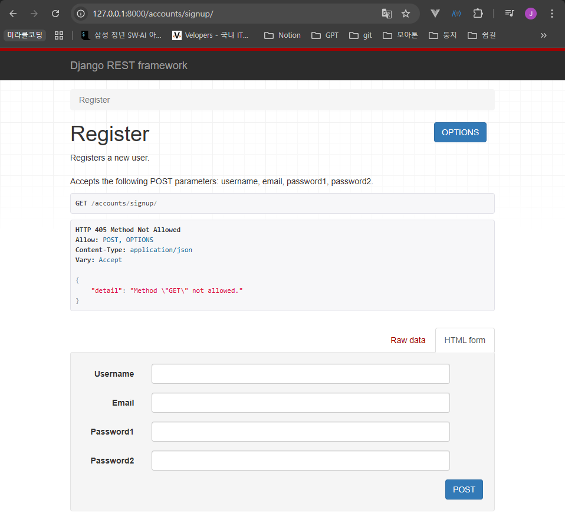

실행 결과

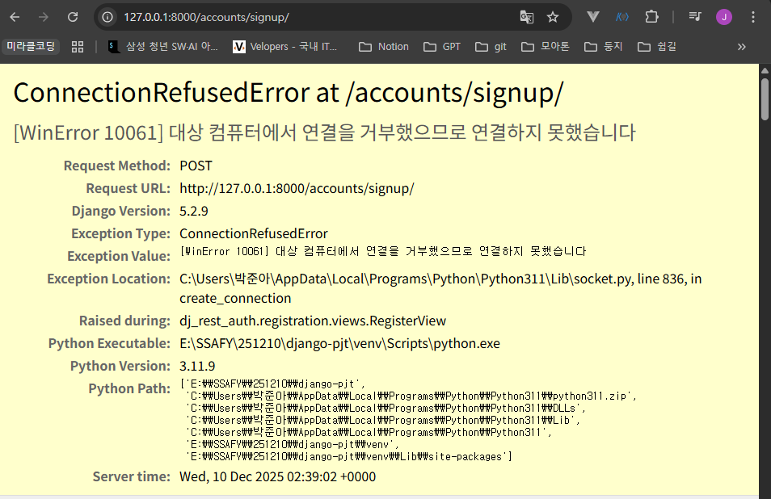

- DB에는 저장이 되었으나, 이메일을 보낼 수 없어 오류 발생

```bash
# settings.py
ACCOUNT_EMAIL_VERIFICATION = 'none'
```

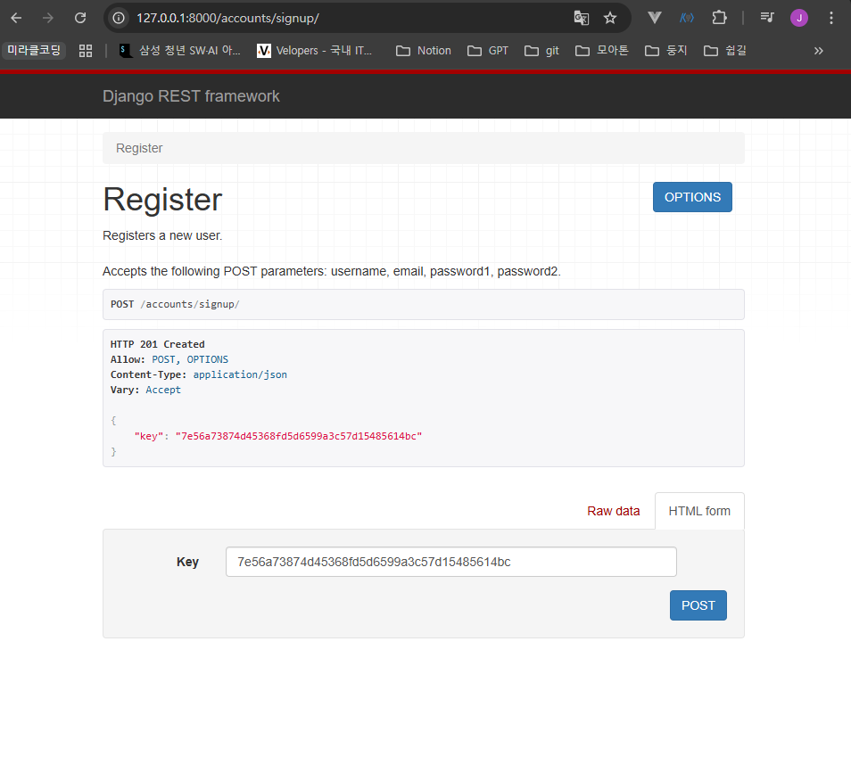

회원가입 성공 후 화면: Token 확인

- 로그인 성공 후 DRF로부터 발급받은 Token을 Vue에 별도로 저장하여 매 요청마다 함께 보내야 한다.

### Token 활용

- postman을 활용한 게시글 요청
- HTTP Header에 `Authorization: Token [YOUR_TOKEN]` 전달
    - Token 데이터는 Django DB에서 확인 가능

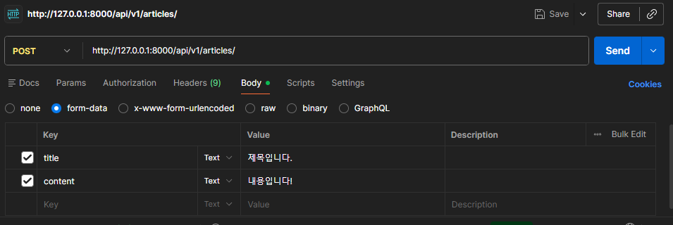

Request Body 설정

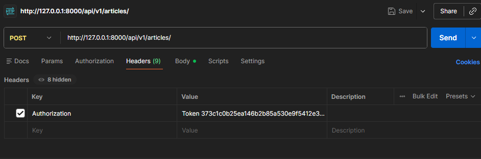

Request Header 설정

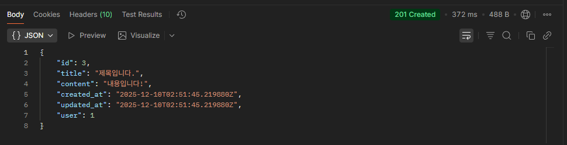

POST 요청 결과

## Permissions (권한 제어)

### 권한 정책 설정

- 전역 설정
    - `DEFAULT_PERMISSION_CLASSES` 사용
    - 기본 값: `rest_framework.permissions.AllowAny`
- View 함수 별 설정
    - `@permission_classes` 데코레이터 사용
    - 개별 view에 지정하여 재정의

### DRF가 제공하는 권한의 종류

- IsAuthenticated: 인증된 사용자만 접근 허용
    - `request.user`가 존재하고 인증된 상태인지 확인
- IsAdminUser: 스태프 권한(`is_staff=True`)을 가진 관리자 사용자만 접근 허용
    - 일반 사용자와 비인증 사용자의 모든 요청을 거부
- IsAuthenticatedOrReadOnly: 인증된 사용자는 모든 요청(읽기/쓰기)을 허용하고, 비인증 사용자는 읽기 전용 요청만 허용
- AllowAny: 아무런 제한 없이 모든 사용자의 접근을 허용
    - 권한 검사 (Authorization) 로직을 전혀 수행하지 않는다.

### IsAuthenticated 권한 설정

```python
# settings.py

REST_FRAMEWORK = {
    # Authentication
    'DEFAULT_AUTHENTICATION_CLASSES': [
        'rest_framework.authentication.TokenAuthentication',
    ],
    # permission
    'DEFAULT_PERMISSION_CLASSES': [
        'rest_framework.permissions.AllowAny',
    ],
}
```

```python
# articles/views.py
# permission Decorators
from rest_framework.decorators import permission_classes
from rest_framework.permissions import IsAuthenticated

@api_view(['GET', 'POST'])
@permission_classes([IsAuthenticated])
def article_list(request):
    pass
```

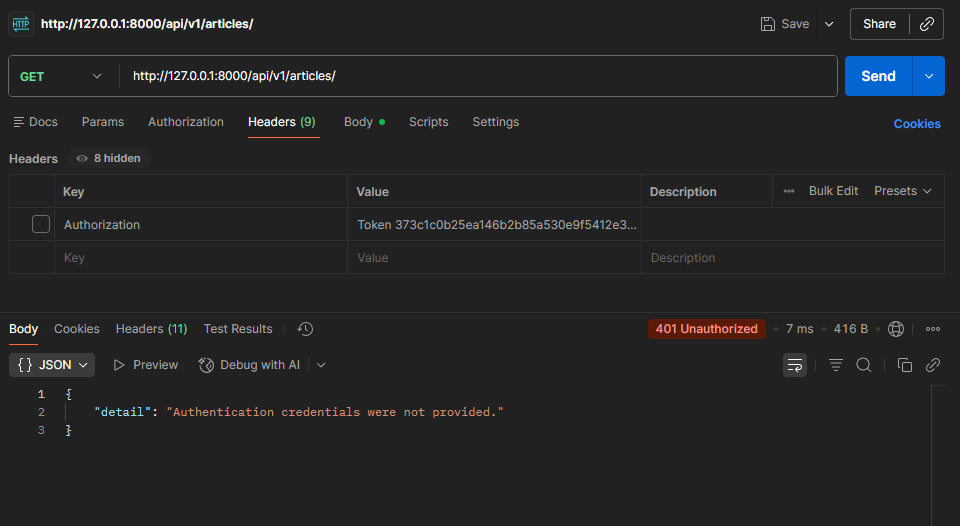

Token 비활성화 한 후 GET 요청 결과: 401 Unauthorized

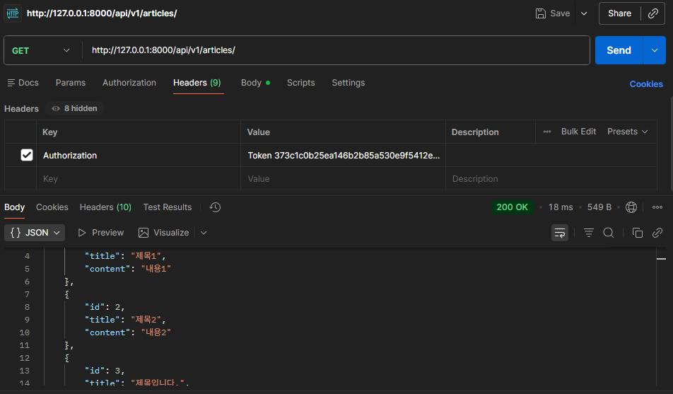

Token 활성화한 후 GET 요청 결과: 200 OK

### IsAdminUser 권한 설정

```python
# articles/views.py
# permission Decorators
from rest_framework.decorators import permission_classes
from rest_framework.permissions import IsAuthenticated, IsAdminUser

@api_view(['GET', 'POST'])
@permission_classes([IsAdminUser])
def article_list(request):
    pass
```

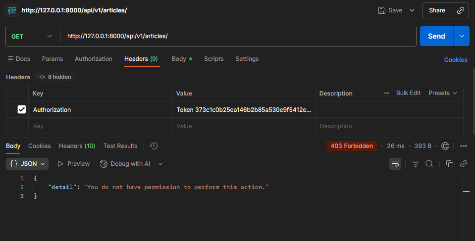

User Token을 보냈지만, 403 Forbidden 에러 발생

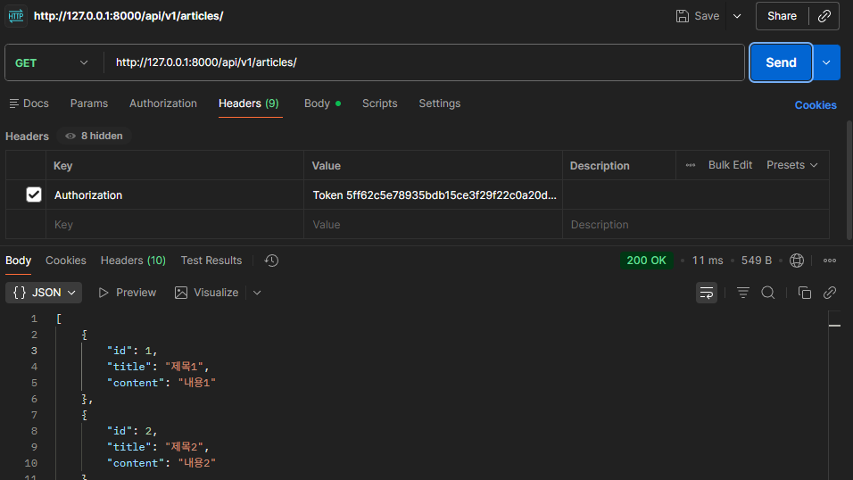

Admin Token으로 보낸 결과: 200 OK

---

### 설치한 라이브러리 정리

| 라이브러리 | 설명 |
| --- | --- |
| `pinia-plugin-persistedstate` | pinia의 상태를 브라우저의 localStorage에 자동으로 저장 |
| `axios` | Vue가 Django 서버와 데이터를 주고받기 위해 사용하는 HTTP 통신 라이브러리 |
| `djangorestframework` | Django로 REST API를 구축하기 위한 프레임워크 |
| `django-cors-headers` | CORS 헤더를 처리해주는 라이브러리 |
| `dj-rest-auth` | Django의 기본 인증 시스템을 기반으로 로그인, 로그아웃, 비밀번호 변경 등의 기능을 API 엔드포인트로 제공 |
| `dj-rest-auth[with-social]` | 기본 dj-rest-auth 기능에 더해 API를 구현하는 데 필요한 django-allauth 라이브러리를 함께 설치 |
