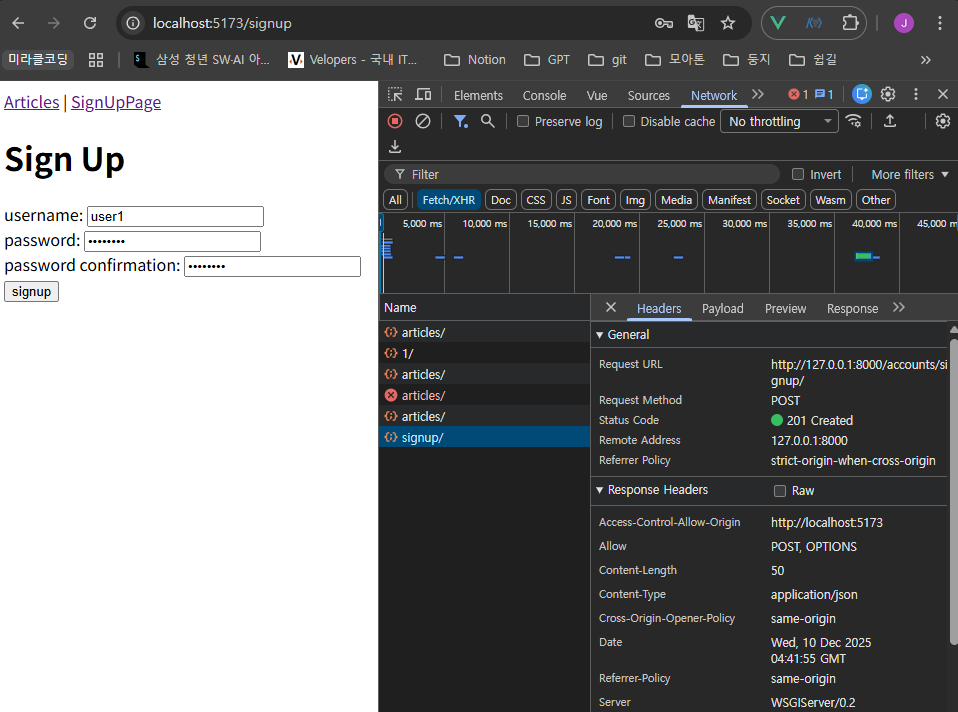
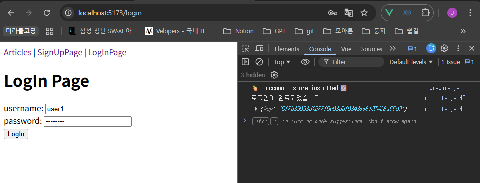
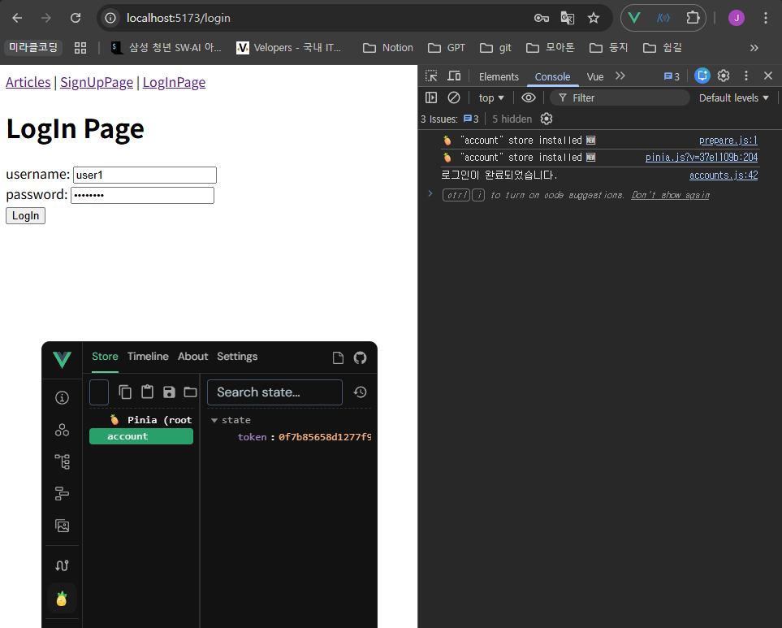
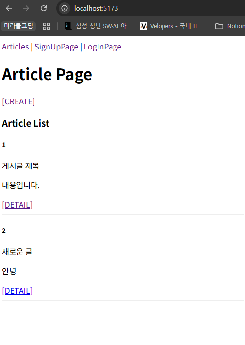
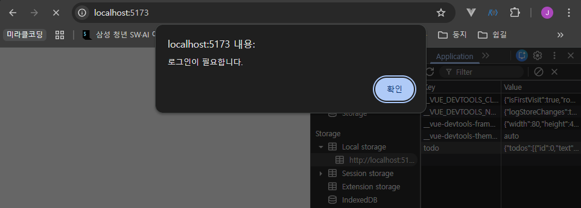
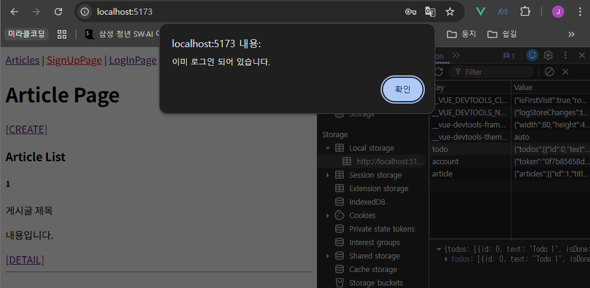
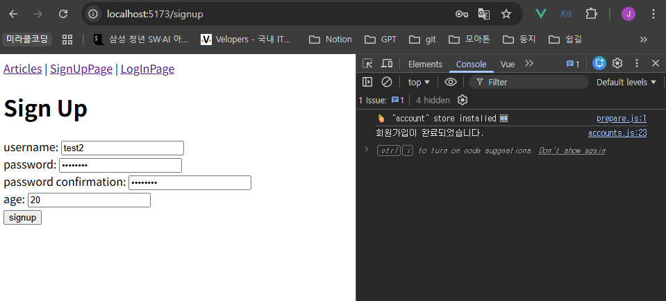
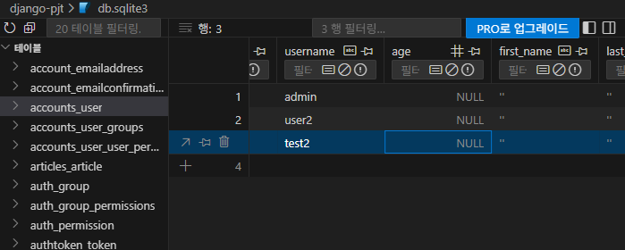
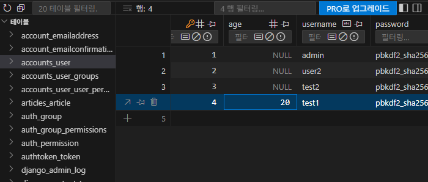

# Authentication with Vue (인증과 권한)

## Vue Authentication 구현 (Frontend)

### 회원가입

- token을 발급받는다.

```jsx
// store/accounts.js

import { defineStore } from 'pinia'
// import { ref, computed } from 'vue'
import axios from 'axios'

export const useAccountStore = defineStore('account', () => {
  const API_URL = 'http://127.0.0.1:8000'
  
  const signUp = function (payload) {
    // const username = payload.username
    // const password1 = payload.password1
    // const password2 = payload.password2
    const { username, password1, password2 } = payload

    axios({
      method: 'post', 
      url: `${API_URL}/accounts/signup/`,
      data: {
        username, password1, password2
      }
    })
      .then(res => {
        console.log('회원가입이 완료되었습니다.')
      })
      .catch(err => console.log(err))
  }

  return { signUp }
}, { persist: true })

```

```html
<!-- views/SignUpView.vue -->
<template>
  <div>
    <h1>Sign Up</h1>
    <form @submit.prevent="signUp">
      <label for="username">username: </label>
      <input type="text" id="username" v-model.trim="username" /> <br>

      <label for="password1">password: </label>
      <input type="password" id="password1" v-model.trim="password1" /> <br>

      <label for="password2">password confirmation: </label>
      <input type="password" id="password2" v-model.trim="password2" /> <br>

      <input type="submit" value="signup">
    </form>
  </div>
</template>

<script setup>
  import { ref } from 'vue';
  import { useAccountStore } from '@/stores/accounts';

  const username = ref(null)
  const password1 = ref(null)
  const password2 = ref(null)

  const accountStore = useAccountStore()

  const signUp = function () {
    const payload = {
      username: username.value,
      password1: password1.value,
      password2: password2.value,
    }
    accountStore.signUp(payload)
  }
</script>
```




### 로그인

```jsx
// store/accounts.js

export const useAccountStore = defineStore('account', () => {
  ...
  const logIn = function (payload) {
    const { username, password } = payload

    axios({
      method: 'post', 
      url: `${API_URL}/accounts/login/`,
      data: {
        username, password
      }
    })
      .then(res => {
        console.log('로그인이 완료되었습니다.')
        console.log(res.data)
      })
      .catch(err => console.log(err))
  }

  return { signUp, logIn }
}, { persist: true })
```

```html
<!-- views/LogInView.vue -->
<template>
  <div>
    <h1>LogIn Page</h1>
    <form @submit.prevent="login">
      <label for="username">username: </label>
      <input type="text" id="username" v-model.trim="username" /> <br>

      <label for="password">password: </label>
      <input type="password" id="password" v-model.trim="password" /> <br>

      <input type="submit" value="LogIn" />
    </form>
  </div>
</template>

<script setup>
  import { ref } from 'vue';
  import { useAccountStore } from '@/stores/accounts';

  const username = ref(null)
  const password = ref(null)

  const accountStore = useAccountStore()

  const login = function () {
    const payload = {
      username: username.value,
      password: password.value,
    }
    accountStore.logIn(payload)
  }
</script>
```



- console에서 응답으로 온 token값을 확인할 수 있다.

### 토큰 발급 및 저장 (Pinia & LocalStorage)

- 로그인 후 token을 발급받아 store에 저장한다.

```jsx
// store/accounts.js

import { defineStore } from 'pinia'
import { ref, computed } from 'vue'
import axios from 'axios'

export const useAccountStore = defineStore('account', () => {
  ...
  const token = ref(null)

  const logIn = function (payload) {
    const { username, password } = payload

    axios({
      method: 'post', 
      url: `${API_URL}/accounts/login/`,
      data: {
        username, password
      }
    })
      .then(res => {
        // console.log('로그인이 완료되었습니다.')
        // console.log(res.data)
        token.value = res.data.key
      })
      .catch(err => console.log(err))
  }

  return { signUp, logIn, token }
}, { persist: true })
```



- 인증이 필요한 요청마다 token을 함께 보낸다.
    - 게시글 전체 목록 조회 시
    
    ```jsx
    // store/articles.js
    import { useAccountStore } from './accounts'
    
    export const useArticleStore = defineStore('article', () => {
      ...
      const accountStore = useAccountStore()
    
      const getArticles = function () {
        axios({
          method: 'get',
          url: `${API_URL}/api/v1/articles/`,
          headers: {
            'Authorization': `Token ${accountStore.token}`
          }
        })
          .then(res => {
            articles.value = res.data
          })
          .catch(err => console.log(err))
      }
    
      return { articles, API_URL, getArticles }
    }, { persist: true })
    
    ```
    
    - 게시글 생성 시
    
    ```html
    <!-- views/CreateView.vue -->
    <script setup>
      import { useAccountStore } from '@/stores/accounts'
    
      const accountStore = useAccountStore()
      const createArticle = function () {
        axios({
          method: 'post',
          url: `${store.API_URL}/api/v1/articles/`,
          data: {
            title: title.value,
            content: content.value
          },
          headers: {
            'Authorization': `Token ${accountStore.token}`
          }
        })        
          .then(res => {
            router.push({ name: 'ArticleView' })
          })
          .catch(err => console.log(err))
      }
    </script>
    ```
    



### 인증 상태에 따른 화면 처리 (Navigation Guard)

- computed를 활용해 token이 변경될 때 isLogin 상태를 다시 계산하도록 한다.

```jsx
// store/accounts.js

export const useAccountStore = defineStore('account', () => {
  ...
  const isLogin = computed(() => {
    return token.value ? true : false
  })

  return { signUp, logIn, token, isLogin }
}, { persist: true })
```

- 인증되지 않은 사용자 - 메인 페이지 접근 제한
- 전역 네비게이션 가드 beforeEach를 활용해, 인증되지 않은 사용자가 보호된 페이지로 이동하려 할 때 로그인 페이지로 리다이렉트 처리한다.

```jsx
// router/index.js
import { useAccountStore } from '@/stores/accounts'

const router = createRouter({
...
})

router.beforeEach((to, from) => {
  const accountStore = useAccountStore()

  if (to.name === 'ArticleView' && !accountStore.isLogin) {
    window.alert('로그인이 필요합니다.')
    return { name: 'LogInView' }
  }
})

export default router
```



- 인증된 사용자 - 회원가입 및 로그인 페이지에 접근 제한
    - 이미 인증된 사용자라면 메인 페이지로 이동시킨다.

```jsx
// router/index.js

router.beforeEach((to, from) => {
  const accountStore = useAccountStore()

  if (to.name === 'ArticleView' && !accountStore.isLogin) {
    window.alert('로그인이 필요합니다.')
    return { name: 'LogInView' }
  }

  if ((to.name === 'SignUpView' || to.name === 'LogInView') && (accountStore.isLogin)) {
    window.alert('이미 로그인 되어 있습니다.')
    return { name: 'ArticleView' }
  }
})
```



## User Customize

### Customize User Model

- dj-rest-auth를 활용한 회원가입 시 User Model Customize 해보기

```python
# accounts/models.py
from django.db import models
from django.contrib.auth.models import AbstractUser

# Create your models here.
class User(AbstractUser):
    age = models.PositiveIntegerField(null=True, blank=True)
```

```html
<!-- views/SignUpView.vue -->
<template>
  <div>
    <h1>Sign Up</h1>
    <form @submit.prevent="signUp">
      ...
      <label for="age">age: </label>
      <input type="number" id="age" v-model.trim="age" /> <br>

      <input type="submit" value="signup">
    </form>
  </div>
</template>

<script setup>
  ...
  const age = ref(0)

  const signUp = function () {
    const payload = {
      username: username.value,
      password1: password1.value,
      password2: password2.value,
      age: age.value
    }
    accountStore.signUp(payload)
  }
</script>
```

```jsx
// store/accounts.js

export const useAccountStore = defineStore('account', () => {
  const signUp = function (payload) {
    const { username, password1, password2, age } = payload

    axios({
      method: 'post', 
      url: `${API_URL}/accounts/signup/`,
      data: {
        username, password1, password2, age
      }
    })
      .then(res => {
        console.log('회원가입이 완료되었습니다.')
      })
      .catch(err => console.log(err))
  }

  return { signUp, logIn, token, isLogin}
}, { persist: true })
```





- 요청 보낸 유저 명으로 잘 생성되었으나, age 정보는 누락되었다.
    - dj-rest-auth의 RegisterSerializer의 field에 age가 정의되어 있지 않기 때문

### Customize RegisterSerializer

- RegisterSerializer를 상속받는 CustomRegisterSerializer 클래스를 정의한다.
- `get_cleaned_data()`: super()를 사용하여 기존 필드에 대한 유효성 검사 실행 후, 추가 필드에 대해 동일한 작업을 진행한 결과를 반영하여 반환한다.
- `save()`: 유효성 검사 함수와 같은 작업을 진행한다.

```python
# accounts/serializers.py

from dj_rest_auth.registration.serializers import RegisterSerializer
from rest_framework import serializers

class CustomRegisterSerializer(RegisterSerializer):
    age = serializers.IntegerField()

    def get_cleaned_data(self):
        data = super().get_cleaned_data()
        data['age'] = self.validated_data.get('age')
        return data
        
   def save(self, request):
        user = super().save(request)
        user.age = self.validated_data.get('age')
        user.save()
        return user
```

```python
# settings.py

REST_AUTH = {
    'REGISTER_SERIALIZER': 'accounts.serializers.CustomRegisterSerializer',
}
```



age 저장 확인

### 로그아웃

- 로그아웃에 성공하면, token 값을 `null`로 초기화하고 ArticleView 페이지로 이동시킨다.

```jsx
// store/accounts.js

import { useRouter } from 'vue-router'

export const useAccountStore = defineStore('account', () => {
  ...
  const router = useRouter()

  const logOut = function () {
    axios({
      method: 'post',
      url: `${API_URL}/accounts/logout/`,
    })
      .then((res) => {
        token.value = null
        router.push({ name: 'ArticleView' })
      })
      .catch((err) => console.log(err))
  }

  return { signUp, logIn, token, isLogin, logOut }
}, { persist: true })
```

```html
<!-- App.vue -->
<template>
  <header>
    <nav>
      <RouterLink :to="{ name: 'ArticleView' }">Articles</RouterLink> | 
      <RouterLink :to="{ name: 'SignUpView' }">SignUpPage</RouterLink> |
      <RouterLink :to="{ name: 'LogInView' }">LogInPage</RouterLink>
      <form @submit.prevent="logOut">
        <input type="submit" value="Logout">
      </form>
    </nav>
  </header>
  <RouterView />
</template>

<script setup>
import { RouterView, RouterLink } from 'vue-router'
import { useAccountStore } from './stores/accounts';

const accountStore = useAccountStore()
const logOut = function () {
  accountStore.logOut()
}
</script>

```

### 기타 기능 구현

- 로그인 성공 후 자동으로 메인페이지로 이동하기

```jsx
// store/accounts.js

  const logIn = function (payload) {
    const { username, password } = payload

    axios({
      method: 'post', 
      url: `${API_URL}/accounts/login/`,
      data: {
        username, password
      }
    })
      .then(res => {
        console.log('로그인이 완료되었습니다.')
        token.value = res.data.key
        router.push({ name: 'ArticleView' })
      })
      .catch(err => console.log(err))
  }
```

- 회원가입 성공 후 자동으로 로그인까지 진행하기

```jsx
// store/accounts.js

  const signUp = function (payload) {
    const { username, password1, password2, age } = payload

    axios({
      method: 'post', 
      url: `${API_URL}/accounts/signup/`,
      data: {
        username, password1, password2, age
      }
    })
      .then(res => {
        console.log('회원가입이 완료되었습니다.')
        const password = password1
        logIn({ username, password })
      })
      .catch(err => console.log(err))
  }
```

---

## 참고 사항

### Django Signals (이벤트 알림 시스템)

- 애플리케이션 내에서 특정 이벤트가 발생할 때 다른 부분에 신호를 보내어 이벤트가 발생했음을 알릴 수 있다.
- 주로 모델의 데이터 변경, 저장, 삭제와 같은 작업에 반응하며, 추가적인 로직을 실행하고자 할 때 사용한다.
    - 사용자가 새로운 게시글을 작성할 때마다 특정 작업(예: 이메일 알림 보내기)을 수행하려는 경우

```python
# articles/signals.py

from django.db.models.signals import post_save
from django.dispatch import receiver
from .models import Article

# Article 모델의 post_save 신호를 이 함수가 받을 수 있도록 설정
@receiver(post_save, sender=Article)
def article_post_save(sender, instance, created, **kwargs):
    # 'created'는 객체가 새로 생성되었을 때 True
    if created:
        print(f"알림: 새로운 게시글이 작성되었습니다. (제목: {instance.title})")
```

### 환경 변수 (Environment Variable)

- 애플리케이션의 설정이나 동작을 제어하기 위해 사용되는 변수
- 민감한 정보(API Key)를 포함한다.
- 보안적인 이슈를 피하고, 애플리케이션을 다양한 환경에 대응하기 쉽게 만들어 준다.
- Vite에서 환경 변수 사용하기: `.env.local` 파일 생성 및 API 변수 작성
    - 환경 변수 이름은 `VITE_`로 시작해야 한다.
    - 예: `VITE_TMDB_API_KEY=[YOUR_API_KEY]`
    - 사용 예: `const API_KEY = import.meta.env.VITE_TMDB_API_KEY`

