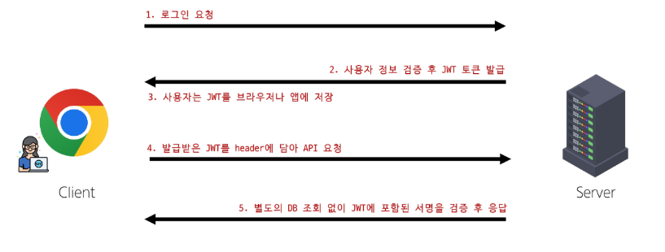
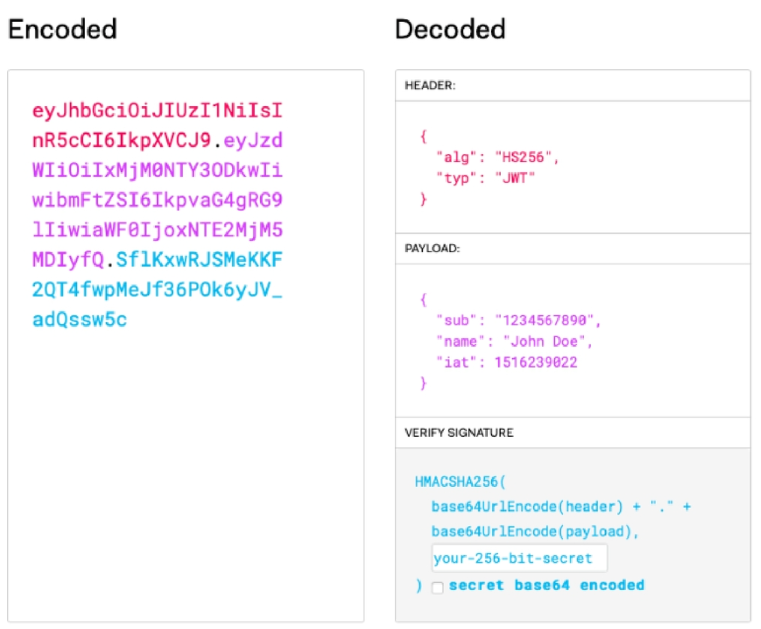
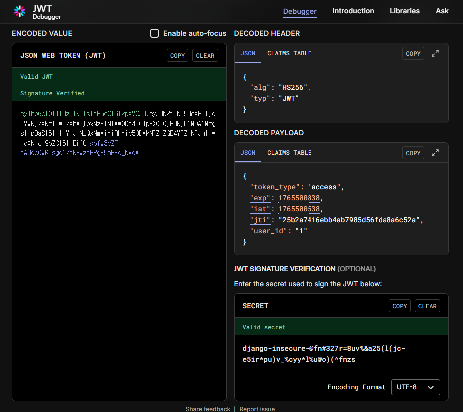

# Vue with DRF: JWT Authentication

## JWT (JSON Web Token)

### JSON Web Token

- 유저가 스스로 누군지 증명하는 디지털 출입증
- **서버가 유저에게 발급**해주는 긴 문자열



JWT 동작 흐름

### JWT 구조



- `.`으로 구분하고 3부분으로 나뉘어져 있다.
- `Header`: 어떤 알고리즘으로 암호화했는지 적혀있는 봉투 역할
- `Payload`: 실제 유저 정보가 들어있는 내용물
    - 누구나 열어볼 수 있어 민감한 정보가 있어서는 안된다.
- `Signature`: 정보가 조작되지 않았음을 증명하는 위조 방지 도장
    - **서버가 가진 키**로 위조 유무를 확인할 수 있다.

### JWT 특징

**장점**

- 서버 부담이 적다 (Stateless)
    - DB에 저장하여 누가 로그인 중인지 기억할 필요가 없다.
- 확장성이 좋다
    - 서버를 여러 개 늘려도 (Scale-out), 토큰만 있으면 어떤 서버에서든 인증이 가능하다.
- 모바일 친화적
    - 웹 뿐만 아니라 앱에서도 쓰기 편하다.

**단점**

- 키를 잃어버렸을 경우 대응하기 어렵다.
- 실수로 payload에 개인정보가 있을 시 누구든 확인할 수 있다.

### Token 방식 vs JWT 방식

| 구분 | Token | JWT |
| --- | --- | --- |
| 키와 서버의 관계 | 키 자체에는 아무런 정보가 없고, 정보는 서버가 가지고 있다. | 키에 정보가 들어 있어, 서버가 정보를 따로 확인할 필요가 없다. |
| 사용자 인증 방식 | DB에 저장된 토큰 정보와 비교 | 서버가 토큰의 Signature를 검증 |
| 키 유출 시 | 번거롭지만, 키 유출 시 서버에서 disable 처리해서 대응 가능 | 간단하지만, 키 유출 시 대응하기 어려움 |
| 사용 예 | 로그인 관리가 엄격해야 하는 경우 (예: 은행) | 대규모 트래픽 처리가 필요한 곳 (예: SNS, 쇼핑몰) |

## JWT 구현 (Django & Vue)

### Django 설정 (`djangorestframework-simplejwt`)

```bash
$ pip install djangorestframework-simplejwt
```

```python
# settings.py

INSTALLED_APPS = [
    ...
    'rest_framework_simplejwt',
    ...
]

REST_FRAMEWORK = {
    # Authentication
    'DEFAULT_AUTHENTICATION_CLASSES': [
        # 'rest_framework.authentication.TokenAuthentication',
        'rest_framework_simplejwt.authentication.JWTAuthentication',
    ],
    # permission
    'DEFAULT_PERMISSION_CLASSES': [
        'rest_framework.permissions.AllowAny',
    ],
}

# dj-rest-auth의 login url을 그대로 활용하기 위함
REST_AUTH = {
    'REGISTER_SERIALIZER': 'accounts.serializers.CustomRegisterSerializer',
    'USE_JWT': True,
}
```

### Vue 로그인 로직 및 환경 변수 설정

- API_URL을 환경 변수로 설정했기 때문에, `.env.local` 파일을 생성한다.
- `const API_URL = import.meta.env.VITE_API_URL`

```bash
# .env.local
VITE_API_URL='http://127.0.0.1:8000'
```

```jsx
// stores/accounts.js

  const logIn = function ({ username, password }) {
    axios({
      method: 'post',
      url: `${API_URL}/accounts/login/`,
      data: {
        username, password
      },
    })
      .then(res => {
        console.log('로그인이 완료되었습니다.')
        console.log(res.data)
        token.value = res.data.access   // token 저장
        user.value = res.data.user      // 같이 전달되는 로그인 user 정보 저장
        // refresh.value = res.data.refresh
        router.push({ name: 'ArticleView' }) 
      })
      .catch(err => console.log(err))
  }
```

- access token을 복사하여 [jwt.io](http://jwt.io)에서 확인
    - Django `settings.py`의 `SECRET_KEY`를 입력하면 인증됨



### Authorization Header 설정 (`Bearer`)
- Authorization 설정에서 Token → Bearer 로 변경

```jsx
// stores/articles.js
  const getArticles = function () {
    axios({
      method: 'get',
      url: `${API_URL}/api/v1/articles/`,
      headers: {
        // 'Authorization': `Token ${accountStore.token}`
        'Authorization': `Bearer ${accountStore.token}`
      },
    })
```

## Refresh Token 활용

### Refresh Token

- 로그인을 다시 하지 않아도 Access Token을 새로 받을 수 있게 하는 장기 열쇠 같은 것
- Access Token은 짧게 쓰는 출입증 역할
    - 유효기간이 짧아 금방 만료되고, 로그인이 필요하다.
- Refresh Token은 이런 Access Token을 재발급받을 수 있게 하는 용도
    - 유효기간은 Access Token보다 길게 설정
    - 외부에 노출되면 안 된다.

### Access Token 만료 및 재발급 과정

1. 기본 Access Token을 활용해서 서버에 요청한다.
2. Access Token이 만료되면 401 에러가 발생한다.
3. 이때 Refresh Token을 활용해 Access Token을 재발급한다.
    1. 재발급에 성공한 경우, 발급받은 Access Token으로 다시 서버에 요청한다.
    2. 재발급에 실패한 경우, Refresh Token이 만료되어 다시 로그인해야 한다.

### Refresh Token 발급 받기

- dj_rest_auth의 `JWT_AUTH_HTTPONLY`설정을 False로 변경한다. (기본값은 True)

```python
# settings.py
REST_AUTH = {
    'REGISTER_SERIALIZER': 'accounts.serializers.CustomRegisterSerializer',
    'USE_JWT': True,
    'JWT_AUTH_HTTPONLY': False,     # refresh token을 받기 위한 준비 (기본이 True)
}
```

```jsx
// stores/accounts.js
  const logIn = function ({ username, password }) {
    axios({
      method: 'post',
      url: `${API_URL}/accounts/login/`,
      data: {
        username, password
      },
    })
      .then(res => {
        console.log('로그인이 완료되었습니다.')
        console.log(res.data)
        token.value = res.data.access   // token 저장
        user.value = res.data.user      // 같이 전달되는 로그인 user 정보 저장
        refresh.value = res.data.refresh // refresh token 저장
        router.push({ name: 'ArticleView' }) 
      })
      .catch(err => console.log(err))
  }
```

### Token 만료 기한 설정

- Access Token의 적정 만료 기한
    - 짧을 수록 보안에 유리하나, 갱신 요청이 많아지게 된다.
    - 대부분의 서비스는 10~15분 설정
    - 보안에 민감한 경우(예: 금융권), 5~10분으로 설정
- Refresh Token의 적정 만료 기한
    - 일반적으로 1~2주 또는 30일
    - 보안이 안전한 곳에서는 30~90일
    - 보안에 민감한 경우 1~14일로 설정

```python
# settings.py
from datetime import timedelta
SIMPLE_JWT = {
    # 테스트를 위해 임시로 access: 1분/ refresh: 2분 설정
    'ACCESS_TOKEN_LIFETIME': timedelta(minutes=1),
    'REFRESH_TOKEN_LIFETIME': timedelta(minutes=2),
}
```

### Access Token 갱신

```jsx
// stores/accounts.js
  const refresh = ref(null)
  const user = ref(null)
  
  const refreshAccessToken = function () {
    return axios({
      method: 'post',
      url: `${API_URL}/accounts/token/refresh/`,
      data: {
        refresh: refresh.value,
      }
    })
      .then(res => {
        // console.log(res)
        token.value = res.data.access  // access 토근 갱신
        return true
      })
      .catch(err => {
        console.log(err)
        return false
      })
  }
```

### Access Token 재발급

- 요청에 실패한 경우, `catch` 메서드가 실행된다.
- 요청 실패의 원인이 401 (Unauthorized)인 경우, refreshAccessToken 함수를 실행하여 access token을 재발급한다.
    - access token 재발급 성공 시 (then),
        - Article 목록을 다시 요청하여 목록을 받아온다.
    - access token 재발급 실패 시 (catch),
        - refresh token이 만료됨을 의미한다.
        - 모든 인증 정보를 삭제한 후 로그인 페이지로 이동

```jsx
// stores/articles.js
  const getArticles = function () {
    axios({
      method: 'get',
      url: `${API_URL}/api/v1/articles/`,
      headers: {
        'Authorization': `Bearer ${accountStore.token}`
      },
    })
      .then(res => {
        articles.value = res.data
      })
      .catch(err =>{
        if (err.response?.status === 401) {
          console.log('Access Token 재발급 진행!')
          
          // access token 재발급은 비동기 요청
          accountStore.refreshAccessToken()
            .then(ok => {
              // 재발급에 실패한 경우 종료
              if (!ok) {
                window.alert('다시 로그인이 필요합니다.')
                accountStore.logOut()   // 기존에 저장된 token을 제거하기 위함
                router.push({ name: 'LogInView' })
                return 
              }
              // 재발급에 성공한 경우 재요청 진행
              axios({
                method: 'get',
                url: `${API_URL}/api/v1/articles/`,
                headers: {
                  'Authorization': `Bearer ${accountStore.token}`
                },
              })
                .then(res => {
                  articles.value = res.data
                })
              })
          }
      })
  }
```

- 만약, async-await로 코드를 작성한다면, 재귀호출하는 방식으로 구현할 수 있다. 하지만 단순 axios로 구현하는 경우, 작동 순서가 불명확할 수 있다.
