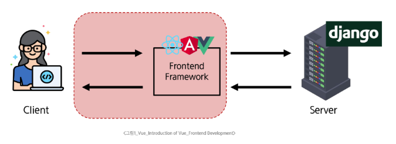
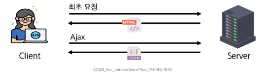
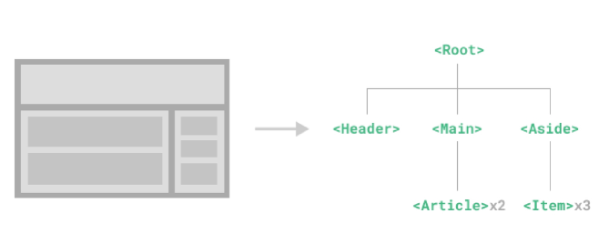
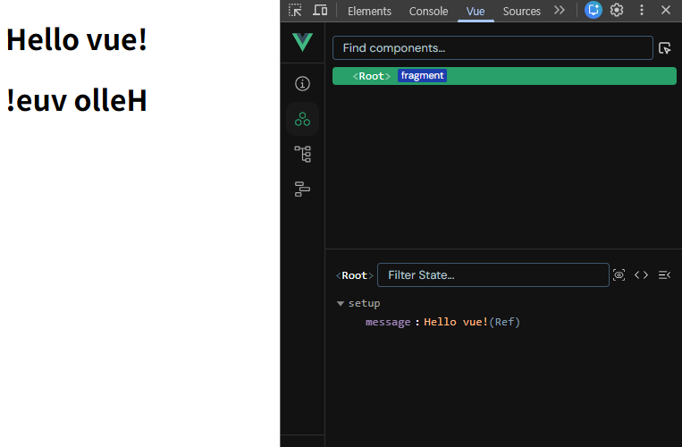
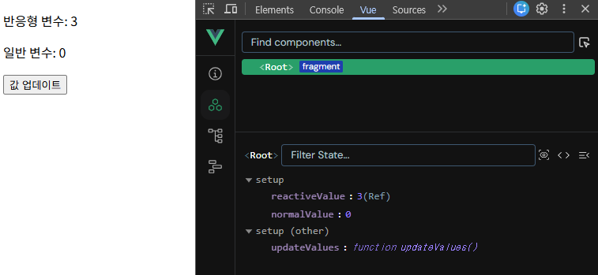

# Vue.js 개요 및 기초

## 1. Frontend Development

### 프론트엔드 개발의 정의 (UI/UX)

- 웹사이트와 웹 애플리케이션의 사용자 인터페이스 (UI)와 사용자 경험 (UX)을 만들고 디자인 하는 것
- HTML, CSS, JavaScript 등을 활용하여 사용자가 직접 상호작용하는 부분을 개발한다.



Frontend Development

### Client-side Frameworks

- **클라이언트 측**에서 UI와 상호작용을 개발하기 위해 사용되는 JavaScript 기반 프레임워크
    - Vue, React, Angular 등
- 웹 애플리케이션 (Web applications): 대화형 웹 사이트
- 컴포넌트 기반의 아키텍처와 모듈화된 코드 구조로 코드 재사용성이 증가한다.

### SPA (Single Page Application)

- 단일 페이지에서 동작하는 웹 애플리케이션
1. 최초 로드 시, 어플리케이션에 필요한 주요 리소스를 다운로드한다.
2. 페이지 갱신에 대해 필요한 데이터만을 비동기적으로 전달받아 필요한 부분만 동적으로 갱신한다.
    1. AJAX를 사용해 필요한 데이터만 비동기적으로 로드
    2. 페이지 전체를 다시 로드할 필요가 없다.
3. JavaScript를 사용하여 클라이언트 측에서 동적으로 콘텐츠를 생성하고 업데이터한다.
    1. CSR 방식

### CSR (Client Side Rendering)

- 클라이언트에서 콘텐츠를 렌더링하는 방식
1. 사용자가 웹사이트에 요청을 보낸다.
2. 서버는 **최소한의 HTML과 JavaScript 파일**을 클라이언트로 전송한다.
3. 클라이언트는 HTML과 JavaScript 파일을 다운로드 받는다.
4. 브라우저가 JavaScript를 실행하여 동적으로 페이지 콘텐츠를 생성한다.
5. 필요한 데이터는 API를 통해 서버로부터 비동기적으로 가져온다.



CSR 작동 예시

### CSR과 SPA

- 애플리케이션의 목적, 규모, 성능 및 SEO 요구사항에 따라 적합한 렌더링 방식을 활용할 수 있어야 한다.

**장점**

- 빠른 페이지 전환
- 서버 부하 방지
- Frontend와 Backend의 명확한 분리
    - Frontend는 UI 렌더링 및 사용자 상호 작용 처리, Backend는 데이터 및 API 제공

**단점**

- 초기 로드 속도가 느리다.
- SEO (검색 엔진 최적화) 문제: 검색엔진 입장에서 HTML을 크롤링해야 하는데 아직 콘텐츠가 모두 존재하지 않기 때문

### MPA (Multi Page Application)

- 여러 개의 HTML 파일이 서버로부터 각각 로드
- 사용자가 다른 페이지로 이동할 때마다 새로운 HTML 파일이 로드된다.
- Django의 MTV 패턴

### SSR (Server-side Rendering)

- 서버에서 화면을 렌더링하는 방식
- 모든 데이터가 담긴 HTML을 서버에서 완성 후 클라이언트에게 전달한다.
- SPA 서비스에서도 SSR을 지원하는 프레임워크가 발전하고 있다.
    - Vue의 Nuxt.js, React의 Next.js

---

## Vue.js

### Vue

- 사용자 인터페이스를 구축하기 위한 JavaScript 기반 프론트엔드 프레임워크
- React나 Angular에 비해 문법이 간결하고 직관적이다.
- **선언적 렌더링 (Declarative Rendering)**: 표준 HTML을 확장하는 Vue 템플릿 구문을 사용하여 JavaScript 상태를 기반으로 화면에 출력될 HTML을 선언적으로 작성한다.
- **반응성 (Reactivitry)**: JS 상태 변경을 추적하고, 변경사항이 발생하면 자동으로 DOM을 업데이트한다.

### Component

- 재사용 가능한 코드 블록
- UI를 독립적이고 재사용 가능한 일부분으로 분할하고, 각 부분을 개별적으로 다룰 수 있다.
- 애플리케이션은 중첩된 Component의 트리 형태로 구성된다.



Component


## Vue 인스턴스

### Vue Application 생성

1. vue 사용을 위한 CDN 작성
2. Application instance: `const { createApp } = Vue` 
    - **구조 분해 할당**으로 Vue 객체의 createApp 함수를 할당한다.
3. Root Component: `createApp` 함수에는 객체(컴포넌트)가 전달된다.
4. 앱 연결 (Mounting): 각 앱 인스턴스에 대해 `mount()`는 한 번만 호출할 수 있다.
5. `setup()` 함수: 컴포넌트가 동작하기 전에 미리 준비하는 초기 설정
    - 데이터를 정의하거나, 화면에 표시할 값을 계산하거나, 각종 로직(함수)을 준비할 수 있다.
    - 이후 템플릿이나 컴포넌트의 다른 부분에서 바로 사용 가능하다.

```html
<!-- vue CDN -->
<script src="https://unpkg.com/vue@3/dist/vue.global.js"></script>

<div id="app"></div>

<script>
  const { createApp } = Vue

  const app = createApp({
	  setup() {}
	})
	
	app.mount('#app')
</script>
```

## 반응성 (Reactivity)

### `ref()` 함수: 반응형 상태 선언

- `.value` 속성이 있는 ref 객체로 wrapping하여 반환하는 함수
- 일반 JavaScript 변수를 Vue가 변화를 감지할 수 있는 **반응형 객체**로 만들어준다.
- ref로 선언된 변수의 값이 변경되면, 해당 값을 사용하는 템플릿에서 **자동으로 업데이트**된다.
    - 컴포넌트 내에서 변하는 값(예: 숫자, 문자열, input 값 등)의 상태(state, data)를 추적하고 관리하기 위해 사용한다.
- 템플릿의 참조에 접근하려면 setup 함수에서 선언 및 반환 필요
    - 편의상 템플릿에서 ref를 사용할 때는 `.value`를 작성할 필요가 없이, 자동으로 unwrapped 된다.
- **ref 함수는 반응형을 가지는 참조 변수를 만드는 것! (`ref === reactive reference`)**
- createApp()에 전달되는 객체는 Vue 컴포넌트
- 컴포넌트 상태는 setup() 함수 내에서 선언되어야 하며 객체를 반환해야 한다.
- 반환된 객체의 속성은 템플릿에서 사용할 수 있다.
    - Mustache syntax(콧수염 구문, `{{ }}`)을 사용하여 메시지 값을 기반으로 동적 텍스트 렌더링

```html
<div id="app">
  <h1>{{ message }}</h1>
  <h1>{{ message.split('').reverse().join('') }}</h1>
</div>

<script src="https://unpkg.com/vue@3/dist/vue.global.js"></script>
<script>
  const { createApp, ref } = Vue

  const app = createApp({
    setup() {
      const message = ref('Hello vue!')
      // console.log(message)        // ref 객체
      // console.log(message.value)  // Hello vue!
      return {
        message  // message: message (단축 속성)
      }
    }
  })

  app.mount('#app')
</script>
```




### 반응형 변수 vs 일반 변수

- ref는 값이 바뀌면 화면이 실시간으로 업데이트된다.
- 일반 변수는 값이 바뀌어도 화면이 갱신되지 않는다.
- **return에서 사용하는 변수는 ref (반응형 변수)!**

```html
<div id="app">
  <p>반응형 변수: {{ reactiveValue }}</p>
  <p>일반 변수: {{ normalValue }}</p>
  <button v-on:click="updateValues">값 업데이트</button>
</div>

<script src="https://unpkg.com/vue@3/dist/vue.global.js"></script>
<script>
  const { createApp, ref } = Vue

  const app = createApp({
    setup() {
      const reactiveValue = ref(0)
      let normalValue = 0
      const updateValues = function () {
        reactiveValue.value++
        normalValue++
      }
      return {
        reactiveValue,
        normalValue,
        updateValues
      }
    }
  })

  app.mount('#app')
</script>
```



### ref Unwrap 주의사항

- 템플릿에서의 unwrap은 ref가 setup에서 반환된 객체의 최상위 속성일 경우에만 적용된다.
- object는 최상위 속성이지만, object.id는 그렇지 않다. 표현식을 평가할 때 object.id가 unwrap되지 않고 ref 객체로 남아 있기 때문에 `[object Object]`가 출력된다.
- 이 문제를 해결하기 위해서는 , id를 객체에서 분해해 최상위 속성으로 만들어야 한다.
- 단, ref가 {{}}의 최종 평가 값인 경우는 unwrap 가능하다.

```html
<div id="app">
  <!-- unwrap 문제 상황 -->
  <!-- [object Object]1 -->
  <p>{{ object.id + 1}}</p>

  <!-- 해결책 : ref가 최상위 속성이 되어야 함 -->
  <!-- 1 -->
  <p>{{ id + 1 }}</p>

  <!-- 단, ref가 {{}}의 최종 평가 값인 경우는 unwrap 가능 -->
  <!-- 0 -->
  <p>{{ object.id }}</p>
</div>

<script src="https://unpkg.com/vue@3/dist/vue.global.js"></script>
<script>
  const { createApp, ref } = Vue

  const app = createApp({
    setup() {
      const object = {
        id: ref(0)
      }
      const { id } = object
      return {
        object,
        id
      }
    }
  })

  app.mount('#app')
</script>
```

### 반응형인데 왜 `let`이 아니라 `const`인가?

자바스크립트의 메모리 참조 방식 때문이다.

- `ref`는 '상자(Object)'입니다.
- 우리가 `const count = ref(0)`이라고 선언했을 때:
    - `count` 변수는 '값 0'을 직접 가지는 게 아니라, **'0이 들어있는 상자'를 가리키고 있습니다.**
    - 우리는 상자 안의 내용물(`0` → `1`)을 바꾸는 것이지, **상자 자체를 다른 상자로 바꾸는 게 아닙니다.**
    - 따라서 상자를 가리키는 변수 자체는 변하지 않으므로 `const`를 사용합니다.

> 코드적 의미:
> 
> 
> `count.value = 1` (상자 안의 값 변경) → 가능
> 
> `count = ref(2)` (상자 자체를 교체) → const라서 불가능 (에러)
> 

### Event Listener: `v-on`

- `v-on` directive를 사용하여 DOM 이벤트를 수신할 수 있다.
- 함수 내에서 반응형 변수를 변경하여 구성 요소 상태를 업데이트

```html
<div id="app">
  <button v-on:click="increment">버튼</button>
  <p>{{ number }}</p>
</div>

<script src="https://unpkg.com/vue@3/dist/vue.global.js"></script>
<script>
  const { createApp, ref } = Vue

  const app = createApp({
    setup() {
      const number = ref(0)
      const increment = function () {
        // console.log(number) // ref 객체
        number.value++
      }
      return {
        number,
        increment
      }
    }
  })

  app.mount('#app')
</script>
```
