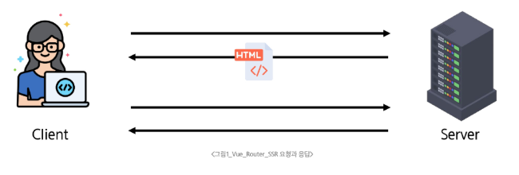
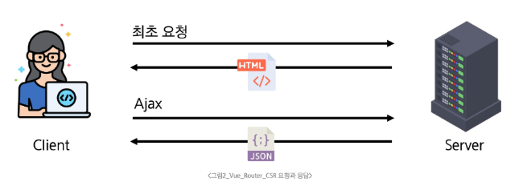
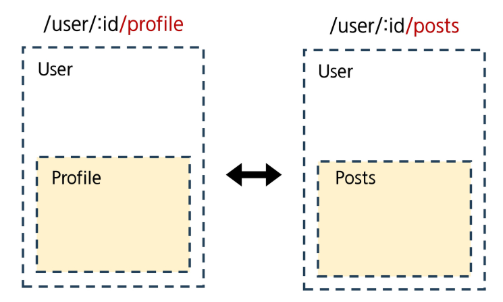

# Vue Router (SPA 라우팅 시스템)

## Routing의 이해

### Routing

- 네트워크에서 경로를 선택하는 프로세스
- 사용자가 접속한 URL 주소에 따라 적절한 페이지 (컴포넌트)를 보여주는 기능

### SSR에서의 Routing

- SSR에서 rounting은 서버 측에서 수행
- 사용자가 방문한 URL 경로를 기반으로 서버가 응답을 전송
- 링크를 클릭하면 브라우저는 서버로부터 HTML 응답을 수신하고,
- 새 HTML 로 전체 페이지를 다시 로드한다.



### CSR에서의  Routing

- CSR에서의 routing은 클라이언트 측(브라우저)에서 수행
- 클라이언트 측 JavaScript가 새 데이터를 동적으로 가져와 전체 페이지를 다시 로드하지 않는다.



### SPA에서 Routing이 없다면?

- 유저가 URL을 통한 페이지의 변화를 감지할 수 없다.
- 페이지가 무엇을 렌더링 중인지에 대한 상태를 알 수 없다.
    - 새로고침하면 처음 페이지로 되돌아감
    - 링크를 공유하면 첫 페이지만 공유 가능
- 브라우저의 뒤로 가기 기능을 사용할 수 없다.
- 페이지는 1개이지만, 주소에 따라 여러 컴포넌트를 새로 렌더링하여 마치 여러 페이지를 사용하는 것처럼 보이도록 해야 한다.

### Vue Router

- Vue.js의 공식 라우팅 라이브러리
    - Vite로 프로젝트 생성 시 ‘Router 추가’ 선택
- Vue로 만든 SPA에서 페이지 이동 기능을 구현할 때 사용한다.
- `<router-link>`: 페이지를 새로고침하지 않는 링크를 만든다.
- `<router-view>`: 현재 URL에 맞는 컴포넌트를 보여준다.

## Vue 프로젝트 구조 변화

### `src/App.vue` -`<RouterLink>`

- 페이지를 다시 로드하지 않고 URL을 변경하여 URL 생성 및 관련 로직을 처리한다.
- RouterLink URL에 해당하는 컴포넌트를 표시한다.
- 원하는 곳에 배치하여 컴포넌트를 레이아웃에 표시할 수 있다.

```html
<!-- App.vue -->
<template>
  <header>
    

    <div class="wrapper">
      <HelloWorld msg="You did it!" />

      <nav>
        <RouterLink to="/">Home</RouterLink>
        <RouterLink to="/about">About</RouterLink>
      </nav>
    </div>
  </header>

  <RouterView />
</template>

```

### `src/router/index.js`

- 라우팅에 관련된 정보 및 설정이 작성되는 곳
- 웹 사이트 여러 페이지들의 주소 목록을 작성 (예: `/`, `home` 등)
- 각 주소로 접속했을 때 어떤 Vue 컴포넌트를 보여줄 지 연결한다.

### `src/views/`

- RouterView 위치에 렌더링 할 컴포넌트를 배치
- 기존 components/ 폴더와 기능적으로 같다.
- 단순 분류의 의미로 구성
    - View는 좀 더 큰 요소 느낌. 페이지 단위
- 일반 컴포넌트와 구분하기 위해 컴포넌트 이름을 View로 끝나도록 작성하는 것을 권장

---

## Vue Router 기본 사용법

### Basic Routing: `RouterLink`, `RouterView`

- `index.js`에 라우터 관련 설정(주소, 이름, 컴포넌트)을 작성한다.

```jsx
// index.js

import { createRouter, createWebHistory } from 'vue-router'
import HomeView from '../views/HomeView.vue'

const router = createRouter({
  history: createWebHistory(import.meta.env.BASE_URL),
  routes: [
    {
      path: '/',
      name: 'home',
      component: HomeView,
    }, ...
  ],
})

export default router
```

- `RouterLink`의 `to` 속성으로 `index.js`에서 정의한 주소 값(path)을 사용한다.
- `RouterLink` 클릭 시 경로와 일치하는 컴포넌트가 RouterView에서 렌더링 된다.

```html
<!-- App.vue -->
<template>
  <header>
    <div class="wrapper">
      <HelloWorld msg="You did it!" />

      <nav>
        <RouterLink to="/">Home</RouterLink>
        <RouterLink to="/about">About</RouterLink>
      </nav>
    </div>
  </header>

  <RouterView />
</template>
```

## 다양한 라우팅 방식

### Named Routes

- routes의 `name` 속성 값에 경로에 대한 이름을 지정하는 것
- `RouterLink`에 `v-bind`를 사용해 `to` props 객체로 전달 가능

```html
<!-- App.vue -->
...
<!-- <RouterLink to="/">Home</RouterLink> -->
<!-- <RouterLink to="/about">About</RouterLink> -->
<RouterLink to="{ name: 'home'}">Home</RouterLink>
<RouterLink to="{ name: 'about'}">About</RouterLink>
...
```

### Dynamic Route Matching

- URL의 일부를 변수로 사용하여 경로를 동적으로 매칭하는 기능
- 매개변수는 콜론(`:`)으로 표기하고, UserView 컴포넌트 라우터를 등록

```jsx
// index.js
import UserView from '@/views/UserView.vue'

const router = createRouter({
  routes: [
    {
      path: '/user/:id',
      name: 'user',
      component: UserView
    }
  ],
})
```

- 매개변수는 객체의 `params` 속성의 객체 타입으로 전달
    - 단, 객체의 `key`이름과 `index.js`에서 지정한 매개변수 이름이 같아야 한다.

```html
<!-- App.vue -->
<RouterLink to="{ name: 'user', params: { id: userId } }">User</RouterLink>

...
<script setup>
import { ref } from 'vue'
const userId = ref(1)
</script>
```

- `userRoute()` 함수를 사용해 스크립트 내에서 반응형 변수에 할당 후 템플릿에 출력
    - 경로가 일치하면 라우트의 매개변수는 컴포넌트에서 `$route.params`로 참조 가능

```html
<!-- views/UserView.vue -->
<template>
  <div>
    <h1>UserView</h1>
    <!-- <h2>{{ $route.params }}번 User 페이지</h2> -->
    <h2>{{ userId }}번 User 페이지</h2>
  </div>
</template>

<script setup> 
import { ref } from 'vue'
import { useRoute } from 'vue-router';

const route = useRoute()
const userId = ref(route.params.id)
</script>
```


### Nested Routes



- 특정 페이지(부모)의 레이아웃은 유지한 채, 내부의 일부 영역만 다른 내용으로 교체하는 라우팅 방식
- 대시보드 형태의 UI를 만들 때 유용하다.
- 컴포넌트 간 부모-자식 관계 관점이 아닌, **URL에서의 중첩된 관계를 표현**하는 관점으로 바라보기
- `components/` 폴더에 컴포넌트 작성 후 `children` 옵션을 사용해 중첩된 라우터에 컴포넌트를 등록한다.
    - 중첩된 Named Routes를 다룰 때 일반적으로 ‘하위 경로에만 이름을 지정’

```jsx
// index.js
import UserProfile from '@/components/UserProfile.vue'
import UserPosts from '@/components/UserPosts.vue'

...
{
  path: '/user/:id',
  // name: 'user',
  component: UserView,
  children: [
    { path: '', name: 'user', component: UserProfile },
    { path: 'profile', name: 'userProfile', component: UserProfile },
    { path: 'posts', name: 'userPosts', component: UserPosts },
  ]
}
```

```html
<!-- UserView.vue -->
<template>
  <div>
    <h1>UserView</h1>
    <h2>{{ userId }}번 User 페이지</h2>
    <RouterLink :to="{ name: 'userProfile' }">Profile</RouterLink>
    <RouterLink :to="{ name: 'userPosts' }">Posts</RouterLink>
  </div>
  <hr>
  <RouterView />
</template>

<script setup> 
import { ref } from 'vue'
import { useRoute, RouterLink, RouterView } from 'vue-router';

const route = useRoute()
const userId = ref(route.params.id)
</script>
```


---

## Programmactic Navigation
- <router-link>를 클릭하는 대신, JavaScript 코드를 통해 특정 URL(페이지)로 이동시키는 기능

### `router.push()`

- 다른 URL로 이동하는 메서드
- history stack에 push하므로 사용자가 뒤로 가기 버튼을 클릭하면 이전 URL로 이동할 수 있다.
- 선언적 표현: `<RouterLink :to='...'>`
- 프로그래밍적 표현: `router.push(...)`

```html
<!-- UserView.vue -->
<template>
	...
  <button @click="goHome">홈으로!</button>
  <RouterView />
</template>

<script setup> 
import { ref } from 'vue'
import { useRoute, useRouter, RouterLink, RouterView } from 'vue-router'
...
const router = useRouter()
const goHome = function () {
  router.push({ name: 'home' })
}
</script>
```

### `router.replace()`

- 현재 위치를 바꾸는 메서드
- history stack에 새로운 항목을 push 하지 않고 다른 URL로 이동
- 이동 전 URL로 **뒤로 가기 불가**
- 선언적 표현: `<RouterLink :to"..." replace>`
- 프로그래밍적 표현: `router.replace(...)`

```html
<!-- UserView.vue -->
<template>
	...
  <button @click="goHome">홈으로!</button>
  <RouterView />
</template>

<script setup> 
import { ref } from 'vue'
import { useRoute, useRouter, RouterLink, RouterView } from 'vue-router'
...
const router = useRouter()
const goHome = function () {
  router.replace({ name: 'home' })
}
</script>
```

---

## route와 router

### route: `useRoute()`

- 현재 활성화된 경로 정보(route)를 담은 route 객체를 반환한다.
- `useRoute()`는 컴포넌트의 setup 함수나 `<script setup>` 최상단에서만 호출해야 한다.

### route 객체

- 현재 URL 상태를 보여주는 역할
    - route 객체 자체가 페이지 이동을 직접 제어할 수는 없다.
- 읽기 전용
- 현재 URL/파라미터쿼리/name/matched 된 라우트 정보를 담고 있다.
- 반응형: URL이 변경되면 route 객체도 자동으로 변경된다.

### router: `useRouter()`

- 라우터 인스턴스 router 객체를 반환한다.
- `useRouter()`는 페이지 이동 등 액션용
- u`serRoute()`는 경로 정보 읽기용

### router 객체

- 애플리케이션 전체 라우팅 로직을 제어할 수 있다.
- 페이지 이동, 네비게이션 관련 메서드 제공
    - router.push(’…’), router.replace(’…’) 등을 통해 프로그래밍적으로 라우트를 변경할 수 있다.
- 네비게이션 가드 등록, 히스토리 제어 등

### route vs router

| 구분 | userRoute()로 얻은 객체 (route) | useRouter()로 얻은 객체 (router) |
| --- | --- | --- |
| 개념 | 현재 경로(페이지) 정보 읽기용 | 전체 라우팅 관리용 인스턴스 |
| 역할 | 현재 상태 확인 | 경로 변경, 이동 |
| 주용도 | `params`, `query`, `name` 등 현재 라우트 정보 확인 | `push`, `replace` 등으로 라우트 변경 (네비게이션) |
| 예제 | `route.params.id` 확인 | `router.push(’/home’)`으로 페이지 이동 |

---

## Navigation Guard

### Navigation Guard

- 특정 URL로 이동하기 전이나 후에 자동으로 실행되는 기능
- Vue Router를 통해 특정 URL에 접근할 때 다른 URL로 redirect 하거나 취소하여 내비게이션을 보호한다.
- 사용자의 로그인 상태나 권한을 확인하여 내비게이션을 허용하거나, 취소하거나, 다른 페이지로 리다이렉트시킬 수 있다.

### Globally Guard (전역 가드)

- 애플리케이션 전역에서 모든 라우트 전환에 적용되는 가드
- 작성 위치: `index.js`
- `beforeEach()`: 다른 URL로 이동하기 직전에 실행되는 함수
    - false 반환: 현재 내비게이션을 취소
    - Route Location 반환: 다른 위치로 redirect
    - return이 없다면, 자동으로 `to` URL Route 객체로 이동

```jsx
router.beforeEach((to, from) => {
	...
	return false 또는 return { name: 'about' }
})
```

- `beforeResolve()`: 내비게이션이 확정되기 직전에 호출
    - 모든 비동기 컴포넌트가 로드되고, 모든 가드가 통과된 상태에서 마지막으로 무언가를 확인하고 싶을 때 사용한다.
    - 페이지에 진입하기 전, 사용자의 권한과 관련된 데이터를 미리 가져오는 등의 작업에 사용
- `afterEach()`: URL이 변경되고 화면 렌더링이 끝난 뒤에 호출
    - 네비게이션을 중단시키거나 변경할 수 없다.
    - 페이지 이동 기록을 logging하거나 이동한 페이지에 맞춰 문서의 제목(`document.title`)을 변경하는 등 후처리 작업에 적합하다.

### Per-route Guard (라우터 가드)

- 특정 라우트에 진입할 때만 실행되도록 라우트 설정 객체에 직접 정의하는 가드
- 작성 위치: `index.js`의 각 routes
- `beforeEnter()`: 특정 라우트에 진입했을 때만 실행되는 함수
    - 다른 URL에서 탐색해올 때만 실행된다.

```jsx
const router = createRouter({
	routes: [
    {
      path: '/user/:id',
      name: 'user',
      component: UserView,
      beforeEnter: (to, from) => {
        ...,
        return false
      }
    }
  ],
})
```

### In-component Guard (컴포넌트 가드)

- 컴포넌트 내에서만 동작하는 가드
- 작성 위치: 각 컴포넌트의 `<script>` 내부
- `onBeforeRouteLeave()`: 현재 라우트에서 다른 라우트로 이동하기 전에 실행
    - 사용자가 현재 페이지를 떠나는 동작에 대한 로직을 처리한다.

```jsx
// UserView.vue
import { onBeforeRouteLeave } from 'vue-router';

onBeforeRouteLeave((to, from) => {
  const answer = window.confirm('정말 떠나실 건가요?')
  if (answer === false) {
    return false
  }
})
```

- `onBeforeRouteUpdate()`: 이미 렌더링 된 컴포넌트가 같은 라우트 내에서 업데이트 되기 전에 실행
    - 라우트 업데이트 시 추가적인 로직을 처리한다.

```jsx

// UserView.vue
import { onBeforeRouteUpdate } from 'vue-router';

const routeUpdate = function () {
  router.push({ name: 'user', params: { id: 100 } })
}

onBeforeRouteUpdate((to, from) => {
  userId.value = to.params.id
})

```

---

## 참고 사항

### Lazy Loading Routes

- Vue 애플리케이션 첫 빌드 시 해당 컴포넌트를 로드하지 않고,
- 해당 경로를 처음 방문할 때 컴포넌트를 로드하는 것
- 빌드할 때 처음부터 모든 컴포넌트를 준비하면 컴포넌트의 크기에 따라 페이지 로드 시간이 길어질 수 있기 때문

```jsx
// index.js
{
  path: '/about',
  name: 'about',
  // route level code-splitting
  // this generates a separate chunk (About.[hash].js) for this route
  // which is lazy-loaded when the route is visited.
  component: () => import('../views/AboutView.vue'),
},
```
