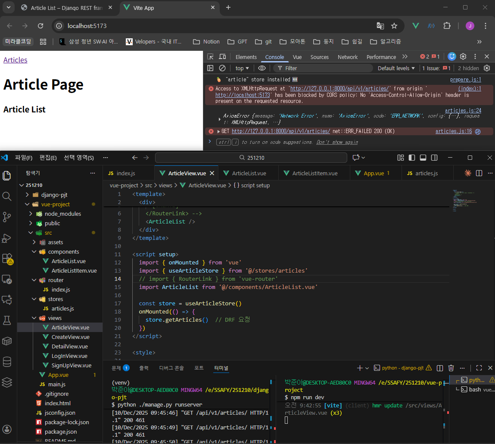
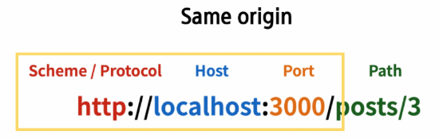
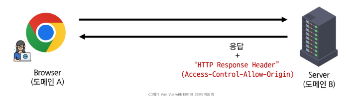
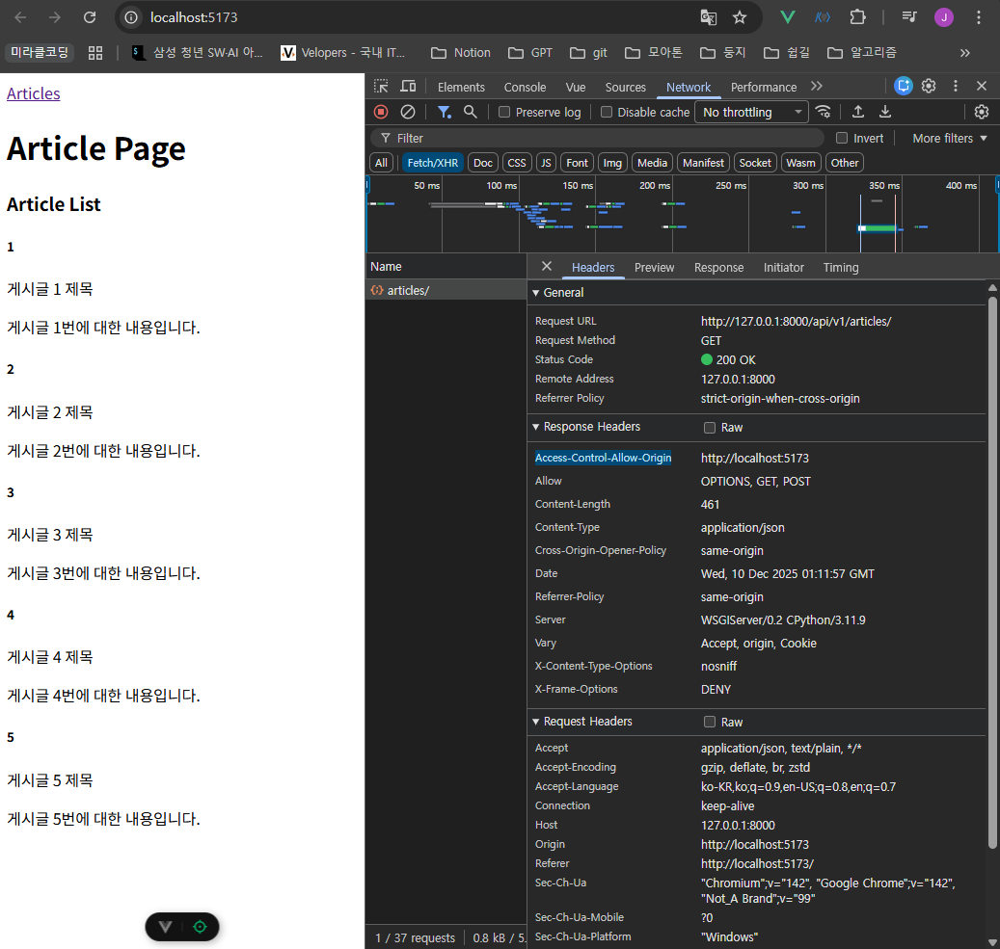
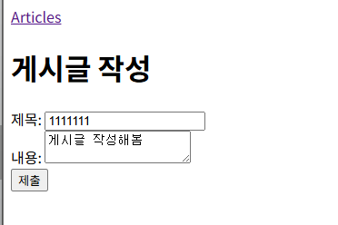
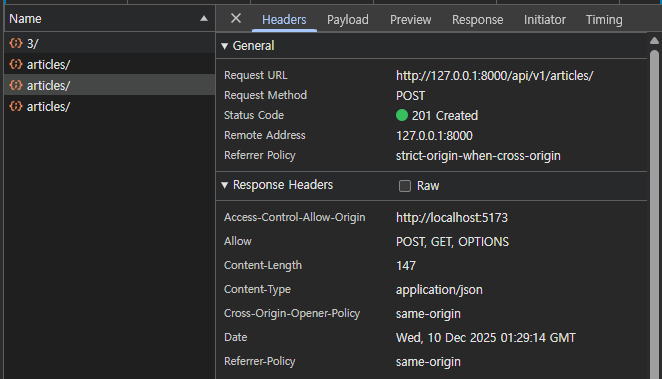
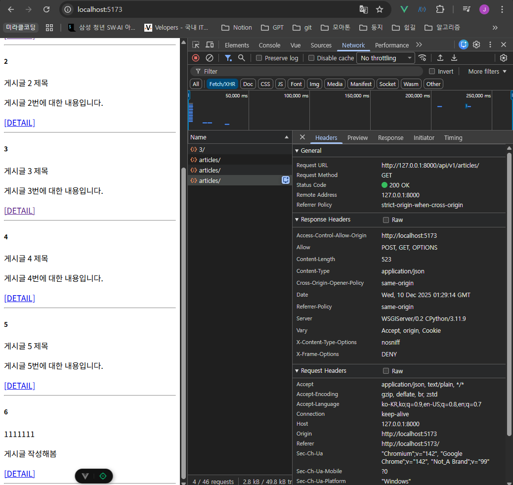

# Vue with DRF (CORS 및 Axios 통신)

## CORS (Cross-Origin Resource Sharing)

### DRF로부터 응답 데이터 받기

- 더미 데이터로 작성한 부분을 DRF 서버에 요청하고 데이터를 응답 받아 store에 저장한다.
- axios를 활용해서 DRF 서버로의 AJAX 요청을 한다.
    - axios: Promise 기반의 HTTP 클라이언트 라이브러리
    - Promise: 자바스크립트에서 비동기 작업의 결과를 나타내는 객체

```jsx
// store/articles.js

import { defineStore } from 'pinia'
import { ref, computed } from 'vue'
import axios from 'axios'

export const useArticleStore = defineStore('article', () => {
  // const articles = ref([
  //   { id: 1, title: 'Article 1', content: 'Article Content 1' },
  //   { id: 2, title: 'Article 2', content: 'Article Content 2' },
  // ])
  const API_URL = 'http://127.0.0.1:8000'
  const articles = ref([])

  const getArticles = function () {
    axios({
      method: 'get',
      url: `${API_URL}/api/v1/articles/`
    })
      .then(res => {
        // console.log(res.data)
        articles.value = res.data
      })
      .catch(err => console.log(err))
  }

  return { articles, API_URL, getArticles }
}, { persist: true })

```

- `getArticles` 함수를 언제 호출할 것인가? → Lifecycle Hooks 사용!
    - ArticleView 컴포넌트가 마운트될 때(`onMounted`) 실행
    - 해당 컴포넌트가 렌더링될 때 항상 최신 게시글 목록을 불러오기 위함

```html
<!-- views/ArticleView.vue -->
<template>
  <div>
    <h1>Article Page</h1>
    <ArticleList />
  </div>
</template>

<script setup>
  import { onMounted } from 'vue'
  import { useArticleStore } from '@/stores/articles'
  import ArticleList from '@/components/ArticleList.vue'

  const store = useArticleStore()
  onMounted(() => {
    store.getArticles()  // DRF 요청
  })
</script>
```



실행 결과: django에서는 200(성공) 응답했으나, vue에서는 CORS policy에 의해 차단

- `200 OK`: DRF 서버는 문제 없이 응답했다.
- 서버는 응답했으나, 브라우저 측에서 거절한 것

```html
Access to XMLHttpRequest at 'http://127.0.0.1:8000/api/v1/articles/' 
from origin 'http://localhost:5173' has been blocked by CORS policy: 
No 'Access-Control-Allow-Origin' header is present on the requested resource.
```

### SOP (Same-Origin Policy)

- 다른 출처의 리소스와 상호작용하는 것이 기본적으로 제한된다.
    - 다른 곳에서 가져온 자료는 일단 막는다.
- 웹 브라우저는 기본적으로 같은 출처에서 요청하는 것만 허용한다.
- 사용자의 개인 정보와 데이터의 보안을 보호하고, 잠재적인 보안 위협을 방지하기 위함
- Origin (출처): URL의 **Protocol, Host, Port**를 모두 포함하여 ‘출처’라고 부른다.
    - 세 영역이 일치하는 경우에만 ‘동일 출처’로 인정한다.



### CORS (Cross-Origin Resource Sharing)

- 다른 출처의 자원 공유를 허용하기 위해 서버가 발급하는 ‘허가증’
- 동일 출처 정책(SOP)을 안전하게 우회하고, 서로 다른 서버 간의 통신을 가능하게 해준다.
- 웹 서버가 리소스에 대한 서로 다른 출처 간 접근을 허용하도록 선택할 수 있는 기능을 제공한다.
- CORS Policy는 서버에서 설정된다! 브라우저는 해당 정책을 확인하여 요청이 허용되는지 여부를 결정한다.
    - 다른 출처의 리소스를 불러오려면, 그 다른 출처에서 올바른 CORS header를 포함한 응답을 반환해야 한다.

### CORS 적용 방법



**Server (도메인 B):** 

- HTTP Header에 `Access-Control-Allow-Origin: 도메인 A`가 포함되면, 이제 도메인 A에서의 요청은 서버의 자원에 접근할 수 있다.

Browser (도메인 A):

- Server (도메인 B)에 등록됐기 때문에 안전하게 Server (도메인 B)의 데이터를 사용할 수 있다.

### CORS Header 설정

- Django에서는 django-cors-headers 라이브러리 활용

```bash
$ pip install django-cors-headers
```

```python
# settings.py

INSTALLED_APPS = [
    'articles',
    'accounts',
    'rest_framework',
    'corsheaders',
    ...
]

MIDDLEWARE = [
    'django.middleware.security.SecurityMiddleware',
    'django.contrib.sessions.middleware.SessionMiddleware',
    # CorsMiddleware가 CommonMiddleware보다 위에서 선언되어야 한다.
    'corsheaders.middleware.CorsMiddleware',
    'django.middleware.common.CommonMiddleware',
    ...
]

CORS_ALLOWED_ORIGINS = [
    'http://127.0.0.1:5173',
    'http://localhost:5173',
]
```

- 개발자도구(F12) - Network - Fetch/XHR 에서 응답받은 객체 확인 가능



실행 결과: Response Headers에 Access-Control-Allow-Origin 확인 가능

## Axios를 활용한 데이터 통신

### READ: 단일 게시글 조회 (`GET` 요청)

- `article` 객체는 다른 컴포넌트에서 공통으로 사용하지 않기 때문에, 굳이 pinia에 추가할 필요가 없다.

```html
<!-- views/DetailView.vue -->
<template>
  <div>
    <h1>Detail</h1>
    <div v-if="article">
      <p>글 번호: {{ article.id }}</p>
      <p>제목: {{ article.title }}</p>
      <p>내용: {{ article.content }}</p>
      <p>작성시간: {{ article.created_at }}</p>
      <p>수정시간: {{ article.updated_at }}</p>
    </div>
  </div>
</template>

<script setup>
import axios from 'axios'
import { onMounted, ref } from 'vue'
import { useRoute } from 'vue-router'
import { useArticleStore } from '@/stores/articles'

const store = useArticleStore()
const route = useRoute()
const article = ref(null)

onMounted(() => {
  axios({
    method: 'get',
    url: `${store.API_URL}/api/v1/articles/${route.params.id}/`
  })
    .then(res => {
      article.value = res.data
    })
    .catch(err => console.log(err))
})
</script>
```

- 만약 store에서 `return { API_URL }`을 하지 않은 경우, Request URL에 `undefined`가 섞임


`return { API_URL }`을 하지 않은 경우


`return { API_URL }` 을 하고 옳게 요청한 경우

### CREATE: 게시글 작성 (`POST` 요청)

- `v-model`을 사용해 사용자 입력 데이터를 양방향 바인딩, trim으로 공백 제거
- 게시글 생성이 성공하면 ArticleView 컴포넌트로 이동시킨다.

```html
<!-- views/CreateView.vue -->
<template>
  <div>
    <h1>게시글 작성</h1>
    <form @submit.prevent="createArticle">
      <label for="title">제목: </label>
      <input type="text" id="title" v-model.trim="title">
      <br/>
      <label for="content">내용: </label>
      <textarea type="text" id="content" v-model.trim="content"></textarea>
      <br/>
      <input type="submit">
    </form>
  </div>
</template>

<script setup>
  import { ref } from 'vue'
  import axios from 'axios'
  import { useArticleStore } from '@/stores/articles'
  import { useRouter } from 'vue-router'

  const store = useArticleStore()
  const router = useRouter()

  const title = ref(null)
  const content = ref(null)

  const createArticle = function () {
    axios({
      method: 'post',
      url: `${store.API_URL}/api/v1/articles/`,
      data: {
        title: title.value,
        content: content.value
      }
    }
      .then(res => {
        router.push({ name: 'ArticleView' })
      })
      .catch(err => console.log(err))
  }
</script>
```



게시글 작성



POST 요청: 201 Created



전체 게시글 조회 페이지(ArticleView)로 리다이렉트: 200 OK
