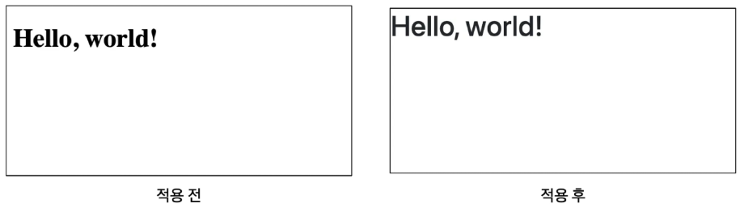
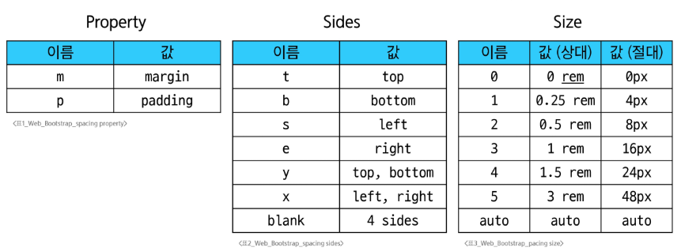
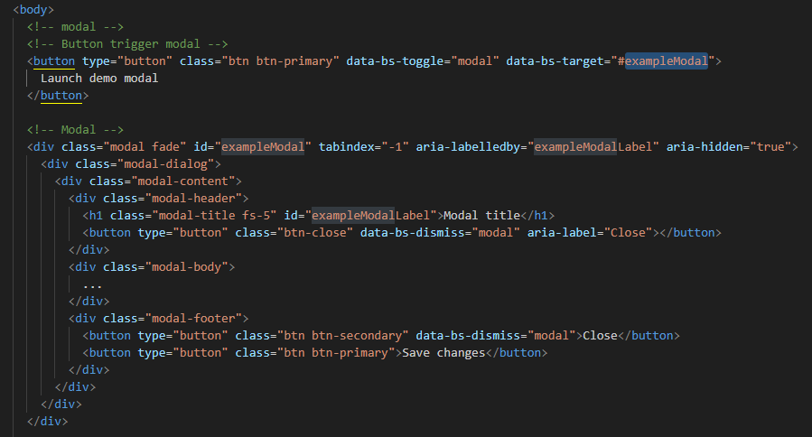
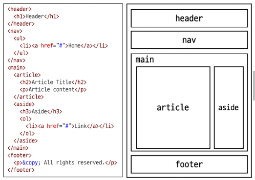

# 스스로 학습
### 시멘틱 태그

**질문**. div는 비시멘틱 태그이다. 그러면 일반적인 블록을 구획할 때, section을 사용해야 하는가?

⇒ **No**. 

- 최상위 구획(큰 틀)에는 시멘틱 태그를 사용해 검색 엔진 최적화를 진행하고, 나머지 작은 구역들에 대해서는 div를 사용할 수 밖에 없다.
- 가능한 한 의미론적 요소들(정해진 태그)을 사용할 것.
    
    (그렇다고 임의로 태그 이름을 지정해서 사용할 수는 없다.)
    

# 실습

## Breakpoints

### `@include media-breakpoint-up(sm)` (Sass 믹스인)

이 코드는 부트스트랩의 Sass 환경에서 사용하는 **편리한 단축 명령어(Mixin)** 입니다.

- **의미**: "소형(sm) 화면 크기(`576px`) 이상일 때"를 의미합니다.
- **장점**: `576px` 같은 정확한 픽셀 값을 외울 필요 없이 `sm`, `md`, `lg`처럼 직관적인 이름을 사용할 수 있어 코드가 간결하고 유지보수가 쉽습니다.
- **단점**: 웹 브라우저가 직접 이해하지 못하므로, 반드시 Sass 컴파일러를 통해 표준 CSS로 변환하는 과정이 필요합니다.

### `@media (min-width: 576px)` (표준 CSS 미디어 쿼리)

이 코드는 모든 웹 브라우저가 이해할 수 있는 **표준 CSS 문법**입니다.

- **의미**: "최소 너비가 `576px` 이상인 화면일 때"를 의미하며, 위 Sass 코드의 최종 결과물입니다.
- **장점**: 별도의 변환 과정 없이 모든 HTML 파일에 바로 적용할 수 있고, 모든 웹 환경에서 작동합니다.
- **단점**: `576px`, `768px` 등 각 중단점(breakpoint)의 정확한 수치를 기억하고 직접 입력해야 해서 코드가 길어지고 실수가 발생할 수 있습니다.

### 2636.  Bootstrap 문법 실습 예제

```html
<!DOCTYPE html>
<html lang="en">
<head>
  <meta charset="UTF-8">
  <meta http-equiv="X-UA-Compatible" content="IE=edge">
  <meta name="viewport" content="width=device-width, initial-scale=1.0">
  <title>Document</title>
  <link href="https://cdn.jsdelivr.net/npm/bootstrap@5.3.8/dist/css/bootstrap.min.css" rel="stylesheet" integrity="sha384-sRIl4kxILFvY47J16cr9ZwB07vP4J8+LH7qKQnuqkuIAvNWLzeN8tE5YBujZqJLB" crossorigin="anonymous">
  <style>
    div {
      width: 100px;
      height: 100px;
      background-color: skyblue;
      border: 1px solid black;
    }

    .margin-class {
      margin: 0px;
    }
      
    @media (min-width: 768px) {
      .margin-class {
        margin: 24px;
      }
    }
    
    @media (min-width: 1200px) {
      .margin-class {
        margin: 48px;
      }
    }

    </style>
</head>

<body>
  <div class="margin-class">
    <span>div</span>
  </div>
  <script src="https://cdn.jsdelivr.net/npm/bootstrap@5.3.8/dist/js/bootstrap.bundle.min.js" integrity="sha384-FKyoEForCGlyvwx9Hj09JcYn3nv7wiPVlz7YYwJrWVcXK/BmnVDxM+D2scQbITxI" crossorigin="anonymous"></script>
</body>
</html>
```

<br><br>

# 수업 필기
## Bootstrap

[Bootstrap 바로가기](https://getbootstrap.com/docs/5.3/getting-started/introduction/)

CSS **프론트엔드 프레임워크** (Toolkit)

- 미리 만들어진 다양한 디자인 요소들을 제공하여 웹 사이트를 빠르고 쉽게 개발할 수 있도록 함
- 현재 가장 인기있는 프론트엔드 프레임워크
- CSS와 JavaScript로 만들어져 있다.
    - CSS - 클래스 선택자로 스타일 및 레이아웃을 정의해둠.
    - `link`와 `script` 태그로 HTML에 추가하여 사용할 수 있다.



### CDN (Content Delivery Network)

- 서버와 사용자 사이의 **물리적인 거리를 줄여** 콘텐츠 로딩에 소요되는 시간을 최소화하는 기술
- 지리적으로 사용자와 가까운 CDN 서버에 콘텐츠를 저장해서 사용자에게 전달한다.
- 웹 페이지 로드 속도를 높임

### Bootstrap 사용 가이드

클래스 이름: `{property}{side}-{size}`

- 로컬 클래스 이름과 겹치더라도, bootstrap의 스타일을 적용하기 위해 (우선순위를 높게 하기 위해) `!important`이 선언되어 있다.

```css
.mt-5 {
	margin-top: 3rem !important;
}
```



### Reset CSS

모든 HTML 요소 스타일을 **일관된 기준으로 재설정**하는 간결하고 압축된 규칙 시트

- user agent stylesheet: 모든 문서에 기본 스타일을 제공하는 기본 스타일 시트
    - 모든 브라우저는 각자의 ‘user agent stylesheet’를 가지고 있다. (브라우저마다 다르다!)
    - 모든 브라우저에서 웹사이트를 동일하게 보이게 만들어야 하는 개발자에겐 골치 아픈 일…
- 모든 브라우저에서 똑같은 스타일 상태로 만들고 스타일 개발을 시작하기 위함

**Normalize CSS**

- 웹 표준 기준으로 브라우저 중 하나가 불일치한다면 차이가 있는 브라우저를 수정하는 방법
- bootstrap이 사용하고 있는 Reset CSS 방법. 가장 대중적인 방법.
    - bootstrap-reboot.css 파일에서 normalize.css를 자체적으로 커스텀하고 있음

### Bootstrap 활용

**Typography**: 문자 관련 요소

- 제목, display heading, inline 텍스트, 목록 등

**Colors**: 색상 이름을 목적/용도/의미의 관점에서 지었다.

- primary, warning, danger, success 등

**Component**: UI 관련 요소

- alerts, badges, cards, navbar 등
- **반응형** 요소들(예: carousel, modal 등)은 JavaScript를 활용해서 만들어짐
    - 내가 타겟하는 요소의 **id가 옳게 설정되어 있는지** 확인! (`data-bs-target` 등)
- modal 사용 시 주의사항
    - modal과 modal button이 반드시 함께 다닐 필요가 없다.
    - 다른 코드들과 중첩될 경우 modal이 어떤 배경 뒤로 숨겨질 수 있다.
    
    → modal은 주로 body 태그의 최하단에 넣어 레이아웃 파악에 방해되지 않게 한다.
    



## Semantic Web

웹 데이터를 **의미론적으로 구조화**된 형태로 표현하는 방식

- 요소의 시각적 측면이 아닌 요소의 목적과 역할, 의미에 집중하는 방식

### HTML Semantic Element

기본적인 모양과 기능 이외의 **의미**를 가지는 HTML 요소

- 검색엔진 및 개발자가 웹 페이지의 콘텐츠를 이해하기 쉽게 해준다.
    - 검색엔진이 시멘틱 태그를 분석하기 때문에, 마케팅에 **검색엔진 최적화(SEO)**를 사용하기도 한다.
- semantic 요소가 브라우저에 보여질 때는 div 요소와 똑같이 나오게 된다.

**예시**



- `header` 소개 및 탐색에 도움을 주는 콘텐츠
- `nav` 현재 페이지 내, 또는 다른 페이지로의 링크를 보여주는 구획
- `main` 문서의 주요 콘텐츠
- `article` 독립적으로 구분해 배포하거나 될 수 있는 구성의 콘텐츠 구획
- `section` 문서의 독립적인 구획. 더 적합한 요소가 없을 때 사용한다.
- `aside` 문서의 주요 내용과 간접적으로만 연관된 부분
- `footer` 가장 가까운 조상 구획(main, article 등)의 작성자, 저작권 정보, 관련 문서

### OOCSS (Object Oriented CSS)

객체 지향적 접근법을 적용하여 CSS를 구성하는 방법론

- CSS 방법론: CSS를 효율적이고 유지보수가 용이하게 작성하기 위한 일련의 가이드라인
1. **구조와 스킨 분리**
    - 구조(.button)와 색상(.button-blue)을 나타내는 선택자를 분리
2. **컨테이너와 콘텐츠 분리**
    - 객체에 직접 적용하는 대신 객체를 둘러싸고 있는 컨테이너에 스타일을 적용
    - 콘텐츠를 다른 컨테이너로 이동시키거나 재배치할 때 스타일이 깨지는 것을 방지


## 참고

### 의미론적 마크업

- 검색엔진 최적화(SEO)
    
    검색 엔진이 해당 웹 사이트를 분석하기 쉽게 만들어 검색 순위에 영향을 준다.
    
- 웹 접근성 (Web Accessibility)
    - 웹사이트, 도구, 기술이 고령자나 장애를 가진 사용자들이 사용할 수 있도록 설계 및 개발하는 것

HTML과 CSS의 책임/역할을 분리할 것.

- HTML: 콘텐츠의 구조와 의미
- CSS: 레이아웃과 디자인