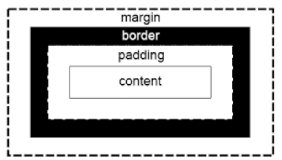

# 스스로 학습

## CSS
### [폰트 스택(Font Stack)의 작동 과정과 절차]

```css
.sansserif {
  font-family: Verdana, Arial, Helvetica, sans-serif;
}
```

웹 브라우저는 `font-family`에 나열된 글꼴을 **왼쪽부터 순서대로 확인하며 "사용자 컴퓨터에 설치된 첫 번째 글꼴"을 사용한다**. 만약 목록에 있는 글꼴이 전부 없다면, 가장 마지막에 있는 **총칭(Generic) 글꼴** 계열로 표시한다.

1. **1순위 (Verdana) 확인**: 브라우저는 `.sansserif` 클래스가 적용된 텍스트를 화면에 표시하기 위해, 먼저 사용자 컴퓨터에 **'Verdana'** 폰트가 설치되어 있는지 확인합니다.
    - **설치되어 있다면?**: Verdana 폰트로 텍스트를 표시하고, 이 규칙의 나머지 부분(Arial, Helvetica...)은 더 이상 확인하지 않고 **작업을 종료**합니다.
    - **설치되어 있지 않다면?**: 다음 순서로 넘어갑니다.
2. **2순위 (Arial) 확인**: Verdana 폰트가 없었으므로, 브라우저는 두 번째 후보인 **'Arial'** 폰트가 있는지 확인합니다.
    - **설치되어 있다면?**: Arial 폰트로 텍스트를 표시하고 작업을 종료합니다.
    - **설치되어 있지 않다면?**: 다음 순서로 넘어갑니다.
3. **3순위 (Helvetica) 확인**: 앞선 두 폰트가 모두 없었다면, 세 번째 후보인 **'Helvetica'** 폰트가 있는지 확인합니다.
    - **설치되어 있다면?**: Helvetica 폰트로 텍스트를 표시하고 작업을 종료합니다.
    - **설치되어 있지 않다면?**: 다음 순서로 넘어갑니다.
4. **최후의 보루 (sans-serif) 적용**: 만약 Verdana, Arial, Helvetica 폰트가 사용자 컴퓨터에 하나도 없다면, 브라우저는 마지막에 명시된 **`sans-serif`** 를 사용합니다.
    - `sans-serif`는 특정 폰트 이름이 아니라 '고딕체 계열'을 의미하는 **총칭(Generic family)** 입니다.
    - 브라우저는 해당 운영체제(Windows, macOS 등)에 설정된 기본 '고딕체' 폰트(예: 맑은 고딕, Apple SD Gothic Neo 등)로 텍스트를 안전하게 표시해 줍니다. 이렇게 하면 최소한 디자이너가 의도한 '깔끔한 고딕체'라는 느낌은 유지할 수 있습니다.

### 결합자

| 결합자 | 적용 범위 | 예시 |
| --- | --- | --- |
| 일반 **형제** 결합자 `~` | 특정 요소 뒤에 오는 **모든** 형제 요소를 선택 | `h1 ~ p { font-style: italic; }` |
| 인접 **형제** 결합자 `+` | 특정 요소 바로 **뒤에 따라오는 형제 요소 하나**만 선택 | `h1 + p { font-weight: bold; }` |
- 결합자 여러 개를 사용 (chaining)

```css
.container section p {
color: red;
}
```

### CSS 가상 클래스, `:first-child`

- 특정 부모 요소 안에서 **첫 번째 자식인 요소를 선택**하는 CSS **가상 클래스(Pseudo-class)**
- 조건이 일치할 때에만 실행한다.

```css
.outer-box > div:first-child {
  text-align: center;
  color: red;
}
```

⚠️ **가장 흔한 오해**: `p:first-child`는 `<p>` 태그 중에서 첫 번째 것을 고르는 것이 아니라, **어떤 요소든 상관없이 '첫 번째 자식'인데, 마침 그 요소가 `<p>` 태그일 경우**에만 선택된다는 점을 기억하는 것이 중요합니다.

<br><br>

# 수업 필기
## 웹 스타일링 - CSS

### CSS (Cascading Style Sheet)

웹 페이지의 디자인과 레이아웃을 구성하는 언어

- 쉼표(`,`)없이 **공백**으로 구분한다.

### CSS 적용 방법

스타일 적용 우선순위는 **인라인 > 내부 > 외부 순**으로 적용된다.

1. 인라인(Inline) 스타일: `style=""` 속성 사용
    - 가독성이 떨어진다.
    - 유지보수, 재사용성에 비효율적

```html
<h1 style="color: blue; background-color: yellow;">Inline Style</h1>
```

1. 내부(Internal) 스타일 시트: <head> 안에서 `<style></style>` 태그 사용

```html
<head>
  <style>
    h2 {
      color: red;
      background-color: black;
    }
  </style>
</head>
```

1. 외부(External) 스타일 시트: 별도의 CSS 파일에 정의, HTML의 `<link>`태그 사용

```html
<head>
  <link rel="stylesheet" href="style.css">
</head>
```

```css
# style.css
h3 {
  color: violet;
  background-color: aqua;
}
```


### CSS 기본 구조와 문법


- 선택자(Selector): 누구를 꾸밀지. HTML 요소를 선택하여 스타일을 적용할 수 있도록 한다.
- 선언(Declaration): 어떻게 꾸밀지. 속성-값 쌍으로 이루어지며 세미콜론 `;`으로 끝남
- 속성(Property): 스타일링하고 싶은 기능이나 특성
    - font-size, background-color, width, margin, padding 등
- 값(Value): 속성에 적용할 구체적인 설정
    - 절대 단위: `px, pt, cm 등`
    - 상대 단위: `%, em, rem, vw, vh 등`

### CSS Selectors (선택자)

**기본 선택자**

| 선택자 | 적용 범위 | 예시 |
| --- | --- | --- |
| 전체 선택자 `*` | HTML 모든 요소를 선택 | `* { color: red; }` |
| 요소(태그) 선택자 | 지정한 모든 태그를 선택 | `h2 { color: orange; }` |
| **클래스 선택자 `.`** | 주어진 클래스 속성을 가진 모든 요소를 선택 | `.green { color: green; }` |
| 아이디 선택자 `#`  | 주어진 아이디 속성을 가진 요소를 선택. 문서에는 주어진 아이디를 가진 요소가 **하나만** 있어야 한다. | `#purple { color: purple; }` |
| 속성 선택자 `[]`  | 주어진 속성이나 속성값을 가진 모든 요소를 선택. 속성의 존재 여부, 값의 일치/포함 등 다양한 조건으로 요소를 정교하게 선택 가능. | `[class^="y"] { color: yellow; }` |

**결합자 (combinators)**

| 결합자 | 적용 범위 | 예시 |
| --- | --- | --- |
| 자식 결합자 `>`  | 첫 번째 요소의 직계 자식만 선택 | `.green > span { font-size: 50px; }` |
| 자손 결합자 `" " (space)`  | 첫 번째 요소의 자손 요소들을 선택 | `.green li { color: brown; }` |

### 값의 단위 (Units)

| 단위 | 기준 | 특징 |
| --- | --- | --- |
| `px` | 화면의 픽셀. 절대 단위. | 직관적, 고정된 크기. 반응형 디자인에 한계 |
| `em` | 부모(parent) 요소의  font-size. 상대 단위 | em 단위를 사용하는 요소가 중첩되면 기준 크기가 계속 변경되어 예측이 어려워진다. (중첩 문제) |
| `rem` | root em. 최상위 요소(root element)인 <html>의 font-size | 기본 16px. 일관성 및 예측 가능, 유지보수 용이성, 접근성 향상 |
| `%` | 부모 요소의 크기 | 유동적. |

### 명시도 (Specificity)

결과적으로 요소에 적용할 CSS 선언을 결정하기 위한 알고리즘

- cascade: 한 요소에 **동일한 가중치**를 가진 선택자가 적용될 때, **마지막에 나오는 선언**이 사용된다.
    - 선언 순서가 중요하다!
- CSS Selector에 **가중치**를 계산하여 어떤 스타일을 적용할지를 결정한다.
    1. `!important`
        - cascade의 구조를 무시하고 강제로 스타일을 적용하는 방식이므로 **지양**할 것.
    2. Inline 스타일
    3. 선택자: `id 선택자` > `class 선택자` > `요소 선택자`
    4. 소스 코드 선언 순서

### CSS 상속

- 상속 되는 속성: 텍스트 등
    - text 관련 요소 `font, color, text-align`
    - `opacity, visibility` 등
- 상속 되지 않는 속성: 배치, 구조 등
    - box model 관련 요소 `width, height, border, box-sizing`
    - position 관련 요소 `position, top/right/bottom/left, z-index`
    - `inherit` 키워드를 사용하여 명시적으로 상속받게 할 수 있다.

## CSS Box Model

웹 페이지의 모든  HTML 요소를 감싸는 사각형 상자 모델

- 모든 요소는 ‘네모’로 생겼다.

### Box 구성 요소




- Margin: 박스와 다른 요소와의 외부 간격
- Border: content와 padding을 감싸는 테두리
- Padding: content와 border 사이의 내부 여백
- Content: 실제 내용이 위치하는 영역
    - `width/height`
- 방향별 속성 값: `top/bottom/right/left`
    - `auto` 좌우 균등 분배 (반응형, 수평정렬)

### Shorthand (단축) 속성

- `border: 2px solid black;`
    - border-width, border-style, border-color를 한번에 설정
    - 작성 순서는 영향을 주지 않는다.
- `margin: 10px 20px 30px 40px;`, `padding: 10px 20px 30px 40px;`
    - 속성 개수에 따라 상/우/하/좌, 상/좌우/하, 상하/좌우, 공통

### Box 크기 계산법

- CSS는 기본적으로 content box 크기를 width 값으로 지정한다.
- 일반적으로 사람이 생각하기에는 width는 border box 크기로 생각한다.

⇒ `* { box-sizing: border-box; }` border box를 기준으로 높이/너비를 계산한다.

## 참고

### 명시도 관련 사이트

- 그림으로 보는 명시도 | https://specifishity.com/
- 명시도 계산기 | https://specificity.keegan.st/

### CSS 스타일 가이드

- 들여쓰기는 공백 2칸
- 선택자와 속성은 새 줄에 작성 (줄바꿈)
- 중괄호 앞에는 공백 넣기
- 속성 뒤에는 콜론 `:`과 공백 넣기, 마지막 속성 뒤에는 세미콜론 `;` 넣기
- **class 선택자를 우선적으로 사용**한다.
    - id, 요소 선택자 등은 가능한 피할 것 (혼합해서 사용할 경우 우선순위가 꼬이기 때문)
    - 이름은 명시적으로 쓰는 것을 추천 (함수 이름처럼 생각하면 됨)
- 하이픈 `-` 사용. ****언더바 `_` 사용 안 함.
- 인라인 스타일은 지양할 것.

### MDN | https://developer.mozilla.org/ko/

Mozilla Developer Network에서 제공하는 온라인 문서

웹 개발자와 디자이너를 위한 종합적인 참고 자료

- 신뢰성 높은 자료이므로 우선적으로 활용할 것.