# 스스로 학습
## Grid system
### 중첩

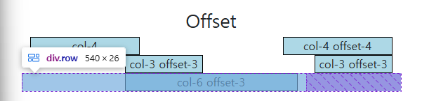

- 중첩된 칸에서 row를 한 번만 선언한 이유는???(의미상 col-6 4개가 한 줄에 배치됨)
    - row를 나눈다는 거는 내용을 분리시킨다는 의미이기 때문에, col-6가 서로 같은 컨텐츠를 담고 있다면 하나의 row로 보는 것이 의미상 적절하다.
    - col이 12칸을 넘어가면 자동으로 다음 줄로 넘어가기 때문에, 굳이 row를 2줄로 선언하지 않는다.
- 중첩된 칸에 새롭게 container를 선언하지 않는 이유는???
    - 작은 영역에서는 굳이 container를 쓰지는 않는다. container 클래스에 margin이 포함되어 있기 때문에 레이아웃을 구성하기 번거로워질 수 있다.

⇒ 레이아웃 설계에 따라 얼마든지 달라질 수 있는 부분. **정답은 없다.**


### Gutter vs. padding & margin
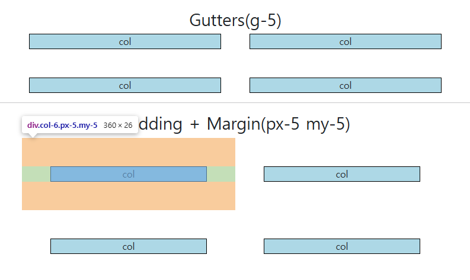

- 코드 예시 (px-5 my-5)
    
    ```html
      <h2 class="text-center">Padding + Margin(px-5 my-5)</h2>
      <div class="container">
        <div class="row">
          <div class="col-6 px-5 my-5">
            <div class="box">col</div>
          </div>
          <div class="col-6 px-5 my-5">
            <div class="box">col</div>
          </div>
          <div class="col-6 px-5 my-5">
            <div class="box">col</div>
          </div>
          <div class="col-6 px-5 my-5">
            <div class="box">col</div>
          </div>
        </div>
      </div>
    ```


<br>

# 수업 필기

## Bootstrap Grid System

웹 페이지의 레이아웃을 조정하는 데 사용되는 **12개의 컬럼**으로 구성된 시스템

- 반응형 디자인을 지원해 웹페이지를 모바일, 태블릿, 데스크탑 등 다양한 기기에서 적절하게 표시할 수 있도록 도와준다.
- 왜 12개??? → 12는 약수가 많은 수이기 때문에 다양한 배치로 활용할 수 있다.

### Grid System 기본 요소

1개의 row안에 12개의 column 영역이 구성된다. 각 요소는 12개 컬럼 중 몇 개를 차지할 것인지 지정된다.

| 기본 요소 | 설명 |
| --- | --- |
| Container | column들을 담고 있는 공간 |
| Column | 실제 컨텐츠를 포함하는 부분 |
| Gutter | 컬럼과 컬럼 사이의 여백 (상하좌우). padding과 margin을 조정해서 할당한다. |

### Bootstrap Grid System 클래스

`container` container로 선언

`row` row로 선언

`col-[칸 수]` 몇 개의 컬럼을 차지할 건지 선언

- 12칸보다 모자라거나 넘치면???
    
     → 모자라면 왼쪽부터 채워진 후 공백. 넘치면 다음 줄로 넘어감
    
- 코드 예시
    
    ```html
      <h2 class="text-center">Basic</h2>
      <div class="container">
        <div class="row">
          <div class="col">
            <div class="box">col</div>
          </div>
          <div class="col">
            <div class="box">col</div>
          </div>
          <div class="col">
            <div class="box">col</div>
          </div>
        </div>
        <div class="row">
          <div class="col-4">
            <div class="box">col-4</div>
          </div>
          <div class="col-4">
            <div class="box">col-4</div>
          </div>
        </div>
        <div class="row">
          <div class="col-2">
            <div class="box">col-2</div>
          </div>
          <div class="col-8">
            <div class="box">col-8</div>
          </div>
          <div class="col-3">
            <div class="box">col-3</div>
          </div>
        </div>
      </div>
    ```
    

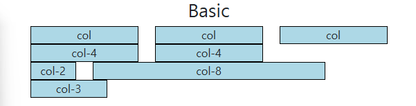

### 중첩 (Nesting)

하나의 column에 또다른 row를 넣으면, **해당 colum은 다시 12개의 column으로 분리된다.**

- 코드 예시
    
    ```html
      <h2 class="text-center">Nesting</h2>
      <div class="container">
        <div class="row">
          <div class="col-4 box">
            <div>col-4</div>
          </div>
          <div class="col-8 box">
            <div class="row">
              <div class="col-6">
                <div class="box">col-6</div>
              </div>
              <div class="col-6">
                <div class="box">col-6</div>
              </div>
              <div class="col-6">
                <div class="box">col-6</div>
              </div>
              <div class="col-6">
                <div class="box">col-6</div>
              </div>
            </div>
          </div>
        </div>
      </div>
    ```
    

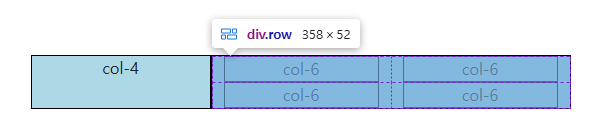


### 상쇄 (Offset)

`offset-[칸 수]`**해당 column의 앞에** [칸 수]만큼의 공백을 준다.

- 코드 예시
    
    ```html
      <h2 class="text-center">Offset</h2>
      <div class="container">
        <div class="row">
          <div class="col-4">
            <div class="box">col-4</div>
          </div>
          <div class="col-4 offset-4">
            <div class="box">col-4 offset-4</div>
          </div>
        </div>
        <div class="row">
          <div class="col-3 offset-3">
            <div class="box">col-3 offset-3</div>
          </div>
          <div class="col-3 offset-3">
            <div class="box">col-3 offset-3</div>
          </div>
        </div>
        <div class="row">
    	    <!-- 앞 공백은 offset, 뒤 공백은 column이 없기 때문에 생긴 것 -->
          <div class="col-6 offset-3">
            <div class="box">col-6 offset-3</div>
          </div>
        </div>
      </div>
    ```
    


### Gutters

row 클래스를 선언한 요소에 `gx-0`, `gy-0`, `g-0` 

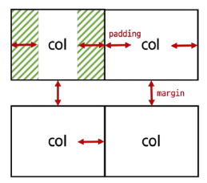

- **x축은 `padding`, y축은 `margin`**으로 여백을 생성한다.
- 실제 컬럼 간에 좌우 간격(x축)은 변하지 않으며, `padding`으로 인해 컬럼 내부 **contents의 너비가 변한다.**
    - 폭은 제한되어 있기 때문에 margin을 사용할 수가 없다.
- 코드 예시 (gx-0)
    
    ```html
      <h2 class="text-center">Gutters(gx-0)</h2>
      <div class="container">
        <div class="row gx-0">
          <div class="col-6">
            <div class="box">col</div>
          </div>
          <div class="col-6">
            <div class="box">col</div>
          </div>
        </div>
      </div>
    ```
    

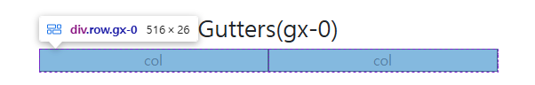

- 코드 예시 (gy-5)
    
    ```html
      <h2 class="text-center">Gutters(gy-5)</h2>
      <div class="container">
        <div class="row gy-5">
          <div class="col-6">
            <div class="box">col</div>
          </div>
          <div class="col-6">
            <div class="box">col</div>
          </div>
          <div class="col-6">
            <div class="box">col</div>
          </div>
          <div class="col-6">
            <div class="box">col</div>
          </div>
        </div>
      </div>
    ```
    

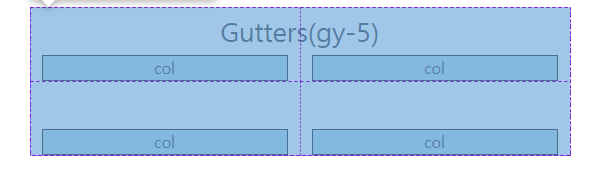

- 코드 예시 (g-5)
    
    ```html
      <h2 class="text-center">Gutters(g-5)</h2>
      <div class="container">
        <div class="row g-5">
          <div class="col-6">
            <div class="box">col</div>
          </div>
          <div class="col-6">
            <div class="box">col</div>
          </div>
          <div class="col-6">
            <div class="box">col</div>
          </div>
          <div class="col-6">
            <div class="box">col</div>
          </div>
        </div>
      </div>
    ```
    

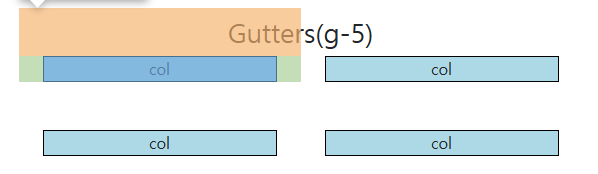


## Grid system for responsive web

### 반응형 웹 디자인 (Responsive Web Design)

다바이스의 종류나 화면 크기에 상관없이, 어디서든 일관된 레이아웃 및 사용자 경험을 제공하는 디자인 기술

- 레이아웃 (Layout): 각 요소의 위치와 크기를 조정하여 웹 페이지의 디자인을 결정하는 것

### Breakpoints

`col-[breakpoints]-[칸 수]`, `offset-[breakpoints]-[칸 수]`

웹 페이지를 다양한 화면 크기에서 적절하게 배치하기 위한 분기점

- 화면 너비에 따라 6개의 분기점 제공
- 각 breakpoints 마다 설정된 최대 너비 값 **“이상으로(and up)”** 화면이 커지면 grid system 동작이 변경된다.
    - 모든 사이즈에 대해 설정하지 않아도 된다.
- `xs`은 사이즈 명시 안함!

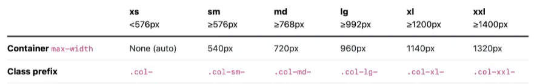

- 코드 예시 (breakpoints)
    
    ```html
      <h2 class="text-center">Breakpoints</h2>
      <div class="container">
        <div class="row">
          <div class="col-12 col-sm-6 col-md-2 col-lg-3 col-xl-4">
            <div class="box">col</div>
          </div>
          <div class="col-12 col-sm-6 col-md-8 col-lg-3 col-xl-4">
            <div class="box">col</div>
          </div>
          <div class="col-12 col-sm-6 col-md-2 col-lg-3 col-xl-4">
            <div class="box">col</div>
          </div>
          <div class="col-12 col-sm-6 col-md-12 col-lg-3 col-xl-12">
            <div class="box">col</div>
          </div>
        </div>
      </div>
    ```
    


- 코드 예시 (breakpoints + offset)
    
    ```html
      <h2 class="text-center">Breakpoints + offset</h2>
      <div class="container">
        <div class="row g-4">
          <div class="col-12 col-sm-4 col-md-6">
            <div class="box">col</div>
          </div>
          <div class="col-12 col-sm-4 col-md-6">
            <div class="box">col</div>
          </div>
          <div class="col-12 col-sm-4 col-md-6">
            <div class="box">col</div>
          </div>
          <div class="col-12 col-sm-4 offset-sm-4 col-md-6 offset-md-0">
            <div class="box">col</div>
          </div>
        </div>
      </div>
    ```
    

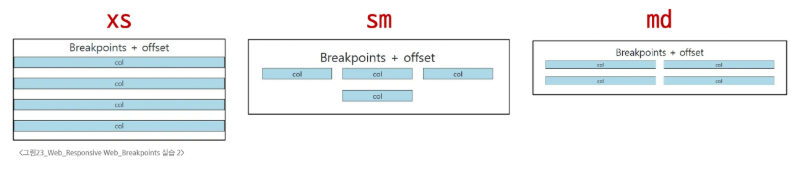

## CSS Layout 종합 정리

position, flexbox, grid system을 적절하게 사용하자.

- position - fixed, absolute
    - navbar, footer 등
- flexbox - 정렬, 공간 배치
    - navbar에 justify-content-between, 좌측 정렬, 좌우 균등 배치 등
- grid system - 컨텐츠 배치, 반응형 웹 디자인
    - col-2 등

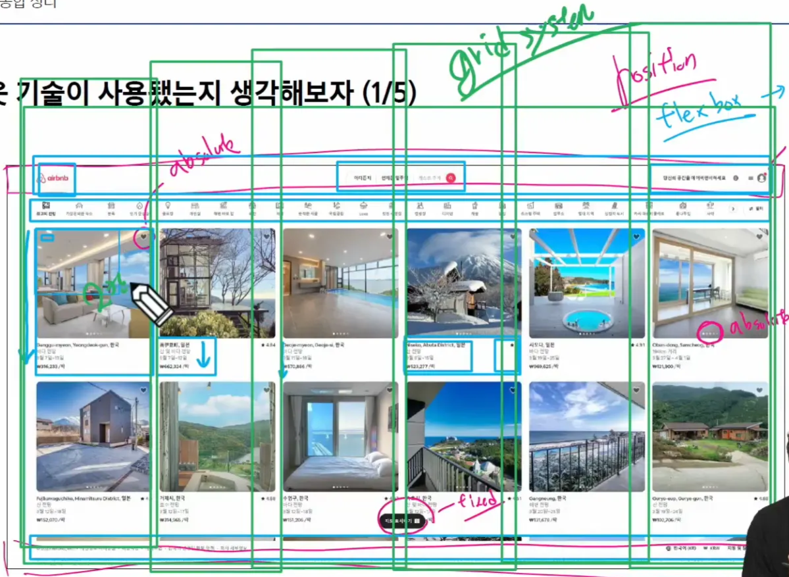

## UX & UI

### UX (User Experience) - 인문학

제품이나 서비스를 사용하는 사람들이 느끼는 전체적인 경험과 만족도를 개선하고 최적화하기 위한 디자인과 개발 분야

- 유저 리서치, 데이터 설계 및 정제, 유저 시나리오, 프로토타입(prototype) 설계
- 직무: UX Researcher, User Researcher
    - 통계 모델 설계, 리서치 기획, 사용자 조사 등

### UI (User Interface) - 기술

서비스와 사용자 간의 상호작용을 가능하게 하는 디자인 요소들을 개발하고 구현하는 분야

- 예쁜 디자인보다는 사용자가 더 쉽고 편리하게 사용할 수 있도록 고려해야 함
- 디자인 시스템, 중간 산출물, 프로토타입이 필요
- 직무: Product Designer, Interaction Designer
    - 개발 가이드, 디자인 컨셉, UI Flow와 사용자 경험 디자인 등

## 참고

### Grid Cards

card일 때, row에서 `row-cols-[컬럼 수]` 클래스를 사용하여 행당 표시할 열(카드) 수를 제어한다.

- 코드 예시
    
    ```html
      <h2 class="text-center">Grid Cards</h2>
      <div class="container">
        <div class="row row-cols-1 row-cols-sm-3 row-cols-md-2 g-4">
          <div class="col">
            <div class="card">
              <div class="card-body">
                <h5 class="card-title">Card title</h5>
                <p class="card-text">This is a longer card with supporting text below as a natural lead-in to additional
                  content. This content is a little bit longer.</p>
              </div>
            </div>
          </div>
          <div class="col">
            <div class="card">
              <div class="card-body">
                <h5 class="card-title">Card title</h5>
                <p class="card-text">This is a longer card with supporting text below as a natural lead-in to additional
                  content. This content is a little bit longer.</p>
              </div>
            </div>
          </div>
          <div class="col">
            <div class="card">
              <div class="card-body">
                <h5 class="card-title">Card title</h5>
                <p class="card-text">This is a longer card with supporting text below as a natural lead-in to additional
                  content.</p>
              </div>
            </div>
          </div>
          <div class="col">
            <div class="card">
              <div class="card-body">
                <h5 class="card-title">Card title</h5>
                <p class="card-text">This is a longer card with supporting text below as a natural lead-in to additional
                  content. This content is a little bit longer.</p>
              </div>
            </div>
          </div>
        </div>
      </div>
    ```
    

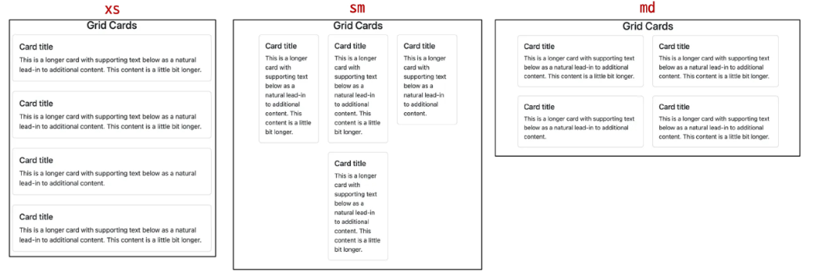

### UI Design Guidelines

기업별로 UI Design Guidelines가 있다.

- [Can’t Unsee](https://cantunsee.space/) : 더 나은 UX/UI를 고민해볼 수 있는 웹 게임