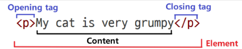
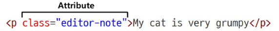

# 스스로 학습
## 태그
### **<dl>: The Description List element**

`<dl>` 설명 목록 요소

`<dt>` 설명 용어 요소

`<dd>` 설명 세부정보 요소

```html
<dl>
  <dt>Firefox</dt>
  <dt>Mozilla Firefox</dt>
  <dt>Fx</dt>
  <dd>
    A free, open source, cross-platform, graphical web browser developed by the
    Mozilla Corporation and hundreds of volunteers.
  </dd>

  <!-- Other terms and descriptions -->
</dl>
```

### 아이디/비밀번호 입력 받기

```html
<!DOCTYPE html>
<html lang="en">
<head>
  <meta charset="UTF-8">
  <meta name="viewport" content="width=device-width, initial-scale=1.0">
  <style>
    label {
      display: block;
    }
  </style>
</head>
<body>
  <div>
    <label for="username">USERNAME : 
      <input type="text" id="username" placeholder="아이디를 입력해주세요.">
    </label>
  </div>
  <div>
    <label for="password">PWD : 
      <input type="password" id="password">
      <button>로그인</button>
    </label>
  </div>
</body>
</html>
```

<br><br>
# 수업 필기

## 웹

### WWW (World Wide Web)

인터넷으로 연결된 컴퓨터들이 정보를 공유하는 거대한 정보 공간

- **Web**: web site, web application 등을 통해 사용자들이 정보를 검색하고 상호작용하는 기술
- **Web site**: 인터넷에서 여러 개의 web page가 모인 것으로, 사용자들에게 정보나 서비스를 제공하는 공간
- **Web page**: HTML, CSS 등의 웹 기술을 이용하여 만들어진, ‘web site’를 구성하는 하나의 요소

### Web page 구성 요소

- HTML - Structure
- CSS - Styling
- JavaScript - Behavior

## 웹 구조화 - HTML

### HTML (HyperText Markup Language)

웹 페이지의 **의미와 구조**를 정의하는 언어

- **HyperText**: 웹 페이지를 다른 페이지로 연결하는 링크
    - **참조**를 통해 사용자가 한 문서에서 다른 문서로 즉시 접근할 수 있는 텍스트
    - 비선형성, 상호연결성, 사용자 주도적 탐색
- **Markup Language**: 태그 등을 이용하여 문서나 데이터의 구조를 명시하는 언어
    - 데이터의 구조와 의미를 정의하는 데 집중
    - ex) HTML, Markdown
    - 프로그래밍 언어로 분류되지 않는다.

**특징**

- 들여쓰기는 출력에 영향을 주지 않는다. 가독성을 위해서 들여쓰기 권장!
- 줄바꿈은 `<br>` 태그를 사용해야 한다. 그렇지 않으면, 그냥 띄어쓰기임.
- 연속된 공백을 하나로 처리한다.
- 에러 메시지를 출력하지 않는다. ⇒ 디버깅은 개발자 도구를 사용

### HTML 구조

- 웹 페이지의 HTML 코드는 `F12(크롬 개발자 도구)`에서 확인 가능

| 태그 | 설명 |
| --- | --- |
| `<!DOCTYPE html>` | 해당 문서가 HTML로 작성한 문서임을 의미 |
| `<html></html>` | 전체 페이지의 콘텐츠를 포함 |
| `<title></title>`  | 브라우저 탭 및 즐겨찾기 시 표시되는 제목으로 사용 |
| `<head></head>` | HTML 문서에 관련된 설명, 설정 등 컴퓨터가 식별하는 **메타데이터**를 작성. 
사용자에게 보이지 않는다. |
| `<body></body>` | HTML 문서의 내용, 페이지에 표시되는 모든 콘텐츠를 작성. 
한 문서에 하나의 body 요소만 존재한다. |

### HTML 요소 (element)

하나의 요소는 **여는 태그**와 **닫는 태그** 그리고 그 안의 **내용**으로 구성된다.

- 닫는 태그가 없는 태그도 존재한다. (내용이 없다.)
    - ex) 



### HTML 속성 (attributes)

사용자가 원하는 기준에 맞도록 요소를 설정하거나 다양한 방식으로 요소의 동작을 조절하기 위한 값

- 나타내고 싶지 않지만 추가적인 기능, 내용을 담고 싶을 때 사용한다.
- CSS에서 스타일 적용을 위해 해당 요소를 선택하기 위한 값으로 활용된다.
    
    
    

**속성 작성 규칙**

- 요소 이름과 속성 사이에 공백이 있어야 한다.
- 하나 이상의 속성들이 있는 경우, 속성 사이에 공백으로 구분한다.
- 속성 값은 열고 닫는 따옴표로 감싸야 한다.

### HTML 태그

| 태그 | 설명 |
| --- | --- |
| `<p></p>` | paragraph. 텍스트 문단 |
| `<a href=""></a>` | anchor. 다른 페이지로 이동시키는 하이퍼링크 태그 |
| ``  | image. `src`(로컬 경로 혹은 웹 경로)에 지정된 그림을 보여주는 태그
`alt`는 대체 텍스트로, 이미지 혹은 경로에 문제가 있을 경우 작동한다. |
| `<h1> ~ <h6>` | heading. 제목 (숫자가 클수록 큰 제목) |
| `<ol>, <ul>, <li>` | ordered lists, unordered lists, lists. |
| `<em>, <strong>` | emphasis & importance. |
- **web 접근성:** 대체 텍스트는 특히 스크린 리더(TTS)에 사용된다.
    - img의 alt속성: 필수는 아니지만 매우 권장된다.
- 의미에 맞는 태그 사용은 스크린 리더, 검색 엔진 최적화(SEO)의 기본이 된다.


### (참고) HTML 스타일 가이드

- 소문자 사용 권장
- 속성 값에는 큰 따옴표 `""`를 사용
- 들여쓰기는 공백 2칸
- 각 요소는 한 줄에 하나씩 작성
- 중첩된 요소는 들여쓰기