# JavaScript - 비동기와 Ajax

## 동기와 비동기

### 동기 (Synchronous)

- 하나의 작업이 **완료된 후에 다음 작업이 실행**되는 방식
- 프로그램의 실행 흐름이 순차적으로 진행

### 비동기 (Asynchronous)

- 한 작업의 완료 여부를 기다리지 않고, 다른 작업을 동시에 수행할 수 있는 방식
- 특정 작업의 실행이 완료될 때까지 기다리지 않고 다음 작업을 즉시 실행하는 방식
- 브라우저는 웹페이지를 먼저 처리되는 요소부터 그려나가며 처리가 오래 걸리는 것들은 별도로 처리가 완료되는대로 병렬적으로 진행

### 동기 vs 비동기

|  | 동기 (Synchronous) | 비동기 (Asynchronous) |
| --- | --- | --- |
| 특징 | 시작 순서대로 처리 (직렬적 수행) | 병렬적 수행 |
| 작업 순서 | 앞의 작업이 먼저 끝나야만 다음 작업을 시작할 수 있다. | 당장 처리를 완료할 수 없는 작업들은 백그라운드에서 실행되며 빨리 완료되는 작업부터 처리한다. |
| 장점 | 단순하고 예측 가능 | 시간이 오래 걸리는 작업을 백그라운드에 위임해 효율성 증가 |
| 단점 | 시간이 오래 걸리는 작업이 실행되면 해당 작업이 끝날 때까지 프로그램 전체가 멈추고, 시스템 자원의 낭비 | 작업의 시작 순서와 완료 순서가 다를 수 있어, 복잡한 흐름과 결과값을 처리해야 하므로 코드의 복잡성 증가 |

### JavaScript Runtime

- JavaScript는 한 번에 하나의 일만 수행할 수 있는 single thread 언어로, 동시에 여러 작업을 처리할 수 없다.
    - single thread: 작업을 처리할 때 실제로 작업을 수행하는 주체
    - 즉, 하나의 작업을 요청한 순서대로 처리할 수 밖에 없다.
- JavaScript가 동작할 수 있는 환경 (Runtime)
    - 브라우저
    - Node.js

### 브라우저 환경에서의 JavaScript 비동기 처리 관련 요소

- JavaScript Engine의 **Call Stack**
    - 코드가 실행되면 함수 호출이 순서대로 쌓이는 작업 공간
    - 기본적인 JavaScript의 single thread 작업 처리
    - 코드 실행하는 애
- **Web API**
    - 시간이 걸리거나 언제 실행될 지 모르는 **비동기 작업들을 처리**하는 곳
    - 브라우저에서 제공하는 runtime 환경
- **Task Queue**
    - Web API 에서 처리가 완료된 작업들이 순서대로 줄을 서서 기다리는 대기열
- **Event Loop**
    - Call Stack이 비어 있는지 계속해서 확인하면서 비는 순간 Task Queue에서 가장 오래된 작업을 콜 스택으로 보내는 역할

### Runtime 예시

```jsx
console.log('Hi')

setTimeout(function myFun() {
	console.log('Work')
}, 3000)

console.log('Bye')
```

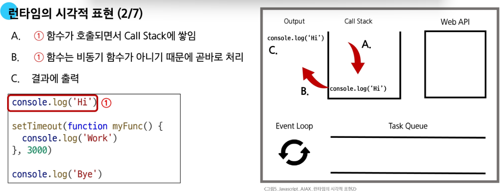

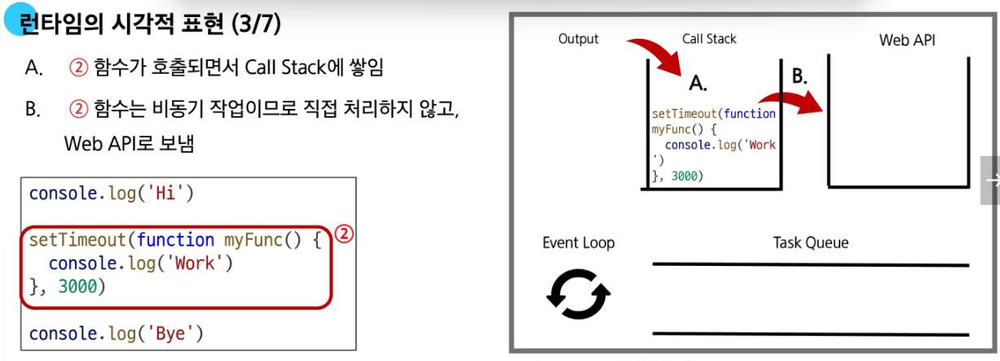

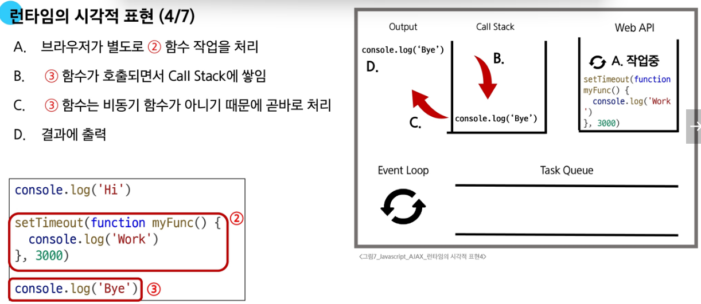

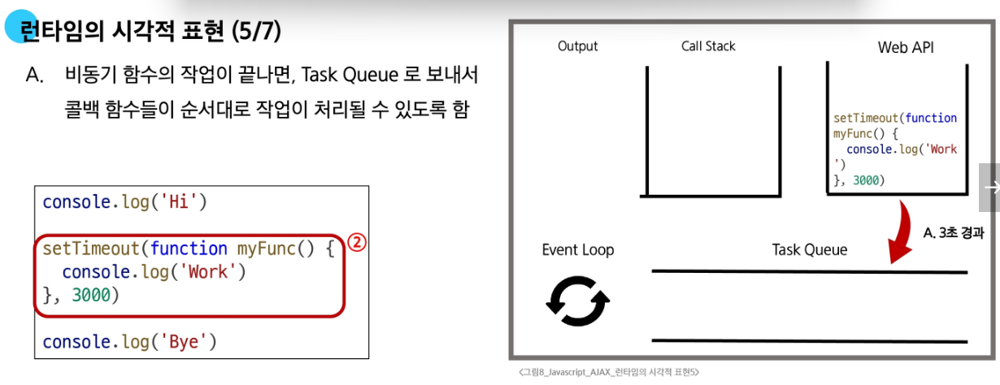

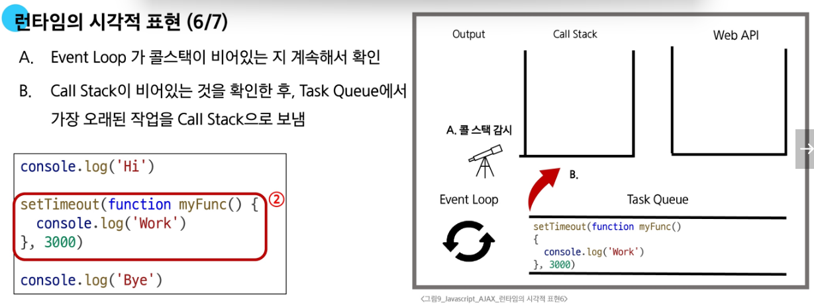

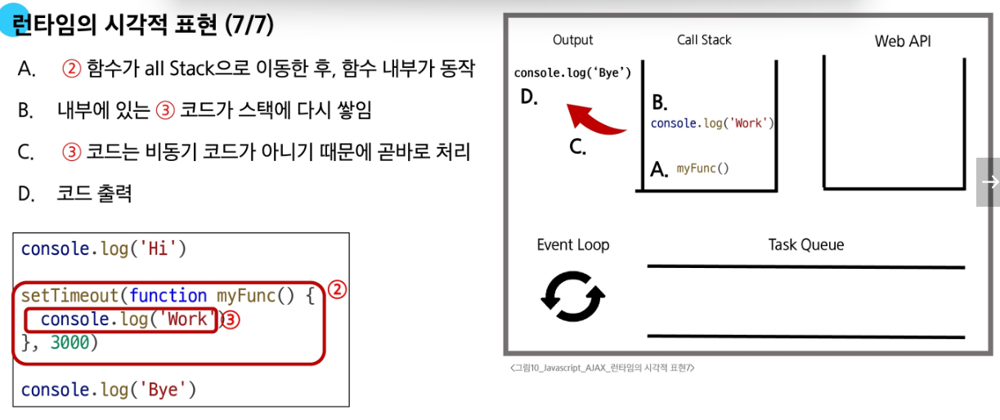

### 비동기 처리 주의사항

- 비동기 처리가 항상 최선은 아니며, 작업의 특성과 데이터의 중요도에 따라 적절히 선택해야 한다.
- 예: 비동기 결제 처리
    - (비동기) 결제 대행사에 결제 요청을 보냄
    - (비동기) 결제 성공/실패 응답을 받음
    - (동기) 응답이 ‘성공’일 경우, 우리 서버 데이터베이스에 주문 상태를 ‘결제 완료’로 기록
    - (동기) 사용자에게 ‘결제 완료’ 페이지를 보여줌

---

## Ajax

### Ajax (Asynchronous JavaScript and XML)

- 비동기적인 웹 애플리케이션 개발을 위한 기술
- 웹 페이지 전체를 새로고침하지 않고, 백그라운드에서 서버와 데이터를 주고받는 **비동기 통신 기술**
- XMLHttpRequest 기술을 사용해 복잡하고 동적인 웹 페이지를 구성하는 방식
- 원래 XML을 의미했지만, 현재는 더 가볍고 JavaScript에서 다루기 쉬운 JSON 형식을 주로 사용한다.
- 목적:
    - 비동기 통신
    - 부분 업데이트
    - 서버 부하 감소

### XHR(XMLHttpRequest) 객체

- JavaScript를 사용하여 서버에 HTTP 요청을 할 수 있는 객체
- 웹 페이지의 전체 새로고침 없이도 서버로부터 데이터를 가져오거나 보낼 수 있다.
- 웹 브라우저와 서버 간의 비동기 통신을 가능하게 하는 JavaScript 객체

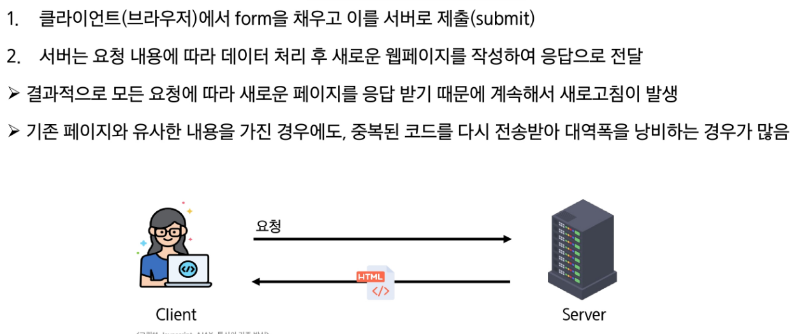

기존 방식


Ajax 방식

### 이벤트 핸들러

- 이벤트가 발생할 때마다 호출되는 함수(콜백 함수)를 제공하는 것
- HTTP 요청은 응답이 올 때까지의 시간이 걸릴 수 있는 작업이라 비동기이며, 이벤트 핸들러를 XHR 객체에 연결해 요청의 진행 상태 및 최종 완료에 대한 응답을 받는다.
- 요청을 보내고 응답을 기다리는 동안 다른 작업을 처리할 수 있다.

### Axios

- 브라우저와  Node.js 환경에서 모두 사용할 수 있는 Promise 기반의 HTTP 클라이언트 라이브러리
- 간편하게 Ajax 통신을 할 수 있도록 도와주는 JavaScript 라이브러리
- 데이터 변환이나 에러 처리 등이 편리해, 많은 실무 프로젝트에서 비동기 HTTP 통신을 위해 가장 인기 있게 사용된다.
- 브라우저를 위한 XHR 객체 생성

**클라이언트-서버 간 동작**

XHR 객체 생성 및 요청 → 응답 데이터 생성 → JSON 데이터 응답 → Promise 객체를 활용해 DOM 조작

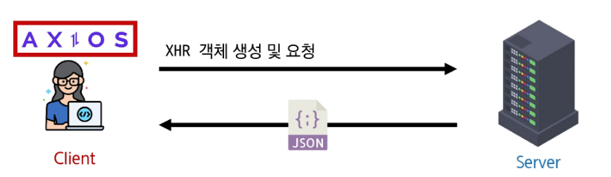

Ajax를 활용한 클라이언트 서버 간 동작

```jsx
axios({
  method: 'get',
  url: 'https://api.thecatapi.com/v1/images/search'
})
  .then((response) => {
    console.log(response)
    console.log(response.data)
  })
  .catch((error) => {
    console.error(error)
  })
```

### Promise

- JS에서 비동기 작업을 처리하기 위한 객체
- 비동기 작업의 최종 완료(또는 실패)와 그 결과값을 나타낸다.
- `then()`: 작업이 성공적으로 완료되었을 때 실행될 콜백 함수를 지정
- `catch()`: 작업이 실패했을 때 실행될 콜백 함수를 지정

```jsx
const promiseObj = axios({
  method: 'get',
  url: 'https://api.thecatapi.com/v1/images/search'
})

console.log(promiseObj) // Promise object

promiseObj
	.then((response) => {
	  console.log(response) // Response object
	  console.log(response.data)  // Response data
	})
	.catch((error) => {
	  console.error(error)
	})
```

### Axios 기본 구조

**성공 처리**

- 서버로부터 받은 응답 데이터를 처리
- then 메서드를 사용해서 성공했을 때 수행할 로직을 작성
- `then(callback)`
    - 요청한 작업이 성공하면 callback 실행
    - callback은 이전 작업의 성공 결과를 인자로 전달 받는다.

**실패 처리**

- 네트워크 오류나 서버 오류 등의 예외 상황을 처리
- catch 메서드를 사용해서 실패했을 때 수행할 로직을 작성
- `catch(callback)`
    - then()이 하나라도 실패하면 callback 실행 (남은 then 중단)
    - callback은 이전 작업의 실패 객체를 인자로 전달 받는다.

### Ajax와 Axios

| Ajax | Axios |
| --- | --- |
| 비동기적인 웹 어플리케이션 개발에 사용하는 기술들의 집합 | 클라이언트 및 서버 사이에 HTTP 요청을 만들고 응답을 처리하는 데 사용되는 JS 라이브러리 (Promise 기반) |
| 개념이자 접근 방식 | 실현하는 구체적인 도구 |

## Callback과 Promise

### 비동기 처리

- 작업이 완료되는 순서에 따라 처리된다.
    - 코드의 실행 순서가 불명확하다.
- 비동기 콜백: 비동기 작업이 완료된 후 실행될 함수를 미리 정의
- Promise: 비동기 작업의 최종 완료 또는 실패를 나타내는 객체

### 비동기 콜백

- 비동기적으로 처리되는 작업이 완료되었을 때 실행되는 함수
- 연쇄적으로 발생하는 비동기 작업을 순차적으로 동작할 수 있게 한다.
- 작업의 순서와 동작을 제어하거나 결과를 처리하는 데 사용
- 비동기 처리를 위한 콜백을 작성할 때 “콜백 지옥(Callback Hell)” 발생

### Promise

- JavaScript에서 비동기 작업의 결과를 나타내는 객체
- 비동기 작업이 완료되었을 때 결과 값을 반환하거나, 실패 시 에러를 처리할 수 있는 기능을 제공
- 콜백 지옥 문제를 해결하기 위해 등장한 비동기 처리를 위한 객체
- ‘작업이 끝나면 실행시켜 줄게’라는 약속
- Promise 기반의 HTTP 클라이언트 라이브러리가 바로 Axios
- 실행 순서의 보장: then/catch 메서드의 콜백 함수는 Event Queue에 배치되는 **순서대로** 엄격하게 호출된다.
- 비동기 작업이 완료된 후에도 then 메서드를 통해 콜백을 추가할 수 있다.

### then & catch의 chaining

- axios로 처리한 비동기 로직은 항상 promise 객체를 반환
    - then과 catch는 모두 항상 promise 객체를 반환
    - 계속해서 **chaining**을 할 수 있다.
- 비동기 작업의 순차적인 처리를 가능하게 한다.
- 코드를 보다 직관적으로 가독성 좋게 작성할 수 있게 한다.

```jsx
// 그러면 모든 곳에 async/await를 도배해야할까? 
// 예시) 1초, 1.5초, 2초 걸리는 작업들을 다 처리한 후에 결과값을 출력해야 하는 경우
function getBurger() {
    return new Promise(resolve => setTimeout(() => resolve("햄버거"), 1000));
}
function getFries() {
    return new Promise(resolve => setTimeout(() => resolve("감자튀김"), 1500));
}
function getCoke() {
    return new Promise(resolve => setTimeout(() => resolve("콜라"), 2000));
}

async function order() {
    console.time("주문 시간");

    const burger = await getBurger(); // 1초 대기
    const fries = await getFries();   // 1.5초 대기
    const coke = await getCoke();     // 2초 대기

    console.log(`${burger}, ${fries}, ${coke}`);
    console.timeEnd("주문 시간"); // 총 4.5초 이상 소요
}

// 함수 실행!
// 워터폴 현상 발생!! => 서로 상관없는 작업들임에도 불구하고, 앞의 작업이 끝날 때까지 기다리는 비효율적인 현상
order();

// 해결 방법) Promise.all 활용
// 순서를 고려하지 않고 호출해도 괜찮은 경우 사용 (함수 호출 순서가 중요하다면 await를 써야함)
// 단점: 하나라도 실패하면 에러 발생 
async function promiseAllOrder() {
    // 1. 주문을 전부 넣음 (Promise 객체 3개가 동시에 생성되면서 작업 시작)
    // await를 붙이지 않았으므로 멈추지 않고 변수에 'Promise 객체'가 담깁니다.
    const burgerPromise = getBurger();
    const friesPromise = getFries();
    const cokePromise = getCoke();

    // 2. Promise.all로 "이 3개가 다 끝날 때까지" 한 번만 기다림
    const [burger, fries, coke] = await Promise.all([getBurger(), getFries(), getCoke()]);

    console.log(result); // ["햄버거", "감자튀김", "콜라"]
    console.timeEnd("주문 시간"); // 약 2초 소요 (가장 오래 걸리는 작업 시간만큼만 걸림)
}

promiseAllOrder();
```

---

## 비동기 팔로우 구현

### axios CDN 작성

- form 요소에 id 속성 지정 및 이벤트 핸들러 할당, actions과 method 속성은 axios로 대체

```html
<!-- accounts/profile.html -->
<h1>{{ person.username }}님의 프로필</h1>
<div>
  팔로워 : {{ person.followers.all|length }} / 팔로우 : {{ person.followings.all|length }}
</div>


  <form id="follow-form"> 
    
    
      <input type="submit" value='UnFollow'>
    
      <input type="submit" value='Follow'>
    
  </form>

<hr>
...

<!-- axios CDN -->
<script src="https://cdn.jsdelivr.net/npm/axios/dist/axios.min.js"></script>
<script>
  // JavaScript 코드를 작성할 영역
  const formTag = document.querySelector('#follow-form')
  console.log(formTag)

  formTag.addEventListener('submit', function(event){
    event.preventDefault()

    axios({
      method: 'post',
      url: `/accounts/${}/follow/`
    })
  })
</script>
```

### `data-*` 속성

- 사용자 지정 데이터 속성을 만들어, HTML과 DOM 사이에서 임의의 데이터를 교환하는 방법
- 모든 사용자 지정 데이터는 JavaScript에서 **dataset 속성**을 통해 접근한다.
- 주의사항
    - 대소문자 여부에 상관없이 ‘xml’ 문자로 시작 불가
    - 세미콜론 포함 불가
    - 대문자 포함 불가
    - 파스칼 케이스로 자동 전환되어 호출된다.

```html
<div data-my-id="my-data"></div>

<script>
    const myId = event.target.dataset.myId
</script>
```

```html
<!-- accounts/profile.html -->

<form id="follow-form" data-user-id="{{ person.pk }}"> 
  ...
</form>

<script>
// JavaScript 코드를 작성할 영역
const formTag = document.querySelector('#follow-form')
console.log(formTag)

formTag.addEventListener('submit', function(event){
  event.preventDefault()
  // 방법1. 이벤트 객체에서 가져오기 (이걸로 써야 한다!)
  const userId = event.currentTarget.dataset.userId

  // 방법2. this에서 가져오기
  //        (화살표 함수로 작성할 때 문제 발생)
  // const userId2 = this.dataset.userId

  // 방법3. formTag에서 직접적으로 가져오기
  //        (변수한테 너무 의존적임)
  // const userId3 = formTag.dataset.userId

  axios({
    method: 'post',
    url: `/accounts/${userId}/follow/`
  })
})
</script>
```

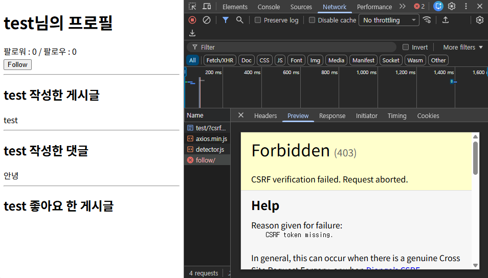

403 Forbidden Error : CSRF 토큰

### CSRF token

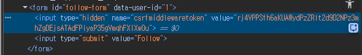

CSRF token이 input hidden 타입으로 작성되어 있다.

- input hidden 타입으로 존재하는 CSRF token 데이터를 axios로 전송해야 한다.
- request JSON의 header에 csft token 데이터를 포함한다.

```jsx
// accounts/profile.html

const csrf_token = document.querySelector('[name=csrfmiddlewaretoken]').value

axios({
  method: 'post',
  url: `/accounts/${userId}/follow/`,
  headers: {'X-CSRFToken': csrf_token}
})
...
```

### 팔로우 버튼 토글

- 팔로우 버튼을 토글하기 위해서는 현재 팔로우 상태인지, 언팔로우 상태인지에 대한 확인이 필요하다.
- Django의 view 함수에서 팔로우 여부를 나타내는 변수 (is_followed)를 추가하여 JSON 형식으로 응답

```python
# accounts/views.py

from django.http import JsonResponse

@login_required
def follow(request, user_pk):
    User = get_user_model()
    person = User.objects.get(pk=user_pk)
    
    if person != request.user:
        if person.followers.filter(pk=request.user.pk).exists():
            person.followers.remove(request.user)
            is_followed = False
        else:
            person.followers.add(request.user)
            is_followed = True
        context = {
            'is_followed': is_followed,
        }
        return JsonResponse(context)
    return redirect('accounts:profile', person.username)
```

```jsx
// accounts/profile.html

  axios({
    method: 'post',
    url: `/accounts/${userId}/follow/`,
    headers: {'X-CSRFToken': csrf_token}
  }).then((response) => {
    const isFollowed = response.data.is_followed
    const followBtn = document.querySelector('input[type=submit]')

    if (isFollowed === true) {
      followBtn.value = "Unfollow"
    } else {
      followBtn.value = "Follow"
    }
  })
```

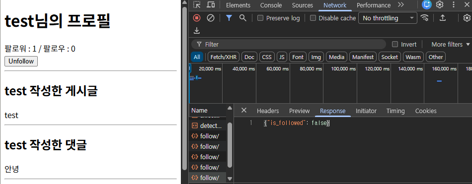

is_followed 응답 확인

### 팔로잉 수와 팔로워 수

- Django view 함수에서 팔로워, 팔로잉 인원 수 연산을 진행하여 결과를 응답 데이터로 전달한다.
- 해당 요소를 선택할 수 있도록 span 태그와 id 속성을 작성한다.

```python
# accounts/views.py

@login_required
def follow(request, user_pk):
    User = get_user_model()
    person = User.objects.get(pk=user_pk)
    
    if person != request.user:
        if person.followers.filter(pk=request.user.pk).exists():
            person.followers.remove(request.user)
            is_followed = False
        else:
            person.followers.add(request.user)
            is_followed = True
        context = {
            'is_followed': is_followed,
            'followings_count': person.followings.count(),
            'followers_count': person.followers.count(),
        }
        return JsonResponse(context)
    return redirect('accounts:profile', person.username)
```

```jsx
// accounts/profile.html

<div>
  팔로워 : <span id="followers-count">{{ person.followers.all|length }}</span>
  / 팔로우 : <span id="followings-count">{{ person.followings.all|length }}</span>
</div>
...
<script>
axios({
    method: 'post',
    url: `/accounts/${userId}/follow/`,
    headers: {'X-CSRFToken': csrf_token}
  }).then((response) => {
    const isFollowed = response.data.is_followed
    const followBtn = document.querySelector('input[type=submit]')
    const followingsCountTag = document.querySelector('#followings-count')
    const followersCountTag = document.querySelector('#followers-count')

    followersCountTag.textContent = response.data.followers_count
    followingsCountTag.textContent = response.data.followings_count

    if (isFollowed === true) {
      followBtn.value = "Unfollow"
    } else {
      followBtn.value = "Follow"
    }
  })
```

## 비동기 좋아요 구현

### 버블링(Bubbling) 활용

- ‘좋아요’ 버튼은 한 페이지에 여러 개가 존재할 수 있다.
- 모든 좋아요 버튼에 각각 이벤트 리스너를 등록해야 하나? NO!
- 버블링 (Bubbling) → 요소의 공통 조상에 이벤트 핸들러를 단 하나만 할당한다!

```html
<!-- articles/index.html -->

<article class="article-container">
  
    ...
  
</article>
```

```jsx
const articleContainer = document.querySelector('.article-container')

articleContainer.addEventListener('submit', (event) => {
  event.preventDefault()  // submit해도 새로고침 되지 않도록
})
```

### currentTarget vs. target

- `event.currentTarget`
    - ‘현재’ 요소
    - 항상 이벤트 핸들러가 연결된 요소만을 참조하는 속성
    - ‘this’와 같다.
- `event.target`
    - **실제 이벤트가 시작된 요소**
    - 이벤트가 발생한 가장 안쪽의 요소(target)를 참조하는 속성
    - 버블링이 진행되어도 변하지 않는다.

```html
<!-- articles/index.html -->

<form data-article-id="{{ article.pk }}"> 
  
  
    <input type="submit" value="좋아요 취소">
  
    <input type="submit" value="좋아요">
  
</form>
...

<script>
  const articleContainer = document.querySelector('.article-container')
  const csrf_token = document.querySelector('[name=csrfmiddlewaretoken]').value

  articleContainer.addEventListener('submit', (event) => {
    event.preventDefault()  // submit해도 새로고침 되지 않도록
    const articleId = event.target.dataset.articleId

    axios({
        method: 'post',
        url: `/articles/${articleId}/likes/`,
        headers: {'X-CSRFToken': csrf_token}
      })
  })
</script>
```

### 좋아요 상태

- Django의 view함수에서 좋아요 여부를 파악할 수 있는 변수 추가 생성
- JSON 타입으로 응답

```python
# articles/views.py

from django.http import JsonResponse

@login_required
def likes(request, article_pk):
    article = Article.objects.get(pk=article_pk)

    # 이미 좋아요가 된 상태라면, 좋아요 해제
    if request.user in article.like_users.all():
        article.like_users.remove(request.user)
        is_liked = False
    # 좋아요가 아닌 상태라면, 좋아요!
    else:
        article.like_users.add(request.user)
        is_liked = True
    context = {
        'is_liked': is_liked
    }
    return JsonResponse(context)
```

```jsx
// articles/index.html

articleContainer.addEventListener('submit', (event) => {
  event.preventDefault()  // submit해도 새로고침 되지 않도록
  const articleId = event.target.dataset.articleId

  axios({
    method: 'post',
    url: `/articles/${articleId}/likes/`,
    headers: {'X-CSRFToken': csrf_token}
  }).then((response) => {
    const isLiked = response.data.is_liked
  }).catch((error) => {
    console.log(error)
  })
})
```

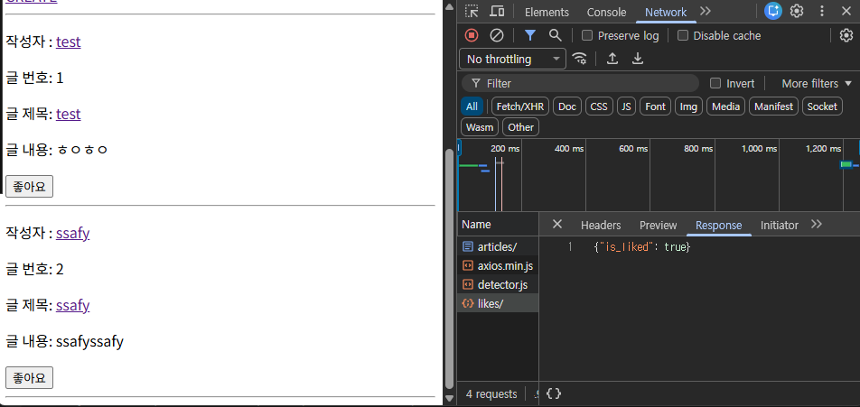

좋아요 버튼 눌렀을 때 응답 확인

### 좋아요 버튼 토글

- 어떤 게시글의 좋아요 버튼을 선택했는지 구별하기 위해, id 속성에 article.pk값을 포함한다.

```html
<!-- articles/index.html -->
<form data-article-id="{{ article.pk }}"> 
  
  
    <input type="submit" value="좋아요 취소" id="like-{{ article.pk }}">
  
    <input type="submit" value="좋아요" id="like-{{ article.pk }}">
  
</form>
```

```jsx
// articles/index.html

articleContainer.addEventListener('submit', (event) => {
  event.preventDefault()  // submit해도 새로고침 되지 않도록
  const articleId = event.target.dataset.articleId
  const likeBtn = document.querySelector(`#like-${articleId}`)

  axios({
    method: 'post',
    url: `/articles/${articleId}/likes/`,
    headers: {'X-CSRFToken': csrf_token}
  }).then((response) => {
    const isLiked = response.data.is_liked

    if (isLiked === true) {
      likeBtn.value = "좋아요 취소"
    } else {
      likeBtn.value = "좋아요"
    }
  }).catch((error) => {
    console.log(error)
  })
})
```

### 비동기로 구현한다면,

- `await` 선언한 바로 상위 함수에 `async`를 작성한다.
- try ~ catch 구문으로 에러 처리

```jsx
// articles/index.html

articleContainer.addEventListener('submit', async (event) => {
  event.preventDefault()
  const articleId = event.target.dataset.articleId
  const likeBtn = document.querySelector(`#like-${articleId}`)

    try {
      const response = await axios({
        method: 'post',
        url: `/articles/${articleId}/likes/`,
        headers: {'X-CSRFToken': csrf_token}
      })
      const isLiked = response.data.is_liked
      
        likeBtn.value = isLiked ? "좋아요 취소" : "좋아요"
        
    } catch {
        console.log("데이터를 제대로 받지 못했습니다!")
    }
})
```


1번 게시글 좋아요 누른 결과

