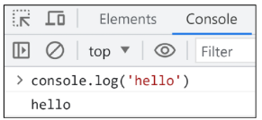
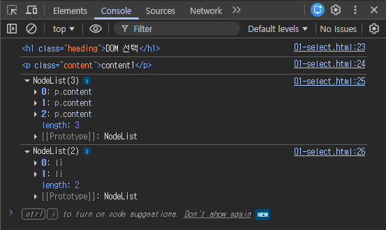

# JavaScript - DOM (Document Object Model)

## JavaScript의 역사

### ECMAScript

- 표준화된 스크립트 프로그래밍 언어 명세
    - 스크립트 언어가 준수해야 하는 규칙, 세부사항 등
- ES6 (ECMAScript 2015)에서 객체지향 프로그래밍 언어로써 많은 발전을 이룸
    - var → let, const, class 탄생 등

## 변수

### 변수 작성 규칙

- 문자, 달러(`$`) 또는 밑줄(`_`)로 시작한다.
    - `$`나 `_`로 시작하는 변수는 특별한 용도(DOM 선택, 내부용 변수)로 쓰인다.
- 대소문자 구분
- 예약어 사용 불가
    - `for`, `if`, `function` 등
- 변수명 Convention
    - **camelCase**: 변수, 객체, 함수에 사용
    - **PascalCase**: 클래스, 생성자에 사용
    - **SNAKE_CASE**: 상수(constants)에 사용

### 변수 선언 키워드

- `let`: **재할당이 필요**한 변수를 선언할 때 사용
    
    ```jsx
    let number = 10  // 1. 선언 및 초기값 할당
    number = 20      // 2. 재할당 가능
    
    let number = 10  // 1. 선언 및 초기값 할당
    let number = 20  // 2. 재선언 불가능
    ```
    
- `const`: **재할당이 불가능**한 상수를 선언할 때 사용

    - 보통 **`const`를 기본으로 사용**하고, 재할당이 필요한 경우 `let`으로 전환한다.
    - 버그 예방 및 코드의 의도 명확화
    
    ```jsx
    const number = 10  // 1. 선언 및 초기값 할당
    number = 10        // 2. 재할당 불가능
    
    const number = 10  // 1. 선언 및 초기값 할당
    const number = 20  // 2. 재선언 불가능
    const number       // const' declarations must be initialized.
    ```
    
- `var`: 재선언/재할당이 가능, 현재는 호이스팅(Hoisting) 문제로 사용을 권장하지 않음

    - ES6 이전에 변수 선언에 사용했던 키워드, 지금은 사용하지 않는다.
    - 재할당 가능, 재선언 가능, 함수 스코프를 가진다.
    - 호이스팅되는 특성으로 인해 예기치 못한 문제가 발생할 수 있다.
        - 선언하기 전 사용할 수 있다.
    - 변수 선언 시 var, const, let 키워드 중 하나를 사용하지 않으면 자동으로 var로 선언된다.

### 호이스팅 (hoisting)

- 변수 선언문이 코드의 최상단으로 끌어올려지는 듯한 현상
- var로 선언된 변수는 선언 위치와 관계없이 스코프 최상단에서 선언된 것처럼 동작하며, 할당 전까지는 undefined 값을 가진다.
- let과 const로 선언된 변수도 기술적으로는 호이스팅 되지만, 변수가 만들어지는 내부 과정이 다르기 때문에 이 문제를 방지할 수 있다. 할당 전에는 접근할 수 없다.

```jsx
// 호이스팅
console.log(name)  // undefined
var name = '홍길동'  // 선언 및 할당

// 동일하게 동작
var name
console.log(name) // undefined
var name = '홍길동'

// let
console.log(age)  // ReferenceError: Cannot access 'age' before initialization
let age = 30

// let
console.log(height)  // ReferenceError: Cannot access 'height' before initialization
const height = 170
```


### 블록 스코프 (Block scope)

- if, for, 함수 등의 중괄호 (`{}`) 내부를 가리킨다.
- 블록 스코프를 가지는 변수는 블록 바깥에서 접근할 수 없다.
- 스코프 안에서 `let`으로 선언하면 밖에서 접근할 수 없다.

```
let x = 1
if (x === 1) {
  let x = 2
  console.log(x) // 2
}
console.log(x) // 1
```

## DOM (Document Object Model)

### 웹 브라우저에서의 JavaScript

- 웹 페이지에서 동적인 기능을 담당한다.
- HTML script 태그

```jsx
<body>
	<script>
		console.log('hello')
	</script>
</body>
```

- js 확장자 파일

```jsx
// hello.js
console.log('Hello')
```

```jsx
<body>
	<script src="hello.js"></script>
</body>
```

- 브라우저 Console



### DOM (The Document Object Model)

- 브라우저에서 HTML 문서를 여러 상자가 중첩된 구조로 보고, 각 상자를 객체로 본다.
- 웹 페이지(Document)를 구조화된 객체로 제공하여 프로그래밍 언어가 페이지 구조에 접근할 수 있는 방법을 제공한다.
    - 문서 구조, 스타일, 내용 등을 변경할 수 있도록 한다.
- **DOM API**: 다른 프로그래밍 언어가 웹 페이지에 접근 및 조작할 수 있도록, 페이지 요소들을 객체 형태로 제공하며 관련된 메서드(Method)도 함께 제공
    - HTML 구조와 내용을 조작하는 명령어 모음

### document 객체

- 웹 페이지를 나타내는 DOM 트리의 최상위 객체
- HTML 문서의 모든 콘텐츠에 접근하고 조작할 수 있는 진입점
    - DOM 조작은 웹 페이지에 실시간으로 반영된다.
- DOM에서 모든 요소, 속성, 텍스트는 하나의 객체

### DOM Tree

- HTML 태그를 나타내는 elements의 node는 문서의 구조를 결정
- 이들은 다시 자식 node를 가질 수 있다. (ex: document.body)
    - 객체 간 상속 구조가 존재한다.

## DOM 선택

- 웹 페이지를 동적으로 만들기 == 웹 페이지를 조작하기
1. 조작하고자 하는 요소를 **선택** (또는 탐색)
2. 선택된 요소의 콘텐츠 또는 속성을 **조작**

### 선택 메서드

`document.querySelector(selector)`

- 요소 한 개 선택
- 제공한 선택자 (selector)와 일치하는 첫 번째 요소를 하나 선택
- 제공한 선택자를 만족하는 첫 번째 element 객체를 반환 (없다면 null 반환)

`document.querySelectorAll(selector)`

- 요소 여러 개 선택
- 제공한 선택자와 일치하는 여러 element를 선택
- 제공한 선택자를 만족하는 NodeList를 반환

```html
<body>
  <h1 class="heading">DOM 선택</h1>
  <a href="https://www.google.com/">google</a>
  <p class="content">content1</p>
  <p class="content">content2</p>
  <p class="content">content3</p>
  <ul>
    <li>list1</li>
    <li>list2</li>
  </ul>
  <script>
    console.log(document.querySelector('.heading'))
    console.log(document.querySelector('.content'))
    console.log(document.querySelectorAll('.content'))
    console.log(document.querySelectorAll('ul > li'))
  </script>
</body>
```



### :nth-child 선택자

- 형제들 중 인덱스를 나타내는 하나의 매개변수를 사용해 지정
- 인덱스는 1부터 시작

```jsx
const itemThird = document.querySelector('li:nth-child(3)')
itemThird.classList.add('list-group-item')
const itemFourth = document.querySelector('li:nth-child(4)')
itemFourth.classList.add('list-group-item')
```


## DOM 조작

### 속성 (attribute) 조작

- **클래스 (class) 속성 조작**
    - 스타일링 및 상태 제어를 위한 클래스 목록을 동적으로 추가/제거
    - `element.classList.add()`: 지정한 클래스 값을 추가
    - `element.classList.remove()`: 지정한 클래스 값을 제거
    - `element.classList.toggle()`: 클래스가 존재한다면 제거하고 false를 반환 (존재하지 않으면 클래스를 추가하고 true를 반환)

- 일반 속성 (attribute) 조작
    - id, href 등 요소의 모든 HTML 속성 값을 직접 설정/조회
    - `element.getAttribute()`: 해당 요소에 지정된 값을 반환(조회)
    - `element.setAttribute(name, value)`: 지정된 요소의 속성 값을 설정
        - 속성이 이미 있으면 기존 값을 갱신 (그렇지 않으면 지정된 이름과 값으로 새 속성이 추가)
    - `element.removeAttribute()`: 요소에서 지정된 이름을 가진 속성 제거

```jsx
const profileTag = document.querySelector('img')

profileTag.setAttribute('src', 'profile.jpg')
profileTag.setAttribute('alt', '프로필 사진')
```

### HTML 콘텐츠 조작

- `textContent` property: 요소의 텍스트 콘텐츠를 표현
- HTML 태그를 완전히 제거하고 순수한 텍스트 데이터만 얻고 싶을 때 가장 유용

### DOM 요소 조작 메서드

- `document.createElement(tagName)`: 작성한 tagName의 HTML 요소를 생성하여 반환
- `Node.appendChild()`: 한 Node를 특정 부모 Node의 자식 NodeList 중 마지막 자식으로 삽입, 추가된 Node 객체를 반환
- `Node.removeChild()`:  DOM에서 자식 Node를 제거, 제거된 Node를 반환

### style 조작 (비추)

- HTML 태그에 `style="..."` 속성을 직접 추가/수정하는 것과 같다.
- **하지만 스타일 변경은 무조건 class를 활용할 것!!!**

### element.after()

- element의 바로 다음 요소로 추가


```jsx
// SNS 내용을 연락처에 추가하기

// 1. 첫 번째 h2 태그는 '소개'라서 그 밑에 추가됨
const h2 = document.querySelector('h2') 
h2.appendChild(p)

// 2. h2와 p는 형제 관계이므로 해당 선택자는 null을 반환함
const h2 = document.querySelector('h2 > p') 
h2.appendChild(p)

// 3. <script> 뒤에 추가됨
body.appendChild(p)  

// 4. element.after() 바로 다음 요소로 추가하기
const phoneParagraph = phone.parentElement
phoneParagraph.after(p)
```

---

## 용어 정리

| 용어 | 설명 |
| --- | --- |
| Node | DOM의 기본 구성 단위 |
| Document Node | HTML 문서 전체를 나타내는 노드 |
| Element Node | HTML 요소를 나타내는 노드 |
| Text Node | HTML 텍스트 (Element Node 내의 텍스트 컨텐츠를 나타냄) |
| Attribute Node | HTML 요소의 속성을 나타내는 노드 |
| NodeList | DOM 메서드를 사용해 선택한 Node의 목록. querySelectorAll()로 반환되는 NodeList는 DOM의 변경사항을 실시간으로 반영하지 않는다. |
| Element | DOM 트리에서 HTML 요소를 나타내는 특별한 유형의 Node. Node의 하위 유형 |
| Parsing | 브라우저가 문자열을 해석하여 DOM Tree로 만드는 과정 (구문 분석, 해석) |

