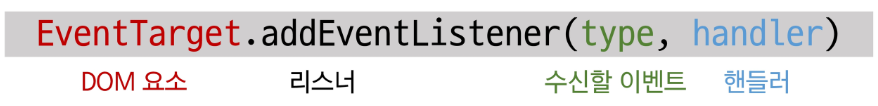
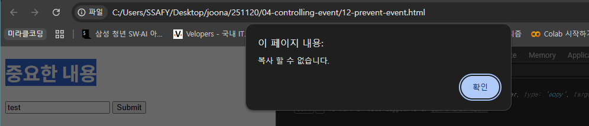
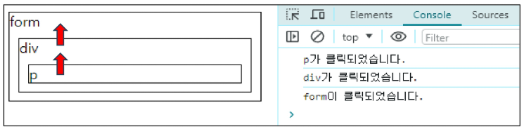
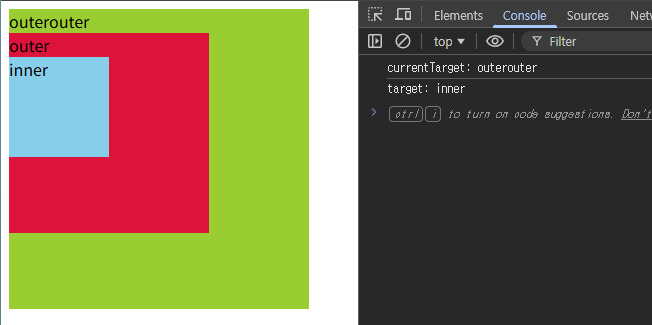

# JavaScript - Controlling Event

## event

### event (이벤트)

- 웹 페이지 상에서 ‘무언가 일어났다’는 신호 또는 사건
- 모든 DOM 요소는 다양한 형태의 이벤트를 발생시킬 수 있다.
    - 이벤트 종류: mouse, input, keyboard, click 등

### event object (이벤트 객체)

- DOM 에서 이벤트가 발생하면 브라우저는 해당 이벤트에 관한 정보를 담은 **event object**를 자동으로 생성한다.
- 이벤트 객체는 이벤트 발생 순간의 상황 (어떤 요소에서 이벤트가 발생했는지, 마우스 좌표는 어디인지, 눌린 키는 무엇인지 등)과 관련된 상세 정보를 담고 있다.

### event handler (이벤트 핸들러)

- 특정 이벤트가 발생했을 때 실행되는 (콜백)함수
- `.addEventListener()` 를 통해 DOM 요소에 이벤트 핸들러(콜백 함수)를 연결한다.
- 일반 함수를 핸들러로 사용 시, this는 이벤트 리스너가 연결된 요소를 가리킨다.
    - event 객체의 currentTarget 속성 값과 동일 (권장)

```jsx
// 1. 버튼 선택
const btn = document.querySelector('#btn')

// 2. 이벤트 핸들러
const detectClick = function (event) {
  console.log(event) // PointerEvent
  console.log(event.type) // click
  console.log(event.currentTarget) // <button id="btn">버튼</button>
  console.log(this) // <button id="btn">버튼</button>
}

// 3. 버튼에 이벤트 핸들러를 등록
btn.addEventListener('click', detectClick)
```

### 이벤트 등록 (`addEventListener`)

- 특정 DOM요소에 지정한 이벤트가 발생했을 때 실행할 이벤트 핸들러를 등록하는 메서드


*addEventListener*

- DOM 요소: HTML 문서의 각 태그를 하나의 객체로 변환한 것
- type: 수신할 이벤트 유형
    - 문자열로 작성한다. (예: `'click'`, `'mouseover'` 등)
- handler: 특정 이벤트가 발생했을 때 실행되는 (콜백)함수
    - 자동으로 **event 객체를 첫번째 매개변수로** 받는다.
    - 핸들러 함수는 매개변수(event 객체)를 통해 이벤트에 대한 상세 정보(이벤트 발생 요소, 이벤트 타입, 추가 데이터 등)에 접근하고 적절한 동작을 수행한다.
    - 반환 값 없음

```jsx
// 1. (WHO) DOM 요소 가져오기
const button = document.querySelector('button')

// 2. (WHAT) 이벤트 핸들러(콜백함수) 작성하기
const handleClick = function () {
  window.alert('버튼이 클릭 되었습니다!')
}

// 3. (WHICH) addEventListener 메서드를 이용해 버튼에 이벤트 핸들러 등록하기
button.addEventListener('click', handleClick)
```

### 이벤트 기본 동작 취소 (`preventDefault`)

- `.preventDefault()`: 해당 이벤트에 대한 기본 동작을 실행하지 않도록 지정

```html
<script>
  // 복사 이벤트 금지 
  const h1Tag = document.querySelector('h1')

  h1Tag.addEventListener('copy', function (event) {
    console.log(event)
    event.preventDefault()
    alert('복사 할 수 없습니다.')
  })

  // 폼 제출 시 페이지 새로고침 동작 취소 
  const formTag = document.querySelector('#my-form')

  const handleSubmit = function (event) {
    event.preventDefault()
  }

  formTag.addEventListener('submit', handleSubmit)
</script>
```


*복사 이벤트 금지*

## 버블링 (Bubbling)

### 버블링 (Bubbling)

- 한 요소에 이벤트가 발생하면, 해당 요소의 핸들러가 동작한 후 이어서 부모 요소의 핸들러가 동작하는 현상
- 가장 최상단의 조상 요소 (document)를 만날 때까지 이 과정이 반복되면서 요소 각각에 할당된 핸들러가 동작한다.
- 각 버튼의 공통 조상인 div 요소에 이벤트 핸들러 단 하나만 할당하기!
    - 여러 자식 요소에서 발생하는 이벤트를 한 곳에서 효율적으로 다룰 수 있다.
    - 공통 조상 (div)에 할당한 핸들러에서 event.target을 이용하면 실제 어떤 버튼에서 이벤트가 발생했는지 알 수 있기 때문


*버블링 예시: p 태그 클릭했을 때*

### currentTarget과 target

- `event.currentTarget`: 현재 요소
    - 항상 **이벤트 핸들러가 연결된 요소**만을 참조하는 속성
    - `this`와 같다.
- `event.target`: 실제 이벤트가 시작된 요소
    - 이벤트가 발생한 **가장 안쪽의 요소(target)**를 참조하는 속성
    - 버블링이 진행되어도 변하지 않는다.

```html
<div id="outerouter">
  outerouter 
  <div id="outer">
    outer
    <div id="inner">inner</div>
  </div>
</div>

<script>
  const outerOuterElement = document.querySelector('#outerouter')

  const clickHandler = function (event) {
    console.log('currentTarget:', event.currentTarget.id) // currentTarget: outerouter
    console.log('target:', event.target.id)
  }

  outerOuterElement.addEventListener('click', clickHandler)
</script>
```


*currentTarget vs. target: inner 요소를 클릭했을 때*

### (참고) Capturing

- 이벤트가 최상위 조상에서 타겟 요소까지 하위로 전파되는 단계
    - 버블링과 반대
- 하위 요소를 클릭하면 이벤트는 먼저 최상위 요소부터 아래로 전파 (캡처링)된다.
- 실제 이벤트가 발생한 지점(event.target)에서 실행된 후 다시 위로 전파 (버블링)된다.

## event handler 활용 실습

### 1. 버튼 클릭하면 +1

```html
<button id="btn">버튼</button>
<p>
  클릭횟수 :
  <span id="counter">0</span>
</p>

<script>
  // 목표: 버튼을 클릭하면 숫자를 1씩 증가시키기 

  // 1. 버튼 클릭 횟수 초기값 설정 
  let initValue = 0

  // 2. 버튼 요소 선택
  const btn = document.querySelector('#btn')

  // 3. 이벤트 핸들러(콜백 함수) 작성 - 버튼 클릭 시 발생할 이벤트 
  const clickHandler = function () {
    console.log("버튼이 눌리는지 확인")
    // 3.1 버튼 클릭 횟수 +1
    initValue += 1
    // 3.2 클릭 횟수를 보여주는 태그 선택
    const spanTag = document.querySelector('#counter')
    // 3.3 태그의 콘텐츠를 +1 된 버튼 클릭 횟수로 변경
    spanTag.textContent = initValue
  }

  // 4. 버튼에 이벤트 핸들러 등록
  btn.addEventListener("click", clickHandler)
</script>
```

### 2. 사용자 입력 실시간 출력 + CSS 스타일 변경

- console.log()로 event 객체를 출력할 경우, currentTarget 키의 값은 null 을 가진다.
    - currentTarget은 이벤트가 처리되는 동안에만 사용할 수 있기 때문
    - 대신 console.log(event.currentTarget)으로 확인 가능

```html
<body>
  <h1></h1>
  <button id="btn">클릭</button>
  <input type="text" id="text-input">

  <script>
    // 목표: 입력 값을 실시간으로 출력하고, 클릭 버튼을 클릭 시 출력 값의 CSS를 변경하기 
    // 1. 입력 이벤트 작성하기
    const inputTag = document.querySelector('#text-input')
    const h1Tag = document.querySelector('h1')

    const inputHandler = function(event) {
      h1Tag.textContent = event.currentTarget.value  // input에 입력한 값을 h1 태그에 저장
    }
    inputTag.addEventListener("input", inputHandler)

    // 2. 클릭 버튼 이벤트 작성하기
    const btn = document.querySelector('#btn')
    
    const clickHandler = function(event) {
      // h1Tag.classList.add('blue')
      h1Tag.classList.toggle('blue')
    }

    btn.addEventListener("click", clickHandler)
  </script>
</body>
```

### 3. todo 프로그램

```html
<body>
  <input type="text" class="input-text">
  <button id="btn">+</button>
  <ul></ul>

  <script>
    // 목표: Input창에 입력한 후 '+'버튼 클릭 시, 실시간으로 리스트에 출력하기
    // 추가기능: 빈 문자열이 입력될 경우, 경고 대화상자를 띄우기 
    const inputTag = document.querySelector('.input-text')
    const btnTag = document.querySelector('#btn')
    const ulTag = document.querySelector('ul')

    const addTodo = function(event) {
      // 사용자가 입력한 데이터(텍스트)를 가져온다.
      const inputData = inputTag.value

      // 인풋 정보를 받아온 이 시점에서 빈 인풋인지 검사한다.
      if (inputData.trim()) {
        // li 태그를 추가한다.
        const liTag = document.createElement('li')
        liTag.textContent = inputData
        
        // ul 태그에 자식으로 추가해야 한다.
        ulTag.appendChild(liTag)
      }
      // 빈 인풋이라면 경고창 띄우기
      else {
        alert('입력하세요 제발')
      }
    }

    btnTag.addEventListener('click', addTodo)
  </script>
</body>
```

### 4. 로또 번호 생성기

```html
<body>
  <h1>로또 추천 번호</h1>
  <button id="btn">행운 번호 받기</button>
  <div></div>

  <script src="https://cdn.jsdelivr.net/npm/lodash@4.17.21/lodash.min.js"></script>
  <script>  
    // 참고
    // _.range(1, 46): 1부터 45까지의 배열 생성
    // _.sampleSize(numbers, 6): 45개의 리스트에서 6개 번호 추출 

    // 1. 필요한 요소 선택
    const btnTag = document.querySelector('#btn')
    const divTag = document.querySelector('div')

    // 2. 로또 번호를 화면에 출력하는 함수 (이벤트 핸들러)
    const getLotto = function(event) {
      const numbers = _.range(1, 46)
      const pickNumbers = _.sampleSize(numbers, 6)
      // console.log(numbers)
      // console.log(pickNumbers)

      const ulTag = document.createElement('ul')
      // 랜덤으로 만든 6개 숫자를 하나하나씩 순회
      pickNumbers.forEach((number) => {
        const liTag = document.createElement('li')
        liTag.textContent = number
        ulTag.appendChild(liTag)
      })
      
      divTag.appendChild(ulTag)
    }

    // 3. 버튼 요소에 이벤트 핸들러를 등록
    btnTag.addEventListener('click', getLotto)
  </script>
</body>
```

---

## 참고

### addEventListener와 화살표 함수 관계

- 화살표 함수는 자신만의 this를 가지지 않는다.
- 대신, 자신이 선언된 상위 스코프의 this를 그대로 물려받아 사용한다.
- 따라서 이벤트 핸들러로 화살표 함수를 사용하면 this는 대부분 전역 객체 (window)를 가리키게 된다.
- 해결:
    - 일반 함수로 사용하기
    - 화살표 함수일 경우, **`event.currentTarget`** 사용하기

```jsx
// 일반적인 this 바인딩 규칙
// 1. 일반 함수 호출: window
// 2. 메서드 호출: 메서드를 소유한 객체

// addEventListener는 위의 일반적인 규칙과 다르게 동작하는데, 
// 이는 JavaScript 엔진이 addEventListener 메서드를 특별하게 처리하기 때문
// 내부 구현 (https://developer.mozilla.org/en-US/docs/Web/API/EventTarget/addEventListener)

const functionButton = document.querySelector('#function')
const arrowButton = document.querySelector('#arrow')

// 1. 일반 함수 사용
functionButton.addEventListener('click', function () {
  console.log(this) // <button id="function">function</button>
})

// 2. 화살표 함수 사용
arrowButton.addEventListener('click', () => {
  console.log(this) // window
})

// 3. 화살표 함수에서는 event 객체 사용으로 대체 가능
arrowButton.addEventListener('click', (event) => {
  console.log(event.currentTarget) // <button id="arrow">arrow function</button>
})
```

### lodash

- 모듈러, 성능 및 추가 기능을 제공하는 JavaScript 유틸리티 라이브러리
- `_.함수명`

```jsx
// 1. _.uniqBy: 객체 배열에서의 특정 키를 기준으로 중복 제거 
const users = [
  { id: 1, name: '철수' },
  { id: 2, name: '영희' },
  { id: 1, name: '철수' },
];

// 먼저 나온 Key 값이 생존 
const uniqueUsersLodash = _.uniqBy(users, 'id');
console.log(uniqueUsersLodash);  // [{ id: 1, name: '철수' }, { id: 2, name: '영희' }]

// 2. _.orderBy: 다중 조건 정렬
const posts = [
  { user: 'A', age: 20 },
  { user: 'B', age: 30 },
  { user: 'C', age: 20 },
];

const sorted = _.orderBy(posts, ['age', 'user'], ['desc', 'asc']);
console.log(sorted)  // [{user: 'B', age: 30}, {user: 'A', age: 20}, {user: 'C', age:20}]

// 3. _.cloneDeep: 깊은 복사 
const original = { 
    profile: { name: 'Kim', skills: ['JS', 'Vue'] } 
};

const deep = _.cloneDeep(original);
deep.profile.skills.push('Lodash'); // 원본은 안전함
console.log("오리지널", original)
console.log("깊은 복사", deep)

// 4. 깊은 비교 
const objA = { a: 1, b: { c: 2 } };
const objB = { a: 1, b: { c: 2 } };

console.log(objA === objB); // false (참조가 다름)
console.log(_.isEqual(objA, objB)); // true

// 5. _.debounce: 마지막 호출만 실행 (사용자 입력이 끝나고, x초 뒤에 한 번 요청하도록 할 때 유용 )
// NodeJS(Redis, RabbitMQ) // 프론트 프레임워크(커스텀 훅으로 가능)

// 사용자가 입력을 멈춘 지 1000ms가 지나면 함수 실행
const handleSearch = _.debounce((keyword) => {
  console.log(`1초 뒤 호출: `, keyword);
}, 1000);

// input 이벤트 핸들러에 연결
// 기존 이벤트 리스너와 다른 형태인데, 이벤트 객체(e)가 꼬이지 않게 하기 위해서 
// 이벤트 객체를 받은 다음에 해당 객체에서 필요한 정보를 핸들러 함수에 전달하도록 사용 
const inputElement = document.querySelector('#searchInput')
inputElement.addEventListener('input', (e) => handleSearch(e.target.value));

// 6. _.throttle: 일정 주기마다 실행 
// 프론트 프레임워크에서는 다른 기능과 합쳐져서 자주 사용 됨 
// Node.Js 에서는 실시간 채팅/게임 이나 로그 파일 저장 시 활용 됨(가벼운 용도로)

// 200ms마다 한 번씩만 실행됨
let mouseNum = 0
const handleScroll = _.throttle(() => {
  mouseNum++;
  console.log('마우스 이동 횟수: ', mouseNum);
}, 1000);

window.addEventListener('mousemove', handleScroll);

// 7. _.isEmpty: 객체가 비었는 지 확인 (단, 숫자는 비었다고 판단하니 주의 필요)
// 프론트: 백엔드에서 받은 데이터가 비었는 지 확인 
// 백엔드: API 요청에서 파라미터가 비었는 지 확인 
console.log(_.isEmpty(null));      // true
console.log(_.isEmpty(undefined)); // true
console.log(_.isEmpty(''));        // true 
console.log(_.isEmpty([]));        // true
console.log(_.isEmpty({}));        // true
console.log(_.isEmpty(0)) // false
console.log(_.isEmpty(100)) // false
```
