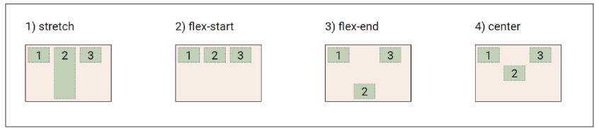

# 스스로 학습
## 레이아웃 구성

- 레이아웃을 짤 때는 부모의 관점에서 구조를 짜보자! → 큰 그림부터 그리기

- flex item은 flex container가 될 수 있다! → 중첩된 flexbox 구조

  

# 수업 필기

## CSS Box Model

웹 페이지의 모든  HTML 요소를 감싸는 사각형 상자 모델

- 모든 요소는 ‘네모’로 생겼다.

### Box 구성 요소

- Margin: 박스와 다른 요소와의 외부 간격
- Border: content와 padding을 감싸는 테두리
- Padding: content와 border 사이의 내부 여백
- Content: 실제 내용이 위치하는 영역
    - `width/height`
- 방향별 속성 값: `top/bottom/right/left`
    - `auto` 좌우 균등 분배 (반응형, 수평정렬)

### Shorthand (단축) 속성

- `border: 2px solid black;`
    - border-width, border-style, border-color를 한번에 설정
    - 작성 순서는 영향을 주지 않는다.
- `margin: 10px 20px 30px 40px;`, `padding: 10px 20px 30px 40px;`
    - 속성 개수에 따라 상/우/하/좌, 상/좌우/하, 상하/좌우, 공통

### Box 크기 계산법

- CSS는 기본적으로 content box 크기를 width 값으로 지정한다.
- 일반적으로 사람이 생각하기에는 width는 border box 크기로 생각한다.

⇒ `* { box-sizing: border-box; }` border box를 기준으로 높이/너비를 계산한다.

### `display` 속성 (박스의 화면 배치 방식) - Outer display 타입

1. **`block`** 타입: 하나의 독립된 덩어리처럼 동작하는 요소.
    - **항상 새로운 행에서 시작한다. (너비 100%)**
    - width, height, margin, padding 속성 사용 가능
    - padding, margin, border로 인해 다른 요소를 상자로부터 밀어낸다.
    - `h1~6`, `p`, `div`, `ul`, `li`
        - `div`헤더, 푸터, 사이드바 등 다양한 섹션을 구조화하는 데 가장 많이 사용한다.

2. **`inline`** 타입: 문장 안의 단어처럼 흐름에 따라 자연스럽게 배치되는 요소.
    - **줄바꿈이 일어나지 않는다.** (콘텐츠의 크기만큼만 영역을 차지)
    - width와 height 속성을 사용할 수 없다.
    - **수직 방향(상하)으로 padding, margin, border가 적용되지만, 다른 요소를 밀어낼 수는 없다.**
    - 수평 방향(좌우)으로 padding, margin, border가 적용되어 다른 요소를 밀어낼 수 있다.
    - `a`, `img`, `span`, `strong`
        - `span` 텍스트의 일부(특정 단어나 구문)에만 스타일을 적용할 때 유용하다.

3. **`inline-block`** 타입: inline과 block의 특징을 모두 가진 특별한 display 속성 값
    - 줄바꿈 없이, 크기 지정이 가능하다.
    - width 및 height 속성 사용 가능
    - padding, margin, border로 다른 요소를 밀어낼 수 있다.
    - list를 inline-block 타입으로 지정해서 네비게이션바로 사용할 때 유용하다.

4. `none` 타입: 요소를 화면에 표시하지 않고, 공간조차 부여되지 않는다.
    - 요소를 on/off하는 조작할 때 유용하다.

### Normal flow

레이아웃을 변경하지 않은 경우에 웹 페이지 요소가 배치되는 방식

## CSS Position

### CSS Layout

각 요소의 위치와 크기를 조정하여 웹 페이지의 디자인을 결정하는 것

- 요소들을 상하좌우로 정렬하고, 간격을 맞추고, 전체적인 페이지의 뼈대를 구성한다.
- 핵심 속성: `display(block, inline, flex, grid, ...)`

### CSS Position

요소를 Normal Flow에서 제거하여 다른 위치로 배치하는 것

- 다른 요소 위에 올리기, 화면의 특정 위치에 고정시키기 등
- 핵심 속성: `position(static, relative, absolute, fixed, sticky, ...)`
- top, bottom, left, right, z축을 이용해 요소의 위치를 조절할 수 있다.

1. (default)**`static`**: normal flow에 따라 기본 배치

2. **`relative`**: normal flow에 따라 배치
    - **원래 위치(static일 때 좌상단 좌표)를 기준으로 이동**
    - top, right, bottom, left 속성으로 위치를 조정한다.
    - 다른 요소의 레이아웃에 영향을 주지 않는다.
    - 요소가 차지하는 공간은 static일 때와 같다.
3. **`absolute`**: 요소를 normal flow에서 **제거**
    - **가장 가까운 relative 부모 요소를 기준으로 이동**
        - 만족하는 부모 요소가 없다면 body 태그를 기준으로 한다. 
        (단, body의 기본 설정 역시 position: static;)
    - top, right, bottom, left 속성으로 위치를 조정
    - 문서에서 요소가 차지하는 공간이 없어진다. → 아래 있던 요소들의 위치가 바뀐다.
    - ex) 네이버 뉴스 썸네일의 ‘유료’ ‘00:21(재생시간)’ 뱃지 등
4. **`fixed`**: 요소를 normal flow에서 제거
    - 현재 화면영역(viewpoint)을 기준으로 이동
    - 스크롤해도 항상 같은 위치에 유지된다.
    - top, right, bottom, left 속성으로 위치를 조정
    - 문서에서 요소가 차지하는 공간이 없어진다. → 아래 있던 요소들의 위치가 바뀐다.
    - ex) 웹툰에서 ‘다음화’ ‘이전화’ ‘맨 위로’ 등, 팝업창
5. **`sticky`**: relative와 fixed의 특성을 결합한 속성
    - 스크롤 위치가 임계점에 도달하기 전에는 relative처럼 동작
    - 스크롤 위치가 임계점에 도달하면 fixed처럼 화면에 고정
    - 다음 sticky 요소가 나오면 이전 sticky 요소가 대체
        - 이전 sticky 요소와 다음 sticky 요소의 위치가 겹치게 되기 때문이다.
    - ex) 스크롤하면서 챕터가 바뀌는 네비게이션바 등

### z-index

요소의 쌓임 순서를 정의하는 속성

- 정수 값(음수 가능)을 사용해 z축 순서를 지정한다.
- 값이 클수록 요소가 위에 쌓이게 된다.
- static이 아닌 요소에만 적용된다.
- 같은 부모 내에서만 z-index 값을 비교하고, 값이 같으면 HTML 문서 순서대로 쌓인다.
    - 부모의 z-index가 낮으면 자식의 z-index가 아무리 높아도 부모보다 위로 올라갈 수 없다.

## CSS Flexbox

### Inner display 타입

박스 내부의 요소들이 어떻게 배치될 지를 결정

요소를 행과 열 형태로 배치하는 1차원 레이아웃 방식 → 공간 배열 & 정렬

**부모가 컨트롤한다.**

### Flexbox 구성 요소

**main axis (주 축)**

- flex item들이 배치되는 기본 축
- main start(왼) → main end(오) 방향으로 배치 (기본 값)

**cross axis (교차 축)**

- main axis에 수직인 축
- cross start(위) → cross end(아래) 방향으로 배치 (기본 값)

**Flex Container**

- display: flex; 혹은 display: inline-flex; 가 설정된 부모 요소
- 이 컨테이너의 1차 자식 요소들이 flex item이 된다.

**Flex Item**

- flex container 내부에 레이아웃되는 항목들

### Flexbox 속성

`display: flex;` flex container로 지정

**배치**

`flex-direction`: flex item이 나열되는 방향을 지정

- row, row-reverse, column, column-reverse

`flex-wrap`: flex container의 한 행에 들어가지 않을 경우, 다른 행에 배치할 지 설정

- nowrap(기본 값), wrap

**공간 분배**

`justify-content`: **주 축**을 따라 flex item들을 정렬하고 간격을 조정

- flex-start(기본 값), center, flex-end, space-between, space-around, space-evenly

`align-content`: 컨테이너에 여러 줄의 flex item이 있을 때, 그 줄들 사이의 공간을 어떻게 분배할지 지정

- flex-wrap이 wrap 또는 wrap-reverse로 설정된 여러 행에만 적용된다.
- stretch(기본 값), center, flex-start, flex-end

**정렬**

`align-items`: 컨테이너 안에 있는 flex item들의 **교차 축** 정렬 방법을 지정

- stretch(기본 값), center, flex-start, flex-end

`align-self`:  컨테이너 안에 있는 flex item들을 교차 축을 따라 개별적으로 정렬

- auto(기본 값), stretch, center, flex-start, flex-end

**flex item**

`flex-grow`: 남는 행 여백을 비율에 따라 각 flex item에 분배

`flex-shrink`: 컨테이너 공간이 부족할 때, flex item이 줄어드는 비율을 지정 

`flex-basis`: flex item의 초기 크기 값을 지정

- flex-basis와 width 값을 동시에 적용한 경우, flex-basis가 우선

> 참고 
> justify - 주축, align - 교차축

## 참고

### margin collapsing (마진 상쇄)

두 block 타입 요소의 margin top과 bottom이 만나 더 큰 margin으로 결합되는 현상

- 단, 플로팅 요소와 절대 위치를 지정한 요소의 여백은 절대 상쇄되지 않습니다.
- 두 박스의 마진 값이 각각 30px, 10px일 때, 두 박스 사이의 최종 간격은 30px + 10px = 40px가 아니라,
두 값 중 더 큰 값인 30px가 됩니다.
- 요소 간 간격을 일관되게 유지할 수 있다. (일관성)
- 요소 간의 간격을 더 예측 가능하고 관리하기 쉽게 만들 수 있다. (단순성)

