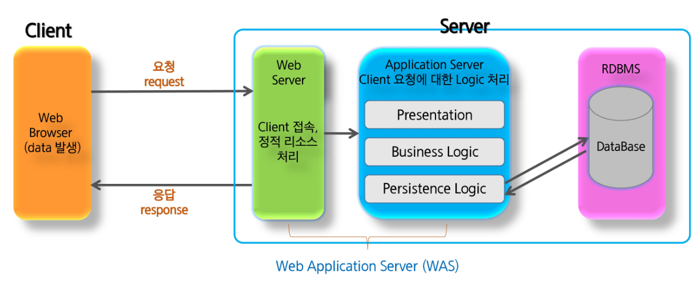
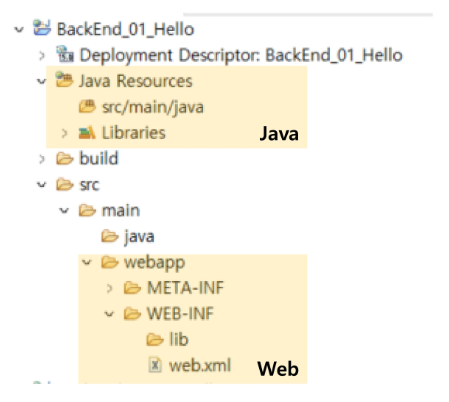
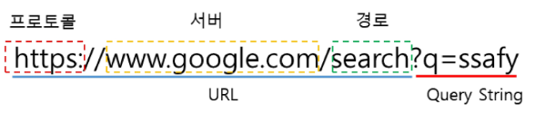
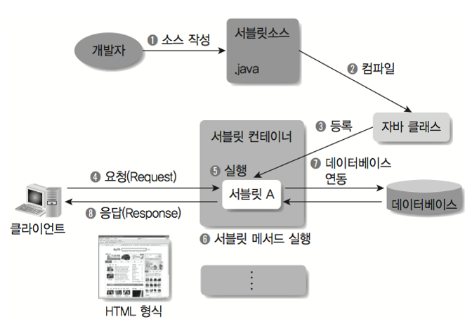
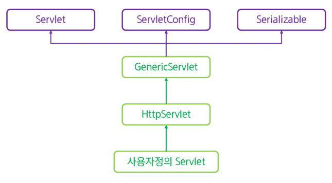
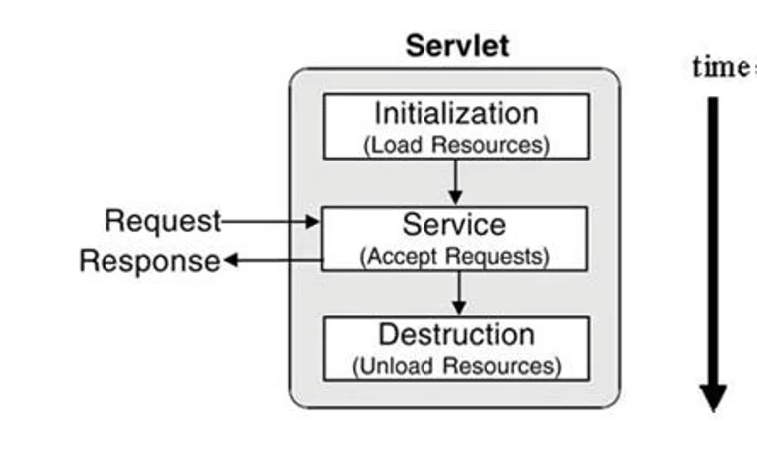
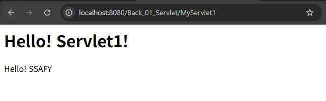
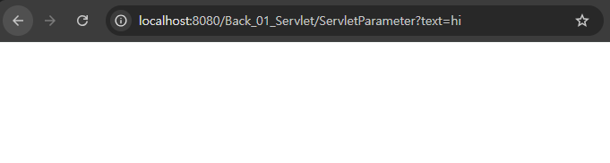
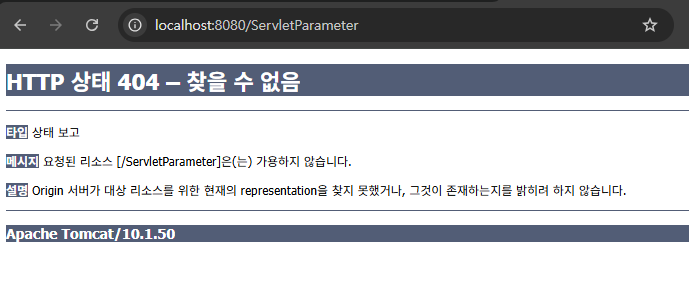
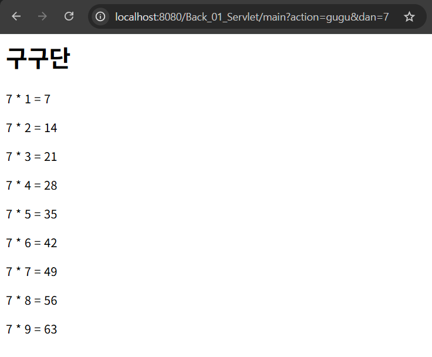

# 서블릿(Servlet) 기초와 웹 애플리케이션 구조

## 웹 프로그래밍

### 서버

- 꺼지지 않는 컴퓨터
- 클라우드 서비스 (예: AWS)는 “꺼지지 않는 컴퓨터”의 한 영역을 빌려주는 것
    - 물리적인 컴퓨터를 한 대 추가하는 것이 아니라,
    - 컴퓨터를 가상으로 쪼개서 할당해주는 것

### Web Architecture



각 코드의 main 함수를 실행하는 것이 아니고, Tomcat에 올리면 Tomcat을 실행한다.

### Web Module




Dynamic Web Project를 만들 때 Web Module 설정

- Context root: 접속 주소 (URL Prefix)
    - 서버 (Tomcat) 하나에 여러 프로젝트가 올라갈 수 있기 때문에 각 프로젝트를 구분하는 역할
- Content directory: 웹 자원 폴더
    - 브라우저가 직접 접근할 수 있는 정적 파일(HTML, CSS, JS)과 JSP 파일이 저장되는 위치
    - 자바 비즈니스 로직(Controller, Service 등)은 `src/main/java` 폴더 아래에 작성

### URI / URL / URN

**URI (Uniform Resource Identifier)**

- 통합 자원 식별자
- 인터넷 상의 자원을 고유하게 식별하는 데 사용
- URL과 URN을 포함하는 상위 개념

**URL (Uniform Resource Locator)**

- 통합 자원 위치
- 자원의 위치를 나타내는 데 사용
- URL 구성요소
    - 프로토콜: 절차를 포함한 통신 규약
    - 서버: 웹페이지를 요청할 서버의 주소
    - 경로: 서버 내의 상세 경로
    - 쿼리 스트링: 추가로 서버로 데이터를 전송하기 위해서 사용
    
    
    

**URN (Uniform Resource Name)**

- 통합 자원 이름
- 자원에 대한 고유한 이름을 제공

## Servlet

### Servlet

- Server + Applet(Application + let)
- WAS (Tomcat)에서 실행되는 Java 프로그램
- 유지보수성 및 재활용성 우수
- 웹페이지를 동적으로 생성할 수 있다.
    - HTML 코드 작성 가능
    - JSP (Java Server Pages)를 통해 해결 가능



servlet 작동 과정

https://coding-factory.tistory.com/742

### Servlet API

- 서블릿은 주로 `Jakarta.servlet.http.HttpServlet`을 상속받아 작성한다.



### Servlet Life-Cycle



servlet life-cycle

- **관리 주체:** 개발자가 직접 `new`를 하지 않고 **웹 컨테이너(Container)**가 제어권을 가진다.
- **초기 설정:** 서블릿 인스턴스가 없으면 클래스를 로드하고 인스턴스를 생성한 뒤 `init()` 메서드를 통해 초기화한다.
    - 서블릿은 **싱글톤(Singleton) 방식**으로 동작한다. 즉, 한 번 만들어진 서블릿 인스턴스는 메모리에 상주하며 다음 요청을 기다린다.
    - 코드 수정으로 인해 다시 로드되면 다시 호출된다.
- **실행:** 요청이 들어올 때마다 컨테이너는 스레드를 생성하고 `service()` 메서드를 호출한다.
    - 주요 메서드로는 `doGet()`, `doPost()`, `service()` 가 있다.
- **종료:** 서블릿 인스턴스를 더 이상 사용하지 않을 때 `destroy()`를 호출하여 자원을 반납한다.
    - 서버가 꺼지거나 서블릿 내용이 수정되어 컨테이너가 서블릿을 교체해야 할 때만 **단 한 번** 호출

### Web Page 이동 방식

|  | Forward (포워드) | Redirect (리다이렉트) |
| --- | --- | --- |
| 사용 방법 | `RequestDispatcher dispatcher = request.getRequestDispatcher(path);
dispatcher.forward(request, response);` | `response.sendRedirect(location);` |
| 이동 범위 | 동일 서버 (project) 내에서만 가능 | 동일 서버 포함 타 URL(구글, 네이버 등) 가능 |
| location bar (URL) | **기존 URL 유지.** 주소창이 변하지 않아 사용자는 내부적으로 페이지가 바뀌었는지 모름 | **새 주소로 변경.** 주소창이 최종 목적지 주소로 바뀜 |
| 객체 (Request/Response) | 기존 객체 유지. | 기존 객체 소멸, 새로운 객체 생성. |
| 속도 | **빠르다.** 서버 안에서만 움직이므로 네트워크 통신이 1번만 일어남 | **느리다.** 서버-브라우저를 한 번 갔다 와야 하므로 2번의 통신이 필요 |
| 데이터 유지 | **`setAttribute` 사용 가능.** 이전 단계에서 담은 데이터를 다음 페이지에서도 쓸 수 있음 | **저장 불가능.** 새 요청이 만들어지므로 데이터가 날아감 (Session/Cookie 필요) |
| 활용 | 단순 조회 결과 화면을 보여줄 때 (예: 게시글 상세 조회) | DB 상태를 변경하는 작업 후 (예: 글쓰기, 삭제, 수정) |

## Servlet 실습

### 프로젝트 구조


| 위치 | 설명 |
| --- | --- |
| `Back/Java Resources/src/main/java/` | web application에 필요한 java file 위치 |
| `Back/Java Resources/Libraries/` | tomcat library (servlet-api.jar 위치) |
| `Back/src/main/webapp/` | view directory (html, css, js, jsp, image 등) |
| `Back/src/main/webapp/WEB-INF/lib/` | web application에 필요한 확장 library |

### Servlet 등록 방법

1. **`web.xml`**
    - `<welcome-file-list>`에 포함할 파일 추가
    - tomcat이 기본적으로 index.html을 지원해주므로 별도의 기입 없어도 작동함
    
    ```xml
     Servers/Tomcat/web.xml
     
     ...
        <welcome-file-list>
            <welcome-file>index.html</welcome-file>
            <welcome-file>index.htm</welcome-file>
            <welcome-file>index.jsp</welcome-file>
        </welcome-file-list>
    
    </web-app>
    ```
    
    ```xml
    /Back_01_Servlet/src/main/webapp/WEB-INF/web.xml
    
    <?xml version="1.0" encoding="UTF-8"?>
    <web-app xmlns:xsi="http://www.w3.org/2001/XMLSchema-instance" xmlns="https://jakarta.ee/xml/ns/jakartaee" xsi:schemaLocation="https://jakarta.ee/xml/ns/jakartaee https://jakarta.ee/xml/ns/jakartaee/web-app_6_0.xsd" id="WebApp_ID" version="6.0">
      <display-name>Back_01_Servlet</display-name>
      <servlet>
        <servlet-name>MyServlet</servlet-name>
        <servlet-class>com.ssafy.myservlet.MyServlet</servlet-class>
      </servlet>
      <servlet-mapping>
      	<servlet-name>MyServlet</servlet-name>
      	<url-pattern>/MyServlet1</url-pattern>
      </servlet-mapping>
    </web-app>
    ```
    
    
    
    web.xml 등록
    
2. **Annotation**
    
    ```java
    /Back_01_Servlet/src/main/java/com/ssafy/myservlet/MyServlet2.java
    
    package com.ssafy.myservlet;
    
    import java.io.IOException;
    import java.io.PrintWriter;
    
    import jakarta.servlet.ServletException;
    import jakarta.servlet.annotation.WebServlet;
    import jakarta.servlet.http.HttpServlet;
    import jakarta.servlet.http.HttpServletRequest;
    import jakarta.servlet.http.HttpServletResponse;
    
    /**
     * Servlet implementation class MyServlet2
     */
    @WebServlet("/MyServlet2")
    public class MyServlet2 extends HttpServlet {
    	private static final long serialVersionUID = 1L;
    
    	protected void doGet(HttpServletRequest request, HttpServletResponse response) throws ServletException, IOException {
    		response.setContentType("text/html; charset=UTF-8");
    		PrintWriter writer = response.getWriter();
    		
    		writer.write("""
    				<html>
    				<head>
    					<title>Hello! SSAFY!</title>
    				</head>
    				<body>
    					<h1>Hello! Servlet2!</h1>
    					<p>Hello! SSAFY</p>
    				</body>
    				</html>
    		""");
    	}
    }
    
    ```
    
    
    
    annotation 등록
    

### GET / POST 요청

```html
	<h2>GET Form</h2>
	<!-- action: 그냥 시작하면 주소창에 마지막 / 기준으로 내용만 바뀜 -->
	<form action="ServletParameter" method="get">
		<input type="text" name="text">
		<input type="submit">
	</form>

	<h2>POST Form</h2>
	<!-- action: /로 시작하면 포트번호 다음부터 바뀜 -->
	<form action="/ServletParameter" method="post">
		<input type="text" name="text">
		<input type="submit">
	</form>
	
```

- `req.getParameter()`의 반환 타입은 String

```java
@WebServlet("/ServletParameter")
public class ServletParameter extends HttpServlet {
	@Override
	protected void doGet(HttpServletRequest req, HttpServletResponse resp) throws ServletException, IOException {
		String text = req.getParameter("text");
		System.out.println(text);
	}
	
	@Override
	protected void doPost(HttpServletRequest req, HttpServletResponse resp) throws ServletException, IOException {
        req.setCharacterEncoding("UTF-8");
		String text = req.getParameter("text");
		System.out.println(text);
	}
}

```



GET Form 제출



POST Form 제출

